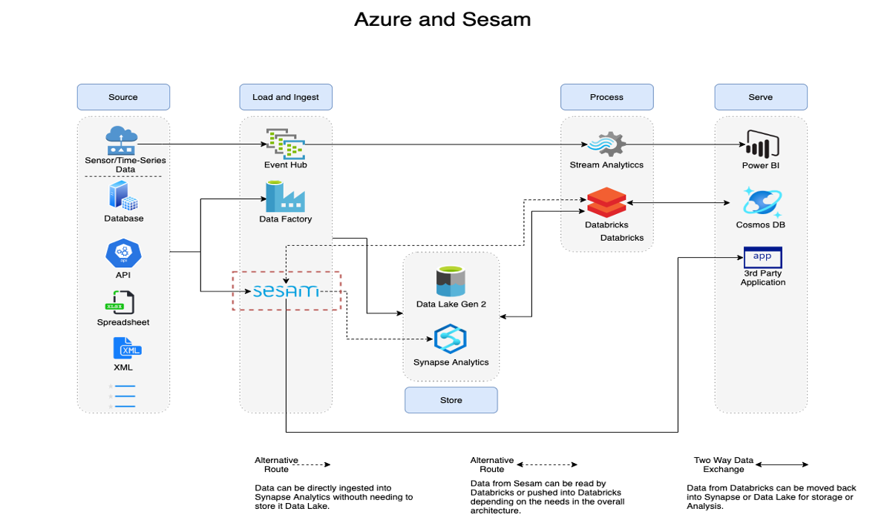
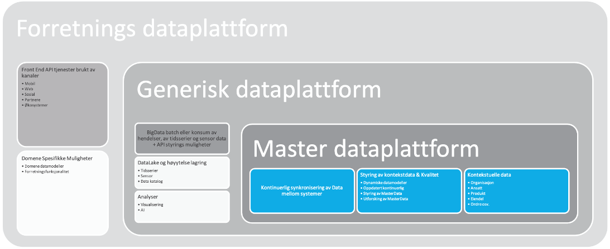
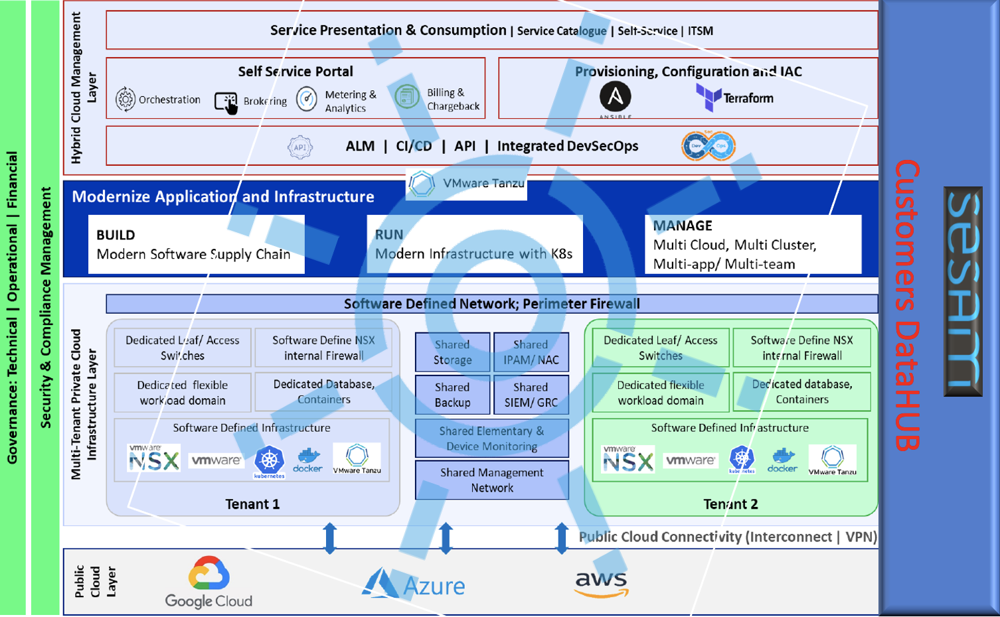

=============================================
Preparations for starting a new Sesam project
=============================================

.. contents:: Table of Contents
   :depth: 2
   :local:

Introduction
------------

This document introduces what we need to understand and consider before starting on a new project for a customer. So prior to start setting up infrastructure and doing work in Sesam we need to have a plan, or a data model showing how data flows from which systems, how it needs to be connected and transformed and which systems will receive data.

Before we dive straight into data and dataflows we have to take a step back consider the following: there are a few risks that can affect the timeline of the pilot pr project phase, where both start date and end date can be delayed:

• Clear scope of understanding of a pilot
• Appointment of a Project Manager by a customer
• Allocation of personnel by a customer
• Scope and specifications of integrations 
• Understanding of Sesam MasterData HUB

In addition there are other things to consider like can we use other components to do this, what different environments do we need (test, stage, QA), what are the main data flows and if it is a pilot; do we have some best practices?

Considerations before setting up a new Sesam project
----------------------------------------------------
Testing
=======

The best practice for testing IT systems is involve testers as earliest as possible. This will ensure that test personnel will contribute to a specification phase and figure out how they should plan and test the requirements, both functional and non-functional. And also figuring what metrics they should use.
This is regarded as the best practice by the most common used framework within Europe and US/Canada – ISTQB. And also aligned with a commonly used framework for specifying requirement used in Europe (required by EU entities) – IREB.
By involving test at the earliest stage, one will ensure that all tests are planned for, and will be executed efficiently. And one could avoid the time-consuming exploratory test scenario.

Another positive side-effect of early test planning, one also has to possibility to create a foundation for regression tests in later LCM stages of an IT-system. It can be executed quickly, and the process of deploying changes to the software can be more efficiently and very often can be automized. 

During test planning in the specification phase one develop test cases, not test shots. Test shots are developed from test cases, but with variable input and expected output. One test case might have several test shots derived from it. Test shots can often be developed into test scripts that can be executed time after time, in system test, acceptance test and in a regression test. Sesam as APIs that support continuous testing through its CI API, and various software for automated testing can use this API. 

Test Environments
^^^^^^^^^^^^^^^^^

Sesam IO AS recommend having two test environments beside the production environment and the personal unit test environment for developer (same as the developer node).

Unit test
^^^^^^^^^

This is basically the developer´s node where he or she should test his newly developed feature or during development. This node is small, and one cannot expect to cover all possible test scenarios due to limitation on size of the node. This environment should contain modules and configurations, and data useful for development and personal unit test, and should not consist of other modules and configurations.

System test
^^^^^^^^^^^

The first objective of a system test is not to see if a system has no errors, but to find errors. A good tester will cheer when a bug is discovered. As developers we should embrace this, it makes our software better. The second objective of a system test is to see if the system fulfills the stated requirements (the specified test cases and shots). If the test team participate in the specification phase, this will ensure that the requirements are testable and measurable. And the system test becomes efficiently for the functional test (just the test the requirements). 

There will be bugs! And bugs must be fixed. But not every bug is equally important to fix. So, agree upon a classification on severity and priority beforehand (during specification). Many conflicts will be avoided. A team of fixers should also be appointed.
Another important part of system test is security, documentation and even training – this are the non-functional aspects of a system test.
But other non-functional test might not be possible to perform in a system test environment, either due to lack of source and target systems, size of the node and size of data in sources. And also, end-to-end value chain tests can be impossible to execute in a system test environment.
Sesam IO AS recommend a medium sized node for a system test environment. And routines for rollback to a starting point is recommended if a system test environment should be a good testing ground for retesting features that has been flagged with a bug. If a rollback scenario is possible with test cycle, a system test environment could be fully automated. 

After a developer has completed his or her unit tests, modules and configurations should be deployed to the System Test environment. 
In a System Test environment only surrounding test system should be used if possible (in some case full production system must be used to provide useful data – especially external services).
In a system test environment, all modules and configurations. 
In a system test environment several test cycles are executed.

At the end of a system test, a test team will often perform an exploratory test. This is ok, but it should on be perform if one has time. But in exploratory tests, unusual issues and bugs might turn up.

And all test (and fixes) should be logged with an updated status in a test management system like Jira, Zephyr etc.

Acceptance Test 
^^^^^^^^^^^^^^^

The environment for performing acceptance test should be equally configured as a production environment, same node size and all integrations included. And if possible populated with the same amount data.
But the objective of an acceptance test is not to test every test case and shots that was perform during system test, but it is a good practice to perform those before telling the environment is ready for testing, just to check if all deployable are deployed correctly.
The main purpose is to test if Sesam is fulfilling the needs of business stakeholder in an everyday work simulation. 
The second purpose is to test if Sesam is suitable performance wise, security wise along with other application in the enterprise architecture. 
The third objective is to test usability and documentation.

After the acceptance test is completed, and Sesam is deployed to a production environment, an acceptance test environment should be maintained for regression testing when CR and later bug fixes are in need of deployment. A regression test is often necessary to be executed to avoid introducing new bugs due to CRs and fixes. This can be any part of Sesam could be affected.

Data flows in Sesam
===================

The data from the source system is fed into Sesam through inbound pipes which collects and tags the data for further processing. Each time raw data comes into Sesam, it goes through a main data flow which can be summarised like this

1. Inbound pipe: data from the source system is fed into Sesam through inbound pipes which collects and tags the data for further processing
2. Global pipe: merge data belonging together to generate global datasets
3. Preparation pipe: global datasets are prepared for target systems. It is here most of the logic is added
4. Outbound pipe: sends data to an endpoint and should normally have no logic

.. image:: images/best-practice/sesam-flow.png
    :width: 800px
    :align: center
    :alt: Generic pipe concept  

To further understnd this flow, please have a look at our best practie :ref:`here <data-modelling-workflow>`

Data modelling in Sesam
=======================

Summary
^^^^^^^

Data modelling in Sesam isn't so much about connecting data together by their relations as it is about connecting them by what they represent. A good data model in Sesam hence relies much about having a good knowledge of the data that are read into Sesam and what they represent, in other words what they are. 

Short glossary of terms used in this document:
- :ref:`pipe <concepts-pipes>`: in Sesam terms this is the component that makes sure that data flows from a source to a target at defined intervals.
- Inbound pipe this is used to refer to pipes that reads from an external system and writes the data to a dataset in Sesam.
- Global pipe: this refers to datasets containing global data for reuse throughout the Sesam instance, see description of global datasets below.
- Preparation pipe: this is a pipe that creates the data that will be sent to an external system.
- Outbound pipe: this is used to refer to pipes that reads data from Sesam and sends them to an external system.

.. _datamodelling-Global datasets:

Global datasets
^^^^^^^^^^^^^^^

At the core of data modelling in Sesam are the :ref:`global datasets <data-modellinge-global>`. These are collections of data that pertains to the same concept from different sources. The main purpose of a global dataset is to be the single authorative location to get fresh data about a specific concept from. A general rule is that every dataset that is written to Sesam from an external data source should be put into its appropriate global, however how small it is.

.. _datamodelling-Data modelling:

Data modelling
^^^^^^^^^^^^^^

Although global datasets are at the core of how Sesam organizes its data, modelling does not only take place in how you structure your global datasets. Data modelling in Sesam starts with the inbound pipes, whether you are at the beginning of a project or adding new data. 

Merge data in a global dataset or not
^^^^^^^^^^^^^^^^^^^^^^^^^^^^^^^^^^^^^
One of the purposes of a global dataset is to present a single authoritative truth about a concept or data. It is then logical to merge data from various different sources (or systems) in one global dataset if they define the same kind of object or type. For example, if some of the various sources contain person data, it would be logical to create a global dataset for person data and then merge each entity that refers to the same person. This is done so that when you ask for information about a specific entity, you also get information about that entity from the other systems. In terms of reusability this is a highly versatile way of getting all the data you need.

However, merging data comes with a cost. In certain cases, changing the rules of how the data are merged requires the pipe to be reset and run again. For large datasets this might mean that it will take time before the downstream pipes will get updates.

In some cases, merging the data isn’t logical. For instance, data like countries, counties, cities and streets might be put into a global location dataset, but it is not logical to merge these data. 

Also note that if a global dataset contains merged data, it does not necessarily mean that every other dataset in the global must be merged. Some data might be telling something about an entity but is not necessary the same thing. 

To the point: Data Modelling
^^^^^^^^^^^^^^^^^^^^^^^^^^^^

Let us begin by repeating an important truth about data modelling in Sesam: when modelling in Sesam do not create your data models by how they are related to each other by their properties (as in a standard relational database), but by what the data in the datasets are about.

For example, let us say we have two datasets or tables, ‘employee and ‘child’. In a relational database, these two tables would normally be linked by a one-to-many relation, i.e. an employee can have many children. However, when we look at these two tables from a Sesam perspective, both are in general speaking of a ‘person’. Hence, we should put both the ‘employee’ and ‘child’ table in the same global containing data about a person, ‘global-person’.

What you are trying to accomplish, is to have a set of global datasets that the preparation pipes can choose from, like food items grouped together in a supermarket to easily locate the food items you need. On the other hand, you don’t want the number of global datasets to grow out of hand, making it hard to find.

Start by analyzing the sources and data to determine the needs of the organization. This will have an impact on the data model and more specifically how the global datasets will be organized. It is here the organization needs to think: what is important to me? What data do I use often, and therefore needs to be easily available? The results vary for each organization and each data model.

The use of other components in Sesam projects
---------------------------------------------

Azure
=====

Sesam with Azure components to form a data platform
^^^^^^^^^^^^^^^^^^^^^^^^^^^^^^^^^^^^^^^^^^^^^^^^^^^

Sesam can be used as a master data HUB and or Data Mesh to improve data quality and data analysis in corporation with several other Azure product to create an Intelligent and ML platform for creating an architecture for state based and predictive maintenance. 

Sesam is not a real-time system and cannot connect to thousands of IoT objects/sensors – so you need a system for collect data from those in real-time. However, Sesam can in retrospect (few seconds later) start to ingest, transform, enrich these data into more useful dimensions to feed DWH, ML/AI like Synapse or Thor (and other similar). 
All systems can be sources and targets for Sesam. And like Synapse and Sesam, they can feedback on each other to improve data and analysis in both systems. Data Factory can be used as a source for Sesam to transform and enrich data and merge data from other sources to improve quality in for example Synapse Analytics or Databricks or similar software. 

Sesam can also be used as a bond in an enterprise architecture consisting of multi cloud software.

Scope for Sesam as a component in data platform
^^^^^^^^^^^^^^^^^^^^^^^^^^^^^^^^^^^^^^^^^^^^^^^

Sesam works best being a part of the master data platform but can be used as an iPaaS in all parts of complete data platform as a component – Sesam is not the data platform for business or generic but can be a component for building such platforms to enable flows and streams of data between other components that a data platform consists of.

Sesam as a component in an ITSM platform
^^^^^^^^^^^^^^^^^^^^^^^^^^^^^^^^^^^^^^^^

Sesam can also be utilized as a propagation tool in ITSM platform. If a project manager needs to add a team member to a DevOps team, Sesam can be used to retrieve data from a master and propagate authorizations needed for that particular team member across the architecture so he can perform his duties without hindrance

Google
======

Best practices for pilots
-------------------------

