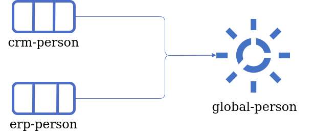
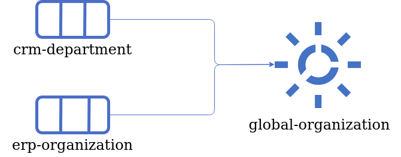
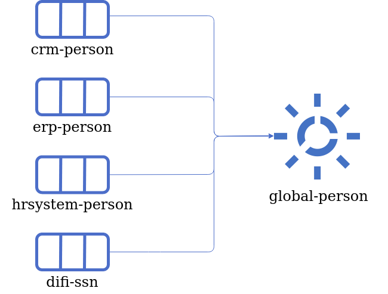
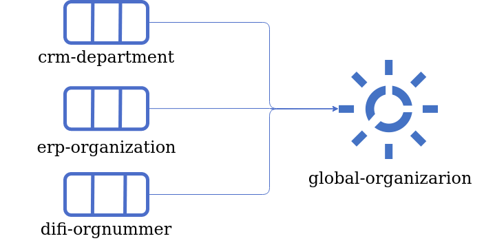
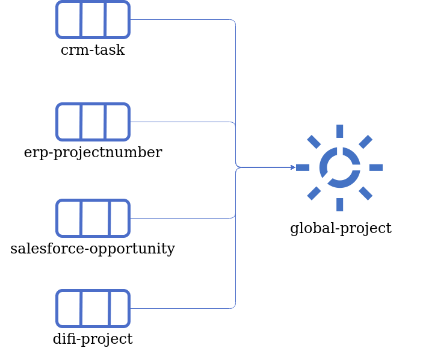

.. _best-practice:

=============
Best Practice
=============

.. contents:: Table of Contents
   :depth: 3
   :local:

Summary
-------
Sesam is an Integration Platform using a unique Datahub approach for collecting, connecting and sharing data. With Sesam data can quickly be re-purposed, re-structured and used without changing the legacy systems that own the original data making all the valuable data within your company available for the whole organization. 

As many systems, Sesam can become complex and difficult to maintain when misused. To mitigate this, it is important to follow a small set of simple rules when starting on your journey. Adhering to these guidelines early on will give your system a solid integrational foundation, sparing you of numerous headaches when later on connecting more external systems adding further integrations. 

As the amount of data in a Sesam node grows, an optimized dataset structure will become necessary. For example, rather than approaching each data flow sequentially and individually — where a single entry will lead to a single integration inside the datahub — it helps to favour aggregations of data with similar type, or data pertaining to the same concept. These aggregations are called “global datasets” and can be seen as authoritative datasets; the one-stop-shop for customer data, where the freshest and most accurate data can unequivocally be found. 

Data handling philosophy
------------------------

The data handling philosophy in Sesam can be described in short as connect, collect and share. Sesam uses connectors to fetch data from external systems. The internal data representation uses JSON which allows Sesam to work with data from heterogeneous sources indistinctively of their system of origin.
We recommend applying the following principles when importing data into Sesam:

1)  Collect data comprehensively; it is preferable to have unused data in Sesam than to re-engineer the connector should the data elements become necessary. 
2)  Keep the data as faithful to the original as possible; transforms are generally not necessary prior to the aggregations.

The next step is to create the global datasets. These consist of categorized and connected data from the imported datasets. 
We also recommend considering the following principles when creating the global datasets: 

1)  The entirety of the imported data should be in at least one global dataset. This means all the raw datasets should to be imported into a global dataset. 
2)  Try to merge the data into the global dataset referring to the same concept. This semantic approach to global datasets will facilitate the consumption and improve the reusability of the data within Sesam.

Following the above mentioned principles when importing data and creating global datasets will establish a good foundation for Sesam’s bold objective: "All the data from all the systems, connected and available as a single shared resource».

|

.. image:: images/best-practice/Sesam-datamodel.png
    :width: 800px
    :align: center
    :alt: Generic pipe concept    

|

To read about the main concepts and how to get started in Sesam, please click :ref:`here <getting-started-glossary>`.

.. _best-practice-global:

Global datasets
---------------
Sesam organizes entities by storing them in global datasets.

Definition
==========

A global dataset is a collection of data pertaining to the same concept from different sources. In other words, a global dataset combines semantically linked data from different sources to provide one single authoritative fresh data location to access when needed. This will reduce the total number of pipes needed compared to a system where you get data from the original sources each time. 

Global datasets can be populated by: 

- adding datasets to a global dataset without merging, 
- merging data from various sources without modifications,  
- selectively merge data by selecting which properties to merge through transformations. More information on implementing such transformations can be obtained :ref:`here <getting-started-transformations>`.

It is important to remember that a global dataset requires either business knowledge or a sound understanding of the data from the different sources. Global datasets will work to their fullest potential if they include all of the semantically linked data elements relating to the subject matter. 

Example:

There are three sources containing person data as shown below. If any target system wants to access data related to this person, without a global dataset available, it would have to go through each root dataset every time. However, through the creation a **global-person** dataset, information can be easily fetched from one single location.

::

  HR system
  {
     "_id": "hr-person:02023688018",
    "hr-person:EmailAddress": "IsakEikeland@teleworm.us",
    "hr-person:Gender": "male",
    "hr-person:SSN": "02023688018"
  }

  CRM
  {
    "_id": "crm-person:100",
      "crm-person:EmailAddress": "IsakEikeland@teleworm.us",
      "crm-person:ID:”100”,
      "crm-person:SSN": "02023688018",
      "crm-person:SSN-ni": "~:hr-person:02023688018"
    }

  ERP
  {
     "_id": "erp-person:0202",
     "erp-person:SSN": "02023688018",
     "erp-person:SSN-ni": "~:hr-person:02023688018",
     "erp-person:ID:”0202”,
     "erp-person:country":"NO"
  }

The dataset below is what a global dataset of the above three datasets looks like in Sesam when merging on equality of social security number (SSN).

::

  {
    "$ids": [
      "~:crm-person:100",
      "~:hr-person:02023688018",
      "~:erp-person:0202"
    ],
    "_id": "crm-person:100",
    "hr-person:EmailAddress": "IsakEikeland@teleworm.us",
    "hr-person:Gender": "male",
    "hr-person:SSN": "02023688018",
    "crm-person:EmailAddress": "IsakEikeland@teleworm.us",
    "crm-person:ID:”100”,
    "crm-person:SSN": "02023688018",
    "crm-person:SSN-ni": "~:hrsystem-person:02023688018",
    "erp-person:SSN": "02023688018",
    "erp-person:SSN-ni": "~:hrsystem-person:02023688018",
    "erp-person:ID”:”0202”,
    "erp-person:country":"NO" 
  }

Positive effects of global datasets
===================================

• By decoupling data from original sources, point-to-point integrations within Sesam can be avoided, thus fewer connections results in lower maintenance costs. In addition, data is available without concern for the original source
• All logic related to connecting and enriching data is only done once 
• Data in global datasets are re-used, which saves work and makes adding new integrations easier
• Only one look-up, instead of having to “look for data” in various datasets
• Input datasets can be kept raw and as similar to the real source as possible, independent of how the data will be used, thus avoiding “early binding”
• Adding additional integrations further refines the global datasets and therefore continuously improves the data quality

A data model without global datasets might look like the figure below. This example consists of four sources and three target systems only. Generally, it will be a lot more complicated.

.. image:: images/best-practice/no-global.png
    :width: 400px
    :align: center
    :alt: Datamodel without global datasets

As shown in the figure below, a Sesam node containing global datasets results in fewer connections, making it both tidier and easier to manage.

.. image:: images/best-practice/global.png
    :width: 400px
    :align: center
    :alt: Generic pipe concept

What do you have to take into account, and what are the challenges of global datasets?
======================================================================================

Global datasets will most likely grow and become large. If the configuration or logic is changed, this can in some cases mean that the whole dataset needs to be updated. This can potentially be a big job and will take time.

As an example, an energy company has 700.000 customers, and each customer has a power meter connected to their home. When adding the historic data (the company is required to store as well) the total data objects sum up to 30.000.000. One way of managing this large data amount is to divide the data into different global datasets. In this case the energy company chose to store their historic data in one global dataset, and the current data in a different global dataset.

.. _best-practice-namespace:

Namespace and namespaced identifiers
------------------------------------

Namespace 
=========

A namespaced property consists of two parts: a namespace and a property. The namespace part can consist of any characters, ending with a colon. The property part can consist of any character except colons.
In the example below, **"crm-person"** and **"hr-person"** are namespaces and **"SSN"** is the property.

E.g.

::
   
  "crm-person:ssn"

  "hr-person:ssn"

Namespaced identifiers
======================

Namespaces are used to create namespaced identifiers (NI's), which makes it possible to merge data without losing track of the source. In addition, namespaced identifiers can be mapped to complete URLs as we have unique identifiers for each object. When namespaces are enabled, the _id of an entity will be a namespaced identifier. In similar ways like foreign keys are used in a relational database, a reference to a namespaced identifier could be used to relate one entity with another. These references are usually added in the input pipe.

A namespaced identifier takes the following form:

::

  "hr-person:SSN:"~:hr-person:18057653453"

  "namespace:propertyName":"namespaced-identifier:value"

Namespace identifiers is a recommended way of referring to datasets for matching properties during transformations. This will ease the connection of data. Namespaced identifiers are generated to keep existing joins so we are able to keep the data model from source. 

By default, namespaced identifiers are stripped from the endpoint entities.

If you have two different person datasets which you want to merge on a common property, like SSN, we should use namespace identifiers. The code below will add a namespace identifier based on common SSN properties between datasets **"hr-person"** and **"erp-person"**. In other words we need to create a namespace identifier between **"hr-person"** and **"erp-person"** datasets so that we can refer to them during merging.

The main reason for generating NI's is to match the **$ids** they point to such that you can actually use them to merge in hops etc.

::

 "transform": {
    "type": "dtl",
    "rules": {
      "default": [
        ["copy", "*"],
        ["add", "SSN",
          ["ni", "hr-person", "_S._id"]
        ]

This will produce the output below where we see the NI we added in the code above: 

::

  "erp-person:SSN": "~:hr-person:erp-person:02023688018",
 

You now have unique namespaced identifiers based on **SSN** which you can use to merge the person data from two different sources.

::

  {
    "_id": "global-person",
    "type": "pipe",
    "source": {
      "type": "merge",
      "datasets": ["erp-person ep", "hr-person hr"],
      "equality": [
        ["eq", "ep.SSN", "hr.SSN"]
      ],
      "identity": "first",
      "version": 2
      },
      "metadata": {
        "global": true,
        "tags": ["people"]
      }
    }

In the above code we are connecting the foreign key **SSN** of **"erp-person"** with the primary key **"$ids"** of 
**"hr-person"**. 

Output from the example code above as seen below with a join to hr-system:

``"erp-person:SSN": "~:hr-person:12032920177"``

::

  {
    "$ids": [
      "~:erp-person:12032920177",
      "~:hr-person:12032920177"
    ],
    "erp-person:Country": "NO",
    "erp-person:EmailAddress": "CaspianNygard@einrot.com",
    "erp-person:Firstname": "Caspian",
    "erp-person:Gender": "male",
    "erp-person:Lastname": "Nygård",
    "erp-person:MiddleInitial": "I",
    "erp-person:MoneyUsed": "11923",
    "erp-person:Number": "93",
    "erp-person:SSN": "~:hr-person:docs-erp-person:12032920177",
    "erp-person:StreetAddress": "Lindøy Løkkavei",
    "erp-person:TimesOrdered": "12",
    "erp-person:Title": "Mr.",
    "erp-person:Username": "Aney1996",
    "erp-person:ZipCode": "2213",
    "hr-person:Country": "NO",
    "hr-person:EmailAddress": "CaspianNygard@einrot.com",
    "hr-person:Gender": "male",
    "hr-person:GivenName": "Caspian",
    "hr-person:MiddleInitial": "I",
    "hr-person:Number": "100",
    "hr-person:SSN": "12032920177",
    "hr-person:StreetAddress": "Lindøy Løkkavei",
    "hr-person:Surname": "Nygård",
    "hr-person:Title": "Mr.",
    "hr-person:Username": "Mays1944",
    "hr-person:ZipCode": "2213",
    **"rdf:type"**: [
      "~:erp:person",
      "~:hr:person"
    ]  
  }

.. _best-practice-naming:

Naming conventions
------------------

It is essential to have an agreed naming convention across integrations within Sesam. The motivation is to have a better visibility and understanding of where your data comes from and where it is heading, as well as to how it is internally transformed. It also makes it easier to switch between projects.

General rules
=============

• lower case
• dash - as delimiter

Systems
=======

• name systems after the name of the service you integrate with, not the technology used (e.g. salesforce instead of mysql)
• if multiple systems are required to talk to a service, postfix them with a qualifier (e.g.salesforce-out)
 
Pipes
=====

• relate input pipe names with the system they read from and postfix the name with the type of content (e.g. salesforce-sale)
• do not use plural names (e.g. salesforce-sale not salesforce-sales)
• prefix merge pipes with merged- (e.g. merged-sale)
• prefix global pipes with global- (e.g. global-sale)
• name preparation pipes with the type of the content and the name of the system to connect to (e.g. sale-salesforce)
• name outgoing pipe by postfixing the intermediate output with -endpoint (e.g. sale-salesforce-endpoint)

Datasets
========

• name them the same as the pipe that produced it (this is default and does not need to be specified)

.. _best-practice-workflow:

Workflow for transforming data in Sesam
---------------------------------------

Most Sesam projects will have a set flow that the data goes through.

The data is fed into Sesam through **input pipes** where namespaced identities are added in order to keep the existing data model with joins intact. In addition an **RDF type** is added in the input pipe for future filtering and classification. 

**Global pipes** merge semantically related data to generate **global datasets**. To be able to easily spot a global pipe in the graph view, the following code can be added:

::

  "metadata": {
    "global": true
 }

**Preparation pipes** prepare data from **global datasets** to target systems. It is here most of the logic is added. It could include enriching with more context from other datasets, structuring data into other formats, adding new fields and other transformations. The main purpose is to get data ready for the target system.

**Output pipes** sends data to an endpoint and should normally have no logic. The main reason for why **output pipes** should not contain any logic or transformations is that we want to see the end result that is being sent to the target system for debugging purposes. If logic is added in the pipe the result will be sent straight to the target system when the pump is running. By adding the transformations in the upstream **preparation pipe** we will be able to look at the processed entities in the upstream dataset for the **output pipe**. 

.. image:: images/best-practice/Sesam-pattern.png
    :width: 800px
    :align: center
    :alt: Generic pipe concept  

.. _best-practice-input-pipe:

Input pipes
===========

Input pipes are used to fetch data from external systems into Sesam. As we want to be as comprehensive as possible regarding the data we ingest there should be very few rules about filtering or altering data embedded within the input pipes. Data filtering, transformation and consolidation will be done at a later stage. 

Embedded data and Conditional input pipes 
^^^^^^^^^^^^^^^^^^^^^^^^^^^^^^^^^^^^^^^^^
Embedded data is data that does not originate from an external source but are manually put into a pipe. Embedded data can be used for different purposes, two of which we will explain below.

Embedded data as extra information
^^^^^^^^^^^^^^^^^^^^^^^^^^^^^^^^^^

Embedded data can be used when we need extra information regarding data that is not available from the source data. The source data could contain codes or abbreviations which need to be translated to a more readable format. Using embedded data we can create a dataset which interprets these codes and abbreviations in order to extract more information than provided by the source data, see example below.

:: 

  {
    "_id": "embedded-data-pipe",
    "type": "pipe",
    "source": {
      "type": "embedded",
      "entities": [{
        "_id": "an id",
        "some-abbreviation": "abbreviation meaning",
        "some-code": "code meaning",
        "some-hash": "hash meaning"
      }]
    }
  }

Embedded data for testing
^^^^^^^^^^^^^^^^^^^^^^^^^

Embedded data may also be used to test new configurations through conditional pipes. Conditional pipes are a way to define several distinct sources for a single input pipe. 

For example, consider a customer that has two different HR-system environments, one for production and one for test. Often there are paired with test- and production-environments in Sesam such. Through conditional pipes we may use the same DTL code for both environments as long as we specify the source environments to be conditional on the Sesam environments. The test environment in Sesam should connect to the data from the HR test environment and the production environment in Sesam should connect to data from the HR production environment. We could also set a condition when working on your private Sesam node, such that when you work ourside the official environments only embedded data is used. This is specially helpful since the IP of your personal Sesam node might not have access to the HR systems. 
 
In the pipe config below we see an example of the general setup of a conditional input pipe. In this example we specify two environments; “Prod“ and “Dev“. In this case, the “Prod“ environment talks directly to the source data, here a csv-file. Inside the conditional “Prod“-definition we specify all the information we need in order to collect the source data.
 
The “Dev“ environment does not connect directly to any external source. Instead we use *"embedded data“*, which is data formatted just like it would be from an external source, but anonymized. As the data is embedded (or hard coded if you will) there is no access restriction.  

The condition used should be determined by an environment variable and not by the configuration such that we can upload the same configuration to several nodes. Adding environment variables is done in the "Variables"-tab under the "Settings"-section for the Datahub.

In this example we create an environment variable specifying which environment the node is running on. We call this variable "node-env" and set it to either "prod" or "dev", depending on which we use:

:: 
 
  "node-env": "prod" or "node-env": "dev".

The corresponding environment variable are used in the "condition" property in the pipe. It is added inside the "Source" section of the pipe's config, as seen in the example below.

``"condition": "$ENV(node-env)"``

Our pipe:

::

   { 
    "_id": "hr-person", 
    "type": "pipe", 
    "source": { 
      "type": "conditional", 
      "alternatives": { 
        "Prod": { 
          "type": "csv", 
          "system": "hr", 
          "blacklist": ["Password"], 
          "delimiter": ",", 
          "encoding": "utf-8", 
          "primary_key": "SSN", 
          "url": "/file/sesam-training/data/test_people_sesam_training1.csv" 
        }, 

        "Dev": { 
          "type": "embedded", 
          "entities": [{ 
            "_id": "23072451376", 
            "Country": "NO", 
            "EmailAddress": "TorjusSand@einrot.com", 
            "Gender": "male", 
            "GivenName": "Torjus", 
            "MiddleInitial": "M", 
            "Number": "1", 
            "SSN": "23072451376", 
            "StreetAddress": "Helmers vei 242", 
            "Surname": "Sand", 
            "Title": "Mr.", 
            "Username": "Unjudosely", 
            "ZipCode": "5163" 
          }, { 
            "_id": "09046987892", 
            "Country": "NO", 
            "EmailAddress": "LarsEvjen@rhyta.com", 
            "Gender": "male", 
            "GivenName": "Lars", 
            "MiddleInitial": "A", 
            "Number": "2", 
            "SSN": "09046987892", 
            "StreetAddress": "Frognerveien 60", 
            "Surname": "Evjen", 
            "Title": "Mr.", 
            "Username": "Wimen1979", 
            "ZipCode": "3121" 
          } 
          }] 
        } 
      }, 
      "condition": "$ENV(node-env)" 
    }, 
    "transform": { 
      "type": "dtl", 
      "rules": { 
        "default": [ 
          ["copy", "*"], 
          ["comment", "below we will add a namespaced identifier and 'rdf:type' for easy filtering later"], 
          ["add", "rdf:type", 
            ["ni", "hr", "person"] 
          ] 
        ] 
      } 
    }, 
    "pump": { 
      "mode": "manual" 
    }, 
    "metadata": { 
      "tags": ["embedded", "person"] 
    } 
     

RDF type  
^^^^^^^^

The RDF type is metadata used to relate data and give some semantic context. When used with a namespace, it keeps track of the origin of the data, as well as the business type. It is composed upon input and will be used to relate and filter like you would use a foreign key.

Namespaces
^^^^^^^^^^

The namespace identifier is added to keep track of origin and to keep exsisting joins from source. Namespaced identifiers are by convention prefixed by a ``‘~:’``, e.g. ``~:crm:person``. You use the functions :ref:`make-ni <dtl_transform-make-ni>` or :ref:`ni <ni_function>` to create it.

Global pipes
============

Before going into **global pipes** please read on what a global dataset is and why we generate them :ref:`here <best-practice-global>`.

The global pipe creates a new dataset. This dataset will be updated with entities from all sources connected to the global pipe.

We can choose not to join or transform some of the datasets which means they are simply “put into” the global dataset. The ones who will be joined and transformed you can read more about below.

A resulting dataset can be a new dataset, but also an existing dataset where one wants to add more data from new sources when they become available for Sesam. This is done by adding source datasets to a global pipe. The new data will be added to the dataset (can be compared to the use of alter table/update of a relational database – but in one single operation).

In order to vizualize global pipes in the data-flow graph we add a metadata tag to the pipe config by the following code:

::

  "metadata": {
    "global": true
 }

This tag need to be placed on root level inside the pipe config, and the resultant graph would take the following form:

.. image:: images/global_true.png
    :width: 600px
    :align: center
    :alt: Generic pipe concept  

As a general rule when it comes to transformations we wish to use reusable properties; e.g. global properties generated in the global dataset. This gives us the opportunity to track data from start to end of the flow through Sesam. 

Often several dataset may contain the same properties, but not necessarily with the same value. In order to prioritize which property value from which dataset we want to use we utilize the :ref:`coalesce <coalesce_dtl_function>` function. If the global id is null, **“Coalesce”** gives us the opportunity to choose which is the next best option. This in turn gives us the opportunity to use the golden record, which you can read about :ref:`here <best-practice-golden-record>`.

Below we see an example of a global pipe called **global-person**. The type of pipe is set to **“merge“**, enabling us to add 4 datasets that we wish to merge.

The **“equality“** determines the join chriteria between the datasets. Further down in the **“transform”** section we see an example of the use of the **coalesce** rule. In this case, three of the datasets contain the zip code belonging to a person. The order of the dataset keys determines the priority (in this example the zip code of hr-person will be chosen whenever it is available).

::

  {
  "_id": "global-person",
  "type": "pipe",
  "source": {
    "type": "merge",    
    "datasets": ["erp-person ep", "crm-person cp", "salesforce-userprofile su", "hr-person hr"],
      s"equality": [
      ["eq", "ep.$ids", "cp.SSN "],
      ["eq", "ep. .$ids ", "hr.$ids"],
      ["eq", "ep.Username", "su.Username"]
    ],
    "identity": "first",
    "version": 2
  },
    "transform": {
    "type": "dtl",
    "rules": {
      "default": [
        ["copy", "*"],
        ["add", "zipcode",
          ["coalesce",
            ["list", "_S.hr-person:ZipCode", "_S.erp-person:ZipCode", "_S.crm-person:PostalCode"]
          ]
        ],
        ["add", "email",
          ["coalesce", "_S.EmailAddress"]
        ],
        ["add", "firstname",
          ["coalesce",
            ["list", "_S.crm-person:FirstName", "_S.erp-person:Firstname", "_S.hr-person:GivenName"]
          ]
        ],
        ["add", "lastname",
          ["coalesce",
            ["list", "_S.crm-person:LastName", "_S.erp-person:Lastname", "_S.hr-person:Surname"]
          ]
        ],
        ["add", "fullname2",
          ["concat", "_T.global-person:firstname", " ",
            ["coalesce",
              ["not",
                ["matches", "*.", "_."]
              ], "_S.MiddleInitial"], ". ", "_T.global-person:lastname"]
        ],
        ["add", "fullname",
          ["concat", "_T.global-person:firstname", " ",
            ["filter",
              ["neq", "_.", ". "],
              ["concat",
                ["coalesce",
                  ["list", "_S.crm-person:MiddleInitial", "_S.erp-person:MiddleInitial", "_S.hr-person:MiddleInitial"]
                ], ". "]
            ], "_T.global-person:lastname"]
        ]
      ]
    }
  },
  "metadata": {
    "global": true
  }
  }

When running the global pipe, the result is a “global dataset” consisting of entities with joined data that has been through the listed transformations.

The first property of an entity in a global dataset is called **"$ids"**. This which will be a list (whenever multiple entities are joined) of **namespaced identifiers**. When an entity is merged into another entity in a merge pipe, the pipe will add the _id of the source entity to the **"$ids"** property. Thus, the **ids** property consists of the _id's of all the source entities that were merged to created that specific merged entity. The **"$ids"** typically tkes the following form:

::

  "$ids": [
    "~:erp-person:02023688018",
    "~:crm-person:100",
    "~:salesforce-userprofile:Mays1944",
    "~:hr-person:02023688018"
  ]

The **"$ids"** are generated automatically when the global pipe runs and they always show up on top for the global dataset entity.

Below is a whole entity of the above global pipe. As we can see it gives an aggregated dataset from 4 sources with **$ids**, **RDF types** and **global properties**.

::

  {
  "$ids": [
    "~:erp-person:02023688018",
    "~:crm-person:100",
    "~:salesforce-userprofile:Mays1944",
    "~:hr-person:02023688018"
  ],
  "crm-person:Address": "Ørneveien 40",
  "crm-person:Customerid": "100",
  "crm-person:EmailAddress": "IsakEikeland@teleworm.us",
  "crm-person:FirstName": "Isak",
  "crm-person:Gender": "male",
  "crm-person:LastName": "Eikeland",
  "crm-person:MiddleInitial": "E",
  "crm-person:PostalCode": "1357",
  "crm-person:SSN": "02023688018",
  "crm-person:Username": "Mays1944",
  "erp-person:Country": "NO",
  "erp-person:EmailAddress": "IsakEikeland@teleworm.us",
  "erp-person:Firstname": "Isak",
  "erp-person:Gender": "male",
  "erp-person:Lastname": "Eikeland",
  "erp-person:MiddleInitial": "E",
  "erp-person:MoneyUsed": "19392",
  "erp-person:Number": "100",
  "erp-person:SSN": "02023688018",
  "erp-person:SSN-ni": "~:crm-person:02023688018",
  "erp-person:StreetAddress": "Frodegaten gate",
  "erp-person:TimesOrdered": "16",
  "erp-person:Title": "Mr.",
  "erp-person:Username": "Mays1944",
  "erp-person:ZipCode": "4017",
  "erp-person:subscriptions": [
    {
      "erp-person:active": true,
      "erp-person:category": "Types of Drink",
      "erp-person:hash": "cd821925a05449c7d5b907157d00fe4b",
      "erp-person:items-ordered": 8,
      "erp-person:received": 20,
      "erp-person:specials": 15,
      "erp-person:start-date": "~t2005-05-02T05:17:30.6196185Z",
      "erp-person:subscription-psuedo-name": "Alpha"
    },
    {
      "erp-person:active": true,
      "erp-person:category": "Foreign Cities",
      "erp-person:hash": "02f30f1fd084eef209c64bcbb577c66d",
      "erp-person:items-ordered": 19,
      "erp-person:received": 21,
      "erp-person:specials": 10,
      "erp-person:start-date": "~t2007-07-01T07:17:30.6196185Z",
      "erp-person:subscription-psuedo-name": "Delta"
    },
    {
      "erp-person:active": false,
      "erp-person:category": "Something You're Afraid Of",
      "erp-person:end-date": "~t2006-12-26T12:17:30.6196185Z",
      "erp-person:hash": "f0145edebae47eccd463a2dec9ac7485",
      "erp-person:items-ordered": 21,
      "erp-person:received": 49,
      "erp-person:specials": 23,
      "erp-person:start-date": "~t2005-12-26T12:17:30.6196185Z",
      "erp-person:subscription-psuedo-name": "Beta"
    }
  ],
  "global-person:email": "IsakEikeland@teleworm.us",
  "global-person:firstname": "Isak",
  "global-person:fullname": "Isak E. Eikeland",
  "global-person:fullname2": "Isak E. Eikeland",
  "global-person:lastname": "Eikeland",
  "global-person:zipcode": "1357",
  "hr-person:Country": "NO",
  "hr-person:EmailAddress": "IsakEikeland@teleworm.us",
  "hr-person:Gender": "male",
  "hr-person:GivenName": "Isak",
  "hr-person:MiddleInitial": "E",
  "hr-person:Number": "100",
  "hr-person:SSN": "02023688018",
  "hr-person:StreetAddress": "Nadderudåsen 186",
  "hr-person:Surname": "Eikeland",
  "hr-person:Title": "Mr.",
  "hr-person:Username": "Mays1944",
  "hr-person:ZipCode": "1357",
  **"rdf:type"**: [
    "~:erp:person",
    "~:crm:person",
    "~:salesforce:userprofile",
    "~:hr:person"
  ],
  "salesforce-userprofile:EmailAddress": "IsakEikeland@teleworm.us",
  "salesforce-userprofile:Username": "Mays1944",
  "salesforce-userprofile:phone_number": 24887159
    }

Preparation pipes
=================

The aggregated data residing in a global dataset often needs to be transformed and/or enriched before it can be delivered to targets. The transformation and enrichment of data is implemented through preparation pipes. Preparation pipes use the aggregated entities from global datasets to combine and narrow down the data down to what is necessary/required by the recipient system. The filtering and relating of data are performed using the RDF types introduced earlier. Data can also be augmented by performing hops to other datasets. For example a city name can be fetched from a different dataset using the the property "difi-postnummer". The goal is to have the data ready to be picked up by the output pipe.

.. _best-practice-output-pipes:

Output pipes 
============

best-practice-input-pipe

The output pipe is the input pipe counterpart. While the input pipe is used to either import data into Sesam or to utiliza embedded data, the output pipe's function is to export data out of Sesam. As mentioned in the :ref:`input pipe <best-practice-input-pipe>` section, the focus of the input pipe will be on its source component/property. The output pipe on the other end will be built around its sink. The output pipe sink will use a system to interface with external systems. In turn the system will either access an embedded connector or an outside interface called a :ref:`microservice <microservice_system>`. The function of the connector/microservice is to interface at the API level with the external system.

Tips for global datasets
------------------------

• All datasets should go into a global dataset
• In most data models, between 10–20 global datasets are sufficient. This is based on experience from various sized projects at Sesam. The smaller projects could have close to 10, and some of the bigger projects has over 20 global datasets, with hundreds of pipes connected to them. To identify how many global datasets a project might need it is important to perform a proper analysis. For instance, if a company’s needs are met by five global datasets, then they do not have to have at least ten. This is only for best practice, but we do have examples of larger data models with less than ten global datasets
• Start general with big “buckets” and re-arrange and split into smaller global datasets if necessary
• Think less property and more “what it is”, e.g. person vs user. Something that stops being a user might not stop being a person
• Keep it generic
• Avoid system specific global datasets, i.e. a document management system contains metadata about various concepts (e.g. title, revision, status, equipment, owner, date generated files). These are static in nature and to make them useful you can put “equipment data” in a "global equipment" dataset. The “owner data” might be put in a "global person" dataset etc. This way you gather concepts across sources and enrich them, such that they are available for other systems to use
• Global datasets give us the opportunity to define :ref:`golden records <best-practice-golden-record>`

How to do global datasets in Sesam
----------------------------------

When initiating a new project in Sesam it is important to begin with the data model. Start by analyzing the sources and data to determine the needs of the organization. This will have an impact on the data model, and more specifically how the global datasets will be organized. It is here the organization needs to think: "what is important to me?", "What data do I use often, and therefore needs to be easily available?". The results vary for each organization and each data model. It is however normal to add global datasets, or to re-arrange them, as the amount of data is growing.

To get an idea of the granularity, please see the final chapter called :ref:`Examples of real global datasets <best-practice-examples-of-real-global-datasets>`.

Generally, most organizations need the following five basic global datasets:

• global-person

• global-project

• global-classification

• global-organization

• global-task

This is only the first part of the analysis. The second part is how to enrich data in the global datasets, and to determine which aggregated datasets there is a need for. These are questions that need to be asked in order to make the enriched datasets as useful as possible.

Recipe for generating global datasets
-------------------------------------

It is impossible to make a universal recipe for all integration projects using Sesam as all projects are unique. The different data variety, data model complexity and costumer requirements are all integral parts structuring each individual Sesam node. In addition, the order in which you do the various tasks might vary, so please use this as a guideline only and not a comprehensive recipe.

1.  The first step is to consider what the goal of the integration is; what do you want to achieve?
2.  Next step is to determine which data from which sources do you need to achieve your goal.
3.  Get information regarding the existing data model and how data needs to be joined.
4.  Access the data source and copy the necessary data into Sesam.
5.  Analyze and decide on how you want to organize your global datasets. There is no right or wrong way of how to do this. In time you will gain experience on which datasets work as global datasets and which does not. Try to use common sense and organize by concept or type.
6.  Once decided it is important to analyze how the data is going to be added to the global dataset; is there a need to merge the data or is there a need to “place” data in a global dataset without merging? For example, generating a global location dataset is logical. It contains countries, regions, cities, boroughs, counties and offices. It does not make sense to merge them, but it does make sense to put them in a common global dataset. This way you might gather data concerning the same concept. as well as to have one single location place for looking up this information. 

In many cases however, it does make sense to merge the data, such as person data as shown earlier, which was merged on SSN, email etc.

7.  Some data may need to be processed before being added to a global dataset. This involves e.g. selecting what we use as ID, converting data type, change property names etc.
8.  When the global datasets are set up, the data can either be re-used as is or undergo further transformations. This might encompass filtering specific data and joining with other datasets to enhance quality and usefulness.
9.  Based on the target systems and your requirements, adapting data to target systems is done as late as possible in the data flow and as close to target as possible (late binding).

Let’s start with simplified example to demonstrate. Below you can see the names four datasets from two different sources; **"crm"** and **"erp"**:

erp-person

crm-person

erp-organisation

crm-organisation

Looking at the names of the datasets, it would be logical to create two global datasets. The first could contain data about person, such as user, customer, name, employee and so on.

|

**global-person**

|

|

The second could contain data concerning the organization. This might include names of departments, customers, regions and so on.

|

**global-organisation**

|

When the number of sources and datasets increases it will become natural to add more “buckets”, or global datasets, to put them in.

Below you find new sources with data from Difi and Salesforce. In addition, more datasets from existing sources were added.

Datasets:

• erp-person

• crm-person

• difi-ssn

• hrsystem-person

• difi-ssn

• difi-orgnumber

• salesforce-opportunity

• erp-projectnumber

• crm-order

The datasets might be organized as depicted below. The global pipe placement of these new sources resulted in one additional source to **“global-organization”**, and two additional sources to **“global-person”**. We also added a new global pipe **“global-project”**.

|

**global-person**

|

|

The second could contain data concerning projects. This might be orders, project numbers, sales opportunities etc.

|

**global-organization**

|

|

**global-project**

|

|

It is important to emphasize that this is only a suggestion on how it might be logical to organize the datasets. The end result is highly individual and will most likely vary. This does however give an idea on how architecture in Sesam is built and developed using global datasets.    

Additional Sesam tips
---------------------

.. _best-practice-golden-record:

Golden record
=============

A golden record is a single, well-defined version of all the data entities in an organizational ecosystem. In this context, a golden record is sometimes called the **"single version of the truth"**, where **"truth"** is understood to mean the reference to which data users can to turn when they want to ensure that they have the correct version of a piece of information.  

In the example below, all three sources provide a **zip-code**, such that some properties in a global dataset might be duplicates from different sources. In this case it could be fitting to add a **"global-person:zipcode"** property to the global dataset. This property should contain the most reliable zip-code value of the three sources and will be the property we access when we want the person's zip-code. This global property becomes a part of a **"golden record"** which ensures a single, well-defined representation of the person.

::

  {
    "$ids": [
    "~:crm-person:100",
    "~:hr-person:02023688018",
    "~:erp-person:0202"
    ],
    "_id": "crm-person:100",
    "hr-person:EmailAddress": "IsakEikeland@teleworm.us",
    "hr-person:Gender": "male",
    "hr-person:ZipCode": "null",
    "crm-person:EmailAddress": "IsakEikeland@teleworm.us",
    "crm-person:ID":"100",
    "crm-person:SSN": "02023688018",
    "crm-person:SSN-ni": "~:hrsystem-person:02023688018",
    "crm-person:PostalCode": "3732",
    "erp-person:SSN": "02023688018",
    "erp-person:SSN-ni": "~:hrsystem-person:02023688018",
    "erp-person:ID":"0202",
    "erp-person:ZipCode": "5003",
    "global-person:zipcode": "3732" 
  }

In addition to the zip-code from the 3 different data sources, the "global-person" dataset now also contains a **global-person:zipcode**. When creating a golden record in Sesam, one configures the priority of the sources and the value of the property that is highest on the priority list and has data will be used.

::

"hr-person:ZipCode": null,
"crm-person:PostalCode": "3732",
"erp-person:ZipCode": "5003",
"global-person:zipcode": "3732"
      
Now, the most trusted zip-code value can be accessed without evaluating all three at every inquiry.

Data modelling
==============

Below are principles of doing data modelling in Sesam.

Raw input
^^^^^^^^^

When reading data into Sesam it is best practice to copy it and not start changing it. This way we have a dataset which is as identical, or as close to identical, to the source data as possible. It is however common practice to add namespaces to the properties in order to keep track of where the data comes from. If you know that a property is a reference to another entity (like a foreign key in a relational database), it is good practice to make a namespaced identifier based on that property. Such a property is usually added as a new property, with a -ni postfix, for example "my-order:customer-ni": "~:my-customer:1" (the source entity will here usually have a property like this: "my-order:customer": 1).

It is also advisable to add, as mentioned earlier, an RDF type and other metadata tags if required. Each entity should have an **id** and if the id isn't generated by the system, we should add it. This **id** (_id) can then be referenced to as a namespaced identifier in other entities, like a foreign key (this being the primary key).

Benefits:

• Not configured specifically for any project or use-case, therefore much easier to re-use the data over time

• No decisions have to be made before the data is imported

Drawbacks:

• Increased storage use if not all the data is needed

Data flow
^^^^^^^^^

In Sesam data is collected, connected, enriched and transformed from the datasets formed from retrieving data from the source systems. This is done by compiling data from multiple datasets, transforming data into new data formats or standards, and adapting the data to new target systems. In this way, new values are created for the re-use and use of data. This is done in the global datasets where the main purpose is that one should not need to look up multiple datasets and compile data for each time one needs it. One should rather make the connecting and enriching once to avoid point-to-point integrations.

Enrich data
^^^^^^^^^^^

There are multiple ways to enrich the original source data. The most common one is to do a DTL transformation. A simple example would be to concatenate “firstname” and “lastname” into a new property called “name”. 

Another way to enrich data is to derive it based on the original properties. One example of this can be the “map-coordinate” property that is stored in the coordinate system that Google uses, but the target system needs it in another coordinate system. This could be achieved by calling a coordinate microservice that returns one or more extra properties based on other coordinate systems.

Yet another example on how to enrich data is by adding mapping to the properties to support a corporate standard information model, or simply mapping to a target system.

Doing these enrichments in a global pipe and storing the enriched data in the global dataset allows the enriched data to be available for future integrations and dataflows that might need the same enrichment.

Output data (late binding)
^^^^^^^^^^^^^^^^^^^^^^^^^^

Principle - adaptation of data to the receiving system is done as late as possible in the data flow, and as close to the receiving system as possible.

Unmodified dataset as output
^^^^^^^^^^^^^^^^^^^^^^^^^^^^

When writing data out of Sesam the dataset might be transferred as it is (unmodified dataset as output), transformed on the way out or transferred directly to other sources. 

Manage source code
^^^^^^^^^^^^^^^^^^

Sesam usually uses a Git based source control service to collaborate and have version control on source code.

Git: an open source version control system used to manage code (DTL when working in Sesam). When working in project the code is updated constantly and released in new versions, so Git helps manage this. As with all projects, it’s up to the project itself to decide how to manage the source code, and what kind of service to use. It is not required to use a source control service, but it is highly recommended.

.. _best-practice-examples-of-real-global-datasets:

Examples of real global datasets
--------------------------------

**Below is an example from a Sesam customer:**

global-workorder

global-customer

global-classification

global-document

global-location