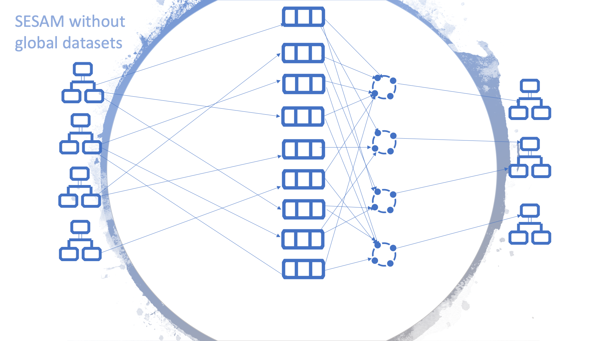

.. _best-practice:

===============
Best Practice
===============

.. contents:: Table of Contents
   :depth: 3
   :local:

Summary
-------
Sesam is an Integration Platform using a unique Datahub approach for collecting, connecting and sharing data. With Sesam data can quickly be re-purposed, re-structured and used, without changing the legacy systems that own the original data. Making all the valuable data within your company available for the whole organization. 

As many systems, Sesam can become complex and difficult to maintain when misused. To mitigate this, it is important to follow a small set of simple rules when starting on your journey. Adhering to these guidelines early will give your system solid foundations making it future proof and sparing you numerous headaches when time will come to connect more external systems and get even more out of your data. 

As the amount of data in a Sesam node grows, an optimized dataset structure will become necessary. For example, rather than approach each data flow sequentially and individually—where a single entry will lead to single merger or alteration followed by sinking the data to a recipient external system—it helps to favour aggregations of data with similar type or pertaining to the same concept. These aggregations are called “global datasets” and can be seen as authoritative datasets—e.g. the one stop shop for customer data, where the freshest and most accurate data can unequivocally be found. 

Data handling philosophy
------------------------
The data handling philosophy in Sesam can be described in short as connect, collect, share. Sesam uses connectors to fetch data from external systems. The internal data representation uses JSON, allowing to work with data from heterogeneous sources indistinctively of their system of origin.

We recommend to apply a few principles when importing data into Sesam:

1)  Collect data comprehensively, it is preferable to have unused data in Sesam than to re-engineer the connector should the data elements become necessary. 
2)  Keep the data as faithful to the original as possible, transforms are generally not necessary at this stage and can be looked into later.

The next step is to create the global datasets, these consist of data from the imported datasets, categorized and connected when possible. 
We also recommend considering the following principles when creating the global datasets: 

1)  The entirety of the imported data should be in at least one global dataset. That means all the raw datasets need to be imported into a global dataset. 
2)  Try to merge the data into the global dataset referring to the same concept. This semantic approach to global datasets will facilitate the consumption and improve the reusability of the data within Sesam.

Following the aforementioned principles when importing data and creating global datasets will establish good foundations for Sesam’s bold objective: "All the data from all the systems, connected and available as a single shared resource".

.. image:: images/best-practice/Sesam-datamodel.png
    :width: 800px
    :align: center
    :alt: Generic pipe concept    

To read about the main concepts and how to get started in Sesam, please click `here <https://docs.sesam.io/getting-started.html#glossary>`__

Global datasets
----------------
Sesam organizes entities by storing them in global datasets.

Definition
==========

A global dataset is a collection of data pertaining to a same concept from different sources. In other words, a global dataset combines data from sources semantically linked to provide one single authoritative fresh data location to access when needed. This will reduce the total number of pipes needed compared to a system where you get data from the original sources each time. 

Global datasets can be populated: 

- simply add datasets to a global dataset without merging, 
- merging data from various sources without modifications,  
- selectively merge data, by selecting which properties to merge through transformations. More information on implementing such transformations can be obtained `here <https://docs.sesam.io/getting-started.html#merge>`__ 

It is important to remember that a global dataset requires either business knowledge or a sound understanding of the data from the different sources. Global datasets will work to their fullest potential if they include all of the semantically linked data elements relating to the subject matter. 

Example:

There are three sources containing person data as shown below. If any target system wants data about this person, it would have to go through each of the root datasets every time. However, through the creation of a **global-person** dataset, information can be easily fetched from one single location.
::

  HR system
  {
     "_id": "hr-person:02023688018",
    "hrsystem-person:EmailAddress": "IsakEikeland@teleworm.us",
    "hrsystem-person:Gender": "male",
  }

  CRM
  {
    "_id": "crm-person:100",
      "crm-person:EmailAddress": "IsakEikeland@teleworm.us",
      "crm-person:ID:”100”
      "crm-person:SSN": "02023688018",
      "crm-person:SSN-ni": "~:hr-person:02023688018",
    }

  ERP
  {
     "_id": "erp-person:0202",
     "erp-person:SSN": "02023688018",
     "erp-person:SSN-ni": "~:hr-person:02023688018",
     "erp-person:ID:”0202”
     "erp-person:country":"NO"
  }

The dataset below is what a global dataset of the above three datasets looks like in Sesam when merging on equality of social security number (SSN).

::

  {
    "$ids": [
    "~:crm-person:100",
    "~:hr-person:02023688018",
    "~:erp-person:0202"
    ],
    "_id": "crm-person:100",
    "hr-person:EmailAddress": "IsakEikeland@teleworm.us",
    "hr-person:Gender": "male",
    "crm-person:EmailAddress": "IsakEikeland@teleworm.us",
    "crm-person:ID:”100”
    "crm-person:SSN": "02023688018",
    "crm-person:SSN-ni": "~:hrsystem-person:02023688018",
    "erp-person:SSN": "02023688018",
    "erp-person:SSN-ni": "~:hrsystem-person:02023688018",
    "erp-person:ID”:”0202”
    "erp-person:country":"NO" 
  }

Positive effects of global datasets
===================================

• By decoupling data from original sources, point-to-point integrations within Sesam can be avoided, thus fewer connections results in lower maintenance costs. In addition, data is available without concern for the original source
• All logic related to connecting and enriching data is only done once 
• Data in Global datasets are re-used, which saves work and makes adding new integrations easier
• Only one look-up, instead of having to “look for data” in various datasets
• Input datasets can be kept raw and as similar to the real source as possible, independent of how the data will be used, thus avoiding “early binding”
• Adding additional integrations further refines the global datasets, and therefore continuously improves the data quality

A data model without global datasets might look like the figure below. This example consists of four sources and three target systems only. Generally, it will be a lot more complicated.

As shown in the figure below, a Sesam node containing global datasets results in fewer connections, making it both tidier and easier to manage.

.. image:: images/best-practice/global.png
    :width: 400px
    :align: center
    :alt: Generic pipe concept

What do you have to take into account, and what are the challenges of global datasets?
======================================================================================

Global datasets will most likely grow and become large. If the configuration or logic is changed, this can in some cases mean that the whole dataset needs to be updated. This can potentially be a big job and will take time.

As an example, an energy company has 700 000 customers, and each customer has a power meter connected to their home. When adding the historic data, the company is required to store as well, the total data objects sum up to 30 000 000. One way of managing this large data amount is to divide the data into different global datasets. In this case, the energy company chose to store their historic data in one global dataset, and the current data in a different global dataset.

Namespace and namespaced identifiers
-------------------------------------

Namespace 
=========

A namespace consists of two parts: a namespace and a property. The namespace part can consist of any characters, ending with a colon. The property part can consist of any character except colons.
In the example below, **"crm-person"** and **"hr-person"** are namespaces and **"SSN"** is the property.

E.g.

::
   
  "crm-person:ssn"

  "hr-person:ssn"

Namespaced identifiers
======================

Namespaces are used to create namespaced identifiers, which makes it possible to merge data without losing track of the source. In addition, namespaced identifiers can be mapped to complete URLs as we have unique identifiers for each object. Namespaced identifiers provide the same functionality as foreign keys in databases. These references are usually added in the input pipe.

A namespaced identifier may take the following form:

::

  "hr-person:SSN-ni":"~:hr-person:18057653453"

  "namespace:propertyName":"namespaced-identifier:value"

Using namespace identifiers is a recommended way of referring to datasets for matching properties during transformations to ease connection of data. If you have three different person datasets, and you want to merge on a common property, like e-mail or SSN, then we should use namespace identifiers. The code below will add a namespace identifier based on common SSN properties between datasets **"crm-person"** and **"erp-person"** during transformation inside DTL of **"crm-person"**. In a similar way, we need to create a namespace identifier between **"hr-person"** and **"erp-person"** datasets so that we can refer to them during merging.

::

["make-ni", "hr-person", "SSN"],

This will produce the following output:

::

  "crm-person:SSN-ni": "~:hr-person:23072451376",

Now, you have unique namespace identifiers based on SSN, which you can refer now.

::

   {
    "_id": "global-person", 
    "type": "pipe", 
    "source": { 
        "type": "merge", 
        "datasets": ["crm-person cp", "hr-person hr", "erp-person ep"], 
        "equality": [ 
            ["eq", "cp.SSN-ni", "hr.$ids"], 
            ["eq", "ep.SSN-ni", "hr.$ids"] 
        ], 
        "identity": "first", 
        "version": 2 
    }

In the above code we are connecting the foreign keys **"SSN-ni"** of **"erp-person"** and **"crm-person"** with the primary key **"$ids"** of 
**"hr-person"**. You do not need to add the third equality between **"erp-person"** and **"crm-person"** as it will happen automatically.

By default, namespaced identifiers are stripped from the output.

Naming conventions
------------------

It is essential to have an agreed naming convention across integrations within Sesam. The motivation is to have a better visibility and understanding of where your data comes from and where it is heading, as well as to how it is internally transformed. It also makes it easier to switch between projects.

General rules
=============

• lower case
• dash - as delimiter

Systems
=======

• name after the name of the service you integrate with, not the technology used (e.g. salesforce instead of mysql)
• if multiple systems are required to talk to a system, postfix them with a qualifier (e.g.salesforce-out)
 
Pipes
=====

• name input pipes with system they read from and postfix with the type of content (e.g. salesforce-sale)
• do not use plural names (e.g. salesforce-sale not salesforce-sales)
• prefix merge pipes with merged- (e.g. merged-sale)
• prefix global pipes with global- (e.g. global-sale)
• name intermediate output pipe with the type of the content and the name of the system to send to (e.g. sale-bigquery)
• name outgoing pipe by postfixing the intermediate output with -endpoint (e.g. sale-bigquery-endpoint)

Datasets
========

• name them the same as the pipe that produced it (the default and does not need to be specified)

Workflow for transforming data in Sesam
---------------------------------------

Most Sesam projects will have a set flow that the data goes through.

The data fed into Sesam through input pipes where namespaced identity is added in order to keep exsisting data model with joins intact, RDF type for future filetring and classification, global_ids used for joining and set different environments through conditions

Merge pipe merges data beloning together to generate global datasets, transforms and Metadata Global true

Outging pipes is where merged datasets are ennriched with more context from other datasets 

Endpoint pipes has no logic and basically sends data to endpoint

.. image:: images/best-practice/Sesam-pattern.png
    :width: 800px
    :align: center
    :alt: Generic pipe concept  

Input pipes
===========

Input pipes are the mechanism to extract data from source system into Sesam. Input pipes utilize the concepts of systems within Sesam. Systems can be described as the connection mechanism towards source systems. Some of them are a part of core functionality of Sesam, some are provided as extensions ready for you to use, others have to be programmed to enable a connection. This is done by implementation of microservices compatible with Docker. After a microservice for Sesam is installed, Sesam can utilize this as a system it can connect to. Microservices and how to build those for Sesam will be discussed in more detail in a later section of this document. But in some cases, microservices must contain more logic to convert data into a more readable form for input pipes. An example could be decompressing files or EDI interpretation of a certain EDIFACT file, which can be quite difficult to achieve within the input pipe itself.  
 
When implementing an input pipe, one has to define which system it should operate towards. After defining which system an input pipe should extract data from, the data model of the source system should be studied and understood whether it is an API or a table within a relational database. 
 
The implementation of input pipes deviates from merging and enrichment pipes. Results from input pipes are stored as raw data sets. Transformation in inputs should be kept at an absolute minimum. The raw data should be kept as is, but one could add extra data information necessary for utilizing the raw data in future for creating merged and/or enriched data sets. We add properties to the raw data, including an “ID” – commonly called global-id. It is like a primary/foreign key in a relational database – but not entirely. It is used as a key to merge two or more raw data sets into one data set. 
 
An example to illustrate what an ID (global-id) is, we retrieve data from a table in a system that contains a field that contains employee-number. Employee number can be the primary key in this table. At the same time, we also retrieve data from the sales system, the primary key is perhaps customer-no. Instead of comparing employee-number and customer-no, we create a global employee id property for both raw data sets based on the primary key of each raw data sets. It can be messy, difficult to maintain and rest assure such values will often be used for more joins and queries down the future. By creating such global IDs as early as possible in the input pipes, making global data sets will be easier and simpler. And making additional merging of newly added raw data sets into a global data set simpler with less effort, and more maintainable. Ids or global ids can be regarded as the Sesam way of a Primary Key, but not for just one data set, but for all similar data set. 
 
Another issue to avoid complications further downstream in the integrations, there are some standard transformations and applications we recommend users to apply inside input pipes. One common issue we can solve in the input pipe is; who can talk directly to the source system? As an example, we use a customer who has 2 different environments (it is recommended by ISTQB, ITIL and other standardized frameworks, to have one for development, one for test (system/acceptance and one finally for production) for their personnel data; one for production and one for test. The customers production environment includes all the personal data for the individuals working for the company. This data is sensitive, and only one IP-address is allowed to access that specific database. 
 
The customer's test environment might also contain sensitive personal data. Therefore, only one IP-address from the Sesam portal may have access. There are several issues connected to this setup. First, what do we do when several consultants work with the same project? Who gets the firewall access? Second, what about minor changes to code that we would like to test out, without having to changes data in the customers test environment?  
 
These issues are solved with the conditional source setting in the input pipes DTL code (DTL = Data Transformation Language by Sesam), and we will go through how to do this below. 
 
In the DTL-code below we see an example of the general setup of a conditional input pipe. In this example we specify two environments; ’Prod’ and ’Dev’. 
In this case, the ’Prod’ environment should talk directly to the source data, in this case a csv-file. Inside the conditional ’Prod’-definition we specify all the information we need in order to collect the source data. 
 
The ’Dev’ environment should not talk directly to any Production source, since many people will be using it. Instead we use ’embedded data’, which is data on the same format as the source data in ’Prod’ but anonymized such that many people can use it. 
Embedded data, or embedded datasets can also be used for parameters (fixed data), like rules for interpreting other data. Eg. Translation of a code/abbreviation in input to a more understandable/readable format for humans. 
We specify which Sesam node belongs to ’Dev’ and which belongs to ’Prod’ by inside the ’Variables’-tab under ’Settings’ - ’Datahub’ inside each node. In the DTL-code window we specify a variable named ’node-env’ which takes the value correlated to the specific environment that node should be associated with. 
 
:: 
 
  "node-env": "prod" or "node-env": "dev" 
 
  Depending on which we use. 
 
 
Another two things seen in input pipe below are: 
 
RDF type; a meta data tag put on for filtering purposes. It consists of source system and column or property. Eg. crm:person. This need to be done in input pipe as after they go into global dataset, we need to make sure we have metadata tags to be able to filter them out. We can also add other metadata tags if required, but RDF type is the one recommended to always put in the input pipe. 
 
Last property added in the input pipe is existing joins. This is to keep existing data model and existing joins and we do this by making NIs (namespaced identifiers)or foreign keys.
 
 
:: 
 
  {  
  "_id": "hr-person",  
  "type": "pipe",  
  "source": {  
    ´´"type": "conditional"´´,  
    "alternatives": {  
      "Prod": {  
        "type": "csv",  
        "system": "hr",  
        "blacklist": ["Password"],  
        "delimiter": ",",  
        "encoding": "utf-8",  
        "primary_key": "SSN",  
        "url": "/file/sesam-training/data/test_people_sesam_training1.csv"  
      },  
      "Dev": {  
        "type": "embedded",  
        "entities": [{  
          "_id": "23072451376",  
          "Country": "NO",  
          "EmailAddress": "TorjusSand@einrot.com",  
          "Gender": "male",  
          "GivenName": "Torjus",  
          "MiddleInitial": "M",  
          "Number": "1",  
          "SSN": "23072451376",  
          "StreetAddress": "Helmers vei 242",  
          "Surname": "Sand",  
          "Title": "Mr.",  
          "Username": "Unjudosely",  
          "ZipCode": "5163"  
        }, {  
          "_id": "09046987892",  
          "Country": "NO",  
          "EmailAddress": "LarsEvjen@rhyta.com",  
          "Gender": "male",  
          "GivenName": "Lars",  
          "MiddleInitial": "A",  
          "Number": "2",  
          "SSN": "09046987892",  
          "StreetAddress": "Frognerveien 60",  
          "Surname": "Evjen",  
          "Title": "Mr.",  
          "Username": "Wimen1979",  
          "ZipCode": "3121"  
        }, {  
          "_id": "07033589977",  
          "Country": "NO",  
          "EmailAddress": "DennisOlsen@dayrep.com",  
          "Gender": "male",  
          "GivenName": "Dennis",  
          "MiddleInitial": "L",  
          "Number": "3",  
          "SSN": "07033589977",  
          "StreetAddress": "Gydas gate 227",  
          "Surname": "Olsen",  
          "Title": "Mr.",  
          "Username": "Gotin1984",  
          "ZipCode": "3732"  
        }, {  
          "_id": "14032975433",  
          "Country": "NO",  
          "EmailAddress": "Emiliestby@teleworm.us",  
          "Gender": "female",  
          "GivenName": "Emilie",  
          "MiddleInitial": "T",  
          "Number": "4",  
          "SSN": "14032975433",  
          "StreetAddress": "Landeroveien 83",  
          "Surname": "Østby",  
          "Title": "Mrs.",  
          "Username": "Slin1956",  
          "ZipCode": "0672"  
        }, {  
          "_id": "20116430180",  
          "Country": "NO",  
          "EmailAddress": "JonasHaile@jourrapide.com",  
          "Gender": "male",  
          "GivenName": "Jonas",  
          "MiddleInitial": "E",  
          "Number": "5",  
          "SSN": "20116430180",  
          "StreetAddress": "Indre Løkkavei 3",  
          "Surname": "Haile",  
          "Title": "Mr.",  
          "Username": "Firejus",  
          "ZipCode": "3515"  
        }, {  
          "_id": "03045865306",  
          "Country": "NO",  
          "EmailAddress": "MartineJohansson@gustr.com",  
          "Gender": "female",  
          "GivenName": "Martine",  
          "MiddleInitial": "J",  
          "Number": "6",  
          "SSN": "03045865306",  
          "StreetAddress": "Statsråd Kroghs veg 222",  
          "Surname": "Johansson",  
          "Title": "Mrs.",  
          "Username": "Somper",  
          "ZipCode": "7021"  
        }, {  
          "_id": "12062922598",  
          "Country": "NO",  
          "EmailAddress": "DavidTnder@superrito.com",  
          "Gender": "male",  
          "GivenName": "David",  
          "MiddleInitial": "N",  
          "Number": "7",  
          "SSN": "12062922598",  
          "StreetAddress": "H.A.Reinerts gate 159",  
          "Surname": "Tønder",  
          "Title": "Mr.",  
          "Username": "Zably1991",  
          "ZipCode": "1524"  
        }, {  
          "_id": "01112962070",  
          "Country": "NO",  
          "EmailAddress": "JulieNordeng@teleworm.us",  
          "Gender": "female",  
          "GivenName": "Julie",  
          "MiddleInitial": "A",  
          "Number": "8",  
          "SSN": "01112962070",  
          "StreetAddress": "Sandbrekketoppen 63",  
          "Surname": "Nordeng",  
          "Title": "Mrs.",  
          "Username": "Hicar1971",  
          "ZipCode": "5224"  
        }, {  
          "_id": "14085111225",  
          "Country": "NO",  
          "EmailAddress": "ErikaOlsen@jourrapide.com",  
          "Gender": "female",  
          "GivenName": "Erika",  
          "MiddleInitial": "L",  
          "Number": "9",  
          "SSN": "14085111225",  
          "StreetAddress": "Fürstlia 148",  
          "Surname": "Olsen",  
          "Title": "Mrs.",  
          "Username": "Whavillat",  
          "ZipCode": "1367"  
        }, {  
          "_id": "12052427741",  
          "Country": "NO",  
          "EmailAddress": "AleksanderOmmundsen@rhyta.com",  
          "Gender": "male",  
          "GivenName": "Aleksander",  
          "MiddleInitial": "M",  
          "Number": "10",  
          "SSN": "12052427741",  
          "StreetAddress": "Rømers gate 182",  
          "Surname": "Ommundsen",  
          "Title": "Mr.",  
          "Username": "Grale1949",  
          "ZipCode": "7030"  
        }}]  
      }  
    },  
    "condition": "$ENV(node-env)"  
  },  
  "transform": {  
    "type": "dtl",  
    "rules": {  
      "default": [  
        ["copy", "*"],  
        ["comment", "below we will add  a namespaced identifier and 'rdf:type' for easy filtering later"],  
        ["add", "rdf:type",  
          ["ni", "hr", "person"]  
        ]  
      ]  
    }  
  },  
  "pump": {  
    "mode": "manual"  
  },  
  "metadata": {  
    "tags": ["embedded", "person"]  
  }  
    

Merge-pipe and global datasets
==============================

By using merge pipes, two or more datasets can be joined/merged into a resulting dataset. This allows us to add several sources into a dataset. We can choose not to joining or transform any datasets which means they are simply “put into” the global dataset. The ones who will be joined and transformed you can read more about below. 
 
A resulting dataset can be a new dataset, but also an existing dataset where one wants to add more data from new sources when they become available for Sesam. This is done by adding source datasets to a “merge pipe”. The new data will be added to the dataset (can be compared to the use of alter table/update of a relational database – but in one single operation). 
 
In the merge pipe we want to add a metadata tag to show this is a merge pipe going into a global dataset, so we set the following code into pipe: 
 
:: 
   
   "metadata": { 
    "global": true }  

 
In addition, it gives the dataset a “global symbol” in the graph tab as seen below. This makes it simple to see this is a global dataset straight away. (Show image) 
 
As a general rule when it comes to transformations, we wish to use reusable properties; i.e. global_ids we generated in input pipe or other global properties generated in the global dataset. This gives us opportunity to track data from start to end of flow through Sesam.  
 
In order to prioritize which ids we want to use, we use “coalesce” function. If the global id is null “coalesce” gives us the opportunity to choose which is the next best option. This, in turn gives us the opportunity to use the golden record, which you can read about here: https://docs.sesam.io/best-practice.html#id19  
 
Below we see an example of a merge-pipe called global-person.  At top the type of pipe is set to **“merge“** enabling us to add 4 datasets that we wish to merge. 
 
Below the actual merge, or **«equality»** rules are set.  Further down, in the **“transform”** section the use of **coalesce** becomes obvious when choosing which properties got get values from. 
 
:: 
 
  { 
    "_id": "global-person", 
    "type": "pipe", 
    "source": { 
      "type": "merge",
      "datasets": ["erp-person ep", "crm-person cp", "salesforce-userprofile su", "hr-person hr"], 
      "equality": [ 
        ["eq", "ep.$ids", "cp.SSN "], 
        ["eq", "ep. .$ids ", "hr.$ids"], 
        ["eq", "ep.Username", "su.Username"] 
      ], 
      "identity": "first", 
      "version": 2 
    }, 
   "transform": { 
      "type": "dtl", 
      "rules": { 
        "default": [ 
          ["copy", "*"], 
          ["add", "zipcode", 
            ["coalesce", 
              ["list", "_S.hr-person:ZipCode", "_S.erp-person:ZipCode", "_S.crm-person:PostalCode"] 
            ] 
          ], 
          ["add", "email", 
            ["coalesce", "_S.EmailAddress"] 
          ], 
          ["add", "firstname", 
            ["coalesce", 
              ["list", "_S.crm-person:FirstName", "_S.erp-person:Firstname", "_S.hr-person:GivenName"] 
            ] 
          ], 
          ["add", "lastname", 
            ["coalesce", 
              ["list", "_S.crm-person:LastName", "_S.erp-person:Lastname", "_S.hr-person:Surname"] 
            ] 
          ], 
          ["add", "fullname2", 
            ["concat", "_T.global-person:firstname", " ", 
              ["coalesce", 
                ["not", 
                  ["matches", "*.", "_."] 
                ], "_S.MiddleInitial"], ". ", "_T.global-person:lastname"] 
          ], 
          ["add", "fullname", 
            ["concat", "_T.global-person:firstname", " ", 
              ["filter", 
                ["neq", "_.", ". "], 
                ["concat", 
                  ["coalesce", 
                    ["list", "_S.crm-person:MiddleInitial", "_S.erp-person:MiddleInitial", "_S.hr-person:MiddleInitial"] 
                  ], ". "] 
              ], "_T.global-person:lastname"] 
          ] 
        ] 
      } 
    }, 
    "metadata": { 
      "global": true 
    } 
  } 
 
When running the merge-pipe, the result is a “global-dataset” consisting of entities with joined data that has been through the listed transformations. 
 
The first property that greets us in a global data set is called $ids and is a list of namespace identities from the sources in the merge pipe. Typically looking like below. 
 
:: 
 
  "$ids": [ 
      "~:erp-person:02023688018", 
      "~:crm-person:100", 
      "~:salesforce-userprofile:Mays1944", 
      "~:hr-person:02023688018" 
    ]
 
 The $ids are generated automatically when the merge-pipe is run, and they always show up on top for the global dataset.  
 
So, what is **$id**? Basically, it is a collection identifier (Collection ID), $ids, is a concept in Sesam to keep track of different global identifiers from raw datasets (or global datasets) when two or more datasets are merged into a global dataset or enriched datasets. 
 
Collection identifier, $ids, is a list of primary keys or global ID used in dataset, pipes (DTL programs within Sesam or used by core functions in Sesam DataHUB. 
Another perspective is to see this as a primary key of global IDs, when merging data from several sources. 
 

Transformation and Enrichment Pipes (TEPs) 
==========================================

In order to utilize aggregated data in Sesam residing in global dataset, data often must be transformed and/or enriched before data can be delivered to targets. The actual deliverance of data is done through another concept of Sesam – Sinks. Sinks are discussed in more detail in another section of this document.
Transforming and enriching data to be ready for deliverance, is implemented through TEPs. 

TEPs are implemented by using aggregated entities from global datasets within Sesam. These global datasets are not necessarily ready to be delivered to targets systems directly. In TEPs only the necessary data for the Endpoint are extracted from the global datasets. This data is extracted by filtering on the metadata tags. RDF type tends to be most used as it contains source system and table/ data type.

As an example, if only require person data from crm system residing in the global-person dataset, metadata tag “rdf type” become useful. We can pop on following filter in this pipe:

 
:: 
  ["filter",  
            ["eq", "_S.rdf:type", "crm:person"]  
          ] 
 
 
This will give output from crm-person only. 
 
Filter is set under transforms and there are several transforms we can do in a Transformation and Enrichment Pipe. Other metadata tags can be used for further filtering if required. 
 
Additional data can also be added to the enriched datasets. This can be more fixed data or parametric data. I.e. in a global dataset only the zip code or country code are stored. The TEPs can then hop to other datasets to retrieve data for city associated with the zip code or the full name of a country associated with the country code from the global dataset. Data in such data sets can be fixed/parametric or as “difi-postnummer” dataset contains all zip codes with city name in Norway.
The resulting dataset from a TEPs is produced and can be finalized into the correct format specified for the endpoint. The final transformation before deliverance is performed in the sink and the corresponding microservice (XML, EDIFACT or an SQL statement towards IBM DB2).
 
Lastly to have specification on target endpoint format is important: 

1. Mandatory – Must have  
2. Parametric options 
3. MUTEX – Mutual Exclusive data – i.e. for bank account you can either use BBAN or IBAN, not both at the same time 
 
See example below: 

::
  "_id": "example-hops-apply-rule", 
  "type": "pipe", 
  "source": { 
    "type": "embedded", 
    "entities": [{ 
      "_id": "apply-rule", 
      "name": { 
        "firstname": "Ola", 
        "lastname": "Nordmann" 
      }, 
      "zipcode": "9982" 
    }] 
  }, 
  "transform": { 
    "type": "dtl", 
    "rules": { 
      "default": [ 
        ["add", "address-info", 
          ["hops", { 
            "datasets": ["global-location gl"], 
            "where": [ 
              ["eq", "_S.zipcode", "gl.postnummer"] 
            ] 
          }] 
        ], 
        ["merge", 
          ["apply", "address", "_T.address-info"] 
        ], 
        ["remove", "address-info"] 
      ], 
      "address": [ 
        ["add", "city", "_S.poststed"], 
        ["add", "municipality", "_S.kommunenavn"] 
      ] 
    } 
  }, 
  "pump": { 
    "mode": "manual" 
  }, 
  "metadata": { 
    "tags": ["location"] 
  } 
 
Endpoint
========

Tips for global datasets
------------------------

• All datasets should go into a global dataset
• In most data models, between 10–20 global datasets are sufficient. This is based on experience on various size of projects at Sesam. The smaller  projects could have close to 10, and some of the bigger projects has over 20 global datasets, with hundreds of pipes connected to them. To identify how many global datasets a project might need it is important to perform a proper analysis. For instance, if a company’s needs are met by five global datasets, then they don’t have to have at least ten. This is only for best practice, but we do have examples of larger data models with less than ten global datasets
• Start general with big “buckets” and re-arrange and split into smaller global datasets if necessary
• Think less property and more “what it is”, e.g. person vs user. Something that stops being a user might not stop being a person
• Keep it generic
• Avoid system specific global datasets. I.e. a document management system contains metadata about various concepts (e.g. title, revision, status, equipment, owner, date generated files). These are static in nature, and to make them useful you can put “equipment data” in a global equipment dataset. The “owner data” might be put in global person dataset etc. This way you gather concepts across sources and enrich them, such that they are available for other systems to use
• Global datasets give us the opportunity to define “golden records”

How to do global datasets in Sesam
----------------------------------

When initiating a new project in Sesam, it is important to begin with the data model. Start by analyzing the sources and data to determine the needs of the organization. This will have an impact on the data model and more specifically how the global datasets will be organized. It is here the organization needs to think: what is important to me? What data do I use often, and therefore needs to be easily available? The results vary for each organization and each data model. It is however normal to add global datasets, or to re-arrange them, as the amount of data is growing.

To get an idea of the granularity, please see final chapter called “Examples of real global datasets”.

Generally, most organizations need five basic global datasets. This is not true for all organizations and data integrations, but it is a good basis to start from.

These five are:

Global-person

Global-project

Global-classification

Global-organization

Global-task

This is only the first part of the analysis. The second part is how to enrich data in the global datasets, and to determine which aggregated datasets there is a need for. These are questions that need to be asked in order to make the enriched datasets as useful as possible.

Recipe for generating global datasets
-------------------------------------

It is impossible to make a universal recipe for all integration projects using Sesam as all projects are unique. The different data variety, data model complexity and costumer requirements are all integral parts structuring each individual Sesam node. In addition, the order you do the various tasks might vary, so please use this as a guideline only, not a comprehensive recipe.

1.  The first step is to consider what the goal of the integration is; what do you want to achieve?
2.  Next step is to determine which data from which sources do you need to achieve your goal.
3.  Get information regarding the existing data model and how data needs to be joined.
4.  Access the data source and copy the necessary data into Sesam.
5.  Analyze and decide on how you want to organize your global datasets. There is no right or wrong way of how to do this. In time you will gain experience on which datasets work as global datasets and which does not. Try to use common sense and organize by concept or type.
6.  Once decided it is important to analyze how the data is going to be added to the global dataset; is there a need to merge the data or is there a need to “place” data in a global dataset without merging? For example, generating a global location dataset is logical. It contains countries, regions, cities, boroughs, counties and offices. It does not make sense to merge them, but it does make sense to put them in a common global dataset. This way you might gather data concerning the same concept as well as to have one single location place for looking up this information. 

In many cases however, it does make sense to merge the data, such as person data as shown earlier, which was merged on SSN, email etc.

7.  Some data may need to be processed before being added to a global dataset. This involves e.g. selecting what we use as ID, converting data type, change property names etc.
8.  When the global datasets are set up, the data can either be re-used as is, or undergo further transformations. This might encompass filtering specific data and joining with other datasets etc. to enhance quality and usefulness.
9.  Based on the target systems and your requirements, adapting data to target systems is done as late as possible in the data flow and as close to target as possible (late binding.)

Let’s start with simplified example to demonstrate. Below we have four datasets from two different sources; **"crm"** and **"erp"**:

erp-person

crm-person

erp-organisation

crm-organisation

Looking at the names of the datasets, it would be logical to create two global datasets. The first could contain data about person, such as user, customer, name, employee and so on.

**global-person**

.. image:: images/best-practice/global-person1.png
    :width: 700px
    :align: center
    :alt: Generic pipe concep

The second could contain data concerning the organization. This might include names of departments, customers, regions and so on.

**global-organisation**

.. image:: images/best-practice/global-organisation.png
    :width: 700px
    :align: center
    :alt: Generic pipe concep

When the number of sources and datasets increases it will become natural to add more “buckets” or global datasets to put them in.

Below are new sources with data from Difi and Salesforce. In addition, more datasets from existing sources were added.

Datasets:

erp-person

crm-person

difi-ssn

hrsystem-person

difi-ssn

difi-orgnumber

salesforce-opportunity

erp-projectnumber

crm-order

The datasets might be organized like this, please see below. As seen no changes in **“global-organization”**. New datasets added to **“global-person”** and new “bucket” called **“global-project”** is generated.

**global-person**

.. image:: images/best-practice/global-person2.png
    :width: 600px
    :align: center
    :alt: Generic pipe concep

The second could contain data concerning projects. This might orders, project numbers, sales opportunities etc.

**global-project**

.. image:: images/best-practice/global-project.png
    :width: 600px
    :align: center
    :alt: Generic pipe concep

It is important to emphasize that this is only a suggestion on how it might be logical to organize the datasets. The end result is highly individual and will most likely vary. This does however give an idea on how architecture in Sesam is built and developed using global datasets.    

Additional Sesam tips
---------------------

Golden record
=============

A golden record is a single, well-defined version of all the data entities in an organizational ecosystem. In this context, a golden record is sometimes called the **"single version of the truth"**, where **"truth"** is understood to mean the reference to which data users can to turn when they want to ensure that they have the correct version of a piece of information.  

In the example below, all three sources provide a **zip-code**, such that some properties in a global dataset might be duplicates from different sources. In this case it could be fitting to add a **"global-person:zipcode"** property to the global dataset. This property should contain the most reliable zip-code value of the three sources and will be the property we access when we want the person's zip-code. This global property becomes a part of a **"golden record"** which ensures a single, well-defined representation of the person.

::

  {
    "$ids": [
    "~:crm-person:100",
    "~:hr-person:02023688018",
    "~:erp-person:0202"
    ],
    "_id": "crm-person:100",
    "hr-person:EmailAddress": "IsakEikeland@teleworm.us",
    "hr-person:Gender": "male",
    "hr-person:ZipCode": "null",
    "crm-person:EmailAddress": "IsakEikeland@teleworm.us",
    "crm-person:ID":"100",
    "crm-person:SSN": "02023688018",
    "crm-person:SSN-ni": "~:hrsystem-person:02023688018",
    "crm-person:PostalCode": "3732",
    "erp-person:SSN": "02023688018",
    "erp-person:SSN-ni": "~:hrsystem-person:02023688018",
    "erp-person:ID":"0202",
    "erp-person:ZipCode": "5003",
    "global-person:zipcode": "3732" 
  }

In addition to the zip-code from the 3 different data sources, the "global-person" dataset now also contains a **global-person:zipcode**. When creating a golden record in Sesam, one configures the priority of the sources and the value of the property that is highest on the priority list and has data will be used.

::

"hr-person:ZipCode": null,
"crm-person:PostalCode": "3732",
"erp-person:ZipCode": "5003",
"global-person:zipcode": "3732"
      
Now, the most trusted zip-code value can be accessed without evaluating all three at every inquiry.

RDF types
=========

In central datasets a property for classification is sometimes added. In Sesam, this is called **"rdf type”**. This is used if one wants to extract a specific data type from the global dataset.

Data modelling
==============

Below are principles of doing data modelling in Sesam.

Raw input
^^^^^^^^^

When reading data into Sesam it is best practice to copy it and not start changing it. This way we have a dataset which is identical or close to identical to the source data. It is, however, common practice to add namespaced identifiers
 on the source pipe to keep track of where the data comes from.

Benefits:

• Not configured specifically for any project or use-case, therefore much easier to re-use the data over time

• No decisions have to be made before the data is imported

Drawbacks:

• Increased storage use if not all the data is needed

Data flow
^^^^^^^^^

In Sesam data is collected, connected, enriched and transformed from the datasets formed from retrieving data from the source systems. This is done by compiling data from multiple datasets, transforming data into new data formats or standards, and adapting the data to new target systems. In this way, new values are created for the re-use and use of data. This is done in the global dataset where the main purpose is that one should not need to look up multiple datasets and compile data for each time one needs it, but rather make the connecting and enriching once and look up in one place.

Enrich data
^^^^^^^^^^^

There are multiple ways to enrich the original source data, the most common one is to do a transformation, a simple example would be to concatenate “firstname” and “lastname” into a new property called “name”, that consists of both. This will be stored in the global dataset (in addition to the two original properties), and will be available for future integrations that might need the same transformation.

Another way to enrich data, is to derive it based on the original property. One example of this can be a “map-coordinate” property that is stored in the coordinate system that Google uses, but the target system needs it in another coordinate system. This is achieved by calling a coordinate microservice, that returns one or more extra properties based on other coordinate systems. These are then added to the global dataset in addition to the original one, giving future integrations more options if needed.

Yet another example on how to enrich data is by adding mapping to the properties to support a corporate standard information model or simply mapping to a target system. This adds the mapped properties to the global dataset in addition to the original properties, making it possible for integrations to chose between a standard information model or the native information model of the source system.

Output data (late binding)
^^^^^^^^^^^^^^^^^^^^^^^^^^

Principle - adaptation of data to the receiving system is done as late as possible in the data flow, and as close to the receiving system as possible.

Unmodified dataset as output
^^^^^^^^^^^^^^^^^^^^^^^^^^^^

When writing data out of Sesam the dataset might be transferred as it is (unmodified dataset as output), transformed on the way out or transferred directly to other sources. 

Manage source code
^^^^^^^^^^^^^^^^^^

Sesam usually uses a Git based source control service to collaborate and have version control on source code.

Git: an open source version control system used to manage code (DTL when working in Sesam). When working in project the code is updated constantly and released in new versions, so Git helps manage this. As with all projects, it’s up to the project itself to decide how to manage the source code, and what kind of service to use. It is not required to use a source control service, but it is highly recommended.

Examples of real global datasets
--------------------------------

**Below is an example from a Sesam customer:**

global-workorder

global-vehicle

global-sale

global-reporting

global-reading

global-project

global-poweroutage

global-person

global-meterpoint

global-location

global-invoicemain

global-invoicedetail

global-invoice

global-grid

global-fault

global-customer

global-contract

global-communication

global-classification

global-asset

global-account

**Another organization’s data model with 13 global datasets:**

global-subscription

global-skills

global-site

global-sesam-product

global-person

global-paymentmethod

global-machine

global-event

global-department-employee

global-department

global-CV

global-company

global-customer

**A public sector company’s growing list of global datasets:**

global-klassifisering

global-organisasjon

global-person

global-prosjekt

global-prosjektoekonomi

global-soeknad

global-statistikk

**An energy company’s list of global datasets:**

global-asset

global-catalogue

global-classification

global-consumption

global-contract

global-customer

global-document

global-exportobjects

global-facility

global-grid

global-inventory

global-invoice

global-job

global-location

global-market

global-meterpoint

global-sale

global-timeseries

global-vendor

global-workorder

**Another public sector company’s list of global datasets:**

global-access

global-address

global-asset

global-case

global-classification

global-company

global-contract

global-course

global-document

global-file

global-order

global-person

global-project

global-task

