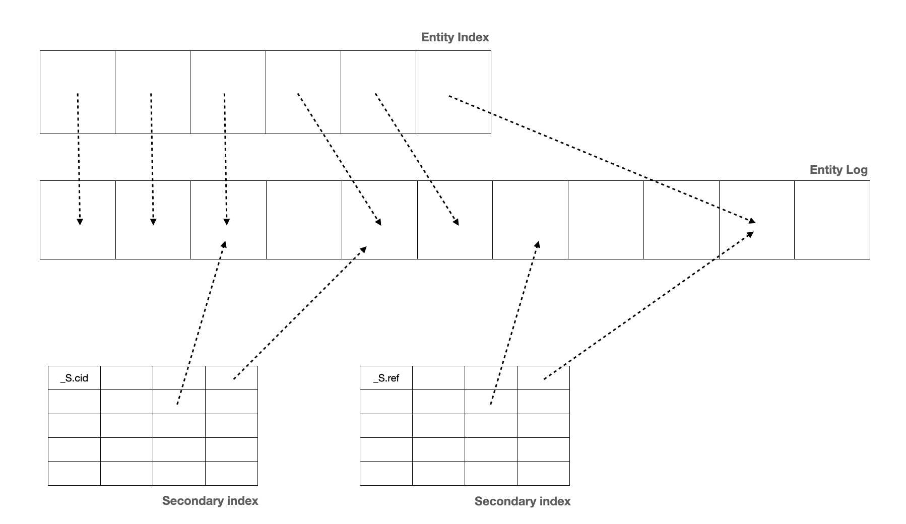
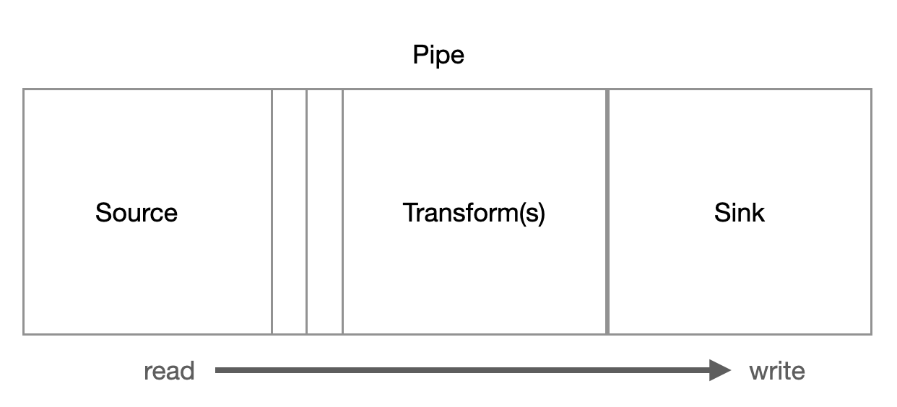
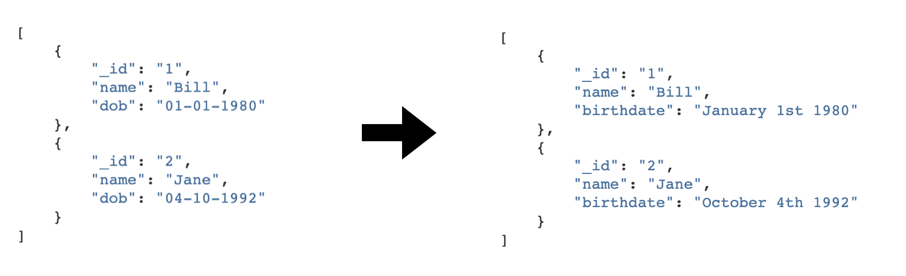
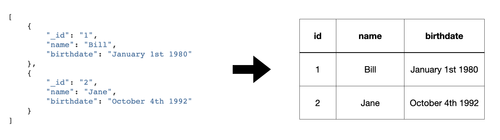

========
Concepts
========

.. contents:: Table of Contents
   :depth: 2
   :local:

Introduction
------------

.. image:: images/datahub.jpg
    :width: 800px
    :align: center
    :alt: Sesam

This document introduces concepts that are key to understanding and working with Sesam.

Sesam is a Master Data Hub built on a streaming dataflow data integration and processing system. It stores data in a data hub. The hub is optimised for getting data from source systems, transforming data, and providing data to target systems.

Sesam gets raw data from source systems and stores it in datasets. Pipes can be defined to process datasets to construct new datasets. Transforms can join data across datasets to create new shapes of data. Data from these datasets can be exposed and delivered to other systems. The entire system is driven by the state change of :doc:`entities <entitymodel>`.

The primary building block for building :ref:`flows <concepts-flows>` is the :ref:`pipe <concepts-pipes>`. A pipe gets data from a :ref:`source <concepts-sources>`, :ref:`transforms <concepts-transforms>` it and writes it to a :ref:`sink <concepts-sinks>`. The data that flows through pipes are streams of :doc:`entities <entitymodel>` – which are like JSON objects. Pipes are the active component that gets data into the data hub, makes data flow through it and provides data to target systems.

Why?
----

The data hub is the go-to place for data within the enterprise. Integrations no longer have to be point-to-point. Systems can be loosely coupled instead of being tightly coupled, as is the case for direct integrations. With Sesam, individual systems no longer have to depend on other systems being up. It is also a lot easier to replace systems or to perform migrations. Sesam is the active part and will :ref:`schedule <concepts-scheduling-and-signalling>` how and when pipes are run. If a system is down, the pipe will try getting or sending the data once the system is back up.

With the help of features like :ref:`streaming <concepts-streaming>`, :ref:`merging <concepts-merging>`, :ref:`namespaces <concepts-namespaces>` and :ref:`global datasets <concepts-global-datasets>` Sesam enables higher quality `master data management <https://en.wikipedia.org/wiki/Master_data_management>`_.

The Sesam service is built around the principle that Sesam does not own the data stored in the data hub. The idea is that all the data in the data hub can be re-read from the sources and thus be fully rebuilt from scratch.

.. _concepts-streaming:

Streams of data
---------------

Sesam consumes and produces streams of :doc:`entities <entitymodel>`. An entity is very much like a JSON object and consists of a number of key-value pairs along with some special reserved property names. See the :doc:`entity data model <entitymodel>` document for more details about entities.

The following is a quick example of the shape of entities that are consumed and exposed by Sesam.

::

    [
        {
            "_id": "1",
            "name": "Bill",
            "dob": "01-01-1980"
        },
        {
            "_id": "2",
            "name": "Jane",
            "dob": "04-10-1992"
        }
    ]

Streams of entities flow through pipes. A pipe has an associated pump that is scheduled to regularly pull data entities from the source, push them through any transforms and send the results to the sink. The most common source is the :ref:`dataset source <dataset_source>` which reads entities from a dataset. The most common sink is the :ref:`dataset sink <dataset_sink>` which writes entities to a dataset. There are also :ref:`sources <source_section>` and :ref:`sinks <sink_section>` that can read and write data to and from external systems outside of Sesam.

.. _concepts-datasets:

Datasets
--------

A dataset is the basic means of storage inside Sesam. A dataset is a log of :doc:`entities <entitymodel>` supported by primary and secondary indexes. A :ref:`dataset sink <dataset_sink>` can write entities to the dataset. An entity is appended to the log if it is new (as in, an entity with a never-before-seen ``_id`` property) or if it is different from the previous version of the same entity.

A content hash is generated from the content of each entity. This hash value is used to determine if an entity has changed over time. The content hashing is what enables :ref:`change tracking <concepts-change-tracking>`.

The :ref:`dataset source <dataset_source>` exposes the entities from the dataset so that they can be streamed through :ref:`pipes <concepts-pipes>`. As the main data structure is a log the source can read from a specific location in the log. Datasets have full :ref:`continuation support <concepts-continuation-support>`.

Configuration
-------------

.. _concepts-systems:

Systems
=======

A :ref:`system <system_section>` is any database or API that could be used as a source of data for Sesam or as the target of entities coming out of Sesam. The system components provide a way to represent the actual systems being connected or integrated.

The system component has a couple of uses. Firstly it can be used to introspect the underlying system and provide back lists of possible 'source' or 'sink' targets. Often this information can be used on the command line or in the *Sesam Management Studio* to quickly and efficiently configure how Sesam consumes or delivers data.

The other use of the *system* is that it allows configuration that may apply to many *source* definitions, e.g. connection strings, to be located and managed in just one place. Systems also provide services like connection pooling and rate limiting.

You can also run your own :ref:`extension systems <concepts-extensions>`.

.. _concepts-pipes:

Pipes
=====

A :ref:`pipe <pipe_section>` is composed of a :ref:`source <concepts-sources>`, a chain of :ref:`transforms <concepts-transforms>`, a :ref:`sink <concepts-sinks>`, and a :ref:`pump <concepts-pumps>`. It is an atomic unit that makes sure that data flows from the source to the sink. It is a simple way to talk about the :ref:`flow <concepts-flows>` of data from a source system to a target system. The pipe is also the only way to specify how entities flow from dataset to dataset.

.. _concepts-sources:

Sources
#######

A :ref:`source <source_section>` exposes a stream of entities. Typically, this stream of entities will be the entities in a dataset, rows of data in a SQL database table, the rows in a CSV file, or JSON data from an API.

.. image:: images/pipes-source.png
    :width: 800px
    :align: center
    :alt: Source

Sources have varying support for :ref:`continuations <concepts-continuation-support>`. They accept an additional parameter called a *since* token. This token is used to fetch only the entities that have changed since the location stored in the token. This is used to ask for only the entities that have changed since the last time Sesam asked for them. The since token is an opaque string token that may take any form; it is interpreted by the source only. For example, for a SQL source it might be a datestamp, for a log based source it might be an offset.

Sesam provides a number of out of the box *source* types, such as :ref:`SQL <sql_source>` and :ref:`LDAP <ldap_source>`. It is also easy for developers to expose a :ref:`micro-service <concepts-extensions>` that can supply data from an external service. The built-in :ref:`json <json_source>` source is able to consume data from these endpoints. These custom data providers can be written and hosted in any language.

To help with this there are a number of template projects hosted on our `GitHub <https://github.com/sesam-community>`_ to make this process as easy as possible.

.. _concepts-transforms:

Transforms
##########

Entities streaming through a pipe can be :ref:`transformed <transform_section>` on their way from the source to the sink. A transform chain takes a stream of entities, transforms them, and creates a new stream of entities. There are several different transform types supported; the primary one being the :ref:`DTL transform <dtl_transform>`, which uses the :doc:`Data Transformation Language <DTLReferenceGuide>` to join and transform data into new shapes.

.. _concepts-dtl:

DTL has a simple syntax and model where the user declares how to construct a new data entity. It has commands such as 'add', 'copy', and 'merge'. These may operate on properties, lists of values or complete entities.

In general, DTL is applied to entities in a dataset and the resulting entities are pushed into a sink that writes to a new dataset. The new dataset is then used as a source for sinks that write the data to external systems.

.. _concepts-sinks:

Sinks
#####

A :ref:`sink <sink_section>` is a component that can consume entities fed to it by a pump. The sink has the responsibility to write these entities to the target, handle transactional boundaries and potentially batching of multiple entities if supported by the target system.

Several types of sinks, such as the :ref:`SQL sink <sql_sink>`, are available. Using the :ref:`JSON push sink <json_push_sink>` enables entities to be pushed to custom micro-services or other Sesam service instances.

.. _concepts-pumps:

Pumps
#####

A :ref:`scheduler <concepts-scheduling-and-signalling>` handles the mechanics of :ref:`pumping <pump_section>` data from a source to a sink. It runs periodically or on a :doc:`cron <cron-expressions>` schedule and reads entities from a source and writes them to a sink.

It's also capable of rescanning the source from scratch at configurable points in time. If errors occur during reading or writing of entities, it will keep a log of the failed entities and in the case of writes it can retry writing an entity later.

The retry strategy is configurable in several ways and if an end state is reached for a failed entity, it can be written to a *dead letter* dataset for further processing.

.. _concepts-flows:

Flows
#####

:ref:`Pipes <concepts-pipes>` read from sources and writes to sinks. The output of one pipe can be read by many downstream pipes. In this way pipes can be chained together into a directed graph – also called a flow. In some special situations you may also have cycles in this graph. The Sesam Management Studio has features for :ref:`visualising and inspecting flows <management-studio-flows>`.

.. _concepts-environment-variables:

Environment Variables
=====================

An :ref:`environment variable <environment_variables>` is a named value that you can reference in your configuration. Environment variables are used to parameterize your configuration so that you can easily enable/disable or change certain aspects of your configuration. If you have an environment variable called ``myvariable`` then you can reference it in configuration like this: ``"$ENV(myvariable)"``. Do not use environment variables for sensitive values; use :ref:`secrets <concepts-secrets>` instead. Environment variables are global only.

.. _concepts-secrets:

Secrets
=======

:ref:`Secrets <secrets_manager>` are like environment variables except that they are write-only. Once written to the API you cannot read them back out, but you can reference them in your configuration. They should be used for sensitive values like passwords and other credentials. A secret can only be used in certain locations of the configuration. If you have a secret called ``mysecret`` then you can reference it in configuration like this: ``"$SECRET(mysecret)"``. Secrets can either be global or be local to a system (recommended).

.. _concepts-service-metadata:

Service Metadata
================

The :ref:`service metadata <service_metadata_section>` is a singleton configuration entity that is used for service-wide settings.

Features
--------

.. _concepts-scheduling-and-signalling:

Scheduling and signalling
=========================

The active part of a pipe is called a :ref:`pump <pump_section>`. A pump makes entities flow through the pipe. It can be scheduled to run at regular intervals. These intervals can be specified in seconds or using a :doc:`cron expression <cron-expressions>`. One can also optionally schedule the pipe to do full rescans.

Signalling is an optional feature that automatically signals downstream pipes when data changes upstream. The signal then schedules the pump for immediate execution. This feature allows for new data to flow downstream at a much faster pace than if the pumps just ran at scheduled intervals.

.. _concepts-continuation-support:

Continuation Support
====================

:ref:`Sources <concepts-sources>` can optionally support a since marker which lets them pick up where the previous stream of entities left off - like a "bookmark" in the entity stream. This :ref:`continuation support <continuation_support>` allows a pipe to process changes incrementally. The next time the pipe runs it will continue where the previous run finished. Combined with change tracking this reduces the amount of work that needs to be done.

.. _concepts-change-tracking:

Change Tracking
===============

Sesam is special in that it really cares when data has changed. The typical pattern is to read data from a source and push it to a sink that is writing into a dataset. The dataset is essentially a log of the entities it receives. However if a new log entry was added every time the source was checked then log would grow very fast and be of little use. There are mechanisms at both ends to prevent this. When reading data from a source, it may be possible to just ask for the entities that have changed since the last time, if the source supports it. This uses the knowledge of the source, such as a last updated time stamp, to ensure that only entities that have been created, deleted or modified are exposed. On the side of the dataset, regardless of where the data comes from, an incoming entity is compared with the existing version of that entity and only updated if they are different. The comparison is done by comparing the hashes of the old and new entity.

.. _concepts-deletion-tracking:

Deletion Tracking
=================

The :ref:`dataset sink <dataset_sink>` is capable of detecting that entities have disappeared from the source. It can do this when the pipe does a full rescan. At the end of a pipe run the sink will write a deleted version of those entities (where the ``"_deleted"`` property is set to ``true``). This is a useful feature particularly when the source itself is not able to emit deletes. It is also useful in the cases where filters or other configuration changes causes previously emitted entities to no longer be produced by the pipe.

.. _concepts-dependency_tracking:

Dependency Tracking
===================

One of the really smart things that Sesam can do is to understand complex dependencies in DTL. This is best described with an example. Imagine a dataset of customers and a dataset of addresses. Each address has a property ``customer_id`` that is the primary key of the customer entity to which it belongs. A user creates a DTL transform that processes all customers and creates a new ``customer-with-address`` structure that includes the address as a property. To do this they can use the :ref:`hops <hops_function>` function to connect the customer and address. This DTL transform forms part of a pipe and as such when a customer entity is updated, added or deleted it will be at the head of the dataset log and get processed the next time the pump runs. But what if the address changes? As far as the expected output the customer itself has also changed.

This is in essence a problem of cache invalidation of complex queries. With Sesam, we have solved the problem. We are empowered to solve the problem thanks to our dedicated transform language. This allows us to introspect the transform to see where the dependencies are. Once we understand the dependencies we can create data structures and events that are able to understand that a change to an address should put a corresponding customer entity at the front of the dataset log again. Once it is there it will be pulled the next time the pump is run and a new customer entity containing the updated address is exposed.

.. NOTE::

   Only pipes that use the :ref:`dataset source <dataset_source>` supports dependency tracking. The primary reason for that is a technical one; the tracked entities need to be looked up by id before a specific point in time and fed through the pipe. This is currently only implemented for the ``dataset`` source type. It is unlikely that it can be implemented for other source types as those have latency and ambiguity issues.

.. _concepts-automatic-reprocessing:

Automatic Reprocessing
======================

There are many possible reasons why a pipe may fall out of sync. Configuration may change, datasets may be deleted and then recreated, sources may be truncated, data may be restored from backup, joins to new datasets can be introduced and so on. In these cases the pipe should be reset and it should perform a full rescan to get a new view of the world. Sesam has a feature called :ref:`automatic reprocessing <automatic_reprocessing>` that will detect that the pipe has fallen out of sync and needs to be reset. This is currently an opt-in feature, but if you enable it in on the pipe or in :ref:`service metadata <concepts-service-metadata>` the pipe will automatically reset itself and perform a full rescan – making sure that it is no longer out of sync. In some situations it may need to rewind just a little, instead of doing a full rescan - in any case you can then be sure that it is no longer out of sync.

.. _concepts-namespaces:

Namespaces
==========

:ref:`Namespaces <best-practice-namespace>` are inspired by `RDF <https://www.w3.org/RDF/>`_ (The Resource Description Framework). You'll see them in terms of namespaced identifiers - also called NIs. A NI is a special datatype defined in the :doc:`entity data model <entitymodel>`. In essence they are a string consisting of two parts, the namespace and the identifier. ``"~:foo:bar"`` is an example. The ``~:`` is the type part that tells you that it is a namespaced identifier. ``foo`` in this case is the namespace and ``bar`` is the identifier.

Properties can also have namespaces, but here the ``~:`` part is not used. ``global-person:fullname`` is an example of such a namespaced property. Namespaced properties are essential when :ref:`merging <concepts-merging>` to avoid naming collisions and to maintain provenance of the properties.

A namespaced identifier is a unique reference to an abstract thing. It is an identifer. In Sesam it is not a globally unique identifier, but it is a unique identifier inside one Sesam datahub. There are mechanisms in place for collapsing and expanding namespaced identifiers to globally unique identifiers on import and export.

.. _concepts-global-datasets:

Global datasets
===============

The use of global datasets is described in depth in the :ref:`Best Practice <best-practice-global>` document. The idea is to have one go-to dataset to find data about a specific type of data. A global dataset typically co-locates and :ref:`merges <concepts-merging>` data from many different sources.

.. _concepts-merging:

Merging
=======

An essential feature that enables :ref:`global datasets <concepts-global-datasets>` is the ability to :ref:`merge <getting-started-merging-sources>` different entities into one entity representing the same thing. Organizations often have multiple systems that share overlapping information about employees, customers, products etc. The :ref:`merge source <merge_source>` lets you define equivalence rules that enables you to merge entities. The merge source is able to merging incrementally producing a stream of entities that have been merged – or unmerged (when an equivalence rule no longer applies).

.. _concepts-transit-encoding:

Transit encoding
================

Sesam's entity data model is a `JSON <https://www.json.org/json-en.html>`_ compatible data model. JSON itself supports a limited number of data types, so in order to make the model richer the entity data model supports a subset of the `Transit <https://github.com/cognitect/transit-format>`_ data types. Transit encoding is a technique for encoding a larger set of data types in JSON. See the :doc:`entity data model <entitymodel>` for more information about this encoding.

.. _concepts-compaction:

Compaction
==========

A dataset is an append-only immutable log of data that would, left unchecked, grow forever. This problem is partly mitigated as entities are only written to the log if they are new or different (based on a content hash comparison) from the most recent version of that entity. To supplement this and ensure that a dataset does not consume all available disk space a retention policy can be defined. A retention policy describes the general way in which the log should be compacted. The default policy is to keep two versions of every entity. This is the minimal number of versions to keep in order to make dependency tracking work. A time-based policy is also available allowing you to say how old and entity can be before it becomes a candidate for :ref:`compaction <pipe_compaction>`.

.. _concepts-completeness:

Completeness
============

:ref:`Completeness <completeness>` is a feature that you typically enable on outgoing pipes. It makes sure that all pipes that this pipe is dependent on have run before it processes the source entities of this pipe. The timestamp of the source entity is compared with the completeness timestamp that was inherited from its upstream and dependent pipes. This feature effectively holds back the processing of source entities until it can be sure that dependent pipes have completed. This is useful when you want to have a final entity version before you send it to the target system. It also reduces the number of times you have to send the entity to the target system as there might be several state transitions until the entity can be considered complete.

.. _concepts-circuit-breakers:

Circuit Breakers
================

A :ref:`circuit breaker <circuit_breakers_section>` is a safety mechanism that one can enable on the :ref:`dataset sink <dataset_sink>`. The circuit breaker will trip if a larger than expected number of entities written to a dataset in a pipe run. When tripped, the pipe will refuse to run and it has to be untripped manually. This safety mechanism is there to prevent unforeseen tsunamis of changes and to prevent them from propagating downstream.

.. _concepts-notifications:

Notifications
=============

Monitoring of pipes can be enabled. Once a pipe is being monitored, you can add :doc:`notification rules <notifications>` to pipes and be alerted when those rules are triggered. You can get notification alerts in the user-interface or by email.

.. _concepts-extensions:

Extensions
==========

Sesam provides a finite number of :ref:`systems <concepts-systems>`, but you can build and run your own micro-service extension systems. The :ref:`microservice system <microservice_system>` allows you to use custom Docker images to host them inside the Sesam service.

Network Policy
==============

One has the option of blocking all public access through it or denying all except for a whitelist of ip addresses and ranges. In the new architecture it is possible to push the IP white listing down to the reverse proxy and also allow public access and restricted access to pipes through custom rules on the pipes. There are no restrictions on outgoing traffic currently.

VPN
===

You can extend Sesam into your own network using a IPSec-based Virtual Private Network. The :doc:`Sesam Management Studio <management-studio>` interface does not currently let you configure this. Please contact sales@sesam.io to configure your VPN.

