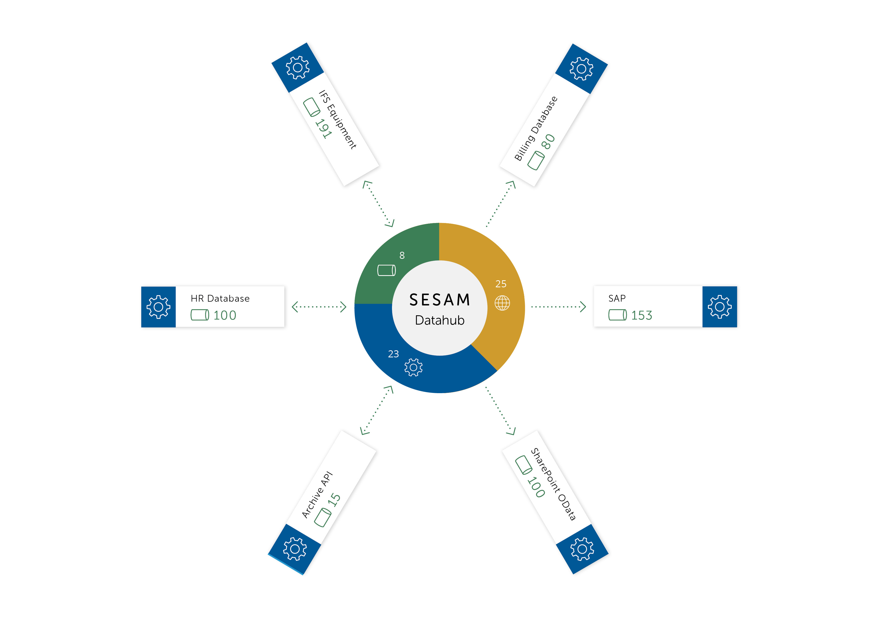
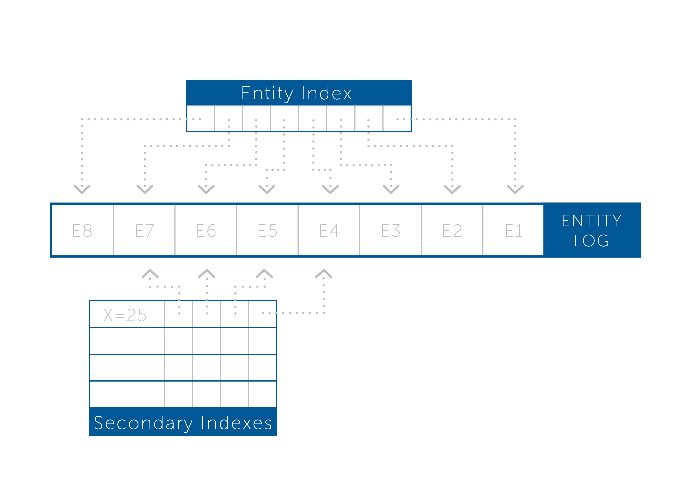
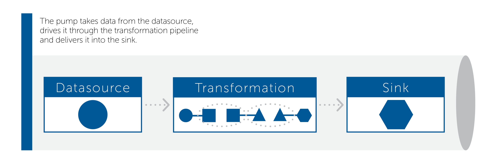
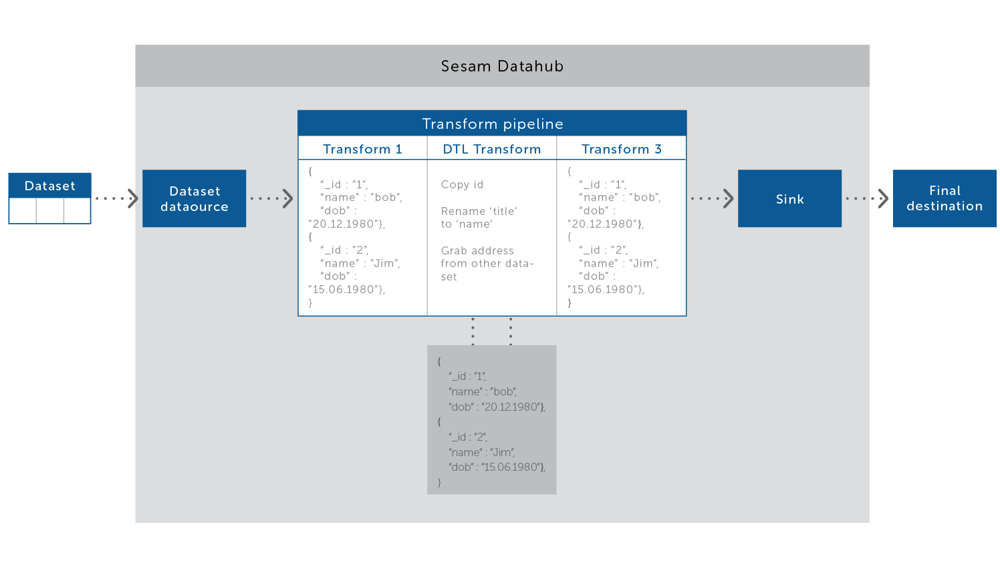

========
Concepts
========

.. contents:: Table of Contents
   :depth: 2
   :local:

Introduction
------------

Sesam is a general purpose data integration and processing platform. It is optimised for collecting or receiving data
from source systems, transforming data, and providing data for target systems.

Sesam collects raw data from source systems and stores it in datasets. Data transformations can be defined to process
the data residing in datasets to construct new datasets. Transformations can join data across datasets to create new
shapes of data. Data from these datasets can be exposed and delivered to other systems. The entire system is driven by
the state change of entities. This document introduces the concepts that are key to understanding and working with Sesam.

Sesam produces and consumes streams of data. Each stream contains a number of data entities. Each entity consists of a
number of name-value pairs and with some special reserved property names. See the :doc:`entity data model <entitymodel>`
section for more details. The following is a quick example of the shape of entities that are consumed and exposed by Sesam.

::

    [
        {
            "_id": "1",
            "name": "Bill",
            "dob": "01-01-1980"
        },
        {
            "_id": "2",
            "name": "Jane",
            "dob": "04-10-1992"
        }
    ]

A key concept in Sesam is the *pipe*. Data flows through a pipe. A pipe consists of a source, an optional list of
transformations, and a sink. Each pipe has an associated pump that is scheduled to run at intervals and pull data
entities from the source, push them through any transformations and deliver the results into the sink.

*Sources* are configured to expose data as streams of entities from source systems such as REST APIs and SQL databases.
Each source is connected to a *System*. A system represents some external system, such as a web server hosting an
API endpoint or a SQL database. The job of the source is to convert the underlying data into a uniform representation; JSON.
Some sources offer features additional features such as only exposing the entities that have changed.
Different sources offer different levels of support for change detection.

Data from a source for an external system, such as a SQL database, is piped into a dataset sink. A dataset sink writes
data into a named dataset. The dataset is the core storage mechanism and consists of a log of entities with some
additional indexes to support lookups and joins. An entity is only appended to the dataset's log if the data is new
or has changed.

Datasets also act as sources. One of the main uses of a dataset is as a source to a transformation. Transformations are
described using the Data Transformation Language (DTL). DTL is optimised for ease of use in stream and graph processing
for the construction of new entities. DTL transformations can use data from many datasets to construct new entities.

The results of applying a DTL transformation is a new stream of entities that can be delivered into a sink. These sinks
can either be another dataset sink or it can be a sink that connects to a target system.

Sesam provides a comprehensive API and UI for working with all aspects of Sesam.

Sesam Service Instance
----------------------

We use *Sesam* as the general name for a Sesam service instance. A given service instance exposes a single API endpoint and user interface. Internally, the service instance consists of configuration for all the pipe definitions, processes to execute the pumps and datasets for the storage of data.

A service instance is configured via the API. Configuration in Sesam is quite cool. It is entity based. This means that we can track and understand if the configuration has changed in the same way we understand if any data has changed.

The API offers two ways to upload configuration. The first is via the 'config' endpoint. This allows a complete set of configuration to be uploaded and is typically used when bootstrapping a service instance in QA or production environments. The other way is to use the individual resources exposed via the API. Such as a post to the collection of pipes.

.. _concepts-datasets:

Datasets
--------

A dataset is the basic means of storage inside the node. A dataset is a log of :doc:`entities <entitymodel>` supported by primary and secondary indexes. A *dataset sink* can write entities to the dataset. The dataset appends the entity to the log if and only if it is new or if it is different from the most recent version of the same entity.

Each entity is given a hash value based on the complete set of values in that entity. This value is used to determine if an entity has changed over time.

A *dataset source* exposes the entities from the dataset so that they can be streamed through pipes. As the main data structure is a log the source can read from a specific location in the log.

The datasets of service instance can be found using the API

::

    http://service_url:9042/api/datasets

Retention Policies
==================

A dataset is an immutable log of data that would, left unchecked, grow forever. This problem is partly mitigated as entities are only written to the log if they are new or different (based on a hash comparison) from the most recent version of that entity. To supplement this and ensure that a dataset does not consume all available disk space a retention policy can be defined. A rentention policy describes the general way in which the log should be compacted. The currently available policy is actually the best one and it is 'None'.

.. _concepts-systems:

Systems
-------

A *system* is any database or API that could be used as a source of data Sesam or as the target of entities coming out of Sesam. The system components provide a way to represent the actual systems being connected, or integrated.

The system component has a couple of uses. Firstly it can be used to introspect the underlying system and provide back lists of possible 'source' or 'sink' targets. Often this information can be used on the command line or in the *Sesam Management Studio* to quickly and efficiently configure how the node consumes or delivers data.

The other use of the *system* is that it allow configuration that may apply to many *source* definitions, e.g. connection strings, to be located and managed in just one place.

.. _concepts-pipes:

Pipes
-----

A *pipe* is composed of a source, a transformation chain, a sink, and a pump. It is an atomic unit that makes sure that data flows from the source to the sink at defined intervals. It is a simple way to talk about the flow of data from a source system to a target system. The pipe is also the only way to specify how entities flow from dataset to dataset.

.. _concepts-sources:

Sources
=======

A *source* is a component hosted in Sesam that exposes a stream of entities. Typically, this stream of entities will be the rows of data in a SQL database table, the rows in a CSV file, or JSON data from an API.

.. image:: images/datasource.png
    :width: 800px
    :align: center
    :alt: Generic pipe concept

Some sources can accept an additional parameter that is an 'offset' token. This token is used to fetch only the entities that have changed since that given offset. This can be used to ask for only the entities that have changed since the last time. An offset is an opaque token that may take any form; it is interpreted by the data source only. For example; for a SQL data source it might be a datestamp or for a log based source it might be a location offset.

Sesam provides a number of out of the box *source* types, such as SQL and LDAP. It is also easy for developers to expose a micro-service that can supply data from a remote service. The built-in remote data source is able to consume data from these endpoints. These custom data providers can be written and hosted in any language.

To help with this there are a number of template projects hosted on our repository GitHub to make this process as easy as possible.

.. _concepts-transforms:

Transforms
==========

Entities streaming through a pipe can be transformed on their way from the source to the sink. A transformation chain takes a stream of entities, transforms them, and creates a new stream of entities. There are several different transform types supported; the primary one being the Data Transformation Language Transform, which uses DTL to join and transform data into new shapes.

.. _concepts-sinks:

Sinks
=====

A data *sink* is a component that can consume entities fed to them by a pump. The sink has the responsibility to write these entities to the target, handle transactional boundaries, and potentially, the batching of multiple entities if supported by the target system.

Several types of data sinks, SQL Sink for example, are available. Using the JSON push sink enables entities to be pushed to custom micro-services or other Sesam service instances.

.. _concepts-pumps:

Pumps
=====

A scheduler handles the mechanics of 'pumping' data from a source to a sink. It runs periodically or on a 'cron' schedule and reads entities from a data source and writes them to a data sink.

It's also capable of rescanning the data source from scratch at configurable points in time. If errors occur during reading or writing of entities, it will keep a log of the failed entities and in the case of writes it can retry
writing an entity later.

The retry strategy is configurable in several ways and if an end state is reached for a failed entity, it can be written to a 'dead letter' dataset for further processing.

Change tracking
===============

Sesam is special in that it really cares when data has changed. The typical pattern is to read data from a source and push it to a sink that is writing into a dataset. The dataset is essentially a log of the entities it receives. However if a new log entry was added every time the source was checked then log would grow very fast and be of little use. There are mechanisms at both ends to prevent this. When reading data from a source it may, if the source supports it, be possible to just ask for the entities that have changed since the last time. This uses the knowledge of the source, such as a last updated time stamp, to ensure that only entities that have been created, deleted or modified are exposed. On the side of the dataset, regardless of where the data comes from, it is compared with the existing version of that entity and only updated if they are different. The comparison is done by comparing the hashes of the old and new entity.

.. _concepts-dtl:

The Data Transformation Language (DTL)
--------------------------------------

The Data Transformation Language is used to construct new data from existing data. DTL transforms should only be applied to data in a dataset.

DTL has a simple syntax and model where the user declares how to construct a new data entity. It has commands such as 'add', 'copy', and 'merge'. That work on properties, list of values and complete entities.

Persisting the results of Transformation
========================================

In general DTL is applied to the entities in a dataset and the resulting entities are pushed into a sink that writes to a new dataset. The new dataset is then used as a source for sinks that write the data to external systems.

.. _dependency_tracking:

Dependency Tracking
===================

One of the really smart things that Sesam can do is to understand complex dependencies in DTL. This is best described with an example. Imagine a dataset of customers and a dataset of addresses. Each address has a property 'customer_id' that is the primary key of the customer entity to which it belongs. A user creates a DTL transform that processes all customers and creates a new 'customer-with-address' structure that includes the address as a property. To do this they can use the 'hops' function to connect the customer and address. This DTL transform forms part of  a pipe and as such when a customer entity is updated, added or deleted it will be at the head of the dataset log and get processed the next time the pump runs. But what if the address changes? As far as the expected output the customer itself has also changed?

This is in essence a cache invalidation of complex queries problem. With Sesam we have solved that problem. We are empowered to solve the problem as we have a dedicated transform language. This allows us to introspect the transform to see where the dependencies are. Once we understand the dependencies we can create data structures and events that are able to understand that a change to an address should put a corresponding customer entity at the front of the dataset log again. Once it is there it will be pulled the next time the pump is run and a new customer entity containing the updated address is exposed.

Sesam API
---------

The Sesam API is a RESTful API that exposes the current state of a Sesam service instance and allows clients to add and modify configuration, test DTL, introspect datasets, view logs and the operational state of pumps and pipes.

The API can be found at:

::

    http://service_endpoint:9042/api

Sesam Management Studio
-----------------------

As well as the API there is a UI for working with Sesam. The UI exposes the pipes, datasets and operational information for a service instance.

The management studio can be found at:

::

    http://service_endpoint:9042/gui

esam Client
------------

The *sesamclient* is a command line tool for interacting with Sesam service instances. It provides a simpler way to interact with the API. The client requires python3 to work and can be installed using Pip.

So what is it used for? It is manily a command line tool for testing and deploying a Sesam configuration to and from a Git repository. 

After we have installed Sesam client via pip, we need to configure it as seen below.

Configuration
=============

::

$ sesam init

Username: foo

Password:

Available subscriptions:

1. My dev node (11aa76...)

2. My test node (44bb11...)

Subscription to use? 2

Config stored in .sesam/config.

Usage
=====

There are various ways of using the Sesam client.
A typical workflow bellow shows how to upload code, download it to make changes to it on local node.After code is edited test are run and once passed code is deplyed.

Typical workflow:
=================

::

$ sesam clean

$ sesam upload

Node config replaced with local config.

## edit stuff in Sesam Management Studio

$ sesam download

Local config replaced by node config.

$ sesam status

Node config is up-to-date with local config.

$ sesam run

Run completed.

$ sesam update

Current output stored as expected output.

$ sesam verify

Verifying output...passed!

You an also run the full test cycle (typical CI setup)

::

$ sesam test

Node config replaced with local config.

Run completed.

Verifying output (1/3)...passed!

Run completed.

Verifying output (2/3)...passed!

Run completed.

Verifying output (3/3)...passed!

Configuring tests
=================

.. list-table::
   :header-rows: 1
   :widths: 10, 30, 10, 10, 30

   * - Property
     - Description
     - Type
     - Required 
     - Default 

   * - ``_id``
     - | Name of the test.
     - | ``string``
     - |  No
     - |  Name of the ``.test.json file``

   * - ``type``
     - | Config type so that this later can just be part of the rest of the config.
     - | ``string``
     - |  No
     - |  Test

Example: 

::

$ cat foo.test.json
{
  "_id": "foo",
  "type": "test",
  "file": "foo.json"
  "blacklist": ["my-last-updated-ts"],
  "ignore": false
}

DTL parameters
==============

If you need to pass various variations of bound parameters to the DTL, you just create multiple .test.json files for each combination of parameters.

Example:

::
$ cat foo-A.test.json
{
  "pipe": "foo",
  "file": "foo-A.xml",
  "endpoint": "xml",
  "parameters": {
    "my-param": "A"
  }
}
$ cat foo-B.test.json
{
  "pipe": "foo",
  "file": "foo-B.xml",
  "endpoint": "xml",
  "parameters": {
    "my-param": "B"
  }
}

::

This will compare the output of ``/publishers/foo/xml?my-param=A`` with the contents of ``foo-A.xml`` and ``/publishers/foo/xml?my-param=B`` with the contents of ``foo-B.xml``.

Internal properties
===================

All internal properties except ``_id`` and ``_deleted`` are removed from the output. Entities that has ``_deleted`` set to ``false`` will also be removed.

Endpoints
=========

By default the entities are fetched from ``/pipes/<my-pipe>/entities``, but if endpoint is set it will be fetched from
``/publishers/<my-pipe>/<endpoint-type>`` based on the endpoint type specified. Note that the pipe needs to be configured to publish to this endpoint.
 
Example:

::

{
  "_id": "foo",
  "type": "test",
  "endpoint": "xml",
  "file": "foo.xml"
}

This will compare the output of ``/publishers/foo/xml`` with the contents of ``foo.xml``.

Blacklisting
============

If the data contains values that are not deterministic (e.g. timestamp added during the run) they can be filtered out using the blacklist.
 
Example:

::

{
  "_id": "foo",
  "type": "test",
  "blacklist": ["foo", "ns1:bar"]
}

This will filter out properties called ``foo`` and ``ns1:bar`` (namespaced).
 
If the data is not located at the top level, a dotted notation is supported ``foo.bar``. This will remove the ``bar`` property from the object (or list of objects) located under the ``foo`` property. If you need to blacklist a property that actually contains a dot, the dot can be escaped like this ``foo\.bar``

If you need to ignore a property on a list of objects, you can also use this notation ``foos.*.bar``. This will remove the ``bar`` property from all the objects located under ``foos``.

Example:

::

{
  "_id": "foo",
  "foos": {
    "A": {
      "bar": "baz",
      "foobar": "foo"
    }
  }
}

Will end up as the following (with ``"blacklist": ["foos.*.bar"]``):

::

{
  "_id": "foo",
  "foos": {
    "A": {
      "foobar": "foo"
    }
  }
}

Avoid ignore and blacklist
==========================

It is recommended to avoid ignoring or blacklisting as much as possible as this creates a false sense of correctness. Tests will pass, but deviations are silently ignored. A better solution is to avoid these properties in the output if possible.

Scheduler customization
=======================

By default the upload command will add a test-friendly scheduler as part of the configuration. The ``_id`` for this micro service system is ``scheduler``, but it can be overridden with the flag "--scheduler-id my-scheduler-id" if you need to override this.
 
If you want to configure a custom scheduler manually as part of the configuration you need to enable the ``--custom-scheduler`` flag.

This custom scheduler needs to implement the following: 

1. POST /start (the tool will call this when the scheduler should start)
2. GET / (the tool will then poll this until it returns with state 'success' or 'failure')

::

{
  "state": "?|success|failure" 
}

Installing
==========

Prebuilt binaries for common platforms can be downloaded from [Github Releases](https://github.com/sesam-io/sesam/releases/).

Building from source
====================

1. Install [Go](https://golang.org)
2. Make sure ``GOPATH`` is set and ``PATH`` includes ``$GOPATH/bin``
3. Download and build the package:
 
 ::
 $ go get github.com/sesam-io/sesam
 
4. Verify that it works

$ sesam -version

sesam version 0.0.8

Known issues

**JSON encoder escapes <, > and & as \uxxxx**
