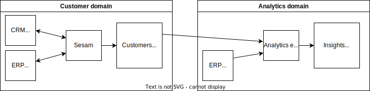

Data architecture
=================

Sesam is a semantic data hub for master data synchronisation and management. It follows the data fabric concept of hybrid data management using semantic technology, providing a knowledge graph of data, metadata, and operational data.

Sesam groups data into global datasets that can be managed in accordance with the principles of the data mesh concept.  Continuously updated data products can be generated by Sesam and consumed through 3rd party products.

Data Ownership by Domain
------------------------

Sesam can be used by one of more `domains in an organisation <https://martinfowler.com/articles/data-mesh-principles.html#DomainOwnership>`_. One Sesam subscription can use the :doc:`permissions system <documentation/operations/security>` and :ref:`config groups <api-config-groups>` to make sure these domains operate autonomous and are kept isolated. Within a domain data synchronization can be done without creating data products. Synchronising data across domain should be done using Data Products.

Data Products
-------------

`Data Products <https://martinfowler.com/articles/data-mesh-principles.html#DataAsAProduct>`_ are typically built from :ref:`global datasets <whatis-global>` within a domain. The global as-is will provide the consumer with unlimited access to the underlying data. It also means that the structure will change if any of the sources change. For analytics and machine learning this can be the desired behaviour. For other domains it can be better to publish one or more transformed globals or other data models.

Data fabric
-----------

Can achieve consistency (security, data format, protocols) with datasets and published endpoints. Sesam can encapsulate and expose legacy systems using these standards.

Concepts in `data fabric <https://www.datanami.com/2021/10/25/data-mesh-vs-data-fabric-understanding-the-differences/>`_ and how they relate to features in Sesam:

- Data access (:ref:`outgoing published endpoints <http_endpoint_sink>`, :ref:`incoming sources <source_section>`)
- Discovery (:ref:`integrated search <integrated-search>`, :ref:`schemas <schema-inferencing>`)
- Transformation (:ref:`data transformation language <DTL>`)
- Integration (:ref:`entity model <entity-data-model>`, :ref:`merge <merge_source>`, :ref:`namespaces <namespaces-feature>`)
- Security (:doc:`permissions <documentation/operations/security>`)
- Governance
- Lineage (:ref:`property lineage <property-lineage>`)
- Orchestration (:doc:`data flows <sesam-dataflow>`, :ref:`schedules <scheduling-and-signalling>`, :ref:`completeness <completeness-feature>`)

Sample architecture
-------------------

