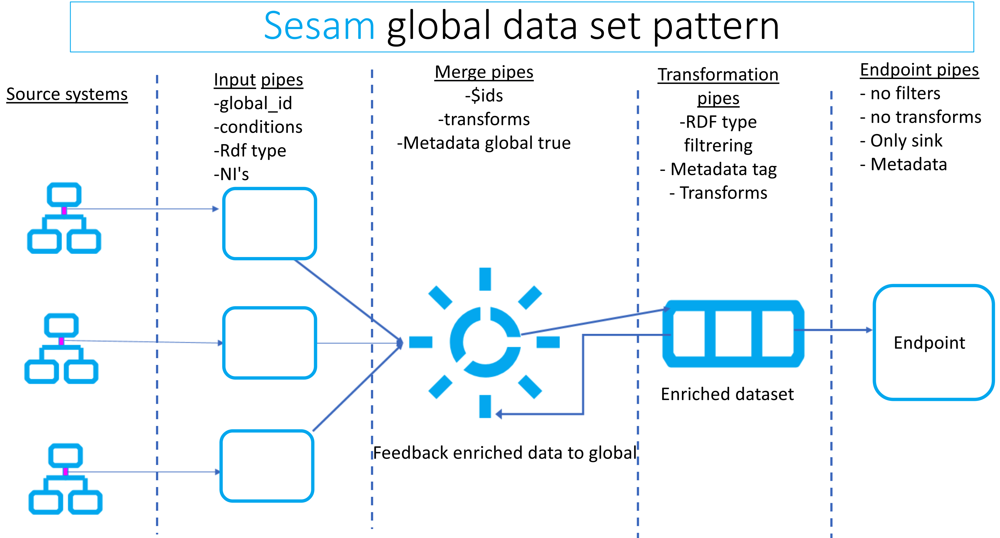
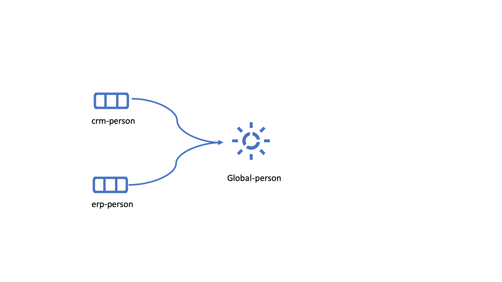
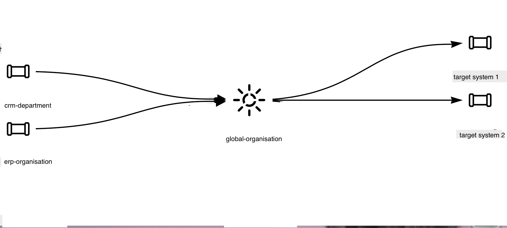
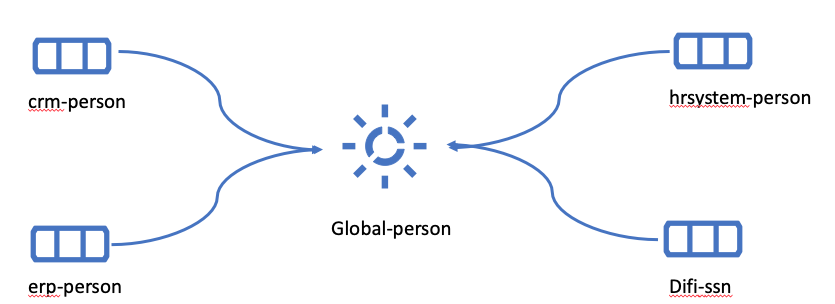
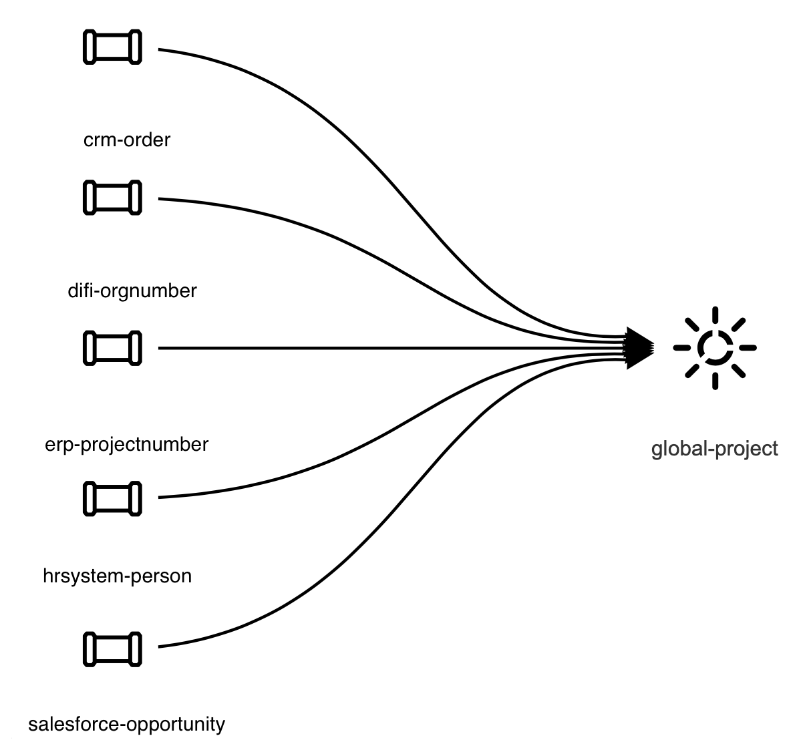

.. _best-practice:

========================
Data management in Sesam
========================

Summary
-------
Sesam is an Master Data Hub using a unique approach for collecting, connecting and sharing data. With Sesam data can quickly be re-purposed, re-structured and used, without changing the legacy systems that own the original data. Making all the valuable data within your company available for the whole organization. 

As many systems, Sesam can become complex and difficult to maintain when misused. To mitigate this, it is important to follow a small set of simple rules when starting on your journey. Adhering to these guidelines early will give your system solid foundations making it future proof and sparing you numerous headaches when time will come to connect more external systems and get even more out of your data. 

As the amount of data in a Sesam node grows, an optimized dataset structure will become necessary. For example, rather than approach each data flow sequentially and individually—where a single entry will lead to single merger or alteration followed by sinking the data to a recipient external system—it helps to favour aggregations of data with similar type or pertaining to the same concept. These aggregations are called “global datasets” and can be seen as authoritative datasets—e.g. the one stop shop for customer data, where the freshest and most accurate data can unequivocally be found. 

Data handling philosophy
------------------------

The data handling philosophy in Sesam can be described in short as connect, collect, share. Sesam uses connectors to fetch data from external systems. The internal data representation uses JSON, allowing to work with data from heterogeneous sources indistinctively of their system of origin.
We recommend applying a few principles when importing data into Sesam:

1)  Collect data comprehensively, it is preferable to have unused data in Sesam than to re-engineer the connector should the data elements become necessary. 
2)  Keep the data as faithful to the original as possible, transforms are generally not necessary at this stage and can be looked into later.

The next step is to create the global datasets, these consist of data from the imported datasets, categorized and connected when possible. 
We also recommend considering the following principles when creating the global datasets: 

1)  The entirety of the imported data should be in at least one global dataset. That means all the raw datasets need to be imported into a global dataset. 
2)  Try to merge the data into the global dataset referring to the same concept. This semantic approach to global datasets will facilitate the consumption and improve the reusability of the data within Sesam.

Following the above mentioned principles when importing data and creating global datasets will establish good foundations for Sesam’s bold objective: "All the data from all the systems, connected and available as a single shared resource».

.. image:: images/best-practice/Sesam-datamodel.png
    :width: 800px
    :align: center
    :alt: Generic pipe concept    

To read about the main concepts and how to get started in Sesam, please click :ref:`here <getting-started>`.

.. _best-practice-global:

Global datasets
---------------

A global dataset is a collection of data pertaining to a same concept from different sources. In other words, a global dataset combines data from sources semantically linked to provide one single authoritative fresh data location to access when needed. This will reduce the total number of pipes needed compared to a system where you get data from the original sources each time. 

The use of global datasets is described in depth in this :ref:`global dataset <global-datasets>` document.

.. _best-practice-namespace:

Namespace and namespaced identifiers
------------------------------------

Namespace 
=========

A namespace consists of two parts: a namespace and a property. The namespace part can consist of any characters, ending with a colon. The property part can consist of any character except colons.
In the example below, **"crm-person"** and **"hr-person"** are namespaces and **"SSN"** is the property.

E.g.

.. code-block:: json
   
  "crm-person:ssn"

  "hr-person:ssn"

.. _best-practice-namespaced-identifiers:

Namespaced identifiers
======================

Namespaces are used to create namespaced identifiers, which makes it possible to merge data without losing track of the source. In addition, namespaced identifiers can be mapped to complete URLs as we have unique identifiers for each object. When namespaces are enabled, the _id of an entity will be a namespaced identifier. In similar ways like foreign keys are used in a relational database, a reference to a namespaced identifier could be used to relate one entity with another. These references are usually added in the inbound pipe.

A namespaced identifier takes the following form:

.. code-block:: json

  "hr-person:SSN": "~:hr-person:18057653453"

  "namespace:propertyName": "namespaced-identifier:value"

Namespace identifiers is a recommended way of referring to datasets for matching properties during transformations. This will ease the connection of data. Namespaced identifiers are generated to keep existing joins so we are able to keep the data model from source. 

By default, namespaced identifiers are stripped from the endpoint entities.

If you have two different person datasets, and you want to merge on a common property, like SSN, we should use namespace identifiers. The code below will add a namespace identifier based on common SSN properties between datasets **"hr-person"** and **"erp-person"**. In other words we need to create a namespace identifier between **"hr-person"** and **"erp-person"** datasets so that we can refer to them during merging.

The main reason for generating NI's is to match the **$ids** they point to so you can actually use them to merge, in hops etc.

.. code-block:: json

  "transform": {
    "type": "dtl",
    "rules": {
      "default": [
        ["copy", "*"],
        ["make-ni", "hr-person", "SSN"]
      ]
    }
  }

This will produce the following output. We see the ["ni"] we added in code above; 

.. code-block:: json

  "erp-person:SSN-ni": "~:hr-person:02023688018"
 

You now have unique namespace identifiers based on **SSN**, which you can use to merge the person data from two different sources.

.. code-block:: json

  {
    "_id": "global-person",
    "type": "pipe",
    "source": {
      "type": "merge",
      "datasets": ["erp-person ep", "hr-person hr"],
      "equality": [
        ["eq", "ep.SSN-ni", "hr.$ids"]
      ],
      "identity": "first",
      "version": 2
    },
    "metadata": {
      "global": true,
      "tags": ["people"]
    }
  }

In the above code we are connecting the foreign keys **SSN** of **"erp-person"** with the primary key **"$ids"** of 
**"hr-person"**. 

Output from the example code above as seen below with a join to hr-system:

``"erp-person:SSN-ni": "~:hr-person:12032920177"``

.. raw:: html

   

   
<a>global-person example output</a>

   

.. code-block:: python

  {
    "$ids": [
      "~:erp-person:12032920177",
      "~:hr-person:12032920177"
    ],
    "erp-person:Country": "NO",
    "erp-person:EmailAddress": "CaspianNygard@einrot.com",
    "erp-person:Firstname": "Caspian",
    "erp-person:Gender": "male",
    "erp-person:Lastname": "Nygård",
    "erp-person:MiddleInitial": "I",
    "erp-person:MoneyUsed": "11923",
    "erp-person:Number": "93",
    "erp-person:SSN": "~:hr-person:docs-erp-person:12032920177",
    "erp-person:StreetAddress": "Lindøy Løkkavei",
    "erp-person:TimesOrdered": "12",
    "erp-person:Title": "Mr.",
    "erp-person:Username": "Aney1996",
    "erp-person:ZipCode": "2213",
    "hr-person:Country": "NO",
    "hr-person:EmailAddress": "CaspianNygard@einrot.com",
    "hr-person:Gender": "male",
    "hr-person:GivenName": "Caspian",
    "hr-person:MiddleInitial": "I",
    "hr-person:Number": "100",
    "hr-person:SSN": "12032920177",
    "hr-person:StreetAddress": "Lindøy Løkkavei",
    "hr-person:Surname": "Nygård",
    "hr-person:Title": "Mr.",
    "hr-person:Username": "Mays1944",
    "hr-person:ZipCode": "2213",
    "rdf:type": [
      "~:erp:person",
      "~:hr:person"
    ]  
  }

.. _best-practice-naming:

.. _best-practice-naming-conventions:

Naming conventions
------------------

It is essential to have an agreed naming convention across integrations within Sesam. The motivation is to have a better visibility and understanding of where your data comes from and where it is heading, as well as to how it is internally transformed. It also makes it easier to switch between projects.

General rules
=============

• lower case
• dash - as delimiter

Systems
=======

• name after the name of the service you integrate with, not the technology used (e.g. salesforce instead of mysql)
• if multiple systems are required to talk to a system, postfix them with a qualifier (e.g.salesforce-out)
 
Pipes
=====

• name inbound pipes with system they read from and postfix with the type of content (e.g. salesforce-sale)
• do not use plural names (e.g. salesforce-sale not salesforce-sales)
• prefix merge pipes with merged- (e.g. merged-sale)
• prefix global pipes with global- (e.g. global-sale)
• name intermediate outbound pipe with the type of the content and the name of the system to send to (e.g. sale-bigquery)
• name outgoing pipe by postfixing the intermediate output with -endpoint (e.g. sale-bigquery-endpoint)

Datasets
========

• name them the same as the pipe that produced it (the default and does not need to be specified)

.. _best-practice-workflow:

Workflow for transforming data in Sesam
---------------------------------------

Most Sesam projects will have a set flow that the data goes through.

The best-practice workflow follows a simple flow structure created for an optimal Sesam experience.

|

.. image:: images/best-practice/sesam-flow.png
    :width: 800px
    :align: center
    :alt: Generic pipe concept  

|

The data from the source system is fed into Sesam through **inbound pipes** which collects and tags the data for further processing. During this step we do not wish to change the data, but rather keep it as close to it's original state as possible. Depending on the semantical context of the data, it is sent into one of possibly several global pipes. We wish to store data in global pipes to better facilitate the consumption and improve the reusability of the data within Sesam. Connected to the global datasets, which are generated by the global pipes, are the preparation pipes. Preparation pipes are where the data is sorted, transformed and enriched to suit the requirements of the target system. Finally the data is sent through an outbound pipe which is connected to a target system.

**Inbound pipes** should preferably not change the source data, but rather tag the data for easier filtering further down in the Sesam data flow. The two standard ways of tagging data in Sesam are through namespaced identifiers and RDF types. Namespaced identifiers are tags on column level which enables us to distinguish between properties from different sources with the same name. Namespaced identifiers (in form of the :ref:`make-ni <dtl_transform-make-ni>` function) are also often used to create the Sesam equivalent of foreign keys for easier join criteria further down the Sesam flow. RDF types are tags on row level which enables us to distinguish between entites from different sources in Sesam. 

**Global pipes** merge data belonging together to generate **global datasets**. To be able to easily spot a global pipe, the following code can be added:

.. code-block:: json

  "metadata": {
    "global": true
  }

**Preparation pipes** is where **global datasets** are prepared for target systems. It is here most of the logic is added. It could include enriching with more context from other datasets, structuring data into other formats, adding new fields and other transformations. The main purpose is to get data ready for the target system.

**Outbound pipes** basically sends data to an endpoint and should normally have no logic.

The main reason for why **outbound pipes** shouldn't contain any logic or transformations is that we want to see the end result that is being sent to the target system, for debugging purposes. If logic is added in the pipe, the result will be sent straight to the target system when the pump is running. By adding the transformations in the upstream **preparation pipe** we will be able to look at the processed entities in the upstream dataset for the **outbound pipe**. Any logic added to an **outbound pipe** cannot either be used by other pipes.

.. _best-practice-inbound-pipes:

Inbound pipes
=============

Inbound pipes are used to fetch data from external systems into Sesam. As we want to be as comprehensive as possible regarding the data we ingest, there should be very few rules about filtering or altering data embedded within the inbound pipes. Data filtering, transformation and consolidation will be done at a later stage. 

Embedded data and Conditional inbound pipes 
^^^^^^^^^^^^^^^^^^^^^^^^^^^^^^^^^^^^^^^^^^^
Embedded data is data that does not originate from an external source but are manually put into a pipe. Embedded data can be used for different purposes, two of which we will explain below.

Embedded data as extra information
^^^^^^^^^^^^^^^^^^^^^^^^^^^^^^^^^^

Embedded data can be used when we need extra information about data that is not available from the source providing the data. The source data could contain codes or abbreviations which need to be translated to a more readable format. Using embedded data we can create a dataset which interprets these codes and abbreviations in order to extract more information than provided by the source data, see example below.

.. code-block:: json

  {
    "_id": "embedded-data-pipe",
    "type": "pipe",
    "source": {
      "type": "embedded",
      "entities": [{
        "_id": "an id",
        "some-abbreviation": "abbreviation meaning",
        "some-code": "code meaning",
        "some-hash": "hash meaning"
      }]
    }
  }

Embedded data for testing
^^^^^^^^^^^^^^^^^^^^^^^^^

Embedded data may also be used to test new configurations through conditional pipes. Conditional pipes are a way to define several distinct sources for a single inbound pipe. For example, consider a customer that has 2 different environments, one for production and one for test. The customer’s production environment includes all the personal data for the individuals working for the company. This data is sensitive, and the access restricted to only one IP-address. The customer's test environment might also contain sensitive personal data. Therefore, only one IP-address from the Sesam portal may have access too. There are several issues with such a setup. First, what do we do when several consultants work with the same project from multiple IPs? Second, what about minor changes to code that we would like to test out, without having to change data in the customer’s test environment?
 
These issues are solved with the conditional source setting in the pipe config, and we will go through how to do this below.
 
In the pipe config below we see an example of the general setup of a conditional inbound pipe. In this example we specify two environments; “Prod“ and “Dev“. In this case, the “Prod“ environment talks directly to the source data, here a csv-file. Inside the conditional “Prod“-definition we specify all the information we need in order to collect the source data.
 
The “Dev“ environment does not connect directly to any external source. Instead we use *"embedded data“*, which is data formatted just like it would be from an external source but anonymized. As the data is embedded, or hard coded if you will, there is no access restriction.  

Which condition is used, should be determined by an environment variable and not by the configuration, so that we can upload the same configuration to several nodes, but determine which condition to be used independently of the node. Adding environment variables is done in the "Variables"-tab under the "Settings"-section for the Datahub.

In this example, we should create an environment variable specifying which environment the node is running, let us call the variable "node-env" and set it to either "prod" or "dev" depending on which we use:

.. code-block:: python
 
  "node-env": "prod" or "node-env": "dev".

The corresponding env variable are used in the condition property in the pipe. It is added inside the "Source" curly brackets of the pipe as seen in example below.

``"condition": "$ENV(node-env)"``

.. raw:: html

   

   
<a>hr-person example pipe</a>

   

.. code-block:: python

  {
    "_id": "hr-person",
    "type": "pipe",
    "source": {
      "type": "conditional",
      "alternatives": {
        "Dev": {
          "type": "embedded",
          "entities": [{
            "_id": "23072451376",
            "Country": "NO",
            "EmailAddress": "TorjusSand@einrot.com",
            "Gender": "male",
            "GivenName": "Torjus",
            "MiddleInitial": "M",
            "Number": "1",
            "SSN": "23072451376",
            "StreetAddress": "Helmers vei 242",
            "Surname": "Sand",
            "Title": "Mr.",
            "Username": "Unjudosely",
            "ZipCode": "5163"
          }, {
            "_id": "09046987892",
            "Country": "NO",
            "EmailAddress": "LarsEvjen@rhyta.com",
            "Gender": "male",
            "GivenName": "Lars",
            "MiddleInitial": "A",
            "Number": "2",
            "SSN": "09046987892",
            "StreetAddress": "Frognerveien 60",
            "Surname": "Evjen",
            "Title": "Mr.",
            "Username": "Wimen1979",
            "ZipCode": "3121"
          }]
        },
        "Prod": {
          "type": "csv",
          "system": "hr",
          "blacklist": ["Password"],
          "delimiter": ",",
          "encoding": "utf-8",
          "primary_key": "SSN",
          "url": "/file/sesam-training/data/test_people_sesam_training1.csv"
        }
      },
      "condition": "$ENV(node-env)"
    },
    "transform": {
      "type": "dtl",
      "rules": {
        "default": [
          ["copy", "*"],
          ["comment", "below we will add a namespaced identifier and 'rdf:type' for easy filtering later"],
          ["add", "rdf:type",
            ["ni", "hr", "person"]
          ]
        ]
      }
    },
    "pump": {
      "mode": "manual"
    },
    "metadata": {
      "tags": ["embedded", "person"]
    }
  }

.. _best-practice-rdf-type:

RDF type  
^^^^^^^^

The RDF type is metadata used to relate data and give some semantic context. When used with a namespace, it keeps track of the origin of the data, as well as the business type. It is composed upon input and will be used to relate and filter like you would use a foreign key.

Namespaces
^^^^^^^^^^

The namespace identifier is added to keep track of origin and to keep exsisting joins from source. Namespaced identifier, on NI'S are prefixed by convention by a ``‘~:’``, e.g. ``~:crm:person``. You use the functions ``make-ni`` or ``ni`` to create it.

.. _best-practice-global-pipes: 

Global pipes
============

..note::
  Before going into **global pipes** please read on what a global dataset is and why we generate them :ref:`here <global-datasets>`.

The global pipe creates a new dataset. This dataset will be updated with entities from all sources added to the global pipe.

We can choose not to join or transform some of the datasets which means they are simply “put into” the global dataset. The ones who will be joined and transformed you can read more about below.

A resulting dataset can be a new dataset, but also an existing dataset where one wants to add more data from new sources when they become available for Sesam. This is done by adding source datasets to a global pipe. The new data will be added to the dataset (can be compared to the use of alter table/update of a relational database – but in one single operation).

In the global pipe we want to add a metadata tag to show this is a pipe going into a global dataset, so we set the following code into the pipe:

.. code-block:: json

  "metadata": {
    "global": true
  }

In addition, it gives the dataset a “global symbol” in the graph tab as seen below. This makes it easy to see this is a global pipe straight away. 

.. image:: images/global_true.png
    :width: 600px
    :align: center
    :alt: Generic pipe concept  

As a general rule when it comes to transformations, we wish to use reusable properties; e.g. global properties generated in the global dataset. This gives us opportunity to track data from start to end of flow through Sesam. 

In order to prioritize which ids we want to use, we use :ref:`coalesce <nulls>`.  If the global id is null, **“Coalesce”** gives us the opportunity to choose which is the next best option. This, in turn gives us the opportunity to use the golden record, which you can read about :ref:`here <best-practice-golden-record>`.

Below we see an example of a global pipe called "global-person". At top the type of pipe is set to **“merge“** enabling us to add 4 datasets that we wish to merge.

Below the actual merge, or **“equality“** rules are set. Further down, in the **“transform”** section the use of **coalesce** becomes obvious when choosing which properties got get values from.

.. raw:: html

   

   
<a>global-person example pipe</a>

   

.. code-block:: python

  {
    "_id": "global-person",
    "type": "pipe",
    "source": {
      "type": "merge",
      "datasets": ["erp-person ep", "crm-person cp", "salesforce-userprofile su", "hr-person hr"],
      "equality": [
        ["eq", "ep.$ids", "cp.SSN "],
        ["eq", "ep.$ids ", "hr.$ids"],
        ["eq", "ep.Username", "su.Username"]
      ],
      "identity": "first",
      "version": 2
    },
    "transform": {
      "type": "dtl",
      "rules": {
        "default": [
          ["copy", "*"],
          ["add", "zipcode",
            ["coalesce",
              ["list", "_S.hr-person:ZipCode", "_S.erp-person:ZipCode", "_S.crm-person:PostalCode"]
            ]
          ],
          ["add", "email",
            ["coalesce", "_S.EmailAddress"]
          ],
          ["add", "firstname",
            ["coalesce",
              ["list", "_S.crm-person:FirstName", "_S.erp-person:Firstname", "_S.hr-person:GivenName"]
            ]
          ],
          ["add", "lastname",
            ["coalesce",
              ["list", "_S.crm-person:LastName", "_S.erp-person:Lastname", "_S.hr-person:Surname"]
            ]
          ],
          ["add", "fullname2",
            ["concat", "_T.global-person:firstname", " ",
              ["coalesce",
                ["not",
                  ["matches", "*.", "_."]
                ], "_S.MiddleInitial"], ". ", "_T.global-person:lastname"]
          ],
          ["add", "fullname",
            ["concat", "_T.global-person:firstname", " ",
              ["filter",
                ["neq", "_.", ". "],
                ["concat",
                  ["coalesce",
                    ["list", "_S.crm-person:MiddleInitial", "_S.erp-person:MiddleInitial", "_S.hr-person:MiddleInitial"]
                  ], ". "]
              ], "_T.global-person:lastname"]
          ]
        ]
      }
    },
    "metadata": {
      "global": true
    }
  }

When running the global pipe, the result is a “global dataset” consisting of entities with joined data that has been through the listed transformations.

The first property that greets us in a global dataset is called **"$ids"**, which will be a list of **namespaced identifiers**. When an entity is merged into another entity in a merge pipe, the pipe will add the _id of the source entity to the **"$ids"** property. Thus, the **ids** property consists of the ids of all the source entities that were merged to created that specific merged entity, typically looking like below.

::

  "$ids": [
    "~:erp-person:02023688018",
    "~:crm-person:100",
    "~:salesforce-userprofile:Mays1944",
    "~:hr-person:02023688018"
  ]

The **"$ids"** are generated automatically when the global pipe runs, and they always show up on top for the global dataset.

So, what is **"$ids"**? Basically, **$ids** is a property containing a list of the **_id** of all the source entities that were merged to create that specific entity.

Below is a whole entity of the above global pipe and as seen, it gives an aggregated dataset from 4 sources with **$ids**, **RDF types** and **global properties**.

.. raw:: html

   

   
<a>global-person example output</a>

   

.. code-block:: python

  {
    "$ids": [
      "~:erp-person:02023688018",
      "~:crm-person:100",
      "~:salesforce-userprofile:Mays1944",
      "~:hr-person:02023688018"
    ],
    "crm-person:Address": "Ørneveien 40",
    "crm-person:Customerid": "100",
    "crm-person:EmailAddress": "IsakEikeland@teleworm.us",
    "crm-person:FirstName": "Isak",
    "crm-person:Gender": "male",
    "crm-person:LastName": "Eikeland",
    "crm-person:MiddleInitial": "E",
    "crm-person:PostalCode": "1357",
    "crm-person:SSN": "02023688018",
    "crm-person:Username": "Mays1944",
    "erp-person:Country": "NO",
    "erp-person:EmailAddress": "IsakEikeland@teleworm.us",
    "erp-person:Firstname": "Isak",
    "erp-person:Gender": "male",
    "erp-person:Lastname": "Eikeland",
    "erp-person:MiddleInitial": "E",
    "erp-person:MoneyUsed": "19392",
    "erp-person:Number": "100",
    "erp-person:SSN": "02023688018",
    "erp-person:SSN-ni": "~:crm-person:02023688018",
    "erp-person:StreetAddress": "Frodegaten gate",
    "erp-person:TimesOrdered": "16",
    "erp-person:Title": "Mr.",
    "erp-person:Username": "Mays1944",
    "erp-person:ZipCode": "4017",
    "erp-person:subscriptions": [
      {
        "erp-person:active": true,
        "erp-person:category": "Types of Drink",
        "erp-person:hash": "cd821925a05449c7d5b907157d00fe4b",
        "erp-person:items-ordered": 8,
        "erp-person:received": 20,
        "erp-person:specials": 15,
        "erp-person:start-date": "~t2005-05-02T05:17:30.6196185Z",
        "erp-person:subscription-psuedo-name": "Alpha"
      },
      {
        "erp-person:active": true,
        "erp-person:category": "Foreign Cities",
        "erp-person:hash": "02f30f1fd084eef209c64bcbb577c66d",
        "erp-person:items-ordered": 19,
        "erp-person:received": 21,
        "erp-person:specials": 10,
        "erp-person:start-date": "~t2007-07-01T07:17:30.6196185Z",
        "erp-person:subscription-psuedo-name": "Delta"
      },
      {
        "erp-person:active": false,
        "erp-person:category": "Something You're Afraid Of",
        "erp-person:end-date": "~t2006-12-26T12:17:30.6196185Z",
        "erp-person:hash": "f0145edebae47eccd463a2dec9ac7485",
        "erp-person:items-ordered": 21,
        "erp-person:received": 49,
        "erp-person:specials": 23,
        "erp-person:start-date": "~t2005-12-26T12:17:30.6196185Z",
        "erp-person:subscription-psuedo-name": "Beta"
      }
    ],
    "global-person:email": "IsakEikeland@teleworm.us",
    "global-person:firstname": "Isak",
    "global-person:fullname": "Isak E. Eikeland",
    "global-person:fullname2": "Isak E. Eikeland",
    "global-person:lastname": "Eikeland",
    "global-person:zipcode": "1357",
    "hr-person:Country": "NO",
    "hr-person:EmailAddress": "IsakEikeland@teleworm.us",
    "hr-person:Gender": "male",
    "hr-person:GivenName": "Isak",
    "hr-person:MiddleInitial": "E",
    "hr-person:Number": "100",
    "hr-person:SSN": "02023688018",
    "hr-person:StreetAddress": "Nadderudåsen 186",
    "hr-person:Surname": "Eikeland",
    "hr-person:Title": "Mr.",
    "hr-person:Username": "Mays1944",
    "hr-person:ZipCode": "1357",
    "rdf:type": [
      "~:erp:person",
      "~:crm:person",
      "~:salesforce:userprofile",
      "~:hr:person"
    ],
    "salesforce-userprofile:EmailAddress": "IsakEikeland@teleworm.us",
    "salesforce-userprofile:Username": "Mays1944",
    "salesforce-userprofile:phone_number": 24887159
  }

.. _best-practice-preparation-pipes:

Preparation pipes
=================

The aggregated data residing in a global dataset often needs to be transformed and/or enriched before it can be delivered to targets. Transforming and enriching data to ready it for delivery is implemented through preparation pipes. Preparation pipes use the aggregated entities from global datasets to combine and narrow the data down to what is necessary/required by the recipient system. The :ref:`filtering <filter_dtl_function>` and relating of data are performed using the :ref:`RDF types <best-practice-rdf-type>` introduced earlier. Data can also be augmented by performing hops to other datasets, for example a city-name can be fetched from a different dataset using the difi-postnummer. The goal is to have the data ready to be picked up by the outbound pipe.

Below is an example of a preparation pipe, based on the global pipe above, where we wish to update the data in the system generating the hr-person data with crm-person data. More precicely, we wish to update data in the HR system to reflect the golden records from global-person. In addition we wish to update the HR data for "StreetAddress" with the address stated in the crm-person key "Address". 

.. raw:: html

   

   
<a>address-hr example pipe</a>

   

.. code-block:: python

  {
    "_id": "address-hr",
    "type": "pipe",
    "source": {
      "type": "dataset",
      "dataset": "global-person"
    },
    "transform": {
      "type": "dtl",
      "rules": {
        "default": [
          ["filter",
            ["in", "~:crm:person", "_S.rdf:type"]
          ],
          ["copy",
            ["list", "hr-person:SSN", "_id"]
          ],
          ["filter",
            ["is-not-null", "_S.crm-person:Address"]
          ],
          ["add", "StreetAddress", "_S.crm-person:Address"],
          ["add", "GivenName", "_S.global-person:firstname"],
          ["add", "Surname", "_S.global-person:lastname"]
        ]
      }
    }
  }

In this case we need to make sure that we do not overwrite existing "StreetAddress" values with potential null-values (altough we should be able to trust the master data from the CRM system, mistakes do occur). We do not have to perform the same check for the properties from our golden records since in this case the hr-person data is part of the coalesce in the global-person pipe. Note that even though several of these properties is already the same in both the HR system and the CRM system, they do not have to be. The first time this integration runs there might be some unnecessary updates, but Sesam's built-in :ref:`change tracking <change-tracking>` will make sure only future changes will be passed through to the target system. 

The result from the address-hr pipe with the input from the global-person example with crm-person:100 look like:

::

  {
    "address-hr:GivenName": "Isak",
    "address-hr:StreetAddress": "Ørneveien 40",
    "address-hr:Surname": "Eikeland",
    "hr-person:SSN": "02023688018"
  }

.. _best-practice-output-pipes:

Outbound pipes 
==============

The outbound pipe is the inbound pipe counterpart. While the inbound pipe is used solely to import data into Sesam, the outbound pipe sole function is to export data out of Sesam. As mentioned in the Inbound pipe section, the focus of the inbound pipe will be on its source component/property. The outbound pipe on the other hand will be built around its :ref:`sink <sink_section>` . Similarly, the outbound pipe will use a Sesam :ref:`system <concepts-systems>` to interface with target systems. This system will either access an embedded connector or an outside interface, called a :ref:`microservice <microservices_in_Sesam>`. The function of the microservice, or the connector, is to interface at the API level with the external system.

Below is an example of an outbound pipe. This pipe uses the dataset created by the pipe **address-hr** in the previous example to send data to the Sesam system called HR.

.. raw:: html

   

   
<a>address-hr-endpoint output example</a>

   

.. code-block:: python

  {
    "_id": "address-hr-endpoint",
    "type": "pipe",
    "source": {
      "type": "dataset",
      "dataset": "address-hr"
    },
    "sink": {
      "type": "sql",
      "system": "HR",
      "primary_key": "SSN",
      "table": "SomeTable"
    },
    "pump": {
      "cron_expression": "*/10 * * * ?"
    }
  }

In this particular pipe we have set our own :doc:`cron expression <cron-expressions>`. Pipes between datasets runs automatically (unless disabled) every 30 seconds by default. Pipes connected to a system, such as this, runs automatically every 15 minutes by default. In this particular case we wanted a more rapid flow.   

Tips for global datasets
------------------------

• All datasets should go into a global dataset
• In most data models, between 10–20 global datasets are sufficient. This is based on experience on various size of projects at Sesam. The smaller  projects could have close to 10, and some of the bigger projects has over 20 global datasets, with hundreds of pipes connected to them. To identify how many global datasets a project might need it is important to perform a proper analysis. For instance, if a company’s needs are met by five global datasets, then they don’t have to have at least ten. This is only for best practice, but we do have examples of larger data models with less than ten global datasets
• Start general with big “buckets” and re-arrange and split into smaller global datasets if necessary
• Think less property and more “what it is”, e.g. person vs user. Something that stops being a user might not stop being a person
• Keep it generic
• Avoid system specific global datasets. I.e. a document management system contains metadata about various concepts (e.g. title, revision, status, equipment, owner, date generated files). These are static in nature, and to make them useful you can put “equipment data” in a global equipment dataset. The “owner data” might be put in global person dataset etc. This way you gather concepts across sources and enrich them, such that they are available for other systems to use
• Global datasets give us the opportunity to define “golden records”

How to do global datasets in Sesam
----------------------------------

When initiating a new project in Sesam, it is important to begin with the data model. Start by analyzing the sources and data to determine the needs of the organization. This will have an impact on the data model and more specifically how the global datasets will be organized. It is here the organization needs to think: what is important to me? What data do I use often, and therefore needs to be easily available? The results vary for each organization and each data model. It is however normal to add global datasets, or to re-arrange them, as the amount of data is growing.

To get an idea of the granularity, please see final chapter called “Examples of real global datasets”.

Generally, most organizations need five basic global datasets. This is not true for all organizations and data integrations, but it is a good basis to start from.

These five are:

Global-person

Global-project

Global-classification

Global-organization

Global-task

This is only the first part of the analysis. The second part is how to enrich data in the global datasets, and to determine which aggregated datasets there is a need for. These are questions that need to be asked in order to make the enriched datasets as useful as possible.

Recipe for generating global datasets
-------------------------------------

It is impossible to make a universal recipe for all integration projects using Sesam as all projects are unique. The different data variety, data model complexity and costumer requirements are all integral parts structuring each individual Sesam node. In addition, the order you do the various tasks might vary, so please use this as a guideline only, not a comprehensive recipe.

1.  The first step is to consider what the goal of the integration is; what do you want to achieve?
2.  Next step is to determine which data from which sources do you need to achieve your goal.
3.  Get information regarding the existing data model and how data needs to be joined.
4.  Access the data source and copy the necessary data into Sesam.
5.  Analyze and decide on how you want to organize your global datasets. There is no right or wrong way of how to do this. In time you will gain experience on which datasets work as global datasets and which does not. Try to use common sense and organize by concept or type.
6.  Once decided it is important to analyze how the data is going to be added to the global dataset; is there a need to merge the data or is there a need to “place” data in a global dataset without merging? For example, generating a global location dataset is logical. It contains countries, regions, cities, boroughs, counties and offices. It does not make sense to merge them, but it does make sense to put them in a common global dataset. This way you might gather data concerning the same concept. as well as to have one single location place for looking up this information. 

In many cases however, it does make sense to merge the data, such as person data as shown earlier, which was merged on SSN, email etc.

7.  Some data may need to be processed before being added to a global dataset. This involves e.g. selecting what we use as ID, converting data type, change property names etc.
8.  When the global datasets are set up, the data can either be re-used as is, or undergo further transformations. This might encompass filtering specific data and joining with other datasets etc. to enhance quality and usefulness.
9.  Based on the target systems and your requirements, adapting data to target systems is done as late as possible in the data flow and as close to target as possible (late binding.)

Let’s start with simplified example to demonstrate. Below we have four datasets from two different sources; **"crm"** and **"erp"**:

erp-person

crm-person

erp-organisation

crm-organisation

Looking at the names of the datasets, it would be logical to create two global datasets. The first could contain data about person, such as user, customer, name, employee and so on.

**global-person**

The second could contain data concerning the organization. This might include names of departments, customers, regions and so on.

**global-organisation**

When the number of sources and datasets increases it will become natural to add more “buckets” or global datasets to put them in.

Below are new sources with data from Difi and Salesforce. In addition, more datasets from existing sources were added.

Datasets:

erp-person

crm-person

difi-ssn

hrsystem-person

difi-ssn

difi-orgnumber

salesforce-opportunity

erp-projectnumber

crm-order

The datasets might be organized like this, please see below. As seen no changes in **“global-organization”**. New datasets added to **“global-person”** and new “bucket” called **“global-project”** is generated.

**global-person**

The second could contain data concerning projects. This might be orders, project numbers, sales opportunities etc.

**global-project**

It is important to emphasize that this is only a suggestion on how it might be logical to organize the datasets. The end result is highly individual and will most likely vary. This does however give an idea on how architecture in Sesam is built and developed using global datasets.    

Additional Sesam tips
---------------------

.. _best-practice-new-id:

Creating a new _id for an entity
================================

Every entity in Sesam is given a unique identifier, which is stored in the ``_id`` field. The best practice when handling the identity field in downstream pipes is to keep the identity of the current entity being processed by the pipe. However, it is sometimes logical to change the identity of an entity. This is mainly done when a pipe is creating new entities (through the emit children functionality for instance), but also if an entity is changing context or type when applied through a DTL transform.

There is one important thing to be aware of when changing the value of the ``_id`` field. Any transforms or operations prior to the change of the ``_id``, will adhere to the original identity of the entity. This means for instance that if you add a filter to a DTL transform before changing the identity, the filter will apply to the old identity, which may result in the entity not being filtered out if a change occur in the original entity. Since the entity is stored in the sink dataset with the new identity, but the entity processed is filtered out with the original identity.

Using values from entities added through the hops function as part of the ``_id`` field should also be used with extreme care and mostly avoided. If a value from a joined entity is used to generate a new identifier is changed, the new identity will no longer match the previous identity and the entity will then be treated as a new entity. The same applies to using fields from the original entity as part of the ``_id``, if one of these changes value it will generate a new identifier.

If it is necessary to create a new ``_id`` for an entity it should then be created before any filters are applied to the transform and no values from joined entities should be used as part of the new identity.

.. _best-practice-golden-record:

Golden record
=============

A golden record is a single, well-defined version of all the data entities in an organizational ecosystem. In this context, a golden record is sometimes called the **"single version of the truth"**, where **"truth"** is understood to mean the reference to which data users can to turn when they want to ensure that they have the correct version of a piece of information.  

In the example below, all three sources provide a **zip-code**, such that some properties in a global dataset might be duplicates from different sources. In this case it could be fitting to add a **"global-person:zipcode"** property to the global dataset. This property should contain the most reliable zip-code value of the three sources and will be the property we access when we want the person's zip-code. This global property becomes a part of a **"golden record"** which ensures a single, well-defined representation of the person.

::

  {
    "$ids": [
    "~:crm-person:100",
    "~:hr-person:02023688018",
    "~:erp-person:0202"
    ],
    "_id": "crm-person:100",
    "hr-person:EmailAddress": "IsakEikeland@teleworm.us",
    "hr-person:Gender": "male",
    "hr-person:ZipCode": "null",
    "crm-person:EmailAddress": "IsakEikeland@teleworm.us",
    "crm-person:ID":"100",
    "crm-person:SSN": "02023688018",
    "crm-person:SSN-ni": "~:hrsystem-person:02023688018",
    "crm-person:PostalCode": "3732",
    "erp-person:SSN": "02023688018",
    "erp-person:SSN-ni": "~:hrsystem-person:02023688018",
    "erp-person:ID":"0202",
    "erp-person:ZipCode": "5003",
    "global-person:zipcode": "3732" 
  }

In addition to the zip-code from the 3 different data sources, the "global-person" dataset now also contains a **global-person:zipcode**. When creating a golden record in Sesam, one configures the priority of the sources and the value of the property that is highest on the priority list and has data will be used.

::

  "hr-person:ZipCode": null,
  "crm-person:PostalCode": "3732",
  "erp-person:ZipCode": "5003",
  "global-person:zipcode": "3732"
      
Now, the most trusted zip-code value can be accessed without evaluating all three at every inquiry.

Data modelling
==============

Below are principles of doing data modelling in Sesam.

Raw input
^^^^^^^^^

When reading data into Sesam it is best practice to copy it and not start changing it. This way we have a dataset which is identical or close to identical to the source data. It is, however, common practice to add namespaces to the properties in order to keep track of where the data comes from. If you know that a property is a reference to another entity (like a foreign key in a relational database), it is good practice to make a namespaced identifier based on that property. Such a property is usually added as a new property, with a -ni postfix, for example "my-order:customer-ni": "~:my-customer:1" (the source entity will here usually have a property like this: "my-order:customer": 1).

It is also advisable to add, as mentioned earlier a RDF type and other metadata tags if required. Each entity should have a **id** and if the id isn't generated by the system, we should add it. This **id** (_id) can then be referenced to as a namespaced identifier in other entities, like a foreign key (this being the primary key).

Benefits:

• Not configured specifically for any project or use-case, therefore much easier to re-use the data over time

• No decisions have to be made before the data is imported

Drawbacks:

• Increased storage use if not all the data is needed

Data flow
^^^^^^^^^

In Sesam data is collected, connected, enriched and transformed from the datasets formed from retrieving data from the source systems. This is done by compiling data from multiple datasets, transforming data into new data formats or standards, and adapting the data to new target systems. In this way, new values are created for the re-use and use of data. This is done in the global dataset where the main purpose is that one should not need to look up multiple datasets and compile data for each time one needs it, but rather make the connecting and enriching once and look up in one place.

Enrich data
^^^^^^^^^^^

There are multiple ways to enrich the original source data, the most common one is to do a DTL transformation, a simple example would be to concatenate “firstname” and “lastname” into a new property called “name”. 

Another way to enrich data, is to derive it based on the original properties. One example of this can be a “map-coordinate” property that is stored in the coordinate system that Google uses, but the target system needs it in another coordinate system. This is achieved by calling a coordinate microservice, that returns one or more extra properties based on other coordinate systems.

Yet another example on how to enrich data is by adding mapping to the properties to support a corporate standard information model or simply mapping to a target system.

Doing these enrichments in a global pipe and storing the enriched data in the global dataset means that the enriched data will be available for future integrations and dataflows that might need the same enrichment.

Output data (late binding)
^^^^^^^^^^^^^^^^^^^^^^^^^^

Principle - adaptation of data to the receiving system is done as late as possible in the data flow, and as close to the receiving system as possible.

Unmodified dataset as output
^^^^^^^^^^^^^^^^^^^^^^^^^^^^

When writing data out of Sesam the dataset might be transferred as it is (unmodified dataset as output), transformed on the way out or transferred directly to other sources. 
