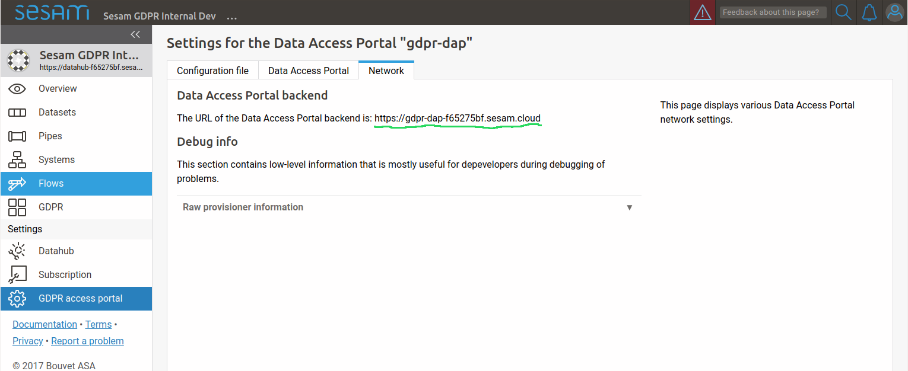

.. This file is included by the "databrowser-auth.rst" and the "gdpr-platform-configuration.rst" files.

To enable openid connect authentication, you first need one or more external authentication services. You must
then tell the data access portal to use the authentication service(s). This is done by setting the "authentication_providers" config variable like this::

    [authentication]
    authentication_providers=
        - provider_id: Microsoft
          consumer_key: xxxxxxxx-xxxx-xxxx-xxxx-xxxxxxxxxxxx
          consumer_secret: xxxxxxxxxxxxxxxxxxxxxxx
          openid_configuration_url: https://login.microsoftonline.com/common/.well-known/openid-configuration
          user_id_attribute: upn

        - provider_id: Google
          consumer_key: xxxxxxxxxx-xxxxxxxxxxxxxxxxxxxxxxxxxxxxxxxx.apps.googleusercontent.com
          consumer_secret: xxxxxxxxxx-xxxxxxxxxxxxx
          openid_configuration_url: https://accounts.google.com/.well-known/openid-configuration
          user_id_attribute: email

        - provider_id: Auth0
          consumer_key: xxxxxxxxxxxxxxxxxxxxxxxxxxxxxxxx
          consumer_secret: xxxxxxxxxxxxxxxxxxxxxxxxxxxxxxxxxxxxxxxxxxxxxxxxxxxxxxxxxxxxxxxx
          openid_configuration_url: https://my_auth0_application.eu.auth0.com/.well-known/openid-configuration
          user_id_attribute: email
          allow_unverified_email: false

Each provider-info entry in the authentication_providers list must contain the following attributes:

    provider_id:
      A unique id identifying the provider. This parameter is user-selectable and can be set
      to anything. The only requirement is that each provider_id must be unique.

      Example: "keycloak_test"

    consumer_key:
      The id the data access portal is registered with at the authentication provider.

    consumer_secret:
      The secret the data access portal uses to authenticate itself with the provider.

The provider-info must contain either a "openid_configuration_url" or a "openid_configuration" parameter:

    openid_configuration_url:
      An url that returns the provider metadata as specified here: http://openid.net/specs/openid-connect-discovery-1_0.html#ProviderMetadata

      Example: "https://myserver.example.com/auth/realms/demo/.well-known/openid-configuration"

    openid_configuration:
      If the provider doesn't have a openid_configuration_url endpoint,
      the provider metadata can be supplied directly on the format specified in http://openid.net/specs/openid-connect-discovery-1_0.html#ProviderMetadata.
      (This is fiddly and not recommended. Use the 'openid_configuration_url' parameter whenever possible)

The provider-info can contain the following optional parameters:

    user_id_attribute: The claim in the UserInfoResponse (http://openid.net/specs/openid-connect-core-1_0.html#UserInfoResponse)
      to use as the "user_id" value. Defaults to "sub". Often, the "sub" claim contains a non-human-readable
      id, so it is usually better to use some other (unique) claim instead.
      For authentication against google, "email" should be used. For authentication against
      login.microsoftonline.com, "upn" should be used.

    contactinfo_attribute: The claim in the UserInfoResponse (http://openid.net/specs/openid-connect-core-1_0.html#UserInfoResponse)
      to use as the "contactinfo" value in the returned user_info dict. Defaults to "email".

    allow_unverified_email:
      If true, users with unverified email addresses are allowed to log in. Default true. This can be
      set to false for authentication providers that are based on the user's email address, and that don't
      already verify the user's email address.

    use_userinfo_endpoint: This can be set to False for providers where the userinfo endpoint isn't
        neccessary or doesn't work for some reason (which is the case for the preprod environment from
        bankidnorge.no, for example). In such cases the user_id, etc is extracted from the IDToken (http://openid.net/specs/openid-connect-core-1_0.html#IDToken) instead.

    scope:
      The openid scopes to request from the provider.
      Defaults to "openid profile email"

Configuring an OpenId connect authentication provider service
~~~~~~~~~~~~~~~~~~~~~~~~~~~~~~~~~~~~~~~~~~~~~~~~~~~~~~~~~~~~~

When a user wants to log in to the GDPR portal via an OpenID Connect authenticationservice, the following happens:
  1. The GDPR portal redirects the user's webbrowser to the authenticationservice's login-page.
  2. The user logs in (for instance via a norwegian BankID)
  3. The authenticationservice redirect the user's webbrowser back to the GDPR portal with an authentication-code in the url.

Most authenticationservices has a list of urls that can be used in step (3). For the GDPR portal, the url is on this form::

    <Data Access Portal backend url>/login_callback/<provider_id>

Example::

    https://gdpr-dap-f65275bf.sesam.cloud/login_callback/BankID

The "provider_id" is the id you specified in the "authentication_providers" configuration option.

You can find the "Data Access Portal backend url" on the "Network"-tab on the "GDPR access portal" page:

In addition, some authenticationservices has a list of urls that it is allowed to redirect back to after the user has
logged out. For the GDPR portal, this url is on this form::

    <Data Access Portal backend url>

Example::

    https://gdpr-dap-f65275bf.sesam.cloud
