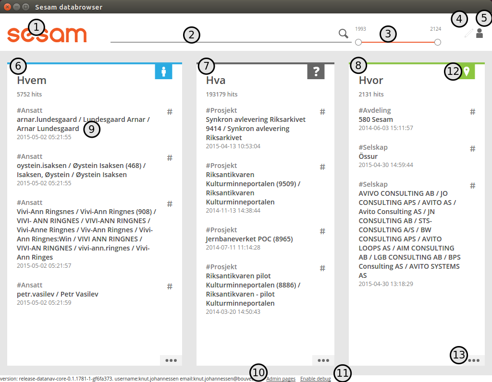
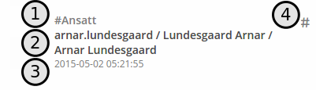
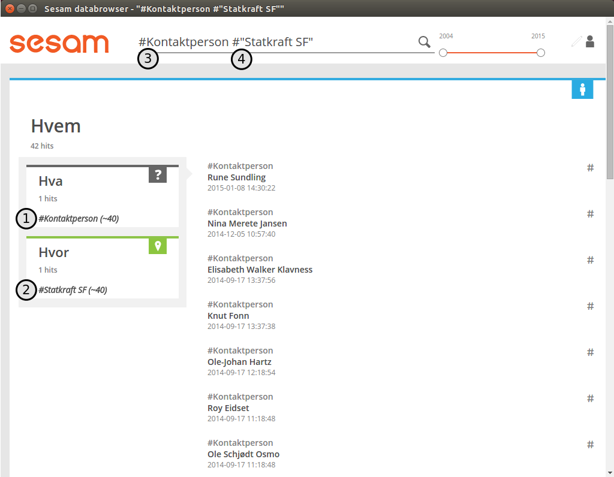
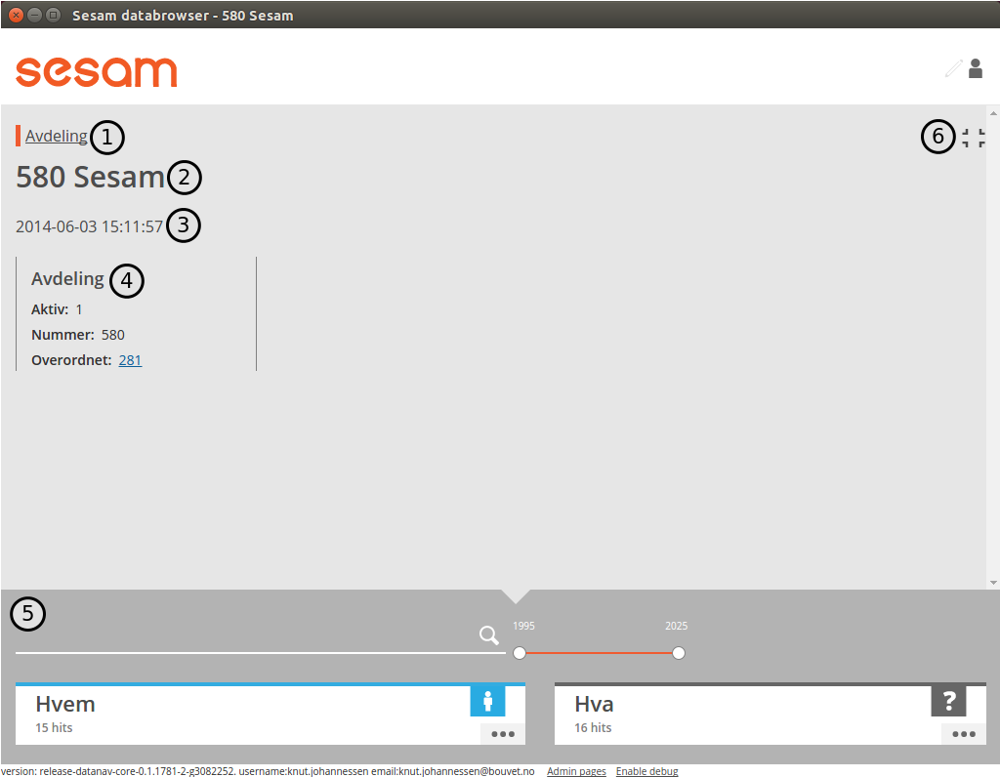
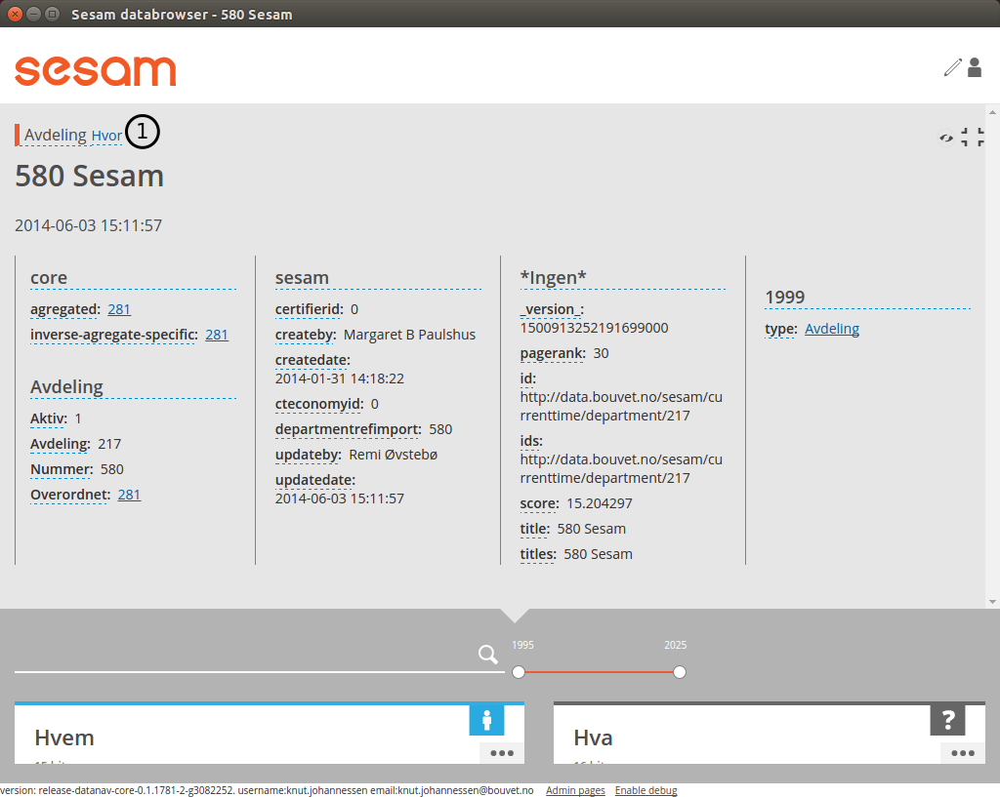
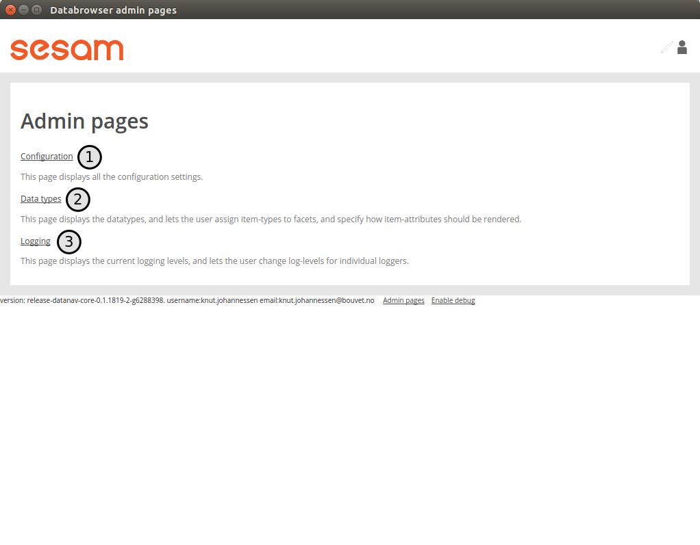
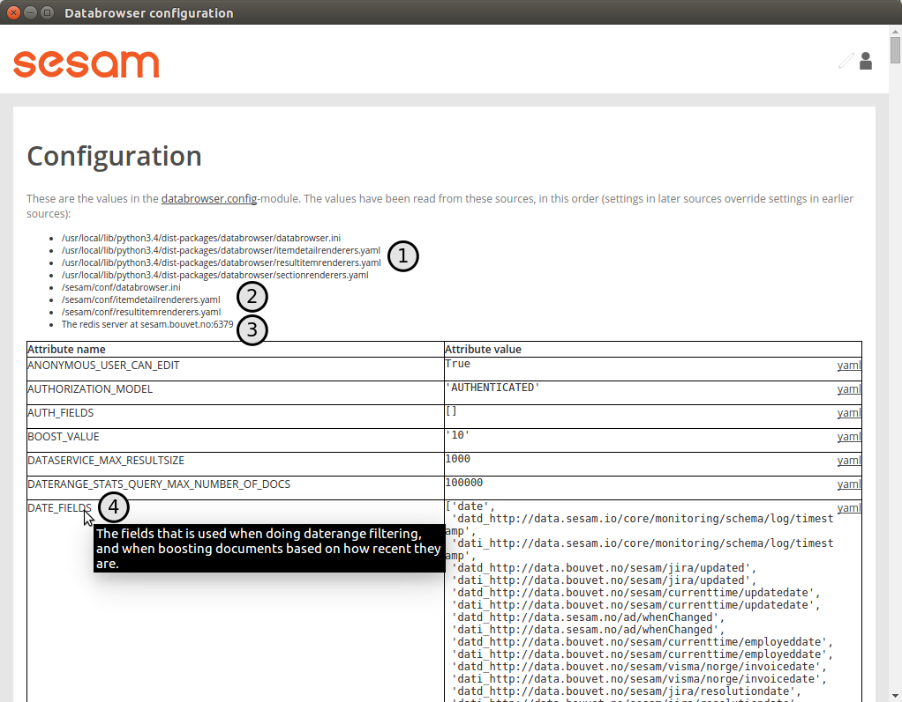
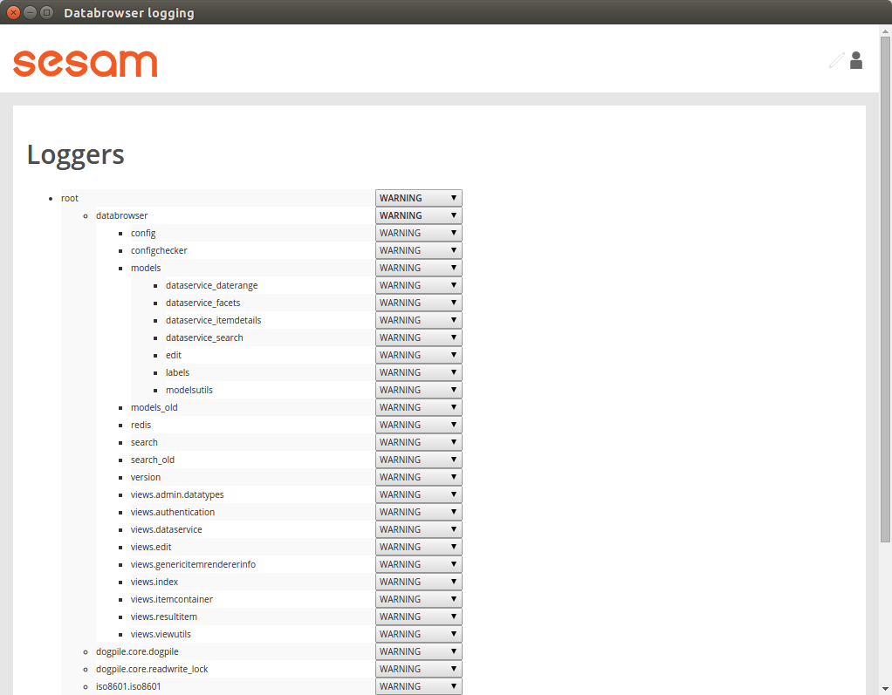
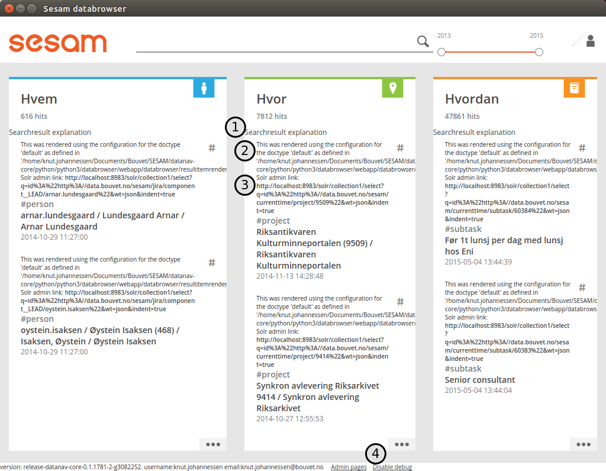
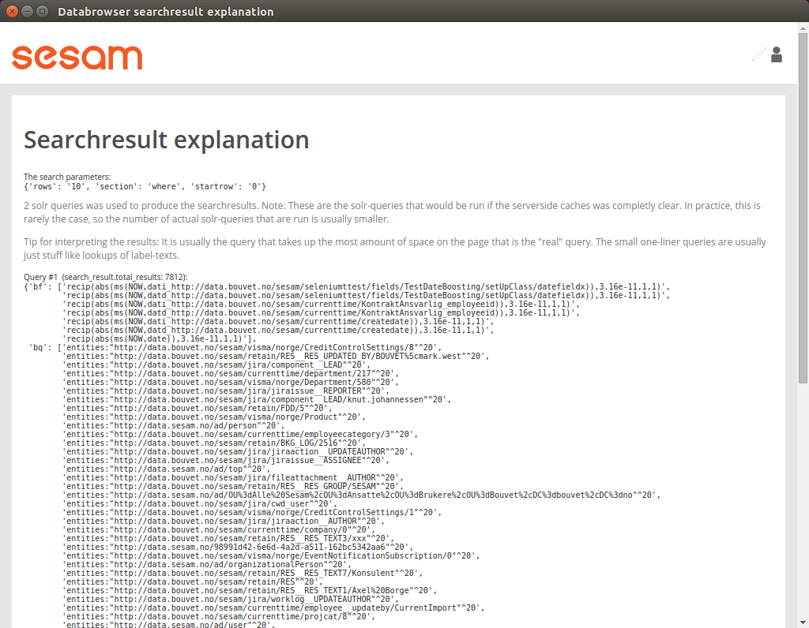

The Sesam Databrowser
=====================

High level overview / Introduction
----------------------------------

The Sesam Databrowser is a generic browser that lets you inspect
information as it exists in the data hub. The interaction principle is a
combination of search and traditional navigation.

.. contents:: Table of Contents
   :depth: 3

The startpage
^^^^^^^^^^^^^

This is the first page you see when loading the databrowser url.

.. _start_page_image:

   Screenshot of startpage

This page gives you a little bit of everything that is relevant to your
user account.

(1) The logo. This is always displayed and links to the startpage.

(2) This is the search field

(3) The date filter lets you filter the results by time

(4) Toggle edit-mode on/off. Edit-mode is used when :ref:`configuring <configuration>` the databrowser.

(5) Link to the item that represents the logged-in user

(6), (7) and (8): :ref:`Sections <the_sections>` that results are grouped
into

(9)  A searchresult

(10) link to the :ref:`admin pages <admin_pages>`

(11) Toggle :ref:`debug-information <show_debug_information>` on/off

(12) Section logo

(13) Section "more" link

.. _the_sections:

The sections
^^^^^^^^^^^^

The searchresult items each has a type ("Ansatt", "Prosjekt",
"Avdeling"). To organize the searchresults, the databrowser splits the
searchresults into separate sections, based on the item types.

There will typically be three sections present: "Who", "What" and
"Where". (6, 7, 8 in the :ref:`startpage image <start_page_image>` above).

The "Who"-section will typically contain items that represents people
("Employee", "Manager", etc).

The "What"-section will typically contain items that represents things
("Project", "Task", etc).

The "Where"-section will typically contain items that represents places
("Department", "Country", etc).

A searchresult
~~~~~~~~~~~~~~

Searchresult items (9 in the :ref:`startpage image <start_page_image>` above) contains the following information:

   searchresult item

(1) The type of the item. This is also a link for
    :ref:`filtering image <hash_filtering>` based on the name of the type.

(2) The title(s). This is also a link to the :ref:`itemdetail image <item_detail_page>` for the item.

(3) The date(s), if available. This is typically a last-modified date.

(4) A link for :ref:`filtering image <hash_filtering>` the searchresults based
    on the items title.

Doing a search with a searchtext
^^^^^^^^^^^^^^^^^^^^^^^^^^^^^^^^

You can do a text-search by entering a text in the searchtext input
field (Element (2) in the :ref:`startpage image <start_page_image>` above). The searchresults in the sections will update automatically as
the user types in a searchtext. If the searchquery results an a section
containing zero searchresults, that section will be hidden.

.. _daterange_slider:

Narrowing a search with the daterange slider
^^^^^^^^^^^^^^^^^^^^^^^^^^^^^^^^^^^^^^^^^^^^

The daterange slider (Element (3) in the :ref:`startpage image <start_page_image>` above) lets you narrow the searchresults
based on a daterange.

.. figure:: ./databrowser-guide-images/daterange.png
   :alt: daterange slider

   daterange slider

The first (1) and last (2) year in the searchresults are displayed at
the top of the daterange-slider. You can use the handles (3) and (4) to
narrow the daterange, like this:

.. figure:: ./databrowser-guide-images/daterange_in_action.png
   :alt: daterange slider

   daterange slider

As you drag the start-date and end-date handles back and forth, the
searchresults will be updated automatically.

.. _focused_section:

Focused section
^^^^^^^^^^^^^^^

To see more results from a section you can click/tap its icon or
more-link (Elements (12) and (13) in the :ref:`startpage image <start_page_image>` above . This is called "focusing" on the
section.

When a section is focused, the other sections gets hidden, and all the
searchresults in the focused section is available. We use "infinite
scrolling" to show all the searchresults: when you scroll down more
searchresults are fetched from the server and added to the end of the
list of searchresults.

In the image below we have focused on the "Who"-section:

.. figure:: ./databrowser-guide-images/focused_section.png
   :width: 800 px
   :alt: focused section

   focused section

A number of things change when focusing on a section:

(1) A vertical scrollbar appears in the browserwindow, to indicate that
    the user can scroll down to see more searchresults.

(2) and (3) Smaller boxes (called "facetsections") are displayed inside
    the focused section. The facetsections contains facetvalues (4) that
    lets you :ref:`filter image <hash_filtering>` the searchresults on things
    like item type.

.. _facetsections:

Facetsections
^^^^^^^^^^^^^

The facetsection displays one or more filters that can be applied to
narrow down the number of searchresults. The number after each
filtername gives an indication on the number of searchresults that would
result by applying the filter.

The purpose of the filters is to only display items that is connected to
the item that the filter refers to. The most common usecase is to filter
items based on their type. (An item's type is described by having the
item refer to another item that represents the type).

You can apply multiple filters by clicking on the #Name of the filters
you want. The searchresult will be the intersection of the searchresults
you would get or each of the filters on its own:

   focused section with filters applied

Note that the selected filters (1) and (2) appears in the searchtext
inputfield as text (3) and (4). Power-users can type in filters manually
and get the same effect as clicking on a filter.

You can remove a filter by clicking on it again, or by deleting the text
from the searchtext inputfield.

In the :ref:`configuration chapter <facetsection_via_itemdetail_view>` we
will describe how to specify the filters each facetsection should
contain.

.. _hash_filtering:

More on Filters
^^^^^^^^^^^^^^^

What follows is a detailed and somewhat technical description of how the
facet filtering is done. A user is normally not required to know the
details here, but in some cases it can be very useful to know what is
going on behind the scenes.

Each item is stored as a separate document in a search-index. Each
document has a number of fields, but in this context only three fields
are important:

-  "titles": A list of the titles of the document (for instance a
   person's name)
-  "ids": The unique identifiers of the document
-  "entities": The ids of other documents that this document refers to.

When the user uses a #Filter, the system will do the following:

1. Extract the title-strings from the #Filter. Examples: #SomeTitle =>
   "SomeTitle", #"Knut Johannessen" => "Knut Johannessen"

2. | Do a search for documents whose "titles"-field contains the exact
     title as specified in the filter. Make a
   | combined list of all the ids of the documents.

3. Do a search for documents whose "entities"-field contains at least
   one of the documentids from step (2), and that also fulfills all the
   other searchparameters (daterange, etc).

4. Display the documents from step (3) to the user.

If more than one #Filter is defined, separate lists of ids are created
for each #Filter in step (2). In step (3) a search is made for documents
whose entities match at least one id in each of the lists from step (2).

| Syntax:
| Filtering is normally done by clicking on a facetvalue in a
  :ref:`facetsection <facetsections>`, but it is also possible to manually
  type in filter in the searchtext inputfield, using the following
  syntax:

-  The filter always starts with the hashtag (#) character.
-  If the title-string contains a space-characters, the title-string
   must be enclosed in double-quote (") characters.
-  Only exact title-string searches are done. For instance: #orang will
   not give any matches on items with the title 'orange'.
-  If the closing double-quote is missing, all the remaining text in the
   search-input field is assumed to be a part of the title-string.

Examples:

=============== ====================== =========================
Search string   Resulting title-string Resulting free-text query
=============== ====================== =========================
#orange         "orange"
#orange apple   "orange"               "apple"
#"orange" apple "orange"               "apple"
#"orange apple" "orange apple"
#"orange apple  "orange apple"
=============== ====================== =========================

.. _item_detail_page:

The itemdetail page
-------------------

When you click on a searchresult item, that item gets selected, and is
displayed on the itemdetail page.

This page displays all the attributes of the selected item, and the
searchresults are filtered so that only items that refer to the selected
item is displayed:

.. figure:: ./databrowser-guide-images/itemdetail_page_collapsed.png
   :width: 800 px
   :alt: Itemdetail page collapsed screenshot

   Itemdetail page collapsed screenshot

(1) The itemdetail view.

(2) Filtered searchresults.

(3) Expand/collaps button.

To see more of the selected item (and less of the filtered
searchresults), you can click the Expand-button (element 3 in the image
above).

   Itemdetail page collapsed screenshot

When the itemdetail page is expanded, the following information is
displayed:

(1) The names of the type or types of the item.

(2) The title or titles of the item.

(3) The date(s) or the item. This is typically a "created" or "last
    changed" date, but this will be different for different itemtypes.
    Example: For an item that represents a calendar entry, the date will
    typically be the date the event occurs.

(4) All the attributes of the item. The user can configure how the
    itemattributes are displayed; ordering, headers, etc can all be
    specified. This is described in detail in the :ref:`configuration <item_attributes>`
    chapter below.

(5) An overview of the searchresults. The searchresult is squashed down
    a bit to take as little room as possible, while still making it
    possible for the user to use the searchtext inputfield and the
    daterange slider.

(6) The expand/collapse button.

Getting back to start
---------------------

There are two ways to get back to the startpage after clicking around in
the databrowser: The first is the web-browser's backbutton. This will
take you one step back toward the starting point.

Example:

1. Open the startpage

2. Click on the more-link on a section => this :ref:`focuses <focused_section>` on the section

3. Click on a searchresult item in the section => this causes the :ref:`item detail page <item_detail_page>` to load.

4. Click on the browser's backbutton => this takes you back to the
   focused section as in step 3.

5. Click on the browser's backbutton => this takes you back to the
   startpage

The other way to navigate is to click on the logo in the top left
corner. This will take you directly back to the startpage, no matter
which page you are currently at.

Logging in
----------

TODO: explain how authentication works: 

Authentication with google
^^^^^^^^^^^^^^^^^^^^^^^^^^

Authentication with microsoft live
^^^^^^^^^^^^^^^^^^^^^^^^^^^^^^^^^^

Authentication via a frontend proxy server
^^^^^^^^^^^^^^^^^^^^^^^^^^^^^^^^^^^^^^^^^^

User object
^^^^^^^^^^^

The "user object" is the item that represents the currently logged-in
user. This item will not be displayed in any searchresults, but can be
reached by clicking on the little person-icon in the top right corner.

.. _configuration:

Configuration
-------------

Specifying what appears in the "Who"-section.
^^^^^^^^^^^^^^^^^^^^^^^^^^^^^^^^^^^^^^^^^^^^^

As mentioned in the :ref:`chapter about "Sections" <the_sections>`, the
searchresults are organized into different sections (for instance "Who",
"What", "Where" and "Why), based on the type of each searchresult item.

You can select which section an item type belongs to via the itemdetail
page. This is done as follows:

-  Go to the startpage
-  Click on the first search-result in the "Where"-section. This opens
   the itemdetail view.
-  Click on the expand-button, if needed
-  Click on the "edit"-button (The little pencil in the top right corner
   of the browserwindow). This changes the view to "edit"-mode, see the
   screenshot below.

   itemdetail page editmode

1) At the top of the itemdetail view all the types of the selected item
   will be displayed. After each type name is listed the section that
   items of that type will appear in. If the link after a type says
   "Unknown", it means that that itemtype hasn't been assigned to a
   section. The item may have more than one type, but at least one of
   the types will be assigned to the "Where"-section.

-  To change which section the item appears in, click on the sectioname
   link after the itemtype (element (1) in the screenshot above. This
   will open a dialogbox where you can select one of the "Who", "What",
   "Where" sections. Select "What".

.. figure:: ./databrowser-guide-images/itemdetail_page_editmode_sectiondialog.png
   :alt: itemdetail page editmode

   itemdetail page editmode

You can now return to the front page (by clicking on the sesam-logo in
the top left corner) to see who your change has affected the
searchresults: The item will now have been moved from the "Where" to the
"What" section.

Note: It is a good idea to change the section back to the original value
afterwards; all the changes you make apply to all users, not just to
you. Click the browsers back-button to go back to the itemdetail page
and select the "Where"- section again.

.. _facetsection_via_itemdetail_view:

Specifying what appears in a facetsection via the itemdetail view.
^^^^^^^^^^^^^^^^^^^^^^^^^^^^^^^^^^^^^^^^^^^^^^^^^^^^^^^^^^^^^^^^^^

The content of the :ref:`facetsections <facetsections>` can also be
specified on the itemdetail page. In this example we will add the
"Avdeling"-

Click on the "What"-heading to to focus on the "What"-section. The
section will expand to take up the full width of the screen, and will
display a "What" facetsection.

Lets assume that we want to have a "Hvor" facetsection that displays the
values of the "departmentid" attribute.

-  Go to the front page and click on the first searchresult in the
   "Hvem"-section
-  Click on the "expand"-link if neccessary, to make the itemdetail view
   take up the whole browserwindow.
-  Click on the "edit"-button (The little pencil in the top right corner
   of the browserwindow)
-  Find the "departmentid" label and click on it. This opens a dialog
   where you can configure the attribute.
-  Select "Hvor" in the "Facet section" dropdown (1) and click the
   submit-button (2).

.. figure:: ./databrowser-guide-images/itemattributes_config_facetsection.png
   :alt: Facet section dropdown

   Facet section dropdown

-  Click on the sesam-logo in the top left corner to go back to the
   front page
-  Click on the "more"-link in the bottom right corner of the
   "Hvem"-section

The "Hvem"-section will now display a "Hvor"-facetsection (in addition
to the old "Hva"-facetsection). As before: If this is a production
system is is a good idea to revert your changes afterwards.

Display fields
^^^^^^^^^^^^^^

Some of the fields of an item has a special significance, and we often
want to display the fields in a more prominent place than the generic
field list. There are three different types of display fields:

.. figure:: ./databrowser-guide-images/itemdetail_page_displayfield_nonedit.png
   :width: 800 px
   :alt: itemdetail page with displayfields

   itemdetail page with displayfields

(1) "Title"-fields are displayed as the title(s) of an item. Typically
    usage: a persons full name.

(2) "Description"-fields are displayed below the titles. They are
    typically used to display a longer text that describes the item
    somehow.

(3) "Date"-fields describes the dates of the item. This can be things
    like "created date" or "modification date", "birth date".

A field is assigned to a display-field via the edit-mode in the
itemdetail-page:

.. figure:: ./databrowser-guide-images/itemdetail_page_editmode_displayfield_description_original.png
   :width: 800 px
   :alt: itemdetail page with displayfields

   itemdetail page with displayfields

To change the display-field setting, select a setting from the dropdown
(1) and click the submit-button (2).

Only the display-field settings that apply to a particular field; in the
example above we are looking at a text-field, so the "Date"
display-field setting is not available in this case.

Search fields
^^^^^^^^^^^^^

Search-fields are similar to display-fields, in that they are item
fields with some special significance. But while the display-fields
settings describes how a field is displayed to the user, the
search-field settings describe how a field is used when searching for
data.

There are three different kinds of search-fields:

1. "Title": These fields are used when doing using a :ref:`#TitleFilter <hash_filtering>`. See the :ref:`hash_filtering` chapter
2. "Date": These fields are used when narrowing a set of searchresults
   with the :ref:`daterange slider <daterange_slider>`.
3. "Email": These fields are used when searching for items that are
   related to the currently logged-in user. These items are then used to
   boost searchresults relevant to the current user.

.. _item_attributes:
   
Item attributes
^^^^^^^^^^^^^^^

In addition to the itemattribute settings we have already mentioned,
there are a few others that we also must mention.

.. figure:: ./databrowser-guide-images/itemdetail_page_editmode_itemattributesmisc.png
   :width: 800 px
   :alt: itemdetail page misc item attributes

   itemdetail page misc item attributes

(1) The "psi" is the unique identifier of the item attribute type. This
    is readonly.

(2) | "Type specific": This checkbox specifies whether or not the
      settings should apply to all instances of the item attribute, or
      only instances of the attribute on items of the same type as the
      current item.
    | This could for instance be used to give the "title"-attribute a
      label of "First- and lastname" for a person, and "Project title"
      for a project.

(3) "Label": The headingtext for the itemattribute.

(4) "Group": The name of the group the itemattribute should be place
    under. To create a new group, simply set this value to a new value.
    If no such group already exists, it will be implicitly created.

(5) "Sortorder": The attribute's sortorder within the group.

(6) Visible: A checkbox that specified whether or not this attribute
    should be displayed or not. (An attribute is alwasy visible in
    edit-mode, regardless of this setting)

(7) Renderer: How the attribute should be rendered. This is normally set
    to "default", which means that the system will attempt to guess at
    the best way of rendering the attribute.

.. _admin_pages:

Admin pages
-----------

In addition to the normal searchresults and itemdetail pages, the
datebrowser also has some pages that is only visible for administrative
users.

These are reached by adding "/admin_index" to the databrower address in your browser.
Example: if your databrowser is reached at "https://databrowser.example.com", the admin-pages
will be at ""https://databrowser.example.com/admin_index".

   Screenshot of admin index page

Below we will look at each of the avialable admin-pages.

Configuration page
^^^^^^^^^^^^^^^^^^

   Screenshot of configuration admin page

This page displays all the configuration-settings of the databrowser. It
is mostly useful for developers who are trying to track down some
problem.

Near the top of the page is a listing of where the databrowser read its
configuration from:

(1) A list of the default configuration-files. These are the files that
    all installations of the databrowser shares.

(2) A list of the installation-specific configuration-files. These files
    are supplied by each installation of the databrowser, and will
    typically override configuration-settings found in the default
    configuration-files.

(3) The redis-server that the databrowser is connected to. When making
    configuration-changes via the gui, the changes are stored in this
    redis-server.

(4) Links for downloading and uploading all configuration-changes to the
    redis server. See the :ref:`Redis configuration upload page <databrowser_configuration_redis_upload_page>`

(5) A list of configuration attributes is displayed for each [section] in the databrowser.ini file.

Data types page
^^^^^^^^^^^^^^^

.. figure:: ./databrowser-guide-images/admin_datatypes_page.png
   :width: 800 px
   :alt: Screenshot of datatypes admin page

   Screenshot of datatypes admin page

This page displays information about item-types and attriute-types, and
lets you do the same configurations as on the itemdetail page. Sometimes
it is easier to do such configuration here, since you don't first have
to find an item that has the item-type or attribute-types that you want
to configure.

Logging page
^^^^^^^^^^^^

   Screenshot of logging admin page

This page is only of interest to developers that has access to the
server logs. It is not meant to be used by end-users. The page lets you
change the log-levels of the various bits of the code. These settings
are not persisted anywhere, and will be reset to their default values
once the databrowser server restarts. To permanently change the
log-levels you have to modify your installation-specific
"production.ini"-file.

.. _show_debug_information:

Debug information
-----------------

The "Enable debug"-link on the bottom of the page will cause additional
information to be displayed on the page. This can be useful when trying
to track down problems with the configuration of the databrowser.

In the image below we have enabled debug information on the frontpage:

   screenshot with debug information enabled

Explanation:

1) This links to a ":ref:`searchresult explanation page <searchresult_explanation_page>`"
   that shows detailed technical information about the search-queries that were run in order
   to generate the search results.

2) This debug-info text describes the settings the databrowser sued to
   render the searchresult item.

3) A link to the underlying solr-data of the searchresult item.

4) The link in the footer has now changed to "Disable debug"

.. _searchresult_explanation_page:

Searchresult explanation page
-----------------------------

This is a special debuginfo page that displays information about the
solr-queries that was used to generate a list of searchresults. It is
mostly useful for developers and administrators that needs to debug and
tweak the search configuration.

   Searchresult explanation page screenshot

.. _databrowser_configuration_redis_upload_page:

Redis configuration upload page
-------------------------------

.. figure:: ./databrowser-guide-images/configuration_redis_upload_page.png
   :width: 800 px
   :alt: Redis configuration upload page screenshot

   Screenshot of Redis upload page

This page lets you bulk-upload configuration settings directly to the Redis server.
The current configuration is displayed in the textarea. You can either make changes to the existing
configuration or copy/paste the config from somewhere else (for instance another databrowser
instance).

This is useful if you have more than one databrowser instance and you want to copy
configuration from one instance to another (for instance from a test-instance to a
-instance).
