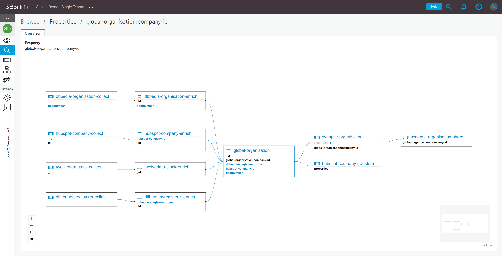

.. _property-lineage:

:badge:`Free for developers,badge-success badge-pill`

Property lineage
=================

Property lineage is a new feature which allows Sesam to track the dependencies between the various properties present in the data as it flows through the system. With this feature enabled, any property with a :ref:`namespace <namespaces-feature>` found in your subscription has its own page which shows the graph of properties that it depends on in the upstream pipes, as well as the properties depending on it in the downstream pipes.

How it works
------------

Property lineage works by statically analyzing the configuration of your pipes and combines its findings with the data collected by the :ref:`schema inferencing <schema-inferencing>` feature to produce a best-effort dependency graph of your properties. The graph shown on Property lineage page allows you to navigate the upstream and downstream properties and pipes by clicking on their names in the graph nodes.

How to enable
-------------
Property lineage is available for all subscriptions with the clustered architecture, and is a part of the :ref:`Integrated Search <integrated-search>` feature. This is how you can activate the feature:

#. Login to `the Sesam portal <https://portal.sesam.io>`_

#. Select the subscription you want to use

#. Navigate to Subscription on the left menu

#. Click on Products tab

#. Find Integrated search and property lineage and click on “Enable”

If your subscription is not yet on a clustered architecture please take contact with support to start the migration.

How to find a lineage for a property
------------------------------------

You can get to this page in three different ways:

1. ``Ctrl/Cmd+Click`` on any property with a namespace in a particular entity in the Integrated Search entity view.

2. ``Ctrl/Cmd+Click`` on any property with a namespaced in a particular entity in the Input/Output tab of a pipe.

3. By clicking on the name of a particular pipe in the list of pipe entity types in the Browse/Entity Types view, or going to the Inferred Schema tab of a particular pipe. This presents a list of all the properties found within the data that flows through this pipe. Clicking on one of these will get you to the Property Lineage page for this property.

 

