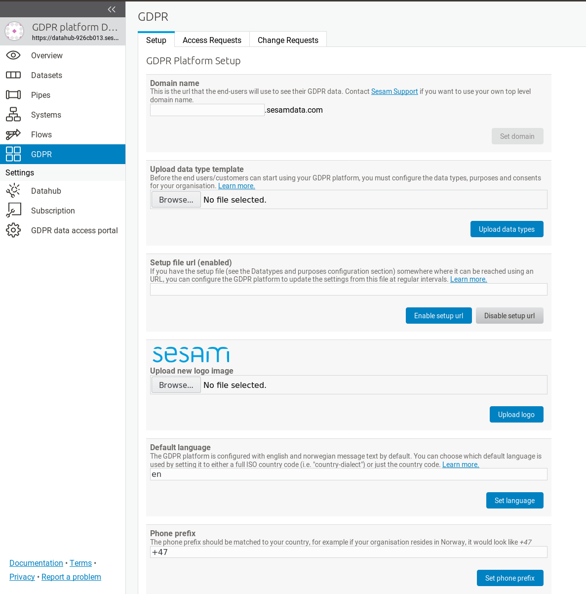
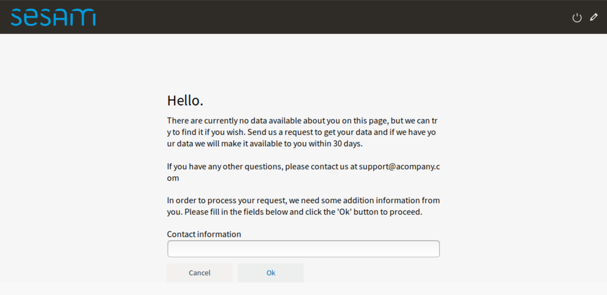

.. _gdpr_platform_configuration:

===========================
GDPR platform configuration
===========================

.. contents:: Table of Contents
   :depth: 2
   :local:

Overview
========

The GDPR platform consist of three parts; the GDPR platform management interface (management studio), the GDPR platform
datahub and the GDPR data access portal.

The management studio interface enables you to edit configuration settings of your GDPR platform and access its
datahub where all your GDPR data is collected, connected and stored.

The GDPR data access portal is the public facing interface of the GDPR platform - this is where the end user - data
subject in GDPR lingo - can log in and manage their GDPR requests, data and consents.

Logging into the GDPR platform
==============================

You can access the GDPR platform management studio by logging into the `Sesam portal <https://portal.sesam.io>`_   and clicking
on your GDPR platform subscription.

This will open the management studio GUI for your GDPR platform and datahub. Before you can start using your GDPR platform,
there are a couple of configuration elements that you might want to set up first.

Configuring the GDPR platform
=============================

There are some configuration properties that you might want to edit before starting to use the platform:

* :ref:`Domain name <gdpr_access_portal_domain_name>`
* :ref:`Data type template <gdpr_platform_data_type_template>`
* :ref:`Setup file URL and update interval <gdpr_platform_data_type_template_setup_url>`
* :ref:`GDPR Data Access portal logo <gdpr_data_access_portal_logo>`
* :ref:`Default language settings <gdpr_data_access_portal_default_language>`
* :ref:`Default phone prefix (for SMS notifications) <gdpr_data_access_portal_default_phone_prefix>`

To do this, navigate to the GDPR platform setup screen:

This screen should contain a number of configuration properties

.. _gdpr_access_portal_domain_name:

Domain name
-----------

The domain name is the internet address (DNS name) where your GDPR data access portal should be available to the users (data
subjects in GDPR lingo). You can choose any name you want, as long as it's not already in use by someone else.
Your GDPR data access portal will be available on the web as https://selected-domain-name.sesamdata.com

.. _gdpr_platform_data_type_template:

Data type template
------------------

This section allows you to upload a "Data type template" file (an Excel spreadsheet) to the GDPR platform.
See the :ref:`GDPR data types and purposes configuration <gdpr_data_types_purposes_configuration>` section for more
details.

.. _gdpr_platform_data_type_template_setup_url:

Setup file URL
--------------

If you have this "Data type template" configuration data file somewhere where it can be reached using an URL
(for example as a shared file in Dropbox, Google Drive, One Drive or something similar), you can configure the GDPR
platform to update the settings from this file at regular intervals. By default this is at midnight UTC.

Setup file Cron expression
--------------------------

You configure how often the "Setup file URL" should be downloaded and updated by editing a "Cron" expression.
In this example, it will be downloaded every day at midnight and automatically update the GDPR platform setup:

::

  0 0 * * *

In this case it will be updated every hour:

::

  0 * * * *

In this case it will be updated every fifteen minutes:

::

  0/15 * * * *

By default, if a setup file has been specified it will be updated at midnight UTC.

If you are unfamiliar with `cron expressions <https://en.wikipedia.org/wiki/Cron>`_, you can read more of how
they are formatted in the :doc:`Cron Expressions <cron-expressions>` document.

.. _gdpr_data_access_portal_logo:

GDPR data access portal logo
----------------------------

You can choose a custom logo image to display on your GDPR data access portal in the "Upload new logo image" setup
section. The uploaded file will replace the default (or current) GDPR data access portal logo immediately when saved.

.. _gdpr_data_access_portal_default_language:

Default language settings
-------------------------

The GDPR platform is configured with english and norwegian message text by default. You can choose which default
language is used by setting it to either a full ISO country code (i.e. "country-dialect") or just
the country code - for example:

::

  no-NB

or

::

  en

If your language is different than the default norwegian and english locale, you can add additional
translations by using the :ref:`translation GUI<gdpr_custom_text_and_translation>`.

.. _gdpr_data_access_portal_default_phone_prefix:

The default phone prefix
------------------------

The default phone prefix should be matched to your country, for example if your organisation resides
in Norway, it would look like:

::

    +47

.. _gdpr_custom_text_and_translation:

Custom text and translation
---------------------------

The static texts displayed in the data access portal can be customized on the GDPR translation page:

.. image:: images/gdpr_localization_strings.png
    :width: 800px
    :align: center
    :alt: Default localization strings

Note that for some of the strings, changes will not affect already emitted notifications or data objects - only new ones.

To add support for a new language you first set the :ref:`default language <gdpr_data_access_portal_default_language>` to the new language. A column for the new language will then appear in the table of localization strings, and you can fill in the strings for the new language.

.. _gdpr_access_portal_authentication_providers:

Authentication providers
------------------------
By default, the GDPR data access portal will ask end-users to authenticate themselves by supplying a phonenumber or and
email address. A one time password is then sent to the phonenumber/email address, and the user can enter the password
to log in.

Sometimes this isn't the best way of authenticating the end-users. Perhaps you already have a login-system in place
that you wish to use, or you wish to authenticate with something other than a phonenumber or email address.

To handle such cases, the databrowser can be configured to authenticate with an `OpenID connect <https://en.wikipedia.org/wiki/OpenID_Connect>`_ authentication provider. OpenID connect is a authentication standard that is widely supported (
for instance by Goodle and Facebook).

.. include:: databrowser-authentication_providers_examples_and_docs-for_include.rst

.. _gdpr_access_portal_access_request_contactinfo:

Custom contact info
-------------------

In some cases the authentication provider doesn't provide a phone number or email address that the user can be reached
on. This can be the case when the user is authenticated via `BankID <https://bankid.no>`_. Since the GDPR platform needs
a way to send notifications to the user, the GDPR data access portal can be configured to require the user to manually
enter the contact information when making an data access request.

This is done by setting the "access_request_contactinfo" option on the data access portal, like this::

    [gdpr]
    access_request_contactinfo=email,mobile_phone

The value of the configuration option is a comma-separated list of the contact information types the user can
specify. Possible values are "email" and "mobile_phone". If more than one type is listed, the user can choose
which one to specify.

This will look like this in the end-user GUI:

The header-text and the mouse-over tooltip for the contact information field can be customized by tweaking
one or more of the following localization strings::

    [localization]
    en-contactinfo__header=Contact information
    en-contactinfo__tooltip=Please enter a mobile phone number or an email address.
    no-contactinfo__header=Kontaktinformasjon
    no-contactinfo__tooltip=Vennligst tast inn et mobiltelefon nummer eller en epost addresse.

Technical details: When the user enters a phone number, it is validated using the regular expression in the
"otp_valid_mobile_phone_number_regexp" config option in the "authentication" section. Email addresses are
validated using the "otp_valid_email_address_regexp" config option.

.. _gdpr_access_portal_extra_access_request_fields:

Extra access request fields
---------------------------

This is the list of extra fields that the user (aka the data subject) must fill in when making a
gdpr access request.
By default this list is empty, but in some cases it can be desirable to have the user add additional
information.
Example usecase: the user authenticate via a phonenumber, but has to also specify their
date of birth when making an access request. This enables the data controller to double-check
that the phonenumber is correct.

Each field id must be some unique subject identifier. The field id will used to look up the field's
"header" and "tooltip" texts in the [localization] section.

Example configuration::

    [gdpr]
    extra_access_request_fields=
        namespace1:field1
        namespace1:field2

    [localization]
    no-namespace1:field1__header=Ekstra felt 1
    no-namespace1:field1__tooltip=Dette er ekstra felt 1
    en-namespace1:field1__header=Extra field 1
    en-namespace1:field1__tooltip=This is extra field 1

    no-namespace1:field2__header=Ekstra felt 2
    no-namespace1:field2__tooltip=Dette er ekstra felt 2
    en-namespace1:field2__header=Extra field 2
    en-namespace1:field2__tooltip=This is extra field 2

This will look like this in the end-user GUI:

.. image:: images/gdpr_dap_extra_fields.png
    :width: 800px
    :align: center
    :alt: Extra access request fields
