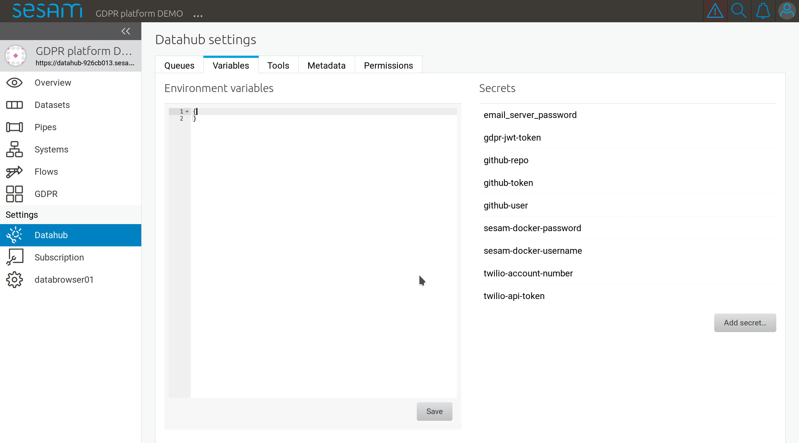

.. _gdpr_portal_configuration:

=========================
GDPR portal configuration
=========================

.. contents:: Table of Contents
   :depth: 2
   :local:

Logging into the portal
=======================

You can access the GDPR portal by logging into the `Sesam portal <https://portal.sesam.io>`_   and clicking
on the GDPR portal subscription.

This will open the management studio GUI for your GDPR portal. Before you can start using the GDPR portal,
there are a couple of configuration elements that you might want to set up first.

Configuring the portal
======================

There are some configuration properties that you might want to edit before starting to use the portal:

* Default phone prefix (for SMS notifications)
* Default language settings
* Setup file URL for automatic update of GDPR configuration elements

To do this, navigate to settings "variables" screen:

In the "Environment variables" form on the left, it should contain a number of configuration properties
(some of which will vary from installation to installation). Example:

::

    {
      "default-country-phone-prefix": "+1",
      "portal-url": "https://datahub-xyzxxyyzz.sesam.cloud",
      "redis-server-host": "10.0.0.148",
      "setup-cron-expr": "* * * * *",
      "solr-server-host": "10.0.0.148",
      "subscription": "99887766-bbaa-4330-aabbcc-bbd52367679b"
    }

Most of these should not be edited, leave them at their current values.

The default phone prefix
------------------------

The default phone prefix should be matched to your country, for example if your organisation resides
in Norway, it would look like:

::

    "default-country-phone-prefix": "+47"

Default language settings
-------------------------

The GDPR portal is configured with english and norwegian message text by default. You can choose which default
language is used by setting it to either a full ISO country code (i.e. "country-dialect") or just
the country code - for example:

::

  "default-language": "no-NB"

or

::

  "default-language": "en"

If your language is different than the default norwegian and english locale, you can add additional
translations by editing the ``custom-translations`` pipe configuration. See the later chapter on custom message texts
for more details. These texts are keyed on ISO locale codes and correspond to this setting. If you for example have
added german texts using the code "de-DE" (or just "de"), you can specify this as the default language here.

Setup file URL
--------------

If you have the setup file (see the :doc:`Datatypes and purposes configuration <gdpr-data-types-purposes-configuration>` section)
somewhere where it can be reached using an URL, you can configure the GDPR portal to update the settings from this
file at regular intervals, for example:

::

  "setup-file-url": "https://my.domain.com/folder/setup_file.xlsx"

You configure how often it should be downloaded by editing a "Cron" expression. In this example, it will
be downloaded every day at midnight and automatically update the GDPR portal setup:

::

  "setup-cron-expr": "0 0 * * *"

If you are unfamiliar with `cron expressions <https://en.wikipedia.org/wiki/Cron>`_, you can read more of how
they are formatted in the :doc:`Cron Expressions <cron-expressions>` document.
