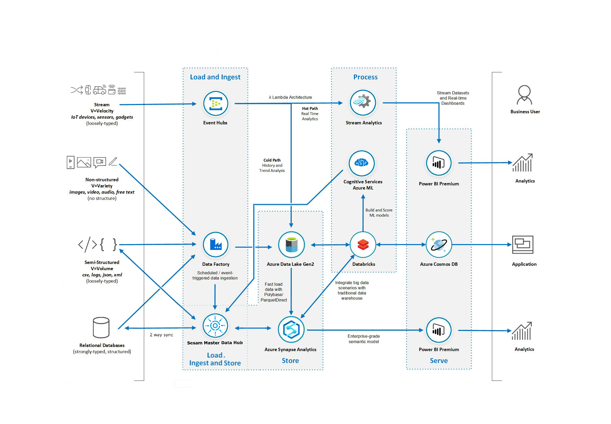

========================
Sesam in Microsoft Azure
========================

.. azure_reference:

Reference Architecture
======================

Using Azure Data Factory with Sesam
===================================

You can use the `REST connector <https://docs.microsoft.com/en-us/azure/data-factory/connector-rest>`_ with the `JSON
format <https://docs.microsoft.com/en-us/azure/data-factory/format-json>`_  in Azure Data Factory to push data to Sesam.

Using Azure Synapse Analytics with Sesam
========================================

You can use the :ref:`mssql-azure-dw_system` to synchronize data with Azure Synapse Analytics.

