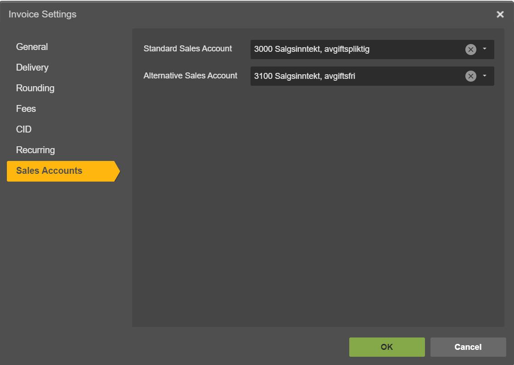

.. _powerofficego_connector:

==============
PowerOffice GO
==============

`PowerOffice <https://poweroffice.no>`_ is an all-in-one business solution. It is a cloud-based software that allows small and medium businesses to manage their accounting, invoicing, payroll, and human resources.

The PowerOffice Go connector configuration can be found in the  `powerofficego-connector github repository <https://github.com/sesam-io/powerofficego-connector>`_. The `playground branch <https://github.com/sesam-io/powerofficego-connector/tree/playground>`_ is typically the most complete branch.

How to find your PowerOffice Client Key
---------------------------------------
In order to connect your PowerOffice account to Sesam you need to create a Client Key in PowerOffice. Simply follow these steps to create one:

#. Login to your PowerOffice account
#. Navigate to **Menu** then click on **Settings**
#. Under System, click **Extensions**
#. Click on **Add Extension**
#. Select **<your app>** from the list, this will generate your **Client Key**
#. Copy your **Client Key** and store it somewhere

Frequently Asked Questions
--------------------------

Why is Product data not in sync with PowerOffice?
*************************************************

Make sure you have selected **Standard Sales Account** for your products in PowerOffice.

#. Navigate to **Settings** in PowerOffice
#. Click on a **Invoice Settings**
#. Click on **Sales Accounts** on left menu
#. Make sure you have selected an account for **Standard Sales Account**

Why contact person is not synched to PowerOffice?
*************************************************

Your contact person might already exist in PowerOffice, and is associated with another customer. If we identify contacts by their emails, and if the email is the same as another contact person, the data will be merged, and you will not see your contact flow as you would expect.

.. Note ::

    Contact persons may have different names across systems. It is important to verify whether the contact you are attempting to synchronize shares the same e.g. email address as any other contact present in PowerOffice.

In PowerOffice a contact person can only be associated with one customer at a time. That means that in order to associate this contact with another company, you need first to remove it from the customer he is currently associated with.

To delete a contact person association to a customer you can do the following:

#. Find the customer associated with your contact person
#. Click on **Contact Persons** on the left menu once on the customer card
#. Select the contact person you want to remove and click **Remove**