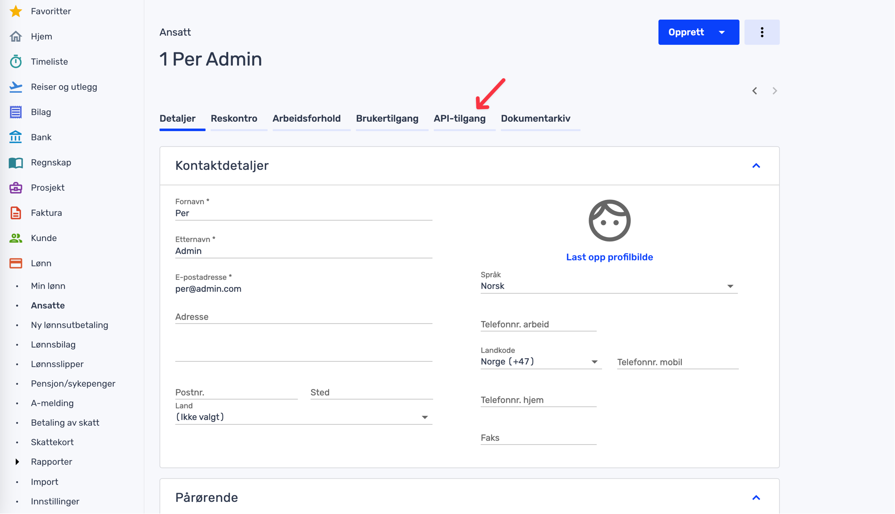

.. _tripletex_connector:

=========
Tripletex
=========

`Tripletex <https://tripletex.no>`_ is a simple-to-use modular accounting system that helps businesses deal with invoicing, salaries, time-tracking, yearly reports and more.

The Tripletex connector configuration can be found in the  `tripletex-connector github repository <https://github.com/sesam-io/tripletex-connector>`_. The `playground branch <https://github.com/sesam-io/tripletex-connector/tree/playground>`_ is typically the most complete branch.

Find your employee token
------------------------
 .. note::
    This applies for Tripletex “production accounts” only.

The employee token can be created by the account administrator in Tripletex under the User Settings page, then in the tab "API access" 

Follow these steps to create your employee token:

#. Enable integrations in Tripletex
#. Navigate to the API-access tab and create a new key choose "tilpasset oppset"/adapted setup
#. Choose All entitlements and write your application name into application name field
#. Name your token

.. image:: images/TT-API1.png
    :width: 800px
    :align: left
    :alt: Choose Company/Selskap

For more information please `read this documentation <https://hjelp.tripletex.no/hc/en/articles/4409557117713>`_.

Using test accounts in Tripletex
--------------------------------
If you wish to connect a Tripletex test account, follow this link and follow the `instructions <https://api.tripletex.io/execute/integrationEnvironment?site=en>`_.

At the end of this wizard you will be provided with your employee and consumer token as part of creating the test account. 
These tokens are required for authenticating your Tripletex test account.

Frequently Asked Questions
--------------------------

Why aren't line-items showing in a Tripletex order?
***************************************************
Tripletex does not allow multiple products to have the same name. This means that if a new product from an other system has the same name as an existing product in Tripletex we are not allowed to create this new product in Tripletex. This means we are not able to insert the order line with the product reference as it depends on the product being created to obtain that reference.

There are two ways to work around this problem:

- Change the name of the to-be-inserted product to something that does not exist in Tripletex already.

or

- Add enough information in the to-be-inserted product (if the system supports this) so that it :ref:`merges <merging_feature>` with an existing product in Tripletex.

Why is the address of my contact in Tripletex not up to date?
*************************************************************

In Tripletex the contact field for **address** is not supported in their API. only in their GUI. That means that we can not read or write write data from or into these fields. 