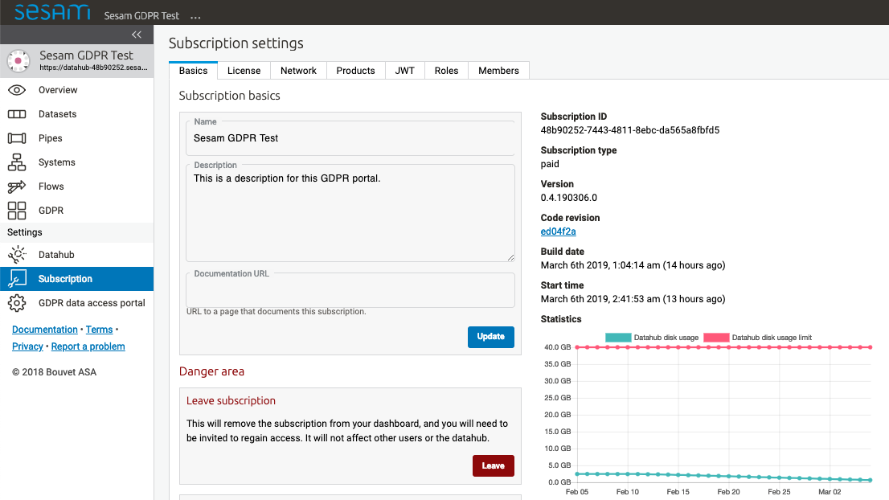
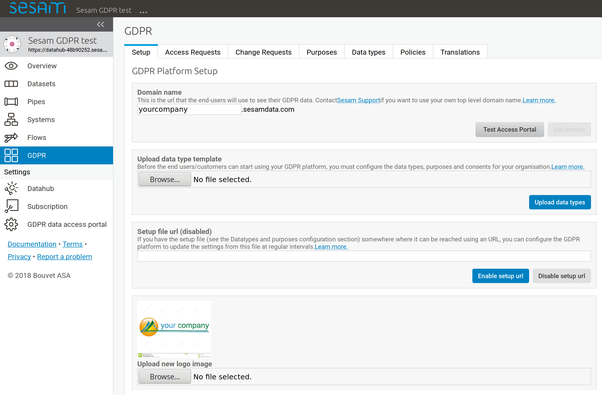
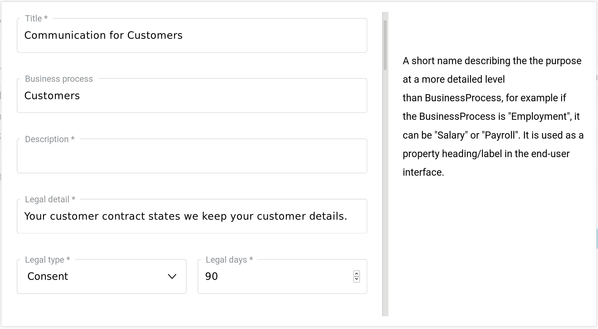
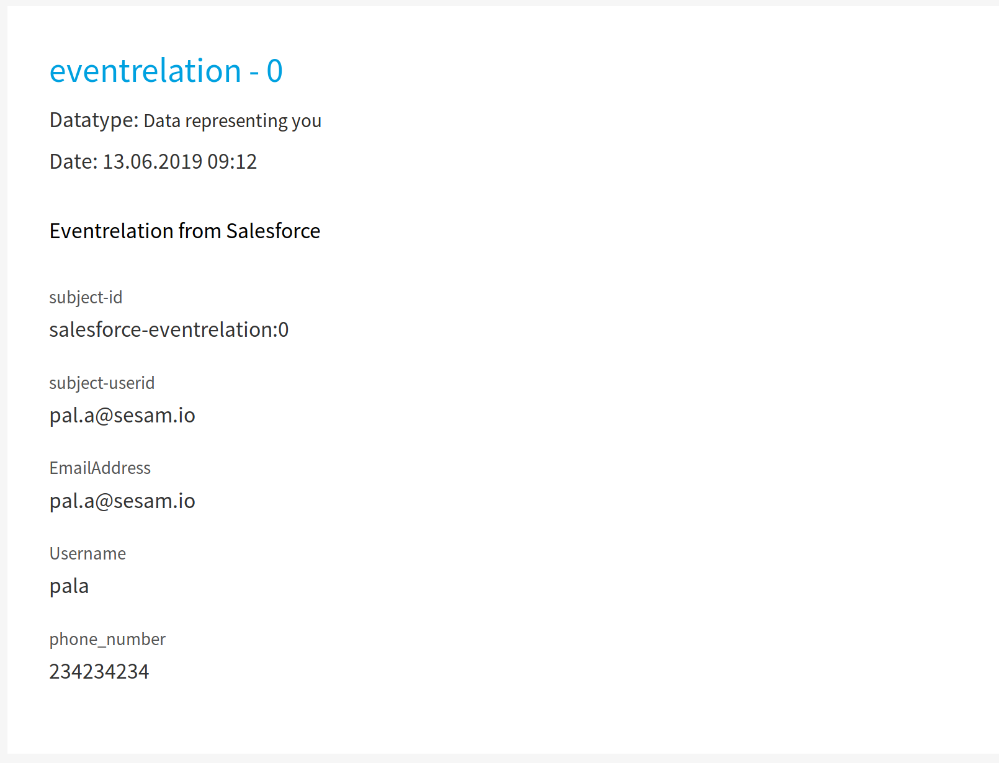
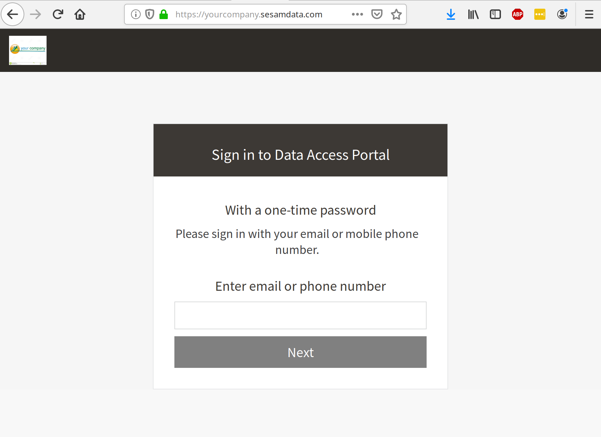
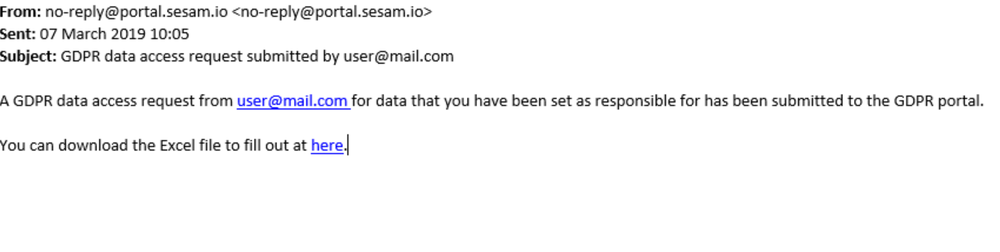
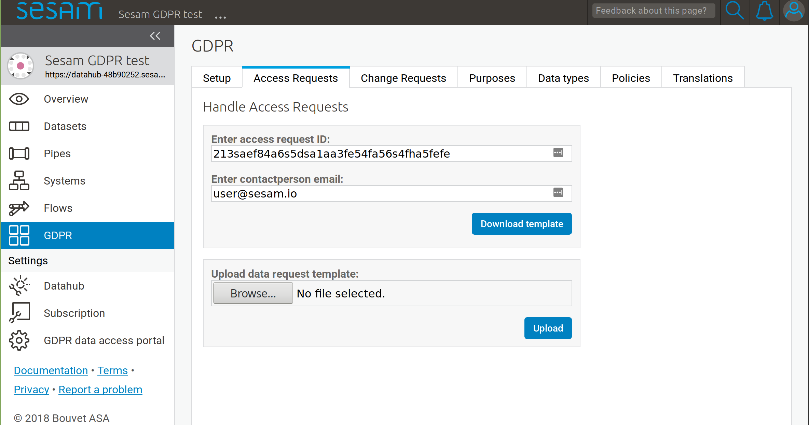

==========================================
Getting started with Sesam's GDPR Platform
==========================================

Introduction
------------

With Sesam's GDPR Platform you can handle your company's GDPR responsibilities. This guide will show you how to set up processing of incoming data requests from the company's data subjects.

Setup
-----

1. Go to `http://portal.sesam.io <http://portal.sesam.io/>`_ and click on sign up.
2. Once you have signed up, `contact support <mailto:support@sesam.io>`_ to create your GDPR subscription.

3. Once you have acces to the GDPR portal, navigate to settings to set ``name`` of your GDPR portal and add a ``description`` that will be seen by the data subject. 

4. Select ``GDPR`` in the left column navigator and in the ``Setup`` pane fill in your ``domain name``.

The domain name is the internet address (DNS) where your GDPR data access portal should be available to the data subjects. You can choose any name you want, as long as it's not already in use by someone else. Your GDPR data access portal will then be available on the web (e.g. ``https://your-selected-name.sesamdata.com``).

5. You can customize you portal by uploading your own logo and selecting colors further down the page.

Purposes
^^^^^^^^
You need to identify what are your systems, which types of personal data are in those systems and what purposes gives you the right to have the personal data. 

Navigate to the Purposes tab and create populate it with your purposes for having the data in your systems. The creation webform provides explanations for what each field represents. Below is an image of the purpose creation template. Make sure to fill in all fields marked with a star (*).

When a data access request has been processed the purpose is displayed to the data subject like in the following image:

.. image:: images/gdpr-getting-started/purpose-displayed.png
    :width: 800px
    :align: center
    :alt: Purpose displayed to data subject

Data types
^^^^^^^^^^

Next, go to Data Types and fill in the data you have in your systems. Make sure to fill in all fields marked with a star (*). In the ``Purposes`` field you select the purposes you have created that apply to the data in question. The email-address(es) supplied in ``Contact`` will receive an email when somebody makes a request for this data.

.. image:: images/gdpr-getting-started/data-type-creation.png
    :width: 800px
    :align: center
    :alt: Data type creation webform

The data related to the data subject can then be displayed like this when a data access request is served:

Your GDPR portal is now ready for use.

Data access request
===================

Request data as data subject
^^^^^^^^^^^^^^^^^^^^^^^^^^^^

1. The data subject can now log in to your portal to request their data. The URL will be the one you chose in the setup process, for example yourcompany.sesamdata.com

2. The data subject can log in with their email or phone number. This is a two-factor secure login that requires the subject to confirm a one-time password. Test logging in as yourself.

3. The data subject can now request their data or ask to be deleted

.. image:: images/gdpr-getting-started/request-data.png
    :width: 800px
    :align: center
    :alt: Deletion and information request available after login

Handle data request as system owner
^^^^^^^^^^^^^^^^^^^^^^^^^^^^^^^^^^^

1. The system owners specified in the GDPR Excel setup will receive an email about the request made by the data subject.

2. Download request template for handling the access request

3. Fill in the Request template for the specific data subject. You can use field names that you find fitting and add as many columns as needed. Then save the Excel document.

.. image:: images/gdpr-getting-started/access-request-excel.png
    :width: 800px
    :align: center
    :alt: Example of filling in excel template

4. Upload the filled-in Request template in the portal. The access request is now handled.

5. The data subject will now be informed via email or text message that the data is available.

.. image:: images/gdpr-getting-started/result-available-email.png
    :width: 800px
    :align: center
    :alt: Email to data subject upon available result

Data displayed to subject
^^^^^^^^^^^^^^^^^^^^^^^^^

When the data subject logs back in he or she can now view their data and execute their rights.

.. image:: images/gdpr-getting-started/data-exposed.png
    :width: 800px
    :align: center
    :alt: Result of request displayed to data subject

Automation of data request handling
===================================

If we have an automatic version of the GDPR platform we can set it up so that it handles data access requests automatically. The data will be delivered to the data subject without human intervention. We can do this because we use the Sesam integration platform with our GDPR platform. Using the Sesam integration platform means we make a copy of all the data we want to make available for the GDPR platform into its Sesam datahub. Once the data is available in the datahub, the system can serve data access requests on it's own.

To set up this automation we need to take care of a few things:

- Import data from our data systems to the datahub of the GDPR platform
- Refer to the datasets in the datahub in our data type definitions
- Update a pre-built pipe

Import data
^^^^^^^^^^^

We have to copy all the data from our source systems that contain data that could be served to our data subjects. We can import this data from different types of sources like databases, APIs, CSV- or XML-files. We do this by creating "inbound pipes" that copy all the data from a source. The pipes connect to external sources through "systems" in Sesam, which serve connection strings, connection pooling, authentication etc. Take a look at the Getting started with Sesam section of this documentation if you need to learn how to configure pipes and systems to connect to external data sources.

For testing purposes we have pre-made a few pipe configurations with embedded test data. We can use these pipes to setup and test the automation with dummy data before connecting to our real data sources.

Create four new pipes and paste the configurations provided in the links below. We can change the values of the first entity of the embedded data in these configs to match our own email address. That way we can test the platform as a data subject ourselves.

- :download:`salesforce-contact.json<files/salesforce-contact.json>`
- :download:`salesforce-eventrelation.json<files/salesforce-eventrelation.json>`
- :download:`salesforce-lead<files/salesforce-lead.json>`
- :download:`salesforce-task.json<files/salesforce-task.json>`

Link data to data subjects
^^^^^^^^^^^^^^^^^^^^^^^^^^

In our data type definitions we now also have to specify from which dataset the data is pulled. To do this we need to create and populate two extra fields in our data type definitions: ``TypeID`` and ``Identifiers`` . We can do this as we create the data types or we can edit them at a later time.

The ``TypeID`` field needs to have a value matching the ``rdf:type`` of the data, while the ``Identifiers`` field needs to contain the namespace and identifier of the attribute of the data we refer to in the data type definitions. See the image below for reference:

.. image:: images/gdpr-getting-started/data-type-automation-extra-fields.png
    :width: 800px
    :align: center
    :alt: Excel template with examples

These identifiers are what connects the data in the datasets to the data subject that is requesting their data. As you can see we have chosen ``EmailAddress`` in this example, but other attributes may be as-well or better suited for identifying data subjects. It could also be multiple identifiers separated by comma (no spaces).

Excel file data type definition alternative
^^^^^^^^^^^^^^^^^^^^^^^^^^^^^^^^^^^^^^^^^^^

If we wish to use an Excel file instead of the portal user interface to upload data types we then have to use the :download:`GDPR automated Excel setup template file <files/GDPR setup data automated.xlsx>`. In this template we need to populate the same two fields as described above.

Update pre-built pipe
^^^^^^^^^^^^^^^^^^^^^

1. Open pre-built pipe ``custom-subject-data`` and update this pipe with all our input datasets. Here we add four datasets ``salesforce-contact``, ``salesforce-eventrelation``, ``salesforce-lead`` and ``salesforce-task`` as our sources. After updating the pipe it should look like this:

.. code-block:: json

	{
	  "_id": "custom-subject-data",
	  "type": "pipe",
	  "source": {
	    "type": "merge",
	    "datasets": ["salesforce-contact sc", "salesforce-eventrelation se", "salesforce-lead sl", "salesforce-task st"],
	    "equality": [],
	    "identity": "first",
	    "strategy": "compact",
	    "version": 2
	  }

2. Now we can check the output of another pre-built pipe ``gdpr-subject-data-update`` (remove the "user" filter to see the complete list of pipes). Check the output of this pipe and you should see all the entities from all four datasets. These entities will eventually go into data subject as per his or her data access request.

3. That's it! We can now make a request as a data subject using our GDPR portal for the related data stored with the company.

"Related" data type levels
^^^^^^^^^^^^^^^^^^^^^^^^^^

Until now we have been fetching "Personal" level data types, but now let's look at "Related" data types.

1. Create a new pipe with "Related" level data called ``salesforce-attendee`` in GDPR node. Use this :download:`salesforce-attendee.json<files/salesforce-attendee.json>` config.

2. Create a data type and write "Related" in its ``Level`` field.

3. Add your dataset sources like shown below in pre-built pipe ``custom-subject-data``.

.. code-block:: json

	{
	  "_id": "custom-subject-data",
	  "type": "pipe",
	  "source": {
	    "type": "merge",
	    "datasets": ["salesforce-contact sc", "salesforce-eventrelation se", "salesforce-lead sl", "salesforce-task st", "salesforce-attendee sa"],
	    "equality": [],
	    "identity": "first",
	    "strategy": "compact",
	    "version": 2
	  }
	}

That's it. You can now make the request and will be able to see all the related data as well as personal data. Make sure you run all the pipes after resetting it to get latest change. 

Deletion or change requests
===========================

The data subject has the right to be forgotten (deleted) or have their data rectified (changed). To support rectification of data you will have to set up the GDPR data access portal to allow for it. You can read about how to do that in the `databrowser guide <docs.sesam.io/databrowser-guide.html>`_.

When a deletion or change request is submitted to a manually updated GDPR platform, an email will be sent to the address(es) listed as "Contact" in our uploaded "Purposes and Data types" excel sheet for the relevant data type(s). This recipient of this email needs to be a user in the Sesam portal assigned the "GDPR operations" role. The recipient of the request will then have to manually update the source systems as per the request. Then the GDPR operator will have to reupload a an excel sheet as if a new data access request has been submitted to reflect the changes.

For an automated GDPR platform it is possible to process change and deletion requests automatically by triggering changes or deletions directly in the source systems. See the `GDPR platform developer documentation <https://docs.sesam.io/gdpr-platform-developer-docs.html#gdpr-platform-developer-docs>`_ for information about automation and the APIs offered for implementing such a mechanism.

GDPR unstructured data handling
===============================

Up to this point we have been working with structured data. However, data is not always going to be structured in the real world. Fortunately, Sesam GDPR node also supports handling of GDPR unstructured data. Visit the `GDPR unstructured data support <https://docs.sesam.io/gdpr-platform-developer-docs.html#gdpr-unstructured-data>`_ section of this documentation to learn more about this.
