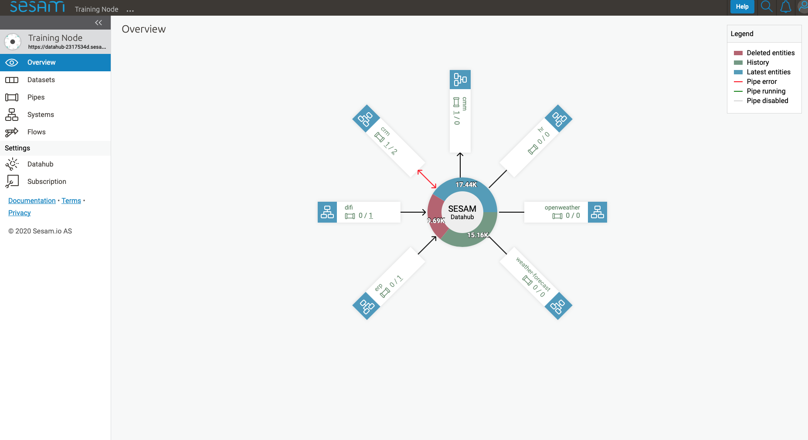
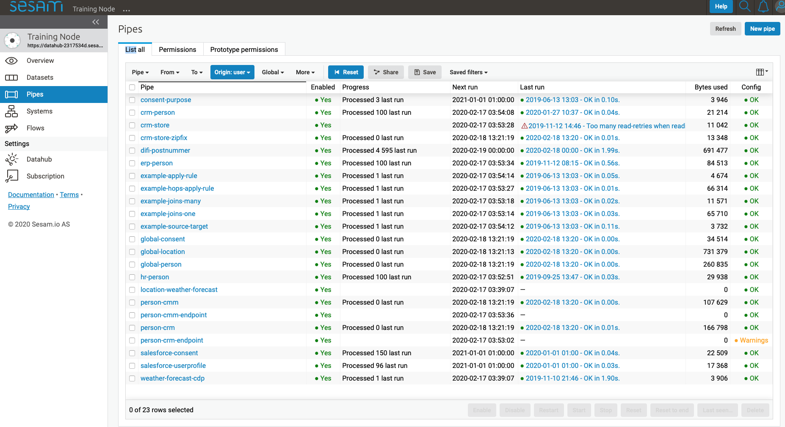
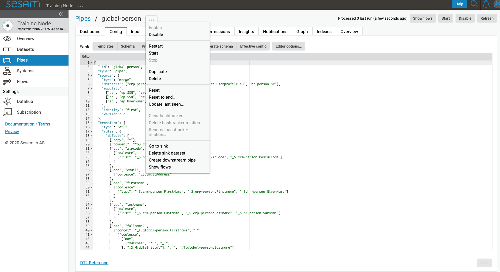
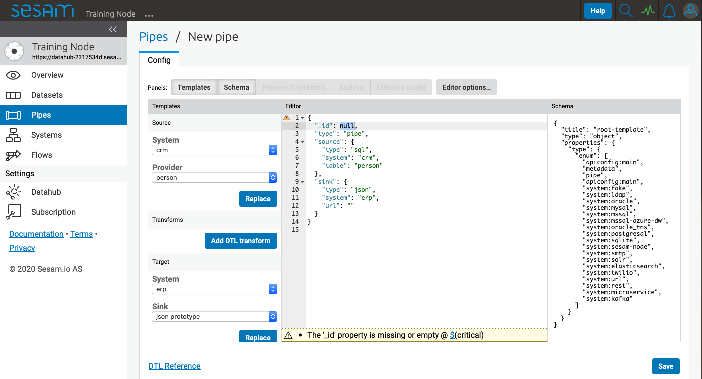
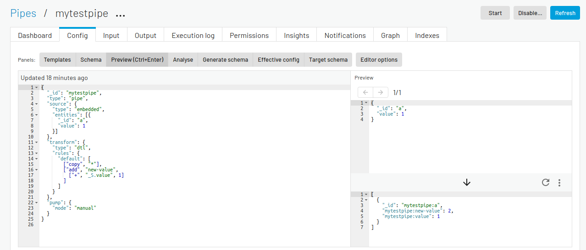
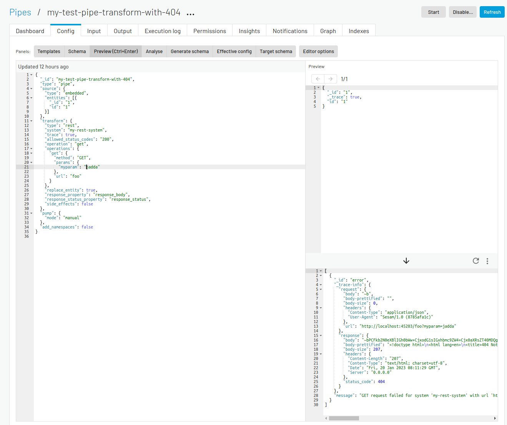
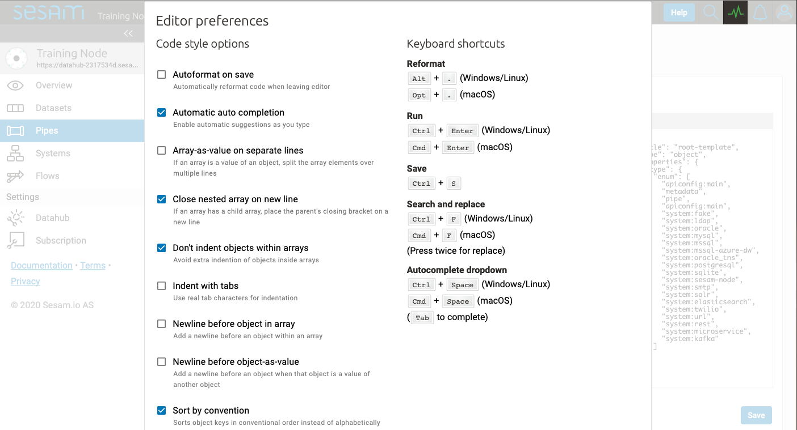
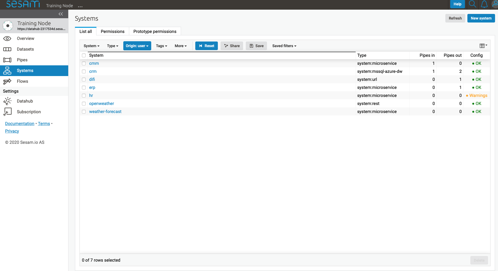
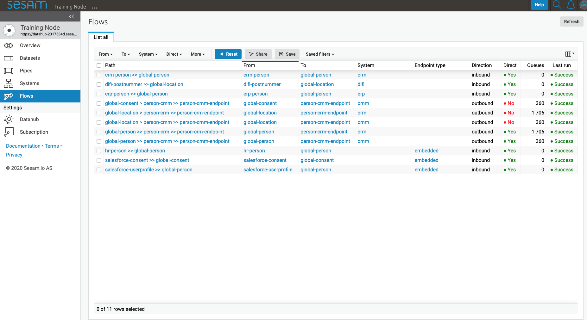
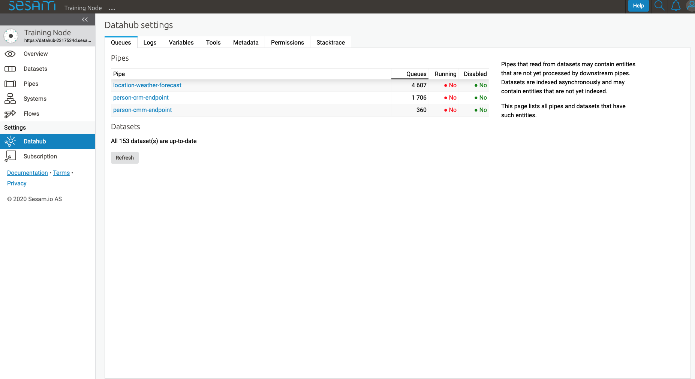

.. _sesam-management-studio:

=======================
Sesam Management Studio
=======================

.. This chapter is getting pretty lengthy. Consider splitting up in seperate files.

Introduction
============

The Sesam Management Studio is used to configure, manage and administer Sesam subscriptions.

To access the Management Studio, go to the `Sesam Portal <https://portal.sesam.io>`_ and click on the desired Sesam subscription.

There is also an `experimental version <https://beta.portal.sesam.io/>`_  where new features are introduced before they are publicly released in the main portal.

When accessing the Management Studio, the first thing that meets you is the overview page.

Overview
========

The **Overview** shows a high-level view of the integrations for the current subscription.
It shows all systems, the number of inbound and outbound pipes for each system, and an aggregated count of entities across all global datasets.

.. _management-studio-pipes:

Browse
======

Only available if :ref:`integrated_search` is enabled for the subscription.

Search
------

The Search tab allows for free-text search across all global datasets in the current subscription.

The Results will show all the entities that matches the search criteria.
Clicking on an entity in the Results will show its details on the right-hand side of the page.

You can drill down further by ``Ctrl/Cmd+clicking`` on *any* namespaced property or namespaced identifier in the selected entity.

Below the Search field you will see three lists that enables more fine tuned filtering of the search result:
Datasets, Namespaces, and Properties. The filters are inclusive so selecting multiple filters will include
entities from all selected filters.

- Filtering on Datasets will limit the result to entities from only the selected datasets.

- Filtering on Namespaces will limit the result to entities containing only the selected namespaces.

- Filtering on Properties will limit the result to entities containing only the selected properties.

Clicking on an entity identifier link in the Results,
takes you to an Identifier tab view for that specific identifier,
showing which other entities references this entity, and which other entities this entity references.

.. note::

  Some special characters may give unexpected search results.
  For instance the character "-" is interpreted by the Elasticsearch engine as a separator,
  so searching for "foo-bar" will show all entities containing "foo-bar", but also entities containing only "foo" or only "bar".

Entity types
------------

The Entity types tab shows all pipes and their inferred Model.

All pipes that have ``infer_pipe_entity_types`` enabled (which is the default behaviour) will contribute to the contents of Entity types.

.. note::

  For Developer and Developer Pro subscriptions, ``infer_pipe_entity_types`` must be enabled manually under **Datahub** > **Metadata**:
  ``"global_defaults": {
  "infer_pipe_entity_types": true
  }``.
  Then, relevant pipes must be restarted for them to contribute to Entity types.

Clicking on an Entity types takes you to a detailed view of that entity type.

The Name column in the Properties list shows all observed property keys, with namespace prefix where applicable, across all instances of this particular Entity type.

The Type column shows all inferred data types that the particular property is observed to have across all entities that contain the property.
The data types are inferred based on observed property values. If the observered values are inferred to multiple data types,
each data type is separated by a pipe character (|).

Clicking on a property key takes you to the :ref:`property_lineage` of that property.

Models
------

Model is inferred from the first part of the pipe id (prior to the first "-") and from pipes with the metadata ``"global": true``.

.. TODO

Pipes
=====

The **Pipes** page shows a list of all pipes in the current subscription.

From here you can create new pipes by clicking **New pipe** in the top right corner of the interface, and view details of existing pipes by clicking on them.

.. Would be nice to merge "New pipe" and "Pipe details" somehow and explain each part of the UI once and in proper sequence.

Whether you create a new pipe or click on an existing pipe, you will be taken to the pipe details page.
The only difference is that when creating a new pipe, you will be taken directly to the Config tab and most of the other tabs will not be available until the pipe is saved.

.. _management-studio-new-pipe:

New pipe
--------

Clicking **New pipe** takes you to the config tab of a new pipe with the Templates panel activated.

First supply a unique value for ``_id`` or the pipe cannot be saved.

 .. image:: images/new-pipe-1.png
    :width: 800px
    :align: center
    :alt: Generic pipe concept

Source template
^^^^^^^^^^^^^^^

The Source template gives easy access to the available systems that this pipe can read data from.
By selecting a system from the **System** dropdown menu, the **Provider** dropdown menu will be populated with specific options for the selected system.

Let us select the ``crm`` system and the ``person`` provider.

After selecting relevant **System** and **Provider**, click **Replace** to add the selections to the pipe config.

 .. image:: images/new-pipe-2.png
    :width: 800px
    :align: center
    :alt: Generic pipe concept

Transforms template
^^^^^^^^^^^^^^^^^^^

Next click **Add DTL transform** to add a DTL transform template to the pipe config. This is a great starting point for writing your own DTL.

  .. image:: images/new-pipe-3.png
    :width: 800px
    :align: center
    :alt: Generic pipe concept

Please visit :ref:`DTL` for more information about DTL.

Now click **Save**, and then **Start**.

To see the pipe run progress and to make sure the pipe is finished, click **Refresh**.

To see the result, click the **Output** tab.

Target template
^^^^^^^^^^^^^^^

By default all pipes write data to a ``dataset`` sink, and the dataset will be given the same id as the pipe ``_id``.
You can override this default behaviour by adding a ``sink`` config. Adding a ``sink`` config can be done with the Target template.

Similar to the Source template, select the desired target system from the **System** dropdown menu and the **Sink** dropdown menu will be populated with specific options for the selected system.

As an example, if we wanted to push data to the ``erp`` system we could select the ``erp`` system and the ``json`` sink.

After selecting a relevant sink, click **Replace** to add the selections to your pipe config.

Please visit :ref:`concepts-sinks` for more information about sinks.

Pipe details
------------

Clicking a pipe on the **Pipes** page takes you to the details of that pipe.

Clicking the **"..."** menu to the right of the pipe name will bring up various options for the pipe, explained below.

.. TODO: Update screenshot.

.. _management-studio-pipe-menu:

Pipe menu
^^^^^^^^^

.. list-table::
   :header-rows: 1
   :widths: 10, 30

   * - Function
     - Description

   * - ``Enable``
     - | The pipe will run according to its schedule.

   * - ``Disable``
     - | The pipe will not run by itself. If the pipe is already running, it will finish running but not run again. You can still manually run a disabled pipe by clicking ``Start`` or ``Restart``.

   * - ``Restart``
     - | Effectively the same as ``Reset`` and ``Start``. The pipe will reprocess all entities from its source. For more info, see :ref:`change_tracking`.

   * - ``Start``
     - | Runs the pipe. The pipe continues to read from its ``since`` value. If the pipe has previously read 100 entities (sequence 0 to 99), its ``since`` value will be 99. Clicking ``Start`` will have it read sequence 100 onwards. For more info, see :ref:`change_tracking`.

   * - ``Stop``
     - | Stops the pipe. Only available if the pipe is currently running.

   * - ``Reset...``
     - | Sets the pipe's ``since`` value to 0, effectively telling the pipe to reprocess all entities from its source next time it runs.

   * - ``Reset to end...``
     - | Sets the pipe's ``since`` value to the ``_updated`` value of the most recent source entity. This can be used to avoid processing queued entities.

   * - ``Update last seen...``
     - | Manually set the pipe's ``since`` value. This is useful if you need to reprocess a certain number of entities back in time, but not necessarily all the entities. Depending on the pipe this value can be an integer, a string, or a comma separated list of integers and/or strings. The sequence number for an entity can be found in the ``_updated`` property on the entity.

   * - ``Discard retry queue``
     - | 

   * - ``Discard inferred schema``
     - | 

   * - ``Start rescan``
     - | 

   * - ``Reset rescan``
     - | 

   * - ``Duplicate``
     - | Creates a copy of the pipe, postfixing the new pipe's ``_id`` with ``-copy``. A handy way of quickly creating a new pipe with similar config.

   * - ``Delete...``
     - | Deletes the pipe. Use with care.

   * - ``Delete sink dataset...``
     - | Deletes the pipe dataset sink and sets the ``since`` value to 0. Use with care.

   * - ``Create downstream pipe``
     - | Creates a new pipe with the current pipe's dataset sink as ``source`` and takes you to the new pipe's Config tab.

   * - ``Create outgoning flow``
     - | 

   * - ``Show flows``
     - | Takes you to the **Flows** page for the current pipe. Only available if the pipe is between a system and a global pipe.

.. TODO: Explain each tab and each panel under the Config tab.

Dashboard tab
^^^^^^^^^^^^^

.. TODO

Config tab
^^^^^^^^^^

Templates panel
~~~~~~~~~~~~~~~

.. TODO: Should the template explanation from "New pipe" be moved here for consistent ordering?

Schema panel
~~~~~~~~~~~~

Clicking the **Schema** panel shows the pipe schema on the right-hand side of the interface. The pipe schema defines valid structure for the pipe config.

.. _management-studio-pipes-preview:

Preview (Ctrl+Enter) panel
~~~~~~~~~~~~~~~~~~~~~~~~~~

Clicking the **Preview** panel shows a preview of how an entity will look after passing through the pipe.

The top right panel shows the source entity that is being used in the preview. The inital value for this entity is
picked from the pipe's source if the source-type allows it, otherwise a small sample entity is generated. You can
manually modify the source-entity and press Ctrl+Enter to preview the resulting output-entity.

If your pipe has a :ref:`REST transform <rest_transform>` or a :ref:`REST sink <rest_sink>` you can get ``trace``
information about which http requests and responses the REST components sends and receives. This is enabled by
adding a ``"_trace": true`` property to the source entity and pressing Ctrl+Enter. The example below shows how this
can look for a pipe with a rest-transform that gets a 404 "Not Found" response from the service it tries to talk to.

Analyse panel
~~~~~~~~~~~~~

.. TODO

Generate schema panel
~~~~~~~~~~~~~~~~~~~~~

.. TODO

Effective config panel
~~~~~~~~~~~~~~~~~~~~~~

.. TODO

Target schema panel
~~~~~~~~~~~~~~~~~~~

.. TODO

Editor options
~~~~~~~~~~~~~~

The **Editor options...** allows you to customize various coding styles and shows a list of keyboard shortcuts.

Feel free to experiment with these options to find what fits your preferences.

Input tab
^^^^^^^^^

Shows information about the pipe's source.

Output tab
^^^^^^^^^^

Shows information about the pipe's target.

Inferred schema tab
^^^^^^^^^^^^^^^^^^^

.. TODO

Execution log tab
^^^^^^^^^^^^^^^^^

.. TODO

Permissions tab
^^^^^^^^^^^^^^^

.. TODO

Insights tab
^^^^^^^^^^^^

.. TODO

Notifications tab
^^^^^^^^^^^^^^^^^

.. TODO

Graph tab
^^^^^^^^^

.. TODO

Indexes tab
^^^^^^^^^^^

.. TODO

Systems
=======

The **Systems** page shows a list of all systems in the current subscription.

.. _management-studio-flows:

Clicking on a system takes you to the details of that system.

.. TODO: Screenshot of system details and an explanation of the various tabs and panels.

You find seven tabs where you can manage permissions and secrets in addition to see status, see which pipes go in and out of system in graph tab and lastly get an overview.

As with pipes you can click **"..."** next to the system name and from this menu you can *duplicate* the current config or *delete* it.

Dashboard tab
-------------

.. TODO

Config tab
----------

.. TODO

Secrets tab
-----------

.. TODO

Permissions tab
---------------

.. TODO

Status tab
----------

.. TODO

Graph tab
---------

.. TODO

Overview tab
------------

.. TODO

Flows
=====
In Sesam, a *flow* can be defined as a collection of pipes on one path, either from a global to an endpoint or vice versa.

On the **Flows** page you can get information about a flow as a whole, whether any pipe is disabled/errored out, as well as you get a total number of queues in a flow, for example.

Settings
========

Lastly, Sesam has Settings for both **Datahub** and your **Subscription**.

**Datahub** settings is for managing queues, logs and permissions for your subscription. It also manages variables for various systems and metadata settings.

**Subscription** settings is for managing for instance license, JWT token and Network configs.

.. image:: images/settings_subscription.png
    :width: 600px
    :align: center
    :alt: SettingsSubscription

User accounts
=============

In order to use the Management Studio you first need to log in with your user credentials. You can either
authenticate via a third party authentication provider (as for example Google or Azure), or create
a user-account directly in the Management Studio.

Your user-account is uniquely identified by the email-address. That means that it is possible to use multiple
authentication providers to log in as the same user, as long as the user credentials from the various authentication
providers contain the same email address.

This comes with a small caveat: If you create a user-account directly in the Management Studio you are not required
to verify that the email address you specify actually exists and that you own it. That basically means that anyone can
claim to own any email-address, including addresses that actually belongs to someone else.

On the other hand: most of the third party authentication providers supplies a verified email address.

To avoid someone else to be able to log in with your email-address, the first login with a verified email-address
will disable any unverified user credentials that has been previously used. All other settings on the existing user
account will be kept, though.
