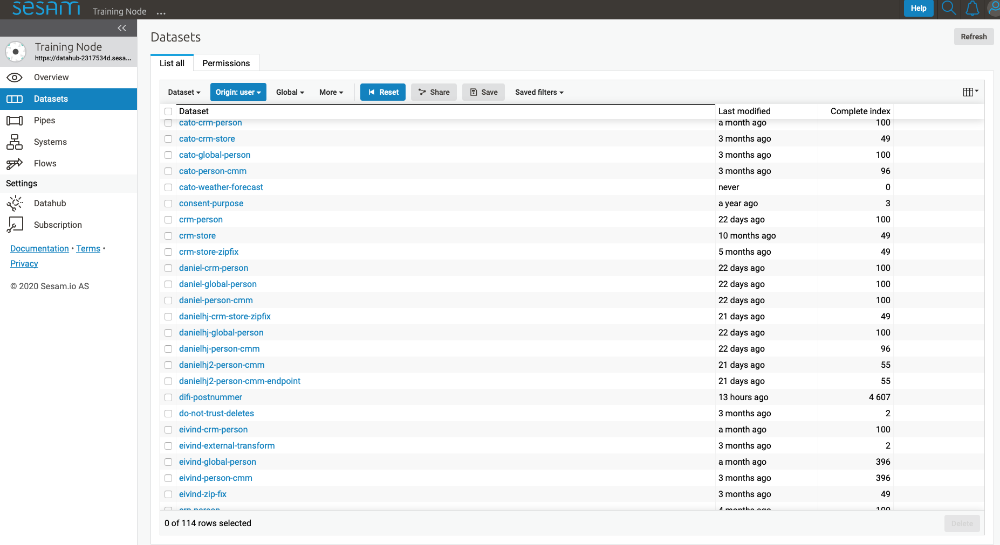
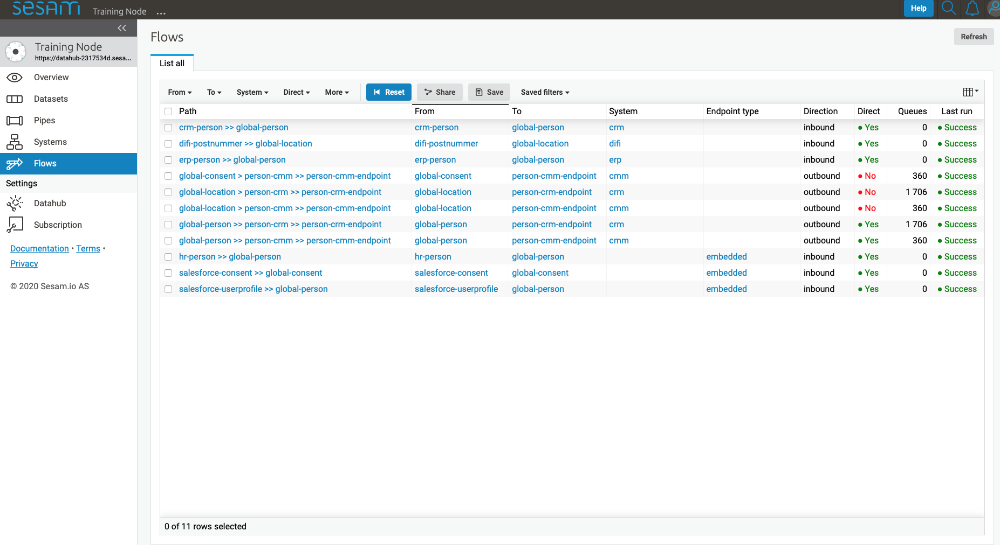
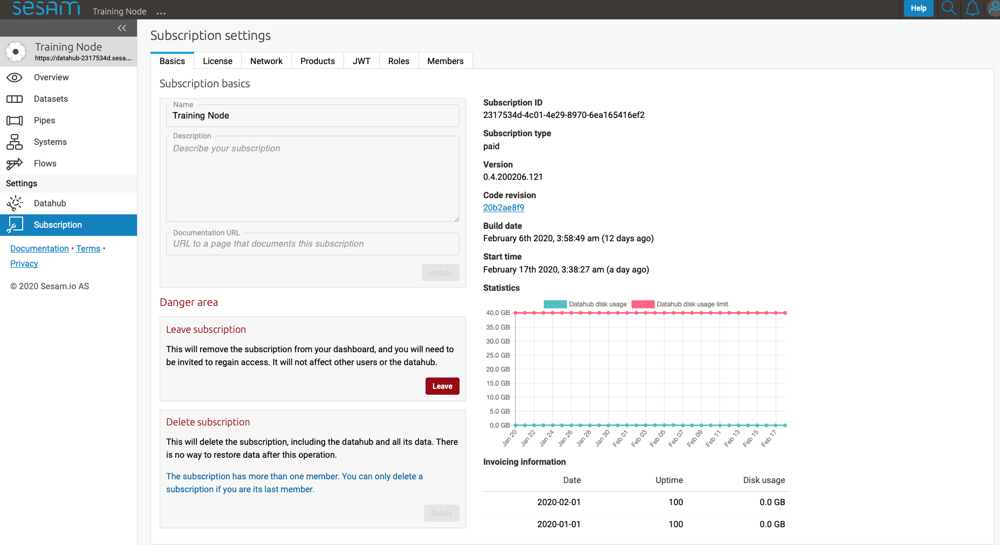

=======================
Sesam Management Studio
=======================

.. contents:: Table of Contents
   :depth: 2
   :local:

Introduction
============

Sesam Management Studio (SMS) is used to configure, manage and administer Sesam nodes.

Management studio can be found here `https://portal.sesam.io <https://portal.sesam.io>`_.

If you are familiar with the Sesam concepts then the UI should be quite intuitive.

When choosing the specific node you require, it takes you into the management studio for that node. The first thing that meets you, is the overview.

Overview
========

When pressing **Overview**, it shows the Sesam integration for the particular node you are looking at. The figure illustrates which systems are connected, number of ingoing and outgoing pipes, deleted entities and history.

.. image:: images/overview.png
    :width: 600px
    :align: center
    :alt: DataSet

Datasets
========

This contains a list of each dataset in this node. By clicking on a dataset, it takes you into the entities this dataset consists of. From here you can **“Go to pipe”** which takes you straight to pipe used to generate this dataset. You can also “delete” this dataset” by pressing **“Delete“** button. If the pipe has recently been running, you can press **“Refresh”** to get latest update. 

At the bottom of the screen you find the **“Compare”** button which allows you to compare current entity to previous version if the entity has changed.

Pressing **“...”** after the name of dataset, you get two options as seen in image below:

.. image:: images/datasets_menu.png
    :width: 600px
    :align: center
    :alt: DataSet

The option “Create a downstream pipe” means to create the next step in the dataflow. Pressing this takes you into “new pipe” with the current dataset as source. By pressing **“Go to pipe”** it takes you to the pipe that produced the current dataset. 

.. _management-studio-pipes:

Pipes
=====

The pipes page contains a list of pipes generated for a particular node. 

.. image:: images/pipes.png
    :width: 600px
    :align: center
    :alt: DataSet

Double clicking on a pipe takes you into this pipe's working area.

By pressing **"..."** to the right of the pipe name, a menu with various options appear. We are going to go through the most commonly used.

.. image:: images/pipesmenu.png
    :width: 600px
    :align: center
    :alt: DataSet

.. _management-studio-pipe-menu:

Pipe Menu
^^^^^^^^^

.. list-table::
   :header-rows: 1
   :widths: 10, 30

   * - Function
     - Description

   * - ``Start``
     - | Starts running the pipe

   * - ``Restart``
     - | Consist of two functions; reset and start. he relationship between starting and restarting pipe, requires some explanation. When clicking ``Start``, the pipe continues to read from its last seen sequence number. So, if the pipe has previously read 100 entities  (sequence 0 to 99), clicking ``Start`` will have it read from sequence 100. When clicking ``Restart``, the pipe will start from the beginning., i.e. at entiry number 0. To see examples and to get more context on this, please click :ref:`Dependency-tracking <concepts-dependency_tracking>`

   * - ``Disable``
     - | Stops the pipe from running according to schedule. If a pipe is running, it will finish running but not run again even if schedule tells it to. You can manually start a pipe that’s disabled by pressing ``Start``

   * - ``Enable``
     - | Pipe will start running again according to schedule.

   * - ``Delete``
     - | Deletes the pipe

   * - ``Duplicate``
     - | It generates a copy of the pipe. Then edit the current config and press ``Save``. This means you do not have to create a pipe from scratch

   * - ``Create downstream pipe``
     - | Automatically takes you to new pipe with current dataset as source

   * - ``Go to sink``
     - | Takes you straight to sink dataset from current pipe

   * - ``Update last seen``
     - | enables you to update the last seen index of the pipe. This is useful if you need to reprocess a certain number of entities back in time, but not necessarily all the entities. Depending on the pipe this value could either be a sequence number, a date and time value given in epoch or a list of either separated by comma. The sequence number for an entity can be found in the "_updated" property on the entity.

.. _management-studio-new-pipe:

New Pipe
^^^^^^^^

When pressing the button **"New Pipe"**, it takes you into template for generating a pipe from scratch.

First we have to add value to "_id" or pipe cannot be saved. The naming conventions of pipe or the "id" can be found here: 
:ref:`Naming conventions <getting-started-naming-conventions>`

As seen below, we have several tabs called "Panels" in Sesam. Press **"Templates"** and the available templates for each part of the pipe is available.

 .. image:: images/new-pipe-1.png
    :width: 800px
    :align: center
    :alt: Generic pipe concept

Starting at top; **"Source"** needs to be defined. Frist menu available is **"System"** and we get available options for sources.
Choose correct *source* for this pipe; .i.e. what is the source of data for this particular pipe you are working on.

Next you will choose your own node then appropriate pipe as source and in **"Provider"** (this is which table you're collecting data from) you chose "**Person"** The press **Replace** and template DTL is pasted into your config as seen below.

 .. image:: images/new-pipe-2.png
    :width: 800px
    :align: center
    :alt: Generic pipe concept

Next step is template for **transforms**. Press **Add DTL transform** and template for adding transforms to your pipe appears.

  .. image:: images/new-pipe-3.png
    :width: 800px
    :align: center
    :alt: Generic pipe concept

Please visit :ref:`DTL reference guide <DTLReferenceGuide>` for most common transforms and functions and how they are used.

All pipes have a default sink that points to / creates a dataset with the same name as the pipe. You can specify your own sink with a template if required. This is done at the bottom of template under **"Target"**. This is where we specify where want to send the data to; which :ref:`Sinks <concepts-sinks>`. This is specified in **"System"** and **"Sink"**. Press **Replace** and once again template pops into your config.

Now press **"Save"** then **"Start"**. To see progress and to make sure pipe is finished, press **"Refresh"**. To see result, go to **"Output"** tab.

To see an example please visit LINK example

Schema
^^^^^^

Next to **Templates** tab, we find **Schema**. When pressing it, the **Schema** for this pipe shows up on right hand side of interface. A **"schema"** generally tells something about the *structure of the data*, i.e. metadata. Examples of metadata that the schema shows are e.g. whether a value is a string, Boolean, or an integer (text, true / false, or number).

.. image:: images/new-pipe-schema.png
    :width: 800px
    :align: center
    :alt: Generic pipe concept

Editor Preferences
^^^^^^^^^^^^^^^^^^

The tab to the far right takes you to page where you can choose some preferences on **code style**.

As you can see below you have some choices (and short explanation on what they mean) like *"Automatic auto completion"*, *"Close nested array on new line"* amongst others. Please have a look and click on the ones you would like to implement.

To the right side of the interface there is a list of available **keyboard shortcuts** which makes working in Sesam easier. 

.. image:: images/new-pipe-editorpref.png
    :width: 800px
    :align: center
    :alt: Generic pipe concept

Systems
=======

When pressing Systems, it gives a list of various systems defined on this node. In the column called "Type" it states which type of system it is e.g. whether this is a microservice, a mssql, url or rest.

By pressing one of the systems, it takes you into the config for a particular system. You find six tabs where you can manage permissions and secrets in addition to see status, see which pipes go in and out of system in graph tab and lastly get an overview.

As with pipes and datasets, you can press "..." next to the system name and from this menu you can *delete* or *duplicate* config for the system.

.. image:: images/systems.png
    :width: 600px
    :align: center
    :alt: DataSet

.. _management-studio-flows:

Flows
=====
In Sesam, a *flow* can be defined as a collection of pipes on one path, either from a global to an endpoint or vice versa.

On the Flows page you can get information about a flow as a whole, whether any pipe is disabled/errored out, as well as you get a total number of queues in a flow, for example.

Settings
========

Lastly, Sesam has “Settings” for both Datahub and your Subscription.

Settings for datahub manages queues, logs and permissions for your node. It also manages variables for various systems and metadata settings.

.. image:: images/settings_datahub.png
    :width: 600px
    :align: center
    :alt: DataSet

For subscription Sesam has settings for e.g. license, JWT token and Network. 

User accounts
=============

In order to use the Management Studio you first need to log in with your user credentials. You can either
authenticate via a third party authentication provider (as for example Google or Azure), or create
a user-account directly in the Management Studio.

Your user-account is uniquely identified by the email-address. That means that it is possible to use multiple
authentication providers to log in as the same user, as long as the user credentials from the various authentication
providers contain the same email address.

This comes with a small caveat: If you create a user-account directly in the Management Studio you are not required
to verify that the email address you specify actually exists and that you own it. That basically means that anyone can
claim to own any email-address, including addresses that actually belongs to someone else.

On the other hand: most of the third party authentication providers supplies a verified email address.

To avoid someone else to be able to log in with your email-address, the first login with a verified email-address
will disable any unverified user credentials that has been previously used. All other settings on the existing user
account will be kept, though.

Elasticsearch [in development]
==============================
.. warning:: The data that is indexed will be available to all users!
.. warning:: This is an experimental feature and will be changed in the future.

We are in the middle of making the Dataset Inspector's free text search work with Elasticsearch. Although this feature is very experimental, it can still be tested
by having:

1. A microservice system called "elasticsearch-freetext", running Elasticsearch 7.
2. An index with the same name as the dataset you want to search.
3. Every entity as a doc in the index, with the id of the doc being the entity's _updated value.

If all of those conditions are met, the Dataset Inspector will use Elasticsearch to do the freetext search. If not, the old way of searching free text will be used.

Setting up Elasticsearch as a microservice.
^^^^^^^^^^^^^^^^^^^^^^^^^^^^^^^^^^^^^^^^^^^
Read more about the microservice system :ref:`here. <microservice_system>`

Here is a sample microservice config for Elasticsearch:
::

    {
      "_id": "elasticsearch-freetext",
      "connect_timeout": 3600,
      "docker": {
        "environment": {
          "discovery.type": "single-node"
        },
        "image": "elasticsearch:7.7.0",
        "memory": 4000,
        "port": 9200
      },
      "read_timeout": 3600,
      "type": "system:microservice"
    }

Create an index
^^^^^^^^^^^^^^^

Then next thing we want to do is to create an index with the same name as the dataset you want to search. This new index will also need some simple mappings
to work as intended. By supplying the mappings, Elasticsearch will automatically create the index, so we can do both at the same time by 
doing the following http request to the microservice system:

::

    PUT /systems/elasticsearch-freetext/proxy/{index name}
    Content-Type: application/json
    {
      "mappings": {
        "properties": {
          "__id": {
            "type":  "keyword"
          }
        }
      }
    }

.. note:: Remember to change {index name} to the name of the dataset you want to search.

Fill the index
^^^^^^^^^^^^^^

Next up we will create a pipe that will fill the newly created index with entities.

The way we willd do this is to first create a REST system that will communicate with our microservice system:

::

    {
      "_id": "elasticsearch-freetext-rest",
      "type": "system:rest",
      "headers": {
        "Content-Type": "application/json"
      },
      "operations": {
        "doc": {
          "headers": {
            "Content-type": "application/json"
          },
          "method": "POST",
          "payload-type": "json",
          "url": "_doc/{{ properties._id }}"
        }
      },
      "url_pattern": "{sub URL}/systems/elasticsearch-freetext/proxy/%s",
      "verify_ssl": true
    }

.. note:: Remember to change the {sub URL} to the URL of your subscription.

::

  {
    "_id": "{dataset}-elasticsearch-freetext-rest",
    "type": "pipe",
    "source":
    {
      "type": "dataset",
      "dataset": "{dataset}"
    },
    "sink":
    {
      "type": "rest",
      "system": "elasticsearch-freetext-rest"
    },
    "transform": [
    {
      "type": "dtl",
      "rules":
      {
        "default": [
          ["add", "properties",
            ["dict", "_id", "_S._updated"]
          ],
          ["add", "operation", "doc"],
          ["add", "payload",
            ["map-dict",
              ["if",
                ["not",
                  ["matches", "_*", "_."]
                ], "_.",
                ["concat", "_", "_."]
              ], "_.", "_S."]
          ]
        ]
      }
    }]
  }

.. note:: Remember to change {dataset} to the id of the dataset you want to search
.. note:: The dtl transforms all the system attributes to start with "__" instead of "_". This is because single underscore is reserved for internal ES attributes (such as _id). The Dataset Inspector transforms them into single underscores again when getting them from the ES index.

After running the pipe, the ES index should be filled up with the entities from the source dataset, and the Dataset Inspector should pick that up and use the index to do free text searches.

