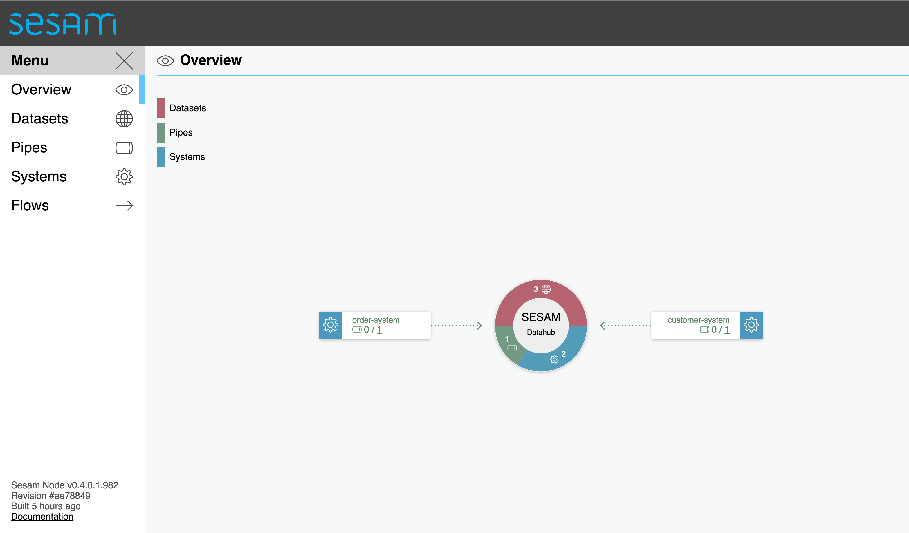
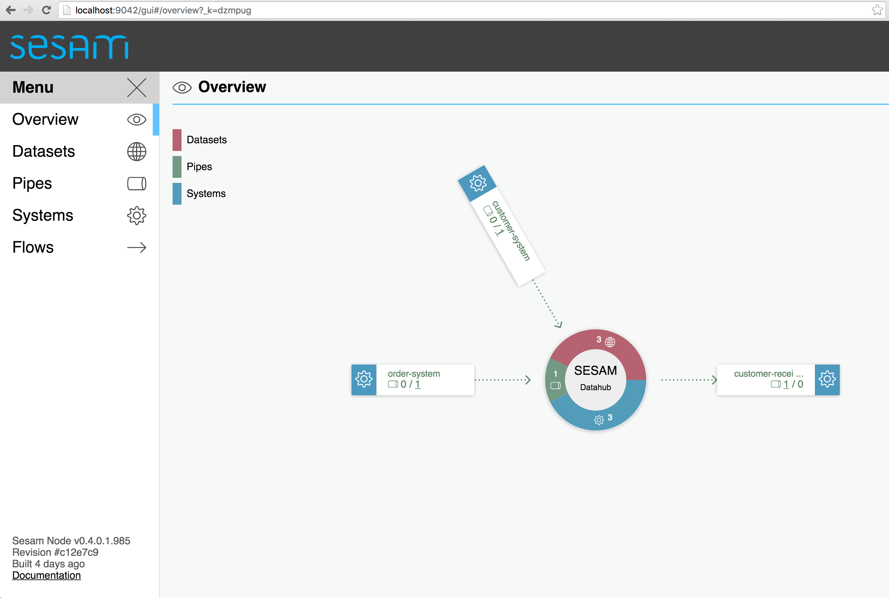

========
Overview
========

.. contents:: Table of Contents
   :depth: 2
   :local:

Introduction
------------

Sesam is a general purpose data integration and processing platform. It is optimised for collecting or receiving data from source systems, transforming data, and pushing or providing data to target systems. Sesam stores data in datasets. A dataset is a log of data entities with additional indexes for efficient random access and lookups. Data is fetched from the source systems on a regular basis and the entities are stored in the log only if they have changed from the last time the entity was seen.

Entities in the datasets can be processed using the Data Transformation Language. DTL takes a stream of entities as input and returns a new stream of transformed entities. It can join data from other datasets to create new entities. Data produced via DTL can be stored in new datasets to be exposed or sent to applications that need it.

The final piece of Sesam is to deliver data from a dataset to a sink. Sinks are used to write data into target systems or send it to service endpoints.

Sesam provides implementations for many types of sources, including relational databases and custom JSON streams. It also provides a number of core Sink implementations such as the relational database and HTTP Post sinks.

Installation
------------

You must sign up using the `Sesam Portal <https://portal.sesam.in/>`_ to install Sesam. The default installation type is a cloud based installation,
but it's also possible to install Sesam on-premise or in a local cloud environment. This document assumes a cloud based installation.

You can also access an existing Sesam installation by registering in the Sesam Portal and obtaining an invitation from the
manager of the existing installation.

Once you have have access to a running Sesam installation in the portal, you can access the Sesam Management Studio by
clicking on its name on the home page in the Portal.

License
-------

Sesam requires a valid license to function. Without a valid license the pipes will stop running.
Instructions for obtaining a valid license can be found in the `Sesam Portal <https://portal.sesam.in/>`_.
A three month trial license is available for evaluation purposes.

.. _overview-getting-started:

Getting Started
---------------

Now that you have Sesam running, lets start using it.

Pre-Requisites
==============

The following guide requires the use of Python 3.5.x/3.4.x, the Sesam client and a Git client.

On Mac OSX
^^^^^^^^^^

We recommend using HomeBrew to install the pre-requisites. The following sequence can be used to get Python3 and the Sesam client installed.

::

  # Install Homebrew
  /usr/bin/ruby -e "$(curl -fsSL https://raw.githubusercontent.com/Homebrew/install/master/install)"

  # Install Python 3
  brew install python3

  # Install Pip
  python3 -m ensurepip

  # Install the sesam client
  pip3 install -U sesamclient

See :ref:`note below <python_virtual_environment>` for how to install and run the sesam client inside a
Python virtual environment instead (i.e. instead of a system-wide install).

If you need Git it can be installed with:

::

  # Install Git
  brew install git

On Windows
~~~~~~~~~~

Python can be installed from `Python Website <https://www.python.org/downloads/>`_. Make sure you choose Python 3.5.x.

In the examples below you may need to replace 'python3' with the correct name of the locally installed python executable e.g. on Windows this will be just 'python'.

To install the SesamClient run the following:

::

  # Install the Sesam client
  pip install -U sesamclient

See :ref:`note below <python_virtual_environment>` for how to install and run the sesam client inside a
Python virtual environment instead (i.e. instead of a system-wide install).

Git client can be installed from:

::

  https://desktop.github.com/

Curl is another utility that is natively available on Mac OSX and Linux, and possible to run on windows as well.

On windows, we recommend installing a proper ``bash`` shell environment either through the
Microsoft `"Bash on Ubuntu on Windows" <https://msdn.microsoft.com/en-us/commandline/wsl/about>`_
program or by installing  `Cygwin <http://cygwin.com>`_ . You can also run a Linux distribution through a virtual machine,
for example using VMWare or VirtualBox. Finally, you can use a cloud provider such as Azure, AWS or Digital Ocean to
provision and run a Linux VM for you. We recommend a recent Ubuntu LTS distribution, but any recent distribution
that supports Python 3 (ideally 3.5+) will do.

Installing ``curl`` on a "proper" Linux is usually straight forward. Consult the documentation for your Linux distribution
for details. For Ubuntu based distributions you can issue the command::

  (sudo) apt-get install curl

You might or might not need the "sudo" command in front, depending on your privileges.

In Cygwin, the "curl" package is available through its package management GUI.

On Linux
^^^^^^^^

Python 3.4.x or 3.5.x comes as standard on most modern Linux distributions. Ensure this is installed before proceeding -
consult your distribution documentation for how to do this.

The sesam client is installed using Pip, the official python package manager.

Installing Pip:

::

  # Install pip on Ubuntu/Debian
  (sudo) apt-get install python3-pip

::

  # For other linux distributions running the latest python 3.5.x+ you can do:
  (sudo) python3 -m ensurepip

  # For other linux distributions running python 3.4.x, consult the distribution documentation
  # for how to install pip

To install the sesam client:

::

  # Install the sesam client
  (sudo) pip3 install -U sesamclient

See :ref:`note below <python_virtual_environment>` for how to install and run the sesam client inside a
Python virtual environment instead (i.e. instead of a system-wide install).

The git client can usually be installed by the distribution package manager:

::

  # On ubuntu/debian
  (sudo) apt-get install git

  # For other distributions consult the documentation

.. _python_virtual_environment:

Running in a python virtual environment
^^^^^^^^^^^^^^^^^^^^^^^^^^^^^^^^^^^^^^^

You can run the sesam client inside a python virtual environment to avoid installing this package globally.
However, to do this we need to install the ``virtualenv`` package first:

::

  # Linux
  (sudo) pip3 install virtualenv

  # OSX:
  pip3 install virtualenv

  # Windows
  pip install virtualenv

Then navigate to where you want the virtual environment to live and call:

::

  # Linux and OSX
  virtualenv --python=python3 your-venv-folder

  # Windows
  virtualenv your-venv-folder

Any time you want to use your new virtual environment in a shell prompt, you will need to initialize it:

::

  # Windows bash shell, Linux and OSX (it will be deactivated when you exit the shell session)
  source your-venv-folder/bin/activate

On windows (in CMD or Powershell):

::

  \path\to\your-venv-folder\Scripts\activate

Note that this will work both in CMD and powershell. It will be deactivated if you close your CMD or poweshell session.
You can call "deactivate" instead to deactivate the virtual environment from within the same CMD or PS shell.

Now you can install the sesam client (and other python packages) into your active virtual environment:

::

  # Linux and OSX
  pip3 install -U sesamclient

  # Windows
  pip install -U sesamclient

Download project files
======================

The Sesam service does not yet contain any configuration nor any data, so lets get hold of some. We've prepared a sample project that showcases some of the core features of Sesam. The files are hosted on GitHub.

Check out the project files using ``git``:

::

  git clone https://github.com/sesam-io/tutorial sesam-tutorial
  cd sesam-tutorial/intro

The project contains three files:

* ``sesam.conf.json`` is the configuration file.
* ``customers/customers.json`` contains customer data.
* ``orders/orders.json`` contains order data.

::

  $ ls -l
  drwxr-xr-x  3 nobody  wheel   102 Jun  2 11:48 customers
  drwxr-xr-x  3 nobody  wheel   102 Jun  2 09:49 orders
  -rw-r--r--  1 nobody  wheel  1921 Jun  2 09:50 sesam.conf.json

  $ ls -l customers/
  -rw-r--r--  1 nobody  wheel  269 Jun  2 09:49 customers.json

  $ ls -l orders/
  -rw-r--r--  1 nobody  wheel  505 Jun  2 09:49 orders.json

Serve data files
================

To serve the data files to a Sesam cloud installation, you will either need to upload them to a publically visible web server
or configure the Sesam installation to use VPN and set up a VPN connection from your local network. See <somewhere> for
more details on this process.

There are various alternative ways to share the data with the Sesam cloud installation. We've included some options
below.

Serving data files from Github
^^^^^^^^^^^^^^^^^^^^^^^^^^^^^^

Create a user and log into `Github <https://github.com>`_ . Create a new public repo. Follow the instructions on Github
and upload the ``customers.json`` and ``orders.json`` files to this repo either through the web GUI or using a git
client on your local machine. Once uploaded, navigate to the files in a web browser and locate the "raw" button
on the page displaying the contents of the files. Copy the URL from the address bar of the browser and use this to
subsitute the "http://YOUR-IP-HERE:8000/orders/" and "http://YOUR-IP-HERE:8000/customers/" URLs in the ``sesam.conf.json``
file.

Serving data files from Google drive
^^^^^^^^^^^^^^^^^^^^^^^^^^^^^^^^^^^^

Upload the ``customers.json`` and ``orders.json`` files to Google drive. From inside the Google drive client
or the Google drive web page, locate the "share" menu and get hold of the "share url" link. The link will be on the form:

::

  https://drive.google.com/file/d/file-id-here/view?usp=sharing

Copy the contents of the "file-id-here" segment of the URL and construct a new "direct" URL that is on the form:

::

  https://drive.google.com/uc?id=file-id-here

Repeat this process and substitute the "base_url" properties containing the "http://YOUR-IP-HERE:8000/orders/" and
"http://YOUR-IP-HERE:8000/customers/" URLs in the ``sesam.conf.json`` file for both of the uploaded files with the
appropriate constructed direct URL.

Verify data contents
====================

Now we're serving the ``customers.json`` and ``orders.json`` files through a web server. Look at what's being
served by running the following ``curl`` command. Alternatively you can open the URLs in your web browser.

::

  $ curl http://url-to-customers-json-file-on-public-webserver-google-drive-or-github
  [
      {"_id": "1",
       "first_name": "John",
       "last_name": "Smith",
       "age": 42},
      {"_id": "2",
       "first_name": "Maria",
       "last_name": "Hawkins",
       "age": 32},
      {"_id": "3",
       "first_name": "Pam",
       "last_name": "Curie",
       "age": 21}
  ]

::

  $ curl http://url-to-orders-json-file-on-public-webserver-google-drive-or-github
  [
      {"_id": "1000",
       "customer_id": "1",
       "items": [
           {"ean": "978-1852493110", "price": 22.10, "quantity": 2 }
       ],
       "discount": 4.20},
      {"_id": "1001",
       "customer_id": "1",
       "items": [
           {"ean": "978-0937381939", "price": 73.50, "quantity": 1 },
           {"ean": "978-0060005719", "price": 10.40, "quantity": 1 }
       ]},
      {"_id": "1002",
       "customer_id": "2",
       "items": [
           {"ean": "978-0195367133", "price": 39.95, "quantity": 1 }
       ]}
  ]

As you can see, the JSON files all contain arrays of objects, aka :doc:`entities <entitymodel>`.

Import the configuration file
=============================

Now that the ``sesam`` tool is installed we can use it to import the configuration file using the Sesam API.

Setting the base url
^^^^^^^^^^^^^^^^^^^^

The api will be served on the url you find on the management studio "settings" page under the "Connection url" heading.
For a cloud instance it will typically be on the form "https://instance-guid.sesam.cloud/api".

You can register this URL with the Sesam client using the ``config`` command:

::

    sesam config server.base_url https://instance-guid.sesam.cloud/api

Or you can supply the URL to all commands using a ``--server_base_url https://instance-guid.sesam.cloud/api`` argument.

Authenticating with the Sesam installation
^^^^^^^^^^^^^^^^^^^^^^^^^^^^^^^^^^^^^^^^^^

Before you can issue any sesam client commands to the Sesam instance, you need to first authenticate yourself:

::

  sesam login (--server_base_url https://instance-guid.sesam.cloud/api)

It will prompt you for a username and password, download a `JWT token <https://jwt.io/>`_ and store it locally. All subsequent
Sesam client commands will then use this token (until it expires).

You can now import your configuration file to the Sesam instance:

::

  $ sesam import sesam.conf.json (--server_base_url https://instance-guid.sesam.cloud/api)
  Read 5 config entities from these config-files:
   sesam.conf.json

If the configuration file is not valid JSON it will be rejected by the server. This command imports the
``sesam.conf.json`` :doc:`configuration file <configuration>` into the Sesam service instance via its
`service API <api.html>`_ running at ``https://instance-guid.sesam.cloud/api``. As you can see from the output, five
configuration entities were imported. Of those, three are `pipes <concepts.html#pipes>`_ and two are
`systems <concepts.html#systems>`_.

The configuration file contains two `pipes <concepts.html#pipes>`_ that read data from ``customers.json`` and  ``orders.json``.
Each JSON file consists of an array of :doc:`entities <entitymodel>`. The pipes pump the entities into datasets
called ``customers`` and ``orders`` respectively.

There is also a third pipe that reads the ``customers`` dataset and applies a :doc:`DTL <DTLReferenceGuide>` transform
on the data. The transform will collect the orders for each customer, calculate the total sum for each order and the
total sum for each customer. Customers with total order sum of less than 25.00 are filtered out.
The resulting entities are then written to the ``customers-with-orders`` dataset.

If you now look at the Sesam Management Studio you'll now see that there are two systems,
``order-system`` and ``customer-system``. They both point towards the *datahub*, which means that the data is flowing in that direction.

Let's look at the data
======================

When pipe configuration is imported into Sesam it will schedule their pumps. It will then start running the pumps at
regular intervals. Use the links below to introspect the datasets. Replace ``localhost`` with the hostname of Sesam service instance.

See the contents of the ``customers`` dataset here:

.. parsed-literal::

  `<https://instance-guid.sesam.cloud/api/datasets/customers/entities>`_

::

  $ curl -s https://instance-guid.sesam.cloud/api/datasets/customers/entities | python3 -m json.tool
  [
      {
          "_deleted": false,
          "_hash": "96a224b5a726e512329924148906c7f9",
          "_id": "1",
          "_previous": null,
          "_ts": 1464862200576348,
          "_updated": 0,
          "age": 42,
          "first_name": "John",
          "last_name": "Smith"
      },
      {
          "_deleted": false,
          "_hash": "e93d14baf12d457cd095c852535b5e61",
          "_id": "2",
          "_previous": null,
          "_ts": 1464862200576496,
          "_updated": 1,
          "age": 32,
          "first_name": "Maria",
          "last_name": "Hawkins"
      },
      {
          "_deleted": false,
          "_hash": "833e9ce9bd1d70546f934cd505e09c54",
          "_id": "3",
          "_previous": null,
          "_ts": 1464862200576636,
          "_updated": 2,
          "age": 21,
          "first_name": "Pam",
          "last_name": "Curie"
      }
  ]

See the contents of the ``orders`` dataset here:

.. parsed-literal::

  `<https://instance-guid.sesam.cloud/api/datasets/orders/entities>`_

::

  $ curl -s https://instance-guid.sesam.cloud/api/datasets/orders/entities | python3 -m json.tool
  [
      {
          "_deleted": false,
          "_hash": "9f941366206e74c4e3ff583665bad61e",
          "_id": "1000",
          "_previous": null,
          "_ts": 1464862211437648,
          "_updated": 0,
          "customer_id": "1",
          "discount": "~f4.20",
          "items": [
              {
                  "ean": "978-1852493110",
                  "price": "~f22.10",
                  "quantity": 2
              }
          ]
      },
      {
          "_deleted": false,
          "_hash": "f9e5976f46173bc95847def79eaf22f8",
          "_id": "1001",
          "_previous": null,
          "_ts": 1464862211437926,
          "_updated": 1,
          "customer_id": "1",
          "items": [
              {
                  "ean": "978-0937381939",
                  "price": "~f73.50",
                  "quantity": 1
              },
              {
                  "ean": "978-0060005719",
                  "price": "~f10.40",
                  "quantity": 1
              }
          ]
      },
      {
          "_deleted": false,
          "_hash": "ce51eccc66843a0d156c6c9742c428e7",
          "_id": "1002",
          "_previous": null,
          "_ts": 1464862211438129,
          "_updated": 2,
          "customer_id": "2",
          "items": [
              {
                  "ean": "978-0195367133",
                  "price": "~f39.95",
                  "quantity": 1
              }
          ]
      }
  ]

The customer and order data read into Sesam ended up in two datasets, ``customers`` and ``orders``. When entities are
written into the dataset some extra metadata properties are added. You can see these in the output above.
They all start with and underscore character ("``_``").

* ``_id``: This is the *primary key* of the entity. It is always a string.
* ``_deleted``: A boolean flag that says if the entity is deleted or not.
* ``_hash``: A hash signature value that is generated from the entity data. This hash is used to find out if the entity has changed or not. When writing to a dataset only actual changes are written to it, so if the hash is the same then the entity is not updated.
* ``_ts``: A real-world timestamp saying when the entity was added to the dataset (in milliseconds since January 1st).
* ``_updated``: The sequence number of the entity in the dataset.
* ``_previous``: A pointer to the sequence number of the previous version of the entity. In our example data these are all ``null`` because we have not made any changes yet.

Transformed output
==================

After a little while, when the datasets are loaded and the ``customers-with-orders`` pump has run, you should be able to see the end result in the ``customers-with-orders`` dataset:

.. parsed-literal::

  `<https://instance-guid.sesam.cloud/api/datasets/customers-with-orders/entities>`_

::

  $ curl -s https://instance-guid.sesam.cloud/api/datasets/customers-with-orders/entities | python3 -m json.tool
  [
      {
          "_deleted": false,
          "_hash": "6dc1762b8a10fef2c3f21e42adebfa97",
          "_id": "1",
          "_previous": null,
          "_ts": 1464862214782937,
          "_updated": 0,
          "name": "John Smith",
          "order_count": 2,
          "orders": [
              {
                  "items": [
                      {
                          "ean": "978-0937381939",
                          "price": "~f73.50",
                          "quantity": 1
                      },
                      {
                          "ean": "978-0060005719",
                          "price": "~f10.40",
                          "quantity": 1
                      }
                  ],
                  "total": "~f83.90"
              },
              {
                  "discount": "~f4.20",
                  "items": [
                      {
                          "ean": "978-1852493110",
                          "price": "~f22.10",
                          "quantity": 2
                      }
                  ],
                  "total": "~f40.00"
              }
          ],
          "total": "~f123.90",
          "type": "customer"
      },
      {
          "_deleted": false,
          "_hash": "938545634032901188497db3c621a5ba",
          "_id": "2",
          "_previous": null,
          "_ts": 1464862214783137,
          "_updated": 1,
          "name": "Maria Hawkins",
          "order_count": 1,
          "orders": [
              {
                  "items": [
                      {
                          "ean": "978-0195367133",
                          "price": "~f39.95",
                          "quantity": 1
                      }
                  ],
                  "total": "~f39.95"
              }
          ],
          "total": "~f39.95",
          "type": "customer"
      }
  ]

It may also be useful to see what the entities look like before they are transformed, i.e. what they look like when read from the pipe's source:

.. parsed-literal::

  `<https://instance-guid.sesam.cloud/api/pipes/customers-with-orders/entities?transformed=false>`_

You can also see the data as it is written to the pipe's sink. These entities have been read from the source and put through the DTL transform:

.. parsed-literal::

  `<https://instance-guid.sesam.cloud/api/pipes/customers-with-orders/entities>`_

Adding a new order
==================

The Sesam service will reload the data files at regular intervals, so any edits you make to it will be picked up automatically.
The pipes defined in the configuration will pump at regular intervals, so edits to ``customers.json`` and ``orders.json``
will also be reflected in the datasets. If you edit the configuration file, then you must reimport it.

Let's add a new order for the customer with id ``2`` (Maria Hawkins). Open ``orders.json`` in your favourite text editor
and add the following at the end of the JSON array:

::

    {"_id": "1003",
     "customer_id": "2",
     "items": [
         {"ean": "978-0295332333", "price": 19.95, "quantity": 1 }
     ]}

If you uploaded your files to Github or Google Drive, you will need to make sure the changes are commited/reuploaded.
If using a regular web server, you must transfer the changed files to the server.

After updating the data files and the ``orders`` pump has run we can then see that the new order has been added to the ``orders`` dataset:

::

  $ curl -s https://instance-guid.sesam.cloud/api/datasets/orders/entities | python3 -m json.tool
  [
      ...,
      {
          "_deleted": false,
          "_hash": "ab2a87d29ac4f6ead83e6e954e1f65e9",
          "_id": "1003",
          "_previous": null,
          "_ts": 1464936747758861,
          "_updated": 3,
          "customer_id": "2",
          "items": [
              {
                  "ean": "978-0295332333",
                  "price": "~f19.95",
                  "quantity": 1
              }
          ]
      }
  ]

What happens next is a little piece of magic. Sesam does something called `dependency tracking <concepts.html#dependency-tracking>`_.
It figures out that Maria Hawkins has received a new order, and that her ``customers`` entity must be reprocessed.
Dependency tracking adds her existing ``customers`` entity to the head of the dataset with ``_tracked`` property set to
``true``. It is able to do this because it can infer it from the DTL transformation rules in the ``customers-with-orders`` pipe.

::

  $ curl -s https://instance-guid.sesam.cloud/api/datasets/customers/entities | python3 -m json.tool
  [
      ...,
      {
          "_deleted": false,
          "_hash": "e93d14baf12d457cd095c852535b5e61",
          "_id": "2",
          "_previous": 1,
          "_tracked": true,
          "_ts": 1464936749252271,
          "_updated": 3,
          "age": 32,
          "first_name": "Maria",
          "last_name": "Hawkins"
      }
  ]

The result of this is then that the entity is processed by the ``customers-with-orders`` pipe, effectively reprocessing
the customer entity. The result of this will then look like this:

::

  $ curl -s https://instance-guid.sesam.cloud/api/datasets/customers-with-orders/entities | python3 -m json.tool
  [
      ...,
      {
          "_deleted": false,
          "_hash": "938545634032901188497db3c621a5ba",
          "_id": "2",
          "_previous": null,
          "_ts": 1464862214783137,
          "_updated": 1,
          "name": "Maria Hawkins",
          "order_count": 1,
          "orders": [
              {
                  "items": [
                      {
                          "ean": "978-0195367133",
                          "price": "~f39.95",
                          "quantity": 1
                      }
                  ],
                  "total": "~f39.95"
              }
          ],
          "total": "~f39.95",
          "type": "customer"
      },
      {
          "_deleted": false,
          "_hash": "ded8824e5ec508efc6bbbc036afa052e",
          "_id": "2",
          "_previous": 1,
          "_ts": 1464936772791645,
          "_updated": 2,
          "name": "Maria Hawkins",
          "order_count": 2,
          "orders": [
              {
                  "items": [
                      {
                          "ean": "978-0195367133",
                          "price": "~f39.95",
                          "quantity": 1
                      }
                  ],
                  "total": "~f39.95"
              },
              {
                  "items": [
                      {
                          "ean": "978-0295332333",
                          "price": "~f19.95",
                          "quantity": 1
                      }
                  ],
                  "total": "~f19.95"
              }
          ],
          "total": "~f59.90",
          "type": "customer"
      }
  ]

The end result is that Maria Hawkins now has *two* orders. The ``total`` property has also been updated to reflect the
fact that there is a new order. Note also that the ``_previous`` property now has a value. It points back to the
previous version of the entity. This way Sesam can track the history of entities.

Pushing data out of Sesam
=========================

There are two ways that you can get the data out of Sesam. One way is to pull it out yourself by using the Service API.
The other way is to have Sesam push it to an external service.

In this section we'll set up a Python HTTP server that can accept entities pushed to it. The received entities will be
written to individual files in a directory. The project is written in Python3 using the `Flask web framework <http://flask.pocoo.org/>`_.

Note that the python webservice we install must be reachable over the internet, i.e. via a
"http(s)://myservice.domain.com:port/" URL so the Sesam cloud instance can reach it. If you don't have access to such
a server, you can provision a pre-packaged or custom VM using a cloud provider such as Azure, AWS or Digital Ocean, or
wrap and deploy it as a custom Docker image using a Microservice hosting provider such as
`sloppy.io <https://sloppy.io>`_ (free trial available).

We will assume we're running on a publicly visible server for the rest of this section.

First we'll have to checkout the project files using ``git``:

::

  git clone https://github.com/sesam-io/python-datasink-template
  cd python-datasink-template

Next we'll have to install the project's dependencies:

::

   pip3 install -r service/requirements.txt

Now start up the service:

::

  $ python3 service/datasink-service.py
   * Running on http://0.0.0.0:5001/ (Press CTRL+C to quit)
   * Restarting with stat
   * Debugger is active!
   * Debugger pin code: 260-787-156

The service is listening on port 5001 - make sure this port is open in the firewall. Entities pushed to it will be
written to the ``./received`` directory.

Next we'll have to define a pipe that reads the ``customers-with-orders`` dataset and writes the entities to
a `JSON push sink <configuration.html#the-json-push-sink>`_. Add the following at the end of ``sesam.conf.json``.
Replace the ``YOUR-IP_HERE`` token with the IP address or fully qualified domain name (FQDN) of your machine.

::

      {
          "_id": "customer-receiver-system",
          "type": "system:url",
          "base_url": "http://YOUR-IP-HERE:5001/"
      },
      {
          "_id": "push-customers-with-orders",
          "type": "pipe",
          "source": {
              "type": "dataset",
              "dataset": "customers-with-orders"
          },
          "sink": {
              "type": "json",
              "system": "customer-receiver-system",
              "url": "receiver"
          }
      }

Save the file and run the following command to import the updated configuration:

::

  $ sesam import sesam.conf.json
  Read 7 config entities from these config-files:
   sesam.conf.json

If the configuration file is not valid JSON it will be rejected by the server. In the overview page in the Sesam Management
Studio you should now see that there are three systems. The new one has an arrow pointing out of the Datahub.

Within 30 seconds or so you'll see some activity in the service's console:

::

  $ python3 service/datasink-service.py
   * Running on http://0.0.0.0:5001/ (Press CTRL+C to quit)
   * Restarting with stat
   * Debugger is active!
   * Debugger pin code: 260-787-156
  Writing entity "1" to file '/private/tmp/python-datasink-template/received/1.json'
  Writing entity "2" to file '/private/tmp/python-datasink-template/received/2.json'
  10.1.100.41 - - [06/Jun/2016 08:16:16] "POST /receiver?is_first=true&is_full=true&request_id=1&sequence_id=d5b42172-b193-450a-b1f8-bdae59ee140b HTTP/1.1" 200 -
  10.1.100.41 - - [06/Jun/2016 08:16:16] "POST /receiver?is_full=true&request_id=2&sequence_id=d5b42172-b193-450a-b1f8-bdae59ee140b&previous_request_id=1&is_last=true HTTP/1.1" 200 -

As you can see, two entities have been pushed to it. Note that even though we have three entities in the
``customers-with-orders`` dataset, we only received two of them. By default the ``dataset`` source will not hand out
old versions of entities. If you want all versions of entities pushed, set the ``include_previous_versions`` property to
``true`` on the ``dataset`` source. The ``dataset`` source will by default only hand out incremental changes.
If you want all entities to be handed out on every pump run then set the ``supports_since`` property to ``false``.
Any changes to ``customers-with-orders`` will be pushed to the service shortly after they appear.

::

  $ ls -l received/
  -rw-r--r--  1 nobody  wheel  960 Jun  6 08:16 1.json
  -rw-r--r--  1 nobody  wheel  769 Jun  6 08:16 2.json

  $ cat received/2.json
  {
      "_deleted": false,
      "_hash": "ded8824e5ec508efc6bbbc036afa052e",
      "_id": "2",
      "_previous": 1,
      "_ts": 1464936772791645,
      "_updated": 2,
      "name": "Maria Hawkins",
      "order_count": 2,
      "orders": [
          {
              "items": [
                  {
                      "ean": "978-0195367133",
                      "price": "~f39.95",
                      "quantity": 1
                  }
              ],
              "total": "~f39.95"
          },
          {
              "items": [
                  {
                      "ean": "978-0295332333",
                      "price": "~f19.95",
                      "quantity": 1
                  }
              ],
              "total": "~f19.95"
          }
      ],
      "total": "~f59.90",
      "type": "customer"
  }

If you want to learn more about how to extend and integrate with Sesam, see the :doc:`Developer Extension Points <extension-points>` document.

Make your own edits
===================

You may want to try to do some other edits to the data files or the configuration file yourself. Try editing any of the files and see what happens.

Examples:

* Change the name of "Maria Hawkins" to something else, and see that she gets updated in the ``customers`` and
``customers-with-orders`` datasets, and that we then gets pushed to your service once more.
* Add a new customer. Then add a new $99 order for that customer. That customer will then get pushed to your service.

What to do next?
================

First, we strongly recommend reading the :doc:`concepts section <concepts>` to understand the Sesam way of thinking.
Then, there are three main things to 'do' with Sesam; get data in the hub, transform data, and get it out to other systems.

To get more data into the hub take a look at the source component types that are natively supported.
The :doc:`configuration <configuration>` section details the source component types and how to configure them.

If you don't see one here that you need then you can also create your own simple service to expose JSON data that can be
consumed by Sesam. The documentation on :doc:`developer extension points <extension-points>` has more examples and links
to templates for C#, Node.js, Java and Python.

If you are looking to transform data into new shapes, or validate it against schema rules, please take a look at the
different kinds of transforms that can be used in a pipe. :doc:`DTL <DTLReferenceGuide>` is a very powerful language
that can reshape, and connect data from multiple datasets.

Finally, when you have data you want to deliver out to other systems or just expose for them to consume it you can use
the sink components. The :doc:`configuration <configuration>` has documentation on all the natively supported sinks.
Again, if there is not a sink for a system you have it is straight forward to set up Sesam to push data to a
custom service.
