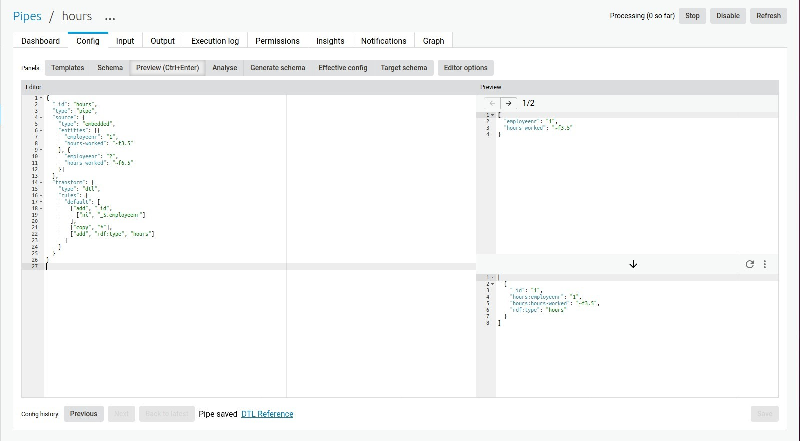
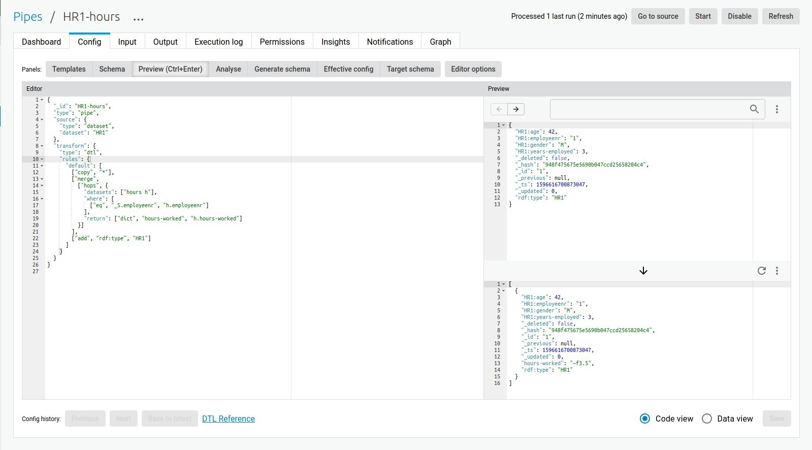
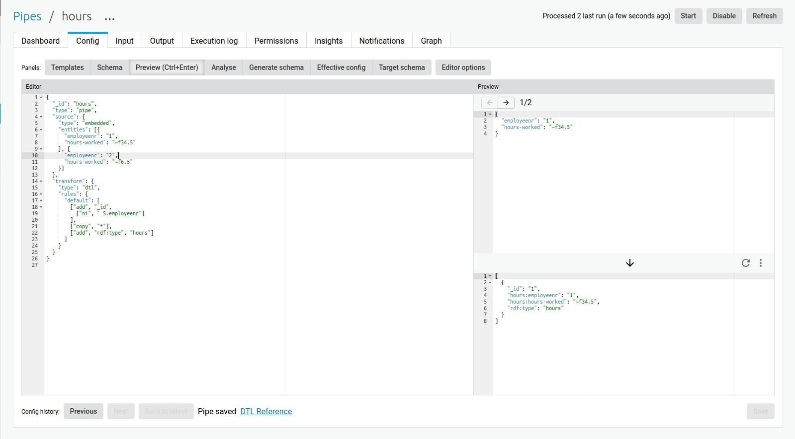
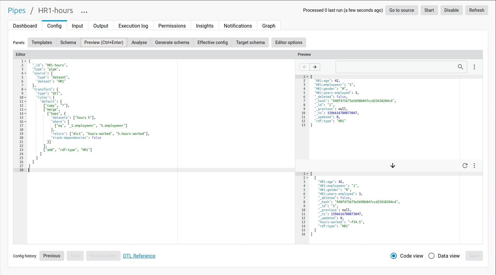
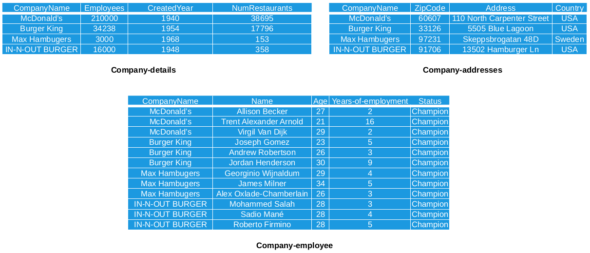
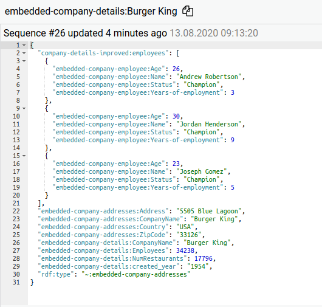

.. _project-exercises:

=================
Project exercises
=================

.. contents:: Table of Contents
   :depth: 2
   :local:

Dependency tracking differences
===============================

In this exercise we will assimilate

   * How dependency tracking is used inside of Sesam 
   * Effect of having it *activated* vs *not activated*

.. admonition:: info
   
   You can read more about dependency tracking here [link to Akanksha’s and Tarjei’s text]

*Why is dependency tracking needed?*
The motivation behind dependency tracking is to make sure that we never process more data than what is needed inside Sesam. Thus ensuring that it is updated when related data outside the main flow changes. 
  
To illustrate, let's say we have two different systems providing employee information; an Employee personal information system and a Time sheet management system. We want to create a main flow that processes employee personal information between these two systems. In addition to the information from these two systems, we might want to connect logged working hours originating from yet another system. To do this we connect the logged working hours data to the data processed between the two HR systems

|

.. graphviz::
    :align: center

    digraph D {
      node [style=rounded]
      rankdir=LR
    
      A [label="{Hours Worked |{empid = 1 | hours = 37.5}}" shape=record fontname="Sans serif" fontsize="10" color="steelblue4" fontcolor="steelblue4"]
      B [label="{Employee\nInformation | {empid = 1 |personal\ndata}}" shape=record fontname="Sans serif" fontsize="10" color="steelblue4" fontcolor="steelblue4"]
      C [label="{{empid = 1 | hours = 37.5}}" shape=record fontname="Sans serif" fontsize="10" color="steelblue4" fontcolor="steelblue4"]

      A -> C [style=solid arrowhead=vee color=steelblue4]
      B -> C [style=solid arrowhead=vee color=steelblue4]  
    }
  
| 

But what if a person changes their working hours? How can we make sure that the resulting data is kept up-to-date with connected data outside the main data flow? 

|

.. graphviz::
    :align: center

    digraph D {
      node [style=rounded]
      rankdir=LR
      align= center
    
      A [label="{Hours Worked |{empid = 1 | hours = 40}}" shape=record fontname="Sans serif" fontsize="10" color="steelblue4" fontcolor="steelblue4"]
      B [label="{Employee\nInformation | {empid = 1 |personal\ndata}}" shape=record fontname="Sans serif" fontsize="10" color="steelblue4" fontcolor="steelblue4"]
      C [label="{{empid = 1 | hours = 40}}" shape=record fontname="Sans serif" fontsize="10" color="steelblue4" fontcolor="red"]

      A -> C [style=solid arrowhead=vee color=steelblue4]
      B -> C [style=solid arrowhead=vee color=steelblue4]
    }

|

In the example below we will show the effects of both keeping and not keeping dependency tracking on your data. Below you will find three scripts. Instead of fetching data from an external system we will simply use embedded data.
The first two pipes creates the source data for logged working hours for two employees as well as personal information data from the same employees. First we create the ’hours’ pipe.

.. raw:: html

   

   
<a>hours</a>
<i>Copy the code into a new pipe in your Sesam dev-node and start it.</i>

.. code-block:: python

  {
    "_id": "hours",
    "type": "pipe",
    "source": {
      "type": "embedded",
      "entities": [{
        "employeenr": "1",
        "hours-worked": "~f7.5"
      }, {
        "employeenr": "2",
        "hours-worked": "~f6.5"
      }]
    },
    "transform": {
      "type": "dtl",
      "rules": {
        "default": [
          ["add", "_id",
            ["ni", "_S.employeenr"]
          ],
          ["copy", "*"],
          ["add", "rdf:type", "hours"]
        ]
      }
    }
  }
.. raw:: html

   

The second pipe, ’HR1’, contains personal information data from two employees.

.. raw:: html

   

   
<a>HR1</a>
<i>Copy the code into a new pipe in your Sesam dev-node and start it.</i>

.. code-block:: python

  {
    "_id": "HR1",
    "type": "pipe",
    "source": {
      "type": "embedded",
      "entities": [{
        "age": 42,
        "employeenr": "1",
        "gender": "M",
        "years-employed": 3
      }, {
        "age": 36,
        "employeenr": "2",
        "gender": "F",
        "years-employed": 7
      }]
    },
    "transform": {
      "type": "dtl",
      "rules": {
        "default": [
          ["add", "_id",
            ["ni", "_S.employeenr"]
          ],
          ["copy", "*"],
          ["merge",
            ["hops", {
              "datasets": ["hours h"],
              "where": [
                ["eq", "_S.employeenr", "h.employeenr"]
              ],
              "return": ["dict", "hours-worked", "h.hours-worked"]
            }]
          ],
          ["add", "rdf:type", "HR1"]
        ]
      }
    }
  }
.. raw:: html

   

The third pipe connects these two resulting datasets through a :ref:`hops <hops_function>` where we match data based on employeenr. We use the data from ’HR1’ as our master data. 

.. raw:: html

   

   
<a>HR1-hours</a>
<i>Copy the code into a new pipe in your Sesam dev-node and start it.</i>

.. code-block:: python

  {
    "_id": "HR1-hours",
    "type": "pipe",
    "source": {
      "type": "dataset",
      "dataset": "HR1"
    },
    "transform": {
      "type": "dtl",
      "rules": {
        "default": [
          ["copy", "*"],
          ["merge",
            ["hops", {
              "datasets": ["hours h"],
              "where": [
                ["eq", "_S.employeenr", "h.employeenr"]
              ],
              "return": ["dict", "hours-worked", "h.hours-worked"]
            }]
          ],
          ["add", "rdf:type", "HR1"]
        ]
      }
    }
  }
.. raw:: html

   

From the results from pipe ’HR1-hours’ you will see that in addition to the employee personal data we now also have working hour data from the 'hours' dataset. 
Now, if we change the value of the hours-worked for employee number 1 inside the pipe ’hours’ and start the pipe, we will see the resulting output for ’hours’ being updated.

We would also expect that the data resulting from pipe ’HR1-hours’ also changes if we start that pipe again, since its dependent data is updated. Indeed this is the case. 

The reason for the ’HR1-hours’ output being updated after we start the pipe again is because dependency tracking is by default turned on for every :ref:`hops <hops_function>` inside Sesam. 

For the purpose of this exercise we can see what happens if we turn dependency tracking off inside ’HR1-hours’. We do this by adding the line **"track-dependencies": false** inside the :ref:`hops <hops_function>`. 

.. raw:: html

   

   
<a>HR1-hours</a>

.. code-block:: python

  {
    "_id": "HR1-hours",
    "type": "pipe",
    "source": {
      "type": "dataset",
      "dataset": "HR1"
    },
    "transform": {
      "type": "dtl",
      "rules": {
        "default": [
          ["copy", "*"],
          ["merge",
            ["hops", {
              "datasets": ["hours h"],
              "where": [
                ["eq", "_S.employeenr", "h.employeenr"]
              ],
              "return": ["dict", "hours-worked", "h.hours-worked"],
              "track-dependencies": false
            }]
          ],
          ["add", "rdf:type", "HR1"]
        ]
      }
    }
  }

.. raw:: html

   

We can now simulate yet an other updated 'hours-worked' value to employee 1 inside the ’hours’ pipe and start it.

If we start the pipe ’HR1-hours’ again, we will see that the pipe does not register that the connected data outside the main data flow has changed. The old value for ’hours-worked’ for empolyee 1 still remains. Dependency tracking is not turned off, which means the pipe does not register that the related data we try to access through the :ref:`hops <hops_function>` function has changed.

Exercise
--------

Create three embedded source pipes based on the following tables:

Note that there is no '_id' column, which embedded entities need inside Sesam. You must therefore add this to the embedded data for each entity to enable Sesam to process them.

For the pipe containing the data from 'company-addresses', in the transform, overwrite the '_id'-value to be the concatination of 'CompanyName' and the string value of the :ref:`current time stamp <now_dtl_function>`. The reason for this is to simulate a constantly updated entity, since every time you run the pipe all entities will be new entities. This means that every time you run this pipe, there will always be new entities in the outcome, even though the data itself has not changed.

Next create an intermediate pipe based on the dataset from the embedded-customer-details output. Inside this pipe you should use the :ref:`hops <hops_function>` function to merge the data from embedded-customer details with the data from embedded-customer-addresses and with the data from embedded customer-employee. 

The **goal** of this exercise is to create a pipe which only processes the minimum needed entities to ensure a up-to-date output. The final result for 'Burger King' should look similar to this, and the scripts should incoorporate different ways of implementing the :ref:`track-dependencies <hops_function>` tag.

