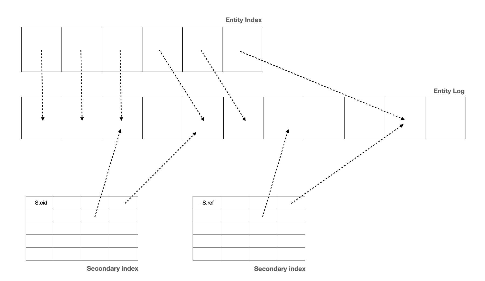

.. _concepts-datasets:

Datasets
========

A dataset is the basic means of storage inside Sesam. A dataset is a log of :ref:`entities <entity-data-model>` supported by primary and secondary indexes. Entities are written to datasets by pipes that use the :ref:`dataset sink <dataset_sink>`.

Datasets support :ref:`change tracking <change_tracking>` by using content hashing, which means that an entity is appended to the log only if it is new or it is different from the previous version of the same entity.

The :ref:`dataset source <dataset_source>` exposes the entities from datasets so that they can be streamed through :ref:`pipes <concepts-pipes>`. Datasets provide full :ref:`continuation support <continuation_support>` as the main data structure is a log the source can read from. Datasets also support a feature called :ref:`deletion tracking <deletion_tracking>`, which means that entities are automatically deleted when they are no longer returned by the pipe's source.

.. _concepts-indexes:

Secondary Indexes
-----------------

Maintenance of secondary indexes is fully automated by Sesam. Indexes are implicitly declared when you reference a join expression on two dataset in :ref:`hops <hops>`, in :ref:`subset <concepts-subsets>` definitions or when you explicitly define them on the :ref:`dataset sink <dataset_sink>`. For :ref:`hops <hops>` the indexes are used to perform :ref:`joins <joins>` between datasets. For subsets the index is used to expose a subset of entities on the dataset as if it was a dataset inside a dataset.

:: NOTE

   Orphaned indexes must be deleted in the user interface or via the API currently.

.. _concepts-subsets:

Subsets
-------

A dataset can divided and exposed as a number of subsets. The subset behaves just like another dataset and can thus be used as one in dataset sources and hops.

It is worth noting that subsets are a lot more than just indexes on individual properties. They can be described as any valid index expression, so in practice they are functional indexes. Almost all :ref:`DTL expression functions <quickref_dtl_expression_functions>` are supported except those that are non-deterministic or references other datasets. You can use them to slice a dataset into any subset that you need as long as there is data in the entities to define it.

Subsets are currently implemented via secondary indexes on datasets, and in practice that means that you can use an indexed value (a property value, a boolean, a partition id etc.) as if it was a dataset. In practice one secondary index can provide one subset per indexed value, i.e. index key. For example if the index expression returned a boolean value there would be two subsets: ``true`` and ``false``, and if it returned a `Norwegian postal number <https://en.wikipedia.org/wiki/Postal_codes_in_Norway>`_ (``0000``-``9999``) there would be 10.000 subsets.
