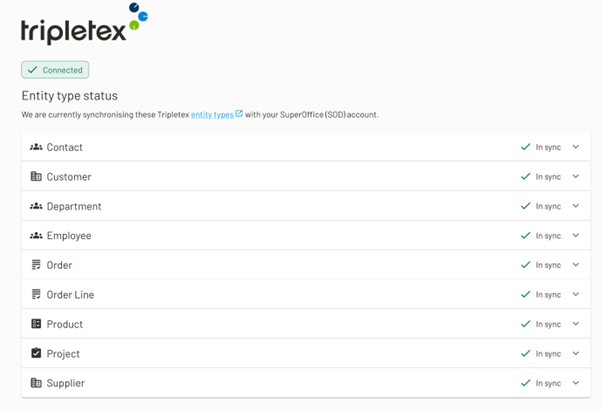
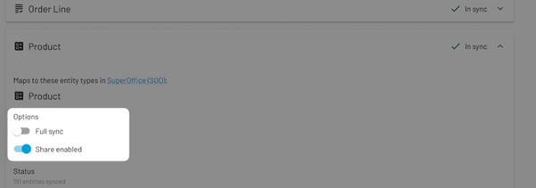

##########
Sesam Talk
##########

Sesam Talk is a Universal Semantic Data Synchronization service created and operated by Sesam.io. It leverages our extensive expertise in data synchronization and data modeling and is built on top of the proven Sesam Data Hub technology. Sesam Talk offers an innovative solution for synchronizing data across multiple cloud services, specifically developed for SaaS companies and their users. This is a complete managed service that includes everything from migration and setup to user interface customization, operations, and support. Sesam Talk enables users to synchronize data between different :doc:`systems <systems/index>` in a simple way, without the need for IT intervention or technical expertise. The solution is designed to provide users with a user-friendly and risk-free way to handle data synchronization, contributing to an improved user experience and increased adoption rates of SaaS platforms. 

 

The Data Synchronization service combines the proven and powerful Sesam.io DataHub with automation and best practices to provide consumers of SaaS applications with improved data quality and consistency across their platform. 

 

Data Synchronization Across All Systems
========================================
Integrations between systems have been available for decades, but due to the inherent complexity, effort, and cost involved in setting up integrations between two or more systems, this has largely been reserved for larger organizations. 
With Sesam Talk, SaaS consumers can achieve similar outcomes with close to zero complexity, effort, and cost compared to traditional integration projects. This is made possible by Sesam Talk's utilization of the same data model for all its consumers, regardless of system type or brand. This means that Sesam Talk can enable the synchronization of Customer Data, Products, Orders, and more across CRM, Webshop, and ERP/accounting systems within 2-3 minutes. 

 

 

Selective data synchronization
===============================
Selective data synchronization eliminates the need to process and transfer entire datasets, focusing solely on the modified or new data elements

Unlike traditional methods that synchronize all data indiscriminately, this innovative technique focuses on synchronizing only the data that undergoes changes. More details about Selective data synchronization can be found `here <https://docs.sesam.io/talk/selective-data-sync/index.html>`_. 

 

Onboarding
===========
Onboarding of systems is done via the Sesam Talk Management Console. 
To onboard your systems, you first need to create a Sesam Talk user by providing your email address and password. Once you have created a user and logged in to the Management Console, you can select the system(s) you want to onboard for data synchronization. Sesam Talk will not collect any data until you have connected two or more systems to the Sesam Talk service. The duration of the onboarding and initial data collection depends on the amount of data residing in each of your systems and the system type(s) you connect. Typically, it takes anywhere from 20 to 60 minutes before data begins to propagate from one system to others. 

 

System Data Types and Synchronization Settings
===============================================

Once you have initiated the onboarding of your systems, you can view the synchronization status of the different data types associated with each system. 

 
Expanding one of the data types also gives you access to the datatype-specific toggles for this specific system. 

 

#. Toggle “Full Sync”: 

    When turned on, this toggle allows all data of the selected datatype to be written to this system, regardless of when the data was created. For example, turning it on in the Tripletex Product example above would result in all products created in the other systems connected to Sesam Talk being synced to Tripletex. Turning it off allows only data created after the time of the onboarding of this system to propagate, meaning no “historical” products would sync to Tripletex, and only products created after the onboarding would sync. 

 

#. Toggle “Share Enabled”: 

    This toggle allows you to prevent data of the selected datatype from propagating to this system by switching the toggle off. Sesam Talk will still read data from the system (used to update other systems), but data created or changed in other systems would not propagate to the system where you turn this off. 

 

Syncronisation Latency 
=======================
The time it takes for a new or a changed data object to propagate to another system is dependent on the different systems APIs and whether or not the system has Webhooks. 
Changes in systems that can notify Sesam Talk about new data using Webhooks, will be available in other systems within a few seconds. 
Where Webhooks are not available we rely on reccuring scans for changes to the data.
The reccurance shedules are system and data-type dependent. 

 

.. toctree::
   :hidden:

   Supported systems <systems/index>
   Concepts <concepts>
   Enhanced Data Security <enhanced-data-security/index>
   Becoming a partner <partner/index>
   Service Level Objective <legal-slo>
   Help <help>
