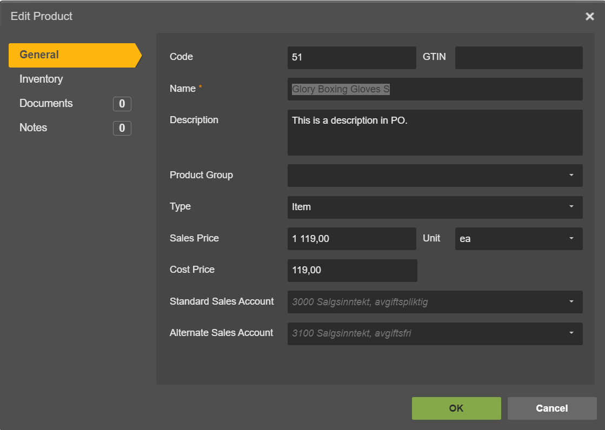

.. _talk_poweroffice:

Poweroffice
===========

`PowerOffice <https://poweroffice.no>`_ is an all-in-one business solution. It is a cloud-based software that allows small and medium businesses to manage their accounting, invoicing, payroll, and human resources.

Contact support@sesam.io if you want to learn more about this offering.

How to find your PowerOffice Client Key
---------------------------------------
In order to connect your PowerOffice account to Sesam Talk you need to create a Client Key in PowerOffice. Simply follow these steps to create one:

#. Login to your PowerOffice account
#. Navigate to **Menu** then click on **Settings**
#. Under System, click **Extensions**
#. Click on **Add Extension**
#. Pick **Custom** from the Extension menu
#. Paste this key in the Application Key field : **109b9cac-bafd-45f0-a996-94169765502c**
#. Copy your Client Key and store it somewhere
#. Use the Client Key when you connect your PowerOffice to Sesam Talk, as shown bellow

|

.. image:: images/poweroffice-client-key.png
    :width: 800px
    :align: left
    :alt: PowerOffice Client Key 

|

Frequently Asked Questions
--------------------------

Why is Product data not in sync with PowerOffice?
*************************************************

Make sure you have selected **Standard Sales Account** for your products in PowerOffice.

#. Navigate to **Settings** in PowerOffice
#. Click on a **Invoice Settings**
#. Click on **Sales Accounts** on left menu
#. Make sure you have selected an account for **Standard Sales Account**

Why can I not see my CRM companies and contacts?
************************************************

Companies and contacts in CRM will only sync to PowerOffice if they are associated or involved with a closed/won deal.

Make sure that the companies and contacts you are trying to synchronise are not duplicated in PowerOffice.

My contact person is not being synched over to PowerOffice
**********************************************************

Your contact person might already exist in PowerOffice, and is associated with another customer. We identify contacts by their emails, so if the email is the same as another contact person, the data will be merged, and you will not see your contact flow as you would expect.

.. Note ::

    Contact persons may have different names across systems. It is important to verify whether the contact you are attempting to synchronise shares the same email address as any other contact present in PowerOffice.

In PowerOffice a contact person can only be associatied with one customer at a time. That means that in order to associate this contact with another company, you need first to remove it from the customer he is currently associated with.

To delete a contact person association to a customer you can do the following:

#. Find the customer associated with your contact person
#. Click on **Contact Persons** on the left menu once on the customer card
#. Select the contact person you want to remove and click **Remove**