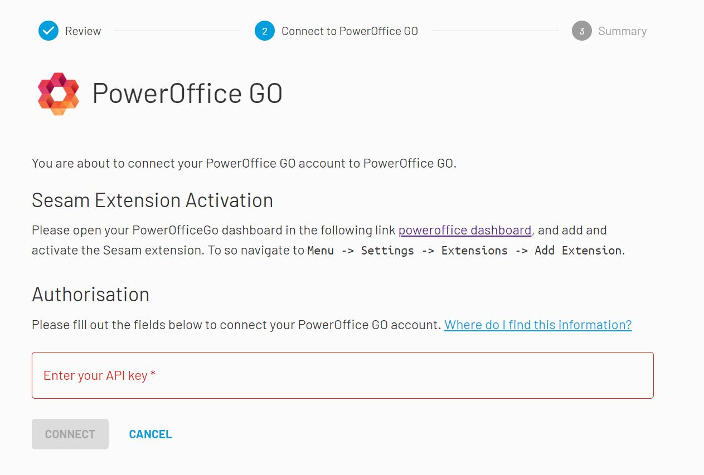

.. _talk_poweroffice:

Poweroffice
===========

`PowerOffice <https://poweroffice.no>`_ is an all-in-one business solution. It is a cloud-based software that allows small and medium businesses to manage their accounting, invoicing, payroll, and human resources.

Contact support@sesam.io if you want to learn more about this offering.

How to find your PowerOffice Client Key
---------------------------------------
In order to connect your PowerOffice account to Sesam Talk you need to create a Client Key in PowerOffice. Simply follow these steps to create one:

#. Login to your PowerOffice account
#. Navigate to **Menu** then click on **Settings**
#. Under System, click **Extensions**
#. Click on **Add Extension**
#. Pick **Custom** from the Extension menu
#. Paste this key in the Application Key field : **109b9cac-bafd-45f0-a996-94169765502c**
#. Copy your Client Key and store it somewhere
#. Use the Client Key when you connect your PowerOffice to Sesam Talk, as shown bellow

|

|

.. panels::
    :column: col-lg-12 p-2 

    **FAQ**
    ^^^^^^^

    .. dropdown:: **Why is Product data not in sync with PowerOffice**
       
        Make sure you have selected **Standard Sales Account** for your products in PowerOffice.

        #. Navigate to **Products** in PowerOffice
        #. Click on a product from the list
        #. Make sure you have selected an account for **Standard Sales Account**

    .. dropdown:: **I can not see my CRM companies and contacts in PowerOffice**
        
        Companies and contacts in CRM will only sync to PowerOffice if they are associated or involved with a closed/won deal.

        Make sure that the companies and contacts you are trying to synchronise are associated with a closed or won deal in your CRM.
