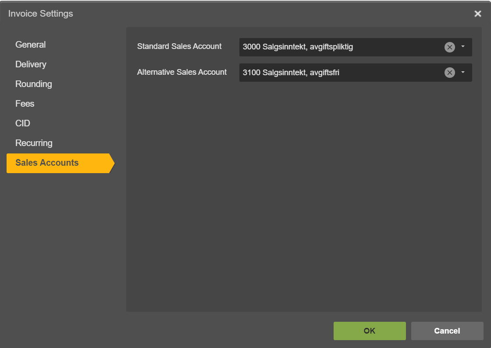

.. _talk_poweroffice:

Poweroffice
===========

`PowerOffice <https://poweroffice.no>`_ is an all-in-one business solution. It is a cloud-based software that allows small and medium businesses to manage their accounting, invoicing, payroll, and human resources.

Contact support@sesam.io if you want to learn more about this offering.

How to find your PowerOffice Client Key
---------------------------------------
In order to connect your PowerOffice account to Sesam Talk you need to create a Client Key in PowerOffice. Simply follow these steps to create one:

#. Login to your PowerOffice account
#. Navigate to **Menu** then click on **Settings**
#. Under System, click **Extensions**
#. Click on **Add Extension**
#. Pick **Custom** from the Extension menu
#. Paste this key in the Application Key field : **109b9cac-bafd-45f0-a996-94169765502c**
#. Copy your Client Key and store it somewhere
#. Use the Client Key when you connect your PowerOffice to Sesam Talk, as shown bellow

|

|

Frequently Asked Questions
--------------------------

Why is Product data not in sync with PowerOffice?
*************************************************

Make sure you have selected **Standard Sales Account** for your products in PowerOffice.

#. Navigate to **Settings** in PowerOffice
#. Click on a **Invoice Settings**
#. Click on **Sales Accounts** on left menu
#. Make sure you have selected an account for **Standard Sales Account**

Why can I not see my CRM companies and contacts?
************************************************

Companies and contacts in CRM will only sync to PowerOffice if they are associated or involved with a closed/won deal.

Make sure that the companies and contacts you are trying to synchronise are associated with a closed or won deal in your CRM.

What to Expect When Connecting Your PowerOffice to Your CRM
***********************************************************

Contacts
^^^^^^^^

- **PowerOffice Contacts:** All contacts in your PowerOffice will sync to your CRM as contacts.

- **CRM Contacts:** Only contacts associated with a closed/won deal will synchronize to your PowerOffice.

- **Merging of Contacts:** Contacts will merge if they share the same email.

Customers/Companies
^^^^^^^^^^^^^^^^^^^

- **PowerOffice Customers:** All PowerOffice customers will sync to CRM as companies.

- **CRM Customers/Companies:** Only customers/companies associated with a closed/won deal will synchronize to your PowerOffice.

- **Merging of Customers/Companies:** Companies will not merge unless safe merging criteria are met.

.. admonition:: **Example**

   HubSpot lacks a unique field to confirm that two companies are the same. In such cases, we avoid merging companies, which may result in occasional duplicates. For guidance on avoiding duplicates, refer to :ref:`avoid_duplicates`.

Invoices
^^^^^^^^

- **PowerOffice Invoices:** All closed or won deals in your CRM will generate invoices/drafts in your PowerOffice, along with associated data such as company, contact, products, and line items.

Products
^^^^^^^^

- **PowerOffice Products:** All products will synchronize with CRM products.
- **CRM Products:** All products will synchronize with CRM products.

- **Merging of Products:** Products will not merge unless safe merging criteria are met.

.. admonition:: **Example**

   HubSpot may lack a unique field to confirm identical products. Consequently, we avoid merging products, occasionally resulting in duplicates. For guidance on avoiding duplicates, refer to :ref:`avoid_duplicates`.

.. _avoid_duplicates:

Avoiding Duplicates in Your PowerOffice
^^^^^^^^^^^^^^^^^^^^^^^^^^^^^^^^^^^^^^^

To prevent duplicates when merging isn't safe, we've disabled `Full Sync`, the synchronization of pre-existing data in the systems before connecting them. This means only new data flows between connected systems. You can enable `Full Sync` at any time in the management console `Management Console <https://talk.sesam.io>`_  to synchronize all records across connected systems.

In case of duplicates in HubSpot, we recommend using the deduplication service on your HubSpot account to `merge records <https://knowledge.hubspot.com/crm-setup/merge-records#:~:text=You%20can%20merge%20two%20companies,and%20associations%20from%20both%20records>`_.

