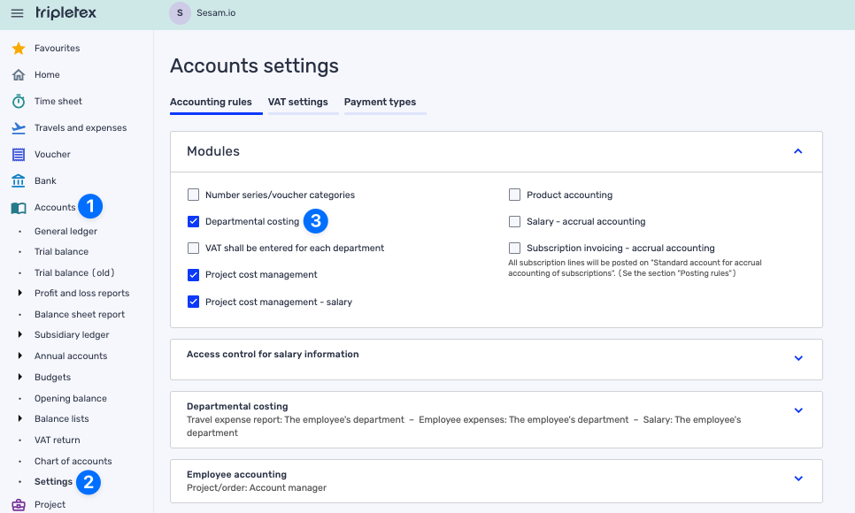

.. _talk_superoffice:

SuperOffice
===========

`SuperOffice <https://www.superoffice.com/>`_ is a CRM system, combining all customer-facing processes – sales, marketing and customer service – into one technology stack.

Contact support@sesam.io if you want to learn more about this offering.

|

Frequently Asked Questions
--------------------------

Why isn´t the account manager from my SuperOffice syncing over to Tripletex?
****************************************************************************

To sync the Account Manager from SuperOffice to Tripletex, please enable **Departmental costing** in Tripletex, as the Account Manager needs to be synched as an employee within a department. Follow these steps in order to enable **Departmental costing** in Tripletex:

Why aren't my SuperOffice "Sales" syncing with ERP?
***************************************************

For a SuperOffice 'Sale' to be considered an order by Talk (and consequently synced to ERP), it must be in the 'Sales Stage Sold' and include an Accepted/Sold Quote alternative. The easiest way to achieve this is by using the 'Place Order' button in SuperOffice and selecting 'Mark sale as sold'.

Why do I sometimes have to re-authorise?
****************************************

SuperOffice uses a token concept called SOTicket, which will expire if it's not used every 6 hours. If Sesam Talk is having operational issues that last more than 6 hours, the token will expire and the user will have to re-authorise to provide us with a new valid token. For more information see `SuperOffice System User <https://docs.superoffice.com/en/authentication/online/auth-application/index.html?tabs=rest>_`.
