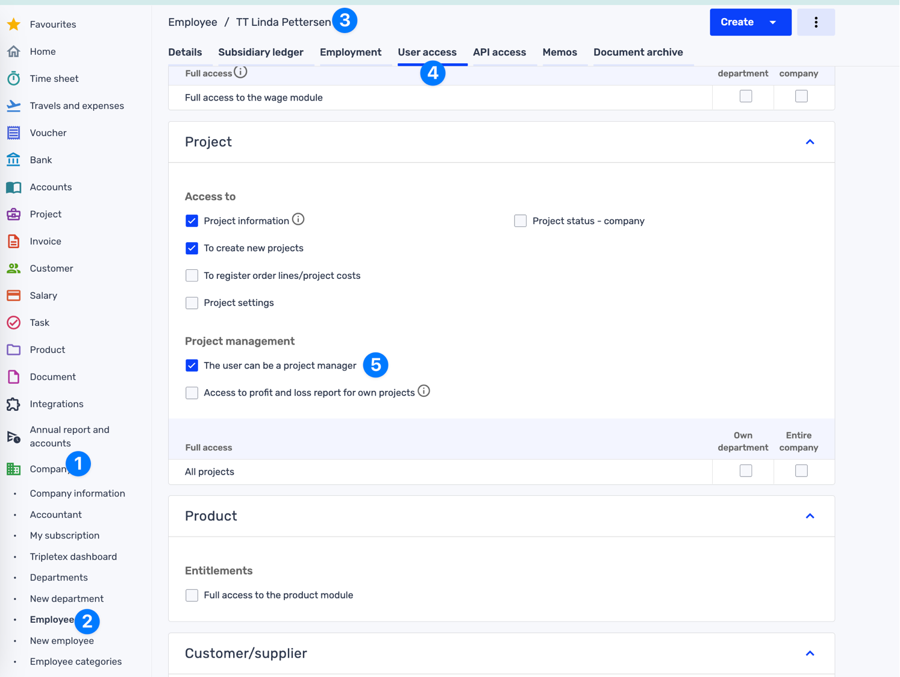

.. _talk_tidsbanken:

Tidsbanken
==========

`Tidsbanken <https://www.tidsbanken.no/>`_ is a Norwegian SaaS for time tracking and more.

Contact support@sesam.io if you want to learn more about this offering.

Frequently Asked Questions
--------------------------

Why aren’t my Projects synced from Tidsbanken to Tripletex?
***********************************************************

In order to insert a Project into Tripletex, the employee assigned as responsible/project manager needs to have been granted Project Manager permissions in Tripletex.

In Tripletex you need to:

#. Select “Company”
#. Select “Employees”
#. Select the Employee you want to give Project Manager permission
#. Select the “User Access” Tab
#. Enable  “The user can be a project manager”

