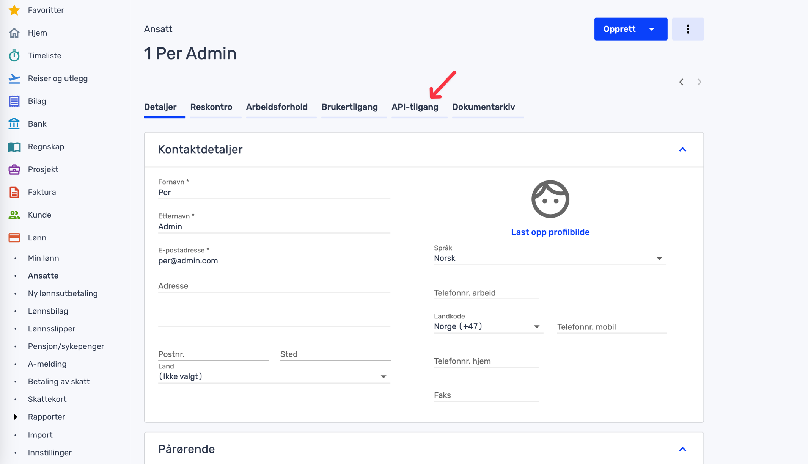
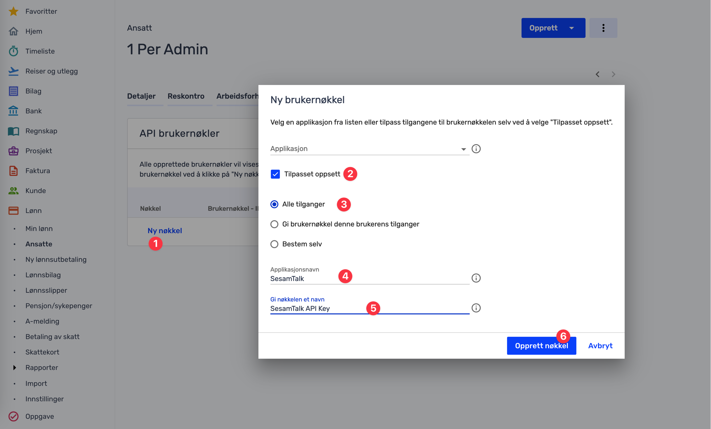
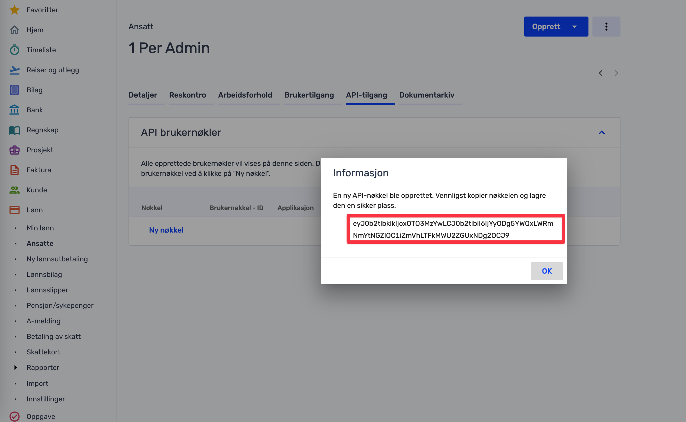

.. _talk_tripletex:

Tripletex
=========
 
`Tripletex <https://tripletex.no>`_ is a simple-to-use modular accounting system that helps businesses deal with invoicing, salaries, timetracking, yearly reports and more.

.. panels::
    :body: text-left
    :container: container-lg pb-3
    :column: col-lg-6 col-md-6 col-sm-6 col-xs-12 p-2

    **Making Tripletex Talk**

    Easily synchronise valuable data between Tripletex and your other systems.
    
    |
    
    .. link-button:: https://tripletex.talk.market
        :type: url
        :text: Try for free
        :classes: btn-primary btn-block

Find your employee token
------------------------
 .. note::
    This applies for Tripletex “production accounts” only.

The employee token can be created by the account administrator in Tripletex under the User Settings page, then in the tab "API access" 

Follow these steps to create your employee token:

#. Enable integrations in Tripletex
#. Navigate to the API-access tab and create a new key choose tilpasset oppset/adapted setup
#. Choose All entitlements and write "SesamTalk" into application name field
#. Name your token
#. Go back and paste the employee token into the API Key field in Sesam Talk

.. image:: images/TT-API1.png
    :width: 800px
    :align: left
    :alt: Choose Company/Selskap

.. image:: images/TT-API2.png
    :width: 800px
    :align: left
    :alt: Select a admin user

For more information please `read this documentation <https://hjelp.tripletex.no/hc/en/articles/4409557117713>`_.

Using test accounts in Tripletex
--------------------------------
If you wish to connect a Tripletex test account, follow this link and follow the `instructions <https://api.tripletex.io/execute/integrationEnvironment?site=en>`_.

At the end of this wizard you will be provided with your employee and consumer token as part of creating the test account. 
These tokens are required for the Sesam Talk onboarding of your Tripletex test account.

Tripletex merge criteria
------------------------
This section covers the different merge criterion in use Sesam Talk for Tripletex data. For more information about the concept, please read the section about :ref:`merging`.

Customers
*********
For customers the following merge criteria is used:

* email  
* organizationnumber

Suppliers
*********
For suppliers the following merge criteria is used:

* email  
* organizationnumber

Contacts
********
For contact the following merge criteria is used:

* email

Employees
*********
For employees the following merge criteria is used:

* email
* employeeNumber
* nationalIdentityNumber

Frequently Asked Questions
--------------------------

Why aren't line-items showing in a Tripletex order?
***************************************************
Tripletex does not allow multiple products to have the same name. This means that if a new product from the CRM system has the same name as an existing product in Tripletex we are not allowed to create this new product in Tripletex. This means we are not able to insert the order line with the product reference as it depends on the product being created to obtain that reference.

There are two ways to work around this problem:

#. Change the name of the CRM product to something that does not exist in Tripletex already.

or

#. Add enough information in the CRM product (if the system supports this) so that it merges with an existing product in Tripletex.
