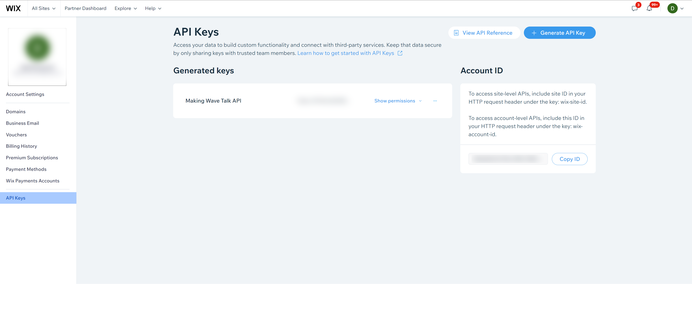
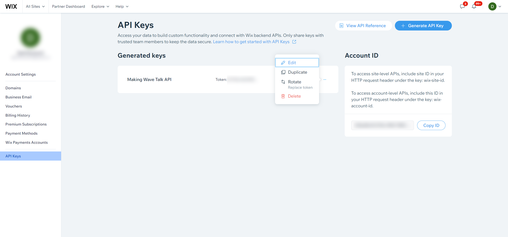

.. _talk_wix:

Wix
===

`Wix <https://wix.com>`_ website builder offers a complete solution from enterprise-grade infrastructure and business features to advanced SEO and marketing tools–enabling anyone to create and grow online.

Find your API key
-----------------

To connect your Wix account you need to create an API-key. 

Follow these steps to generate an API-key for Wix
*************************************************

.. note::
	You need to be the **owner** on your Wix site to be able to create a new API-key.

	If you don't have direct access to the site, request the key and the account ID from the site owner.

#. On your Wix account. Open the `Wix API Keys Manager <https://manage.wix.com/account/api-keys>`_ 
#. Click Create API-Key
#. In the Name field write the name of the API-Key, for example: Making Wave Talk.
#. Under **All site permissions** choose **Wix Stores** and **Wix Contacts & Members**.
#. Follow the steps and once you get your API-Key, also called key's token, Copy it and store it somewhere.
#. Get back to `The onboarding process <https://talk.sesam.cloud/onboarding/wix/connect>`_ 
#. Follow the steps and paste your generated API-Key.

Find your Wix Site ID
---------------------

The site ID for a current site can be obtained from the site URL in your browser. For example, the site ID appears after the **/dashboard/** part of this URL:

Frequently Asked Questions
--------------------------

Why are my ERP orders not created in Wix?
*************************************************

The Wix API does not allow general updates of orders, so we do not write any orders as we are not able to keep them in sync after creation.

We are looking into using the new Wix E-commerce API to provide this functionality in future releases.

Why aren’t the Product descriptions synchronized to/from Wix?
**************************************************************

The Wix Product description property is intended to be used for large amounts of text and HTML formatting in order to look good in the web shop and is not supported in the Sesam Talk Model, nor in the CRM/ERP systems containing Products.

Why aren’t Shipping Cost and Discount synchronized from Wix?
************************************************************* 

Shipping Cost and Discount is not yet supported by the solution on Wix orders. If you require this, please reach out to us so that we can understand your requirements and look to support this.

How do I edit the API permissions?
************************************

If you want to edit the permissions in your API-key, please follow these steps:

#. On your Wix account. Open the `Wix API Keys Manager <https://manage.wix.com/account/api-keys>`_ .
#. Click the three dotted button on the API-key you want to edit.
#. Click **Edit**.
#. We suggest the following permissions: Under **All site permissions** choose **Wix Stores** and **Wix Contacts & Members**.
#. Click **Save & Close**

