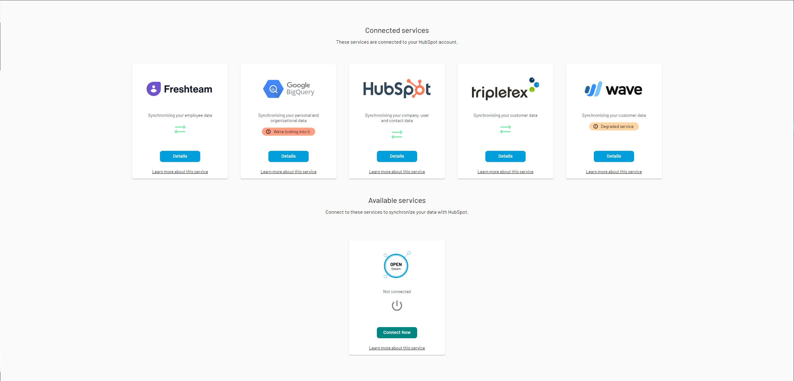

.. _what_is_sesam_talk:

==================
What is Sesam Talk
==================

Sesam Talk synchronizes a limited set of core types with a limited set of properties between the various :doc:`supported system <systems/index>`.

Sesam Talk merges data from the different systems on certain criteria. People are merged if they have the same email, organisations are merged if they have the exact same name.

.. Important::
  Sesam talk is currently in Beta. Use with caution.

Asset model
-----------
Items or resources, such as valubales, machinery, or real estate

.. list-table::
     :header-rows: 1

   * - Property
     - Wikidata id
     - Description

   * - instance_of
     - `P31 <https://www.wikidata.org/wiki/Property:P31>`_
     - The type of the entity

   * - arranged_by
     - `P88 <https://www.wikidata.org/wiki/Property:P88>`_
     - Person or organization that commissioned  the asset

   * - maintained_by
     - `P126 <https://www.wikidata.org/wiki/Property:P126>`_
     - Person or organization in charge of keeping the asset in functioning order

   * - owned_by
     - `P127 <https://www.wikidata.org/wiki/Property:P127>`_
     - Owner of the asset

   * - operator
     - `P137 <https://www.wikidata.org/wiki/Property:P137>`_
     - Person, profession, or organization that operates the asset

   * - creator
     - `P170 <https://www.wikidata.org/wiki/Property:P170>`_
     - Created by

   * - manufacturer
     - `P176 <https://www.wikidata.org/wiki/Property:P176>`_
     - Manufacturer or producer of this asset

   * - stated_in
     - `P248 <https://www.wikidata.org/wiki/Property:P248>`_
     - The source of the entity statement

   * - location
     - `P276 <https://www.wikidata.org/wiki/Property:P276>`_
     - Location of the asset

   * - part_of
     - `P361 <https://www.wikidata.org/wiki/Property:P361>`_
     - Parrent asset

   * - created
     - `P571 <https://www.wikidata.org/wiki/Property:P571>`_
     - Time when an entity begins to exist

   * - service_entry
     - `P729 <https://www.wikidata.org/wiki/Property:P729>`_
     - Date or point in time on which the asset entered operational service

   * - end_of_service
     - `P730 <https://www.wikidata.org/wiki/Property:P730>`_
     - Date or point in time on the asset was retired of pulled out from operational service

   * - description
     - `P921 <https://www.wikidata.org/wiki/Property:P921>`_
     - Description of the asset

   * - described_by_source
     - `P1343 <https://www.wikidata.org/wiki/Property:P1343>`_
     - Document where this asset is described

   * - described_by_source. reference_type
     - `P1343 <https://www.wikidata.org/wiki/Property:P1343>`_. `P3865 <https://www.wikidata.org/wiki/Property:P3865>`_
     - Type of documentation

   * - replaced_by
     - `P1366 <https://www.wikidata.org/wiki/Property:P1366>`_
     - The asset that has replaced this asset

   * - total_equity
     - `P2137 <https://www.wikidata.org/wiki/Property:P2137>`_
     - Amount of equity value for this asset

   * - serial_number
     - `P2598 <https://www.wikidata.org/wiki/Property:P2598>`_
     - An identifier for the asset

   * - unique_identifier
     - `P4649 <https://www.wikidata.org/wiki/Property:P4649>`_
     - Uniqe identifier used to merge entities with identical value and type

   * - unique_identifier. reference_type
     - `P4649 <https://www.wikidata.org/wiki/Property:P4649>`_. `P3865 <https://www.wikidata.org/wiki/Property:P3865>`_
     - The type of the identifier

   * - updated
     - `P5017 <https://www.wikidata.org/wiki/Property:P5017>`_
     - Date a entity is modified

   * - related_category
     - `P7084 <https://www.wikidata.org/wiki/Property:P7084>`_
     - A related catagory for the entity

   * - related_category. instance_of
     - `P7084 <https://www.wikidata.org/wiki/Property:P7084>`_. `P31 <https://www.wikidata.org/wiki/Property:P31>`_
     - The type of the category

   * - related_category. has_sorting
     - `P7084 <https://www.wikidata.org/wiki/Property:P7084>`_. `P8307 <https://www.wikidata.org/wiki/Property:P8307>`_
     - The index used to sort the category
Classification model
--------------------
Classification and grouping used as controlled vocabularies.

.. list-table::
     :header-rows: 1

   * - Property
     - Wikidata id
     - Description

   * - instance_of
     - `P31 <https://www.wikidata.org/wiki/Property:P31>`_
     - The type of the entity

   * - creator
     - `P170 <https://www.wikidata.org/wiki/Property:P170>`_
     - Created by

   * - stated_in
     - `P248 <https://www.wikidata.org/wiki/Property:P248>`_
     - The source of the entity statement

   * - created
     - `P571 <https://www.wikidata.org/wiki/Property:P571>`_
     - Time when an entity begins to exist

   * - description
     - `P921 <https://www.wikidata.org/wiki/Property:P921>`_
     - Description of the classification

   * - title
     - `P1476 <https://www.wikidata.org/wiki/Property:P1476>`_
     - The name of the classification

   * - url
     - `P2699 <https://www.wikidata.org/wiki/Property:P2699>`_
     - URL for the classification

   * - code
     - `P3295 <https://www.wikidata.org/wiki/Property:P3295>`_
     - Code used to represent the classification

   * - unique_identifier
     - `P4649 <https://www.wikidata.org/wiki/Property:P4649>`_
     - Uniqe identifier used to merge entities with identical value and type

   * - unique_identifier. reference_type
     - `P4649 <https://www.wikidata.org/wiki/Property:P4649>`_. `P3865 <https://www.wikidata.org/wiki/Property:P3865>`_
     - The type of the identifier

   * - updated
     - `P5017 <https://www.wikidata.org/wiki/Property:P5017>`_
     - Date a entity is modified

   * - related_category
     - `P7084 <https://www.wikidata.org/wiki/Property:P7084>`_
     - A related catagory for the entity

   * - related_category. instance_of
     - `P7084 <https://www.wikidata.org/wiki/Property:P7084>`_. `P31 <https://www.wikidata.org/wiki/Property:P31>`_
     - The type of the category

   * - related_category. has_sorting
     - `P7084 <https://www.wikidata.org/wiki/Property:P7084>`_. `P8307 <https://www.wikidata.org/wiki/Property:P8307>`_
     - The index used to sort the category

   * - has_sorting
     - `P8307 <https://www.wikidata.org/wiki/Property:P8307>`_
     - The index used to sort the classification
Agreement model
---------------
An agreement such as orders, invoices, that is intended to be enforceable by law

.. list-table::
     :header-rows: 1

   * - Property
     - Wikidata id
     - Description

   * - instance_of
     - `P31 <https://www.wikidata.org/wiki/Property:P31>`_
     - The type of the entity

   * - currency
     - `P38 <https://www.wikidata.org/wiki/Property:P38>`_
     - Currency used by item

   * - creator
     - `P170 <https://www.wikidata.org/wiki/Property:P170>`_
     - Created by

   * - stated_in
     - `P248 <https://www.wikidata.org/wiki/Property:P248>`_
     - The source of the entity statement

   * - part_of
     - `P361 <https://www.wikidata.org/wiki/Property:P361>`_
     - Part of agreement

   * - has_products
     - `P527 <https://www.wikidata.org/wiki/Property:P527>`_
     - Product lines

   * - has_products. point_in_ time
     - `P527 <https://www.wikidata.org/wiki/Property:P527>`_. `P585 <https://www.wikidata.org/wiki/Property:P585>`_
     - A point in time

   * - has_products. reference_type
     - `P527 <https://www.wikidata.org/wiki/Property:P527>`_. `P585 <https://www.wikidata.org/wiki/Property:P585>`_
     - The type of the point in time

   * - has_products. quantity
     - `P527 <https://www.wikidata.org/wiki/Property:P527>`_. `P1114 <https://www.wikidata.org/wiki/Property:P1114>`_
     - A specified number or amount

   * - has_products. title
     - `P527 <https://www.wikidata.org/wiki/Property:P527>`_. `P1476 <https://www.wikidata.org/wiki/Property:P1476>`_
     - A heading

   * - has_products. duration
     - `P527 <https://www.wikidata.org/wiki/Property:P527>`_. `P2047 <https://www.wikidata.org/wiki/Property:P2047>`_
     - The period for the product line

   * - has_products. price
     - `P527 <https://www.wikidata.org/wiki/Property:P527>`_. `P2284 <https://www.wikidata.org/wiki/Property:P2284>`_
     - The cost of the product

   * - has_products. vat
     - `P527 <https://www.wikidata.org/wiki/Property:P527>`_. `P2855 <https://www.wikidata.org/wiki/Property:P2855>`_
     - Precentage of value added tax

   * - has_products. reference_type
     - `P527 <https://www.wikidata.org/wiki/Property:P527>`_. `P3865 <https://www.wikidata.org/wiki/Property:P3865>`_
     - The type of the product line

   * - has_products. unit_symbol
     - `P527 <https://www.wikidata.org/wiki/Property:P527>`_. `P5061 <https://www.wikidata.org/wiki/Property:P5061>`_
     - Identifier of the unit

   * - has_products. discount
     - `P527 <https://www.wikidata.org/wiki/Property:P527>`_. `P7079 <https://www.wikidata.org/wiki/Property:P7079>`_
     - The discount for the product line

   * - has_products. ordered_by
     - `P527 <https://www.wikidata.org/wiki/Property:P527>`_. `P8004 <https://www.wikidata.org/wiki/Property:P8004>`_
     - The subject that ordered the product line

   * - has_products. has_sorting
     - `P527 <https://www.wikidata.org/wiki/Property:P527>`_. `P8307 <https://www.wikidata.org/wiki/Property:P8307>`_
     - The index used to sort the product line

   * - created
     - `P571 <https://www.wikidata.org/wiki/Property:P571>`_
     - Time when an entity begins to exist

   * - point_in_time
     - `P585 <https://www.wikidata.org/wiki/Property:P585>`_
     - A point in time

   * - point_in_time. reference_type
     - `P585 <https://www.wikidata.org/wiki/Property:P585>`_. `P3865 <https://www.wikidata.org/wiki/Property:P3865>`_
     - The type of the point in time

   * - participant
     - `P710 <https://www.wikidata.org/wiki/Property:P710>`_
     - Person that actively takes/took part

   * - participant. object_has_role
     - `P710 <https://www.wikidata.org/wiki/Property:P710>`_. `P3831 <https://www.wikidata.org/wiki/Property:P3831>`_
     - The role of the participant

   * - description
     - `P921 <https://www.wikidata.org/wiki/Property:P921>`_
     - Description of the agreement

   * - email_address
     - `P968 <https://www.wikidata.org/wiki/Property:P968>`_
     - Email address

   * - email_address. reference_type
     - `P968 <https://www.wikidata.org/wiki/Property:P968>`_. `P3865 <https://www.wikidata.org/wiki/Property:P3865>`_
     - Type of email address

   * - title
     - `P1476 <https://www.wikidata.org/wiki/Property:P1476>`_
     - The title of the agreement

   * - duration
     - `P2047 <https://www.wikidata.org/wiki/Property:P2047>`_
     - Length of time of an event or process

   * - price
     - `P2284 <https://www.wikidata.org/wiki/Property:P2284>`_
     - The agreeed price

   * - url
     - `P2699 <https://www.wikidata.org/wiki/Property:P2699>`_
     - Location of a resource

   * - vat
     - `P2855 <https://www.wikidata.org/wiki/Property:P2855>`_
     - Percentage value-added tax

   * - unique_identifier
     - `P4649 <https://www.wikidata.org/wiki/Property:P4649>`_
     - Uniqe identifier used to merge entities with identical value and type

   * - unique_identifier. reference_type
     - `P4649 <https://www.wikidata.org/wiki/Property:P4649>`_. `P3865 <https://www.wikidata.org/wiki/Property:P3865>`_
     - The type of the identifier

   * - updated
     - `P5017 <https://www.wikidata.org/wiki/Property:P5017>`_
     - Date a entity is modified

   * - discount
     - `P7079 <https://www.wikidata.org/wiki/Property:P7079>`_
     - The discount for the agreement

   * - related_category
     - `P7084 <https://www.wikidata.org/wiki/Property:P7084>`_
     - A related catagory for the entity

   * - related_category. instance_of
     - `P7084 <https://www.wikidata.org/wiki/Property:P7084>`_. `P31 <https://www.wikidata.org/wiki/Property:P31>`_
     - The type of the category

   * - related_category. has_sorting
     - `P7084 <https://www.wikidata.org/wiki/Property:P7084>`_. `P8307 <https://www.wikidata.org/wiki/Property:P8307>`_
     - The index used to sort the category
Documentation model
-------------------
A permanent record of information in written, photographic, or other form.

.. list-table::
     :header-rows: 1

   * - Property
     - Wikidata id
     - Description

   * - instance_of
     - `P31 <https://www.wikidata.org/wiki/Property:P31>`_
     - The type of the entity

   * - owned_by
     - `P127 <https://www.wikidata.org/wiki/Property:P127>`_
     - Owner of the document

   * - creator
     - `P170 <https://www.wikidata.org/wiki/Property:P170>`_
     - Created by

   * - stated_in
     - `P248 <https://www.wikidata.org/wiki/Property:P248>`_
     - The source of the entity statement

   * - part_of
     - `P361 <https://www.wikidata.org/wiki/Property:P361>`_
     - Parrent document

   * - created
     - `P571 <https://www.wikidata.org/wiki/Property:P571>`_
     - Time when an entity begins to exist

   * - title
     - `P1476 <https://www.wikidata.org/wiki/Property:P1476>`_
     - Title of document

   * - subtitle
     - `P1680 <https://www.wikidata.org/wiki/Property:P1680>`_
     - Subtitle of document

   * - url
     - `P2699 <https://www.wikidata.org/wiki/Property:P2699>`_
     - URL for the document

   * - file_format
     - `P2701 <https://www.wikidata.org/wiki/Property:P2701>`_
     - File format

   * - unique_identifier
     - `P4649 <https://www.wikidata.org/wiki/Property:P4649>`_
     - Uniqe identifier used to merge entities with identical value and type

   * - unique_identifier. reference_type
     - `P4649 <https://www.wikidata.org/wiki/Property:P4649>`_. `P3865 <https://www.wikidata.org/wiki/Property:P3865>`_
     - The type of the identifier

   * - updated
     - `P5017 <https://www.wikidata.org/wiki/Property:P5017>`_
     - Date a entity is modified

   * - modified_version_of
     - `P5059 <https://www.wikidata.org/wiki/Property:P5059>`_
     - The previous version of this document

   * - related_category
     - `P7084 <https://www.wikidata.org/wiki/Property:P7084>`_
     - A related catagory for the entity

   * - related_category. instance_of
     - `P7084 <https://www.wikidata.org/wiki/Property:P7084>`_. `P31 <https://www.wikidata.org/wiki/Property:P31>`_
     - The type of the category

   * - related_category. has_sorting
     - `P7084 <https://www.wikidata.org/wiki/Property:P7084>`_. `P8307 <https://www.wikidata.org/wiki/Property:P8307>`_
     - The index used to sort the category
Event model
-----------
Something that occurs in a certain place during a particular interval of time.

.. list-table::
     :header-rows: 1

   * - Property
     - Wikidata id
     - Description

   * - instance_of
     - `P31 <https://www.wikidata.org/wiki/Property:P31>`_
     - The type of the entity

   * - creator
     - `P170 <https://www.wikidata.org/wiki/Property:P170>`_
     - Created by

   * - stated_in
     - `P248 <https://www.wikidata.org/wiki/Property:P248>`_
     - The source of the entity statement

   * - location
     - `P276 <https://www.wikidata.org/wiki/Property:P276>`_
     - Location of the occurrence

   * - created
     - `P571 <https://www.wikidata.org/wiki/Property:P571>`_
     - Time when an entity begins to exist

   * - start_time
     - `P580 <https://www.wikidata.org/wiki/Property:P580>`_
     - Time the occurrence starts

   * - end_time
     - `P582 <https://www.wikidata.org/wiki/Property:P582>`_
     - Time the occurrence ends

   * - point_in_time
     - `P585 <https://www.wikidata.org/wiki/Property:P585>`_
     - Time and date the occurrence took place

   * - participant
     - `P710 <https://www.wikidata.org/wiki/Property:P710>`_
     - Person, group of people or organization takes/took part in the occurrence

   * - participant. object_has_role
     - `P710 <https://www.wikidata.org/wiki/Property:P710>`_. `P3831 <https://www.wikidata.org/wiki/Property:P3831>`_
     - The role of the participant

   * - description
     - `P921 <https://www.wikidata.org/wiki/Property:P921>`_
     - Description of the occurrence 

   * - title
     - `P1476 <https://www.wikidata.org/wiki/Property:P1476>`_
     - Published name of a work

   * - duration
     - `P2047 <https://www.wikidata.org/wiki/Property:P2047>`_
     - Length of time of the occurrence

   * - unique_identifier
     - `P4649 <https://www.wikidata.org/wiki/Property:P4649>`_
     - Uniqe identifier used to merge entities with identical value and type

   * - unique_identifier. reference_type
     - `P4649 <https://www.wikidata.org/wiki/Property:P4649>`_. `P3865 <https://www.wikidata.org/wiki/Property:P3865>`_
     - The type of the identifier

   * - updated
     - `P5017 <https://www.wikidata.org/wiki/Property:P5017>`_
     - Date a entity is modified

   * - related_category
     - `P7084 <https://www.wikidata.org/wiki/Property:P7084>`_
     - A related catagory for the entity

   * - related_category. instance_of
     - `P7084 <https://www.wikidata.org/wiki/Property:P7084>`_. `P31 <https://www.wikidata.org/wiki/Property:P31>`_
     - The type of the category

   * - related_category. has_sorting
     - `P7084 <https://www.wikidata.org/wiki/Property:P7084>`_. `P8307 <https://www.wikidata.org/wiki/Property:P8307>`_
     - The index used to sort the category
Location model
--------------
A position, place or site that something is in or where something happens.

.. list-table::
     :header-rows: 1

   * - Property
     - Wikidata id
     - Description

   * - territorial_entity. reference_type
     - `P131 <https://www.wikidata.org/wiki/Property:P131>`_. `P3865 <https://www.wikidata.org/wiki/Property:P3865>`_
     - Type of teritorial entity

   * - territorial_entity. territorial_type
     - `P131 <https://www.wikidata.org/wiki/Property:P131>`_. `P132 <https://www.wikidata.org/wiki/Property:P132>`_
     - Type of teritorial entity

   * - country
     - `P17 <https://www.wikidata.org/wiki/Property:P17>`_
     - Country for this location

   * - instance_of
     - `P31 <https://www.wikidata.org/wiki/Property:P31>`_
     - The type of the entity

   * - territorial_entity
     - `P131 <https://www.wikidata.org/wiki/Property:P131>`_
     - Located in the following teritorial entity

   * - creator
     - `P170 <https://www.wikidata.org/wiki/Property:P170>`_
     - Created by

   * - stated_in
     - `P248 <https://www.wikidata.org/wiki/Property:P248>`_
     - The source of the entity statement

   * - postal_code
     - `P281 <https://www.wikidata.org/wiki/Property:P281>`_
     - Identifier assigned by postal authorities 

   * - created
     - `P571 <https://www.wikidata.org/wiki/Property:P571>`_
     - Time when an entity begins to exist

   * - coordinate_location
     - `P625 <https://www.wikidata.org/wiki/Property:P625>`_
     - Geocoordinates of the location in the WGS84 coordinating system

   * - addressee
     - `P1817 <https://www.wikidata.org/wiki/Property:P1817>`_
     - Person or organization to whom a location is connected

   * - post_town
     - `P4595 <https://www.wikidata.org/wiki/Property:P4595>`_
     - Town/city part of the postal address

   * - unique_identifier
     - `P4649 <https://www.wikidata.org/wiki/Property:P4649>`_
     - Uniqe identifier used to merge entities with identical value and type

   * - unique_identifier. reference_type
     - `P4649 <https://www.wikidata.org/wiki/Property:P4649>`_. `P3865 <https://www.wikidata.org/wiki/Property:P3865>`_
     - The type of the identifier

   * - updated
     - `P5017 <https://www.wikidata.org/wiki/Property:P5017>`_
     - Date a entity is modified

   * - street_address
     - `P6375 <https://www.wikidata.org/wiki/Property:P6375>`_
     - Street address line for the location. Include building number or PO box.

   * - street_address. has_sorting
     - `P6375 <https://www.wikidata.org/wiki/Property:P6375>`_. `P8307 <https://www.wikidata.org/wiki/Property:P8307>`_
     - The index used to sort the street address

   * - related_category
     - `P7084 <https://www.wikidata.org/wiki/Property:P7084>`_
     - A related catagory for the entity

   * - related_category. instance_of
     - `P7084 <https://www.wikidata.org/wiki/Property:P7084>`_. `P31 <https://www.wikidata.org/wiki/Property:P31>`_
     - The type of the category

   * - related_category. has_sorting
     - `P7084 <https://www.wikidata.org/wiki/Property:P7084>`_. `P8307 <https://www.wikidata.org/wiki/Property:P8307>`_
     - The index used to sort the category
Organisation model
------------------
Any type of group or association of individuals who are joined together either formally or legally.

.. list-table::
     :header-rows: 1

   * - Property
     - Wikidata id
     - Description

   * - instance_of
     - `P31 <https://www.wikidata.org/wiki/Property:P31>`_
     - The type of the entity

   * - chief_executive_officer
     - `P169 <https://www.wikidata.org/wiki/Property:P169>`_
     - Highest-ranking corporate officer appointed as the CEO within an organization

   * - creator
     - `P170 <https://www.wikidata.org/wiki/Property:P170>`_
     - Created by

   * - stated_in
     - `P248 <https://www.wikidata.org/wiki/Property:P248>`_
     - The source of the entity statement

   * - ticker_symbol
     - `P249 <https://www.wikidata.org/wiki/Property:P249>`_
     - Identifier for a publicly traded share of a particular stock on a particular stock market or that of a cryptocurrency

   * - location
     - `P276 <https://www.wikidata.org/wiki/Property:P276>`_
     - Location of the organization

   * - part_of
     - `P361 <https://www.wikidata.org/wiki/Property:P361>`_
     - Parrent organization

   * - industry
     - `P452 <https://www.wikidata.org/wiki/Property:P452>`_
     - Specific industry of company or organization

   * - industry. reference_type
     - `P452 <https://www.wikidata.org/wiki/Property:P452>`_. `P3865 <https://www.wikidata.org/wiki/Property:P3865>`_
     - The type of industry classification

   * - created
     - `P571 <https://www.wikidata.org/wiki/Property:P571>`_
     - Time when an entity begins to exist

   * - official_website
     - `P856 <https://www.wikidata.org/wiki/Property:P856>`_
     - Primary website og the organization

   * - description
     - `P921 <https://www.wikidata.org/wiki/Property:P921>`_
     - Description of the organization 

   * - email_address
     - `P968 <https://www.wikidata.org/wiki/Property:P968>`_
     - An email address

   * - email_address. object_has_role
     - `P968 <https://www.wikidata.org/wiki/Property:P968>`_. `P3831 <https://www.wikidata.org/wiki/Property:P3831>`_
     - The role of the email address

   * - email_address. has_sorting
     - `P968 <https://www.wikidata.org/wiki/Property:P968>`_. `P8307 <https://www.wikidata.org/wiki/Property:P8307>`_
     - The index used to sort the email address

   * - employees
     - `P1128 <https://www.wikidata.org/wiki/Property:P1128>`_
     - Numer of employees in the organization 

   * - phone_number
     - `P1329 <https://www.wikidata.org/wiki/Property:P1329>`_
     - Telephone number

   * - phone_number. object_has_role
     - `P1329 <https://www.wikidata.org/wiki/Property:P1329>`_. `P3831 <https://www.wikidata.org/wiki/Property:P3831>`_
     - The role of the phone number

   * - phone_number. has_sorting
     - `P1329 <https://www.wikidata.org/wiki/Property:P1329>`_. `P8307 <https://www.wikidata.org/wiki/Property:P8307>`_
     - The index used to sort the phone number

   * - official_name
     - `P1448 <https://www.wikidata.org/wiki/Property:P1448>`_
     - Official name of the organization 

   * - total_revenue
     - `P2139 <https://www.wikidata.org/wiki/Property:P2139>`_
     - Income gained by an organization during a given time frame. Not to be confused with fiscal revenue

   * - fax_number
     - `P2900 <https://www.wikidata.org/wiki/Property:P2900>`_
     - Telephone number of a fax line

   * - fax_number. object_has_role
     - `P2900 <https://www.wikidata.org/wiki/Property:P2900>`_. `P3831 <https://www.wikidata.org/wiki/Property:P3831>`_
     - The role of the fax number

   * - fax_number. has_sorting
     - `P2900 <https://www.wikidata.org/wiki/Property:P2900>`_. `P8307 <https://www.wikidata.org/wiki/Property:P8307>`_
     - The index used to sort the fax number

   * - unique_identifier
     - `P4649 <https://www.wikidata.org/wiki/Property:P4649>`_
     - Uniqe identifier used to merge entities with identical value and type

   * - unique_identifier. reference_type
     - `P4649 <https://www.wikidata.org/wiki/Property:P4649>`_. `P3865 <https://www.wikidata.org/wiki/Property:P3865>`_
     - The type of the identifier

   * - updated
     - `P5017 <https://www.wikidata.org/wiki/Property:P5017>`_
     - Date a entity is modified

   * - related_category
     - `P7084 <https://www.wikidata.org/wiki/Property:P7084>`_
     - A related catagory for the entity

   * - related_category. instance_of
     - `P7084 <https://www.wikidata.org/wiki/Property:P7084>`_. `P31 <https://www.wikidata.org/wiki/Property:P31>`_
     - The type of the category

   * - related_category. has_sorting
     - `P7084 <https://www.wikidata.org/wiki/Property:P7084>`_. `P8307 <https://www.wikidata.org/wiki/Property:P8307>`_
     - The index used to sort the category
Person model
------------
A human being, regardless of role.

.. list-table::
     :header-rows: 1

   * - Property
     - Wikidata id
     - Description

   * - instance_of
     - `P31 <https://www.wikidata.org/wiki/Property:P31>`_
     - The type of the entity

   * - employer
     - `P108 <https://www.wikidata.org/wiki/Property:P108>`_
     - Organization for which the person works or worked

   * - employer. job_title
     - `P108 <https://www.wikidata.org/wiki/Property:P108>`_. `P39 <https://www.wikidata.org/wiki/Property:P39>`_
     - A persons role at the employer

   * - creator
     - `P170 <https://www.wikidata.org/wiki/Property:P170>`_
     - Created by

   * - stated_in
     - `P248 <https://www.wikidata.org/wiki/Property:P248>`_
     - The source of the entity statement

   * - date_of_birth
     - `P569 <https://www.wikidata.org/wiki/Property:P569>`_
     - Date on which the person was born

   * - created
     - `P571 <https://www.wikidata.org/wiki/Property:P571>`_
     - Time when an entity begins to exist

   * - last_name
     - `P734 <https://www.wikidata.org/wiki/Property:P734>`_
     - Lest name of person

   * - first_name
     - `P735 <https://www.wikidata.org/wiki/Property:P735>`_
     - First name or another given name of this person

   * - email_address
     - `P968 <https://www.wikidata.org/wiki/Property:P968>`_
     - Email address

   * - email_address. object_has_role
     - `P968 <https://www.wikidata.org/wiki/Property:P968>`_. `P3831 <https://www.wikidata.org/wiki/Property:P3831>`_
     - The role of the email address

   * - email_address. has_sorting
     - `P968 <https://www.wikidata.org/wiki/Property:P968>`_. `P8307 <https://www.wikidata.org/wiki/Property:P8307>`_
     - The index used to sort the email address

   * - phone_number
     - `P1329 <https://www.wikidata.org/wiki/Property:P1329>`_
     - Telephone number

   * - phone_number. object_has_role
     - `P1329 <https://www.wikidata.org/wiki/Property:P1329>`_. `P3831 <https://www.wikidata.org/wiki/Property:P3831>`_
     - The role of the phone number

   * - phone_number. has_sorting
     - `P1329 <https://www.wikidata.org/wiki/Property:P1329>`_. `P8307 <https://www.wikidata.org/wiki/Property:P8307>`_
     - The index used to sort the phone number

   * - twitter_username
     - `P2002 <https://www.wikidata.org/wiki/Property:P2002>`_
     - Twitter username

   * - faceboook_id
     - `P2013 <https://www.wikidata.org/wiki/Property:P2013>`_
     - Facebook username

   * - unique_identifier
     - `P4649 <https://www.wikidata.org/wiki/Property:P4649>`_
     - Uniqe identifier used to merge entities with identical value and type

   * - unique_identifier. reference_type
     - `P4649 <https://www.wikidata.org/wiki/Property:P4649>`_. `P3865 <https://www.wikidata.org/wiki/Property:P3865>`_
     - The type of the identifier

   * - updated
     - `P5017 <https://www.wikidata.org/wiki/Property:P5017>`_
     - Date a entity is modified

   * - resident_of
     - `P5389 <https://www.wikidata.org/wiki/Property:P5389>`_
     - Country  where a person is resident

   * - linkedIn_id
     - `P6634 <https://www.wikidata.org/wiki/Property:P6634>`_
     - Linkedin username

   * - related_category
     - `P7084 <https://www.wikidata.org/wiki/Property:P7084>`_
     - A related catagory for the entity

   * - related_category. instance_of
     - `P7084 <https://www.wikidata.org/wiki/Property:P7084>`_. `P31 <https://www.wikidata.org/wiki/Property:P31>`_
     - The type of the category

   * - related_category. has_sorting
     - `P7084 <https://www.wikidata.org/wiki/Property:P7084>`_. `P8307 <https://www.wikidata.org/wiki/Property:P8307>`_
     - The index used to sort the category

   * - reports_to
     - `P10645 <https://www.wikidata.org/wiki/Property:P10645>`_
     - The subject position reports to this position
Product model
-------------
A product is the item offered for sale. A product can be a service or an item.

.. list-table::
     :header-rows: 1

   * - Property
     - Wikidata id
     - Description

   * - image
     - `P18 <https://www.wikidata.org/wiki/Property:P18>`_
     - Image of relevant illustration of the product

   * - instance_of
     - `P31 <https://www.wikidata.org/wiki/Property:P31>`_
     - The type of the entity

   * - currency
     - `P38 <https://www.wikidata.org/wiki/Property:P38>`_
     - Currency used by the price of the product

   * - owned_by
     - `P127 <https://www.wikidata.org/wiki/Property:P127>`_
     - Owner of the product

   * - creator
     - `P170 <https://www.wikidata.org/wiki/Property:P170>`_
     - Created by

   * - manufacturer
     - `P176 <https://www.wikidata.org/wiki/Property:P176>`_
     - Manufacturer or producer of this product

   * - stated_in
     - `P248 <https://www.wikidata.org/wiki/Property:P248>`_
     - The source of the entity statement

   * - country_of_origin
     - `P495 <https://www.wikidata.org/wiki/Property:P495>`_
     - Country of origin of this product

   * - created
     - `P571 <https://www.wikidata.org/wiki/Property:P571>`_
     - Time when an entity begins to exist

   * - description
     - `P921 <https://www.wikidata.org/wiki/Property:P921>`_
     - Description of the product

   * - quantity
     - `P1114 <https://www.wikidata.org/wiki/Property:P1114>`_
     - Number of products in stock

   * - described_by_source
     - `P1343 <https://www.wikidata.org/wiki/Property:P1343>`_
     - Document where the product is described

   * - described_by_source. reference_type
     - `P1343 <https://www.wikidata.org/wiki/Property:P1343>`_. `P3865 <https://www.wikidata.org/wiki/Property:P3865>`_
     - Type of description

   * - title
     - `P1476 <https://www.wikidata.org/wiki/Property:P1476>`_
     - Title of the product

   * - price
     - `P2284 <https://www.wikidata.org/wiki/Property:P2284>`_
     - Published product price

   * - discontinued_date
     - `P2669 <https://www.wikidata.org/wiki/Property:P2669>`_
     - Date that the availability of the product was discontinued

   * - url
     - `P2699 <https://www.wikidata.org/wiki/Property:P2699>`_
     - A URL to a product description

   * - vat
     - `P2855 <https://www.wikidata.org/wiki/Property:P2855>`_
     - Percentage value-added tax

   * - code
     - `P3295 <https://www.wikidata.org/wiki/Property:P3295>`_
     - Code used to represent the product

   * - gtin
     - `P3962 <https://www.wikidata.org/wiki/Property:P3962>`_
     - GTIN (or EAN, UCC) is used to identify products via their barcodes

   * - unique_identifier
     - `P4649 <https://www.wikidata.org/wiki/Property:P4649>`_
     - Uniqe identifier used to merge entities with identical value and type

   * - unique_identifier. reference_type
     - `P4649 <https://www.wikidata.org/wiki/Property:P4649>`_. `P3865 <https://www.wikidata.org/wiki/Property:P3865>`_
     - The type of the identifier

   * - updated
     - `P5017 <https://www.wikidata.org/wiki/Property:P5017>`_
     - Date a entity is modified

   * - unit_symbol
     - `P5061 <https://www.wikidata.org/wiki/Property:P5061>`_
     - Identifier of the unit

   * - related_category
     - `P7084 <https://www.wikidata.org/wiki/Property:P7084>`_
     - A related catagory for the entity

   * - related_category. instance_of
     - `P7084 <https://www.wikidata.org/wiki/Property:P7084>`_. `P31 <https://www.wikidata.org/wiki/Property:P31>`_
     - The type of the category

   * - related_category. has_sorting
     - `P7084 <https://www.wikidata.org/wiki/Property:P7084>`_. `P8307 <https://www.wikidata.org/wiki/Property:P8307>`_
     - The index used to sort the category
Task model
----------
A piece of work to be done.

.. list-table::
     :header-rows: 1

   * - Property
     - Wikidata id
     - Description

   * - instance_of
     - `P31 <https://www.wikidata.org/wiki/Property:P31>`_
     - The type of the entity

   * - owned_by
     - `P127 <https://www.wikidata.org/wiki/Property:P127>`_
     - Owner of the task

   * - creator
     - `P170 <https://www.wikidata.org/wiki/Property:P170>`_
     - Created by

   * - stated_in
     - `P248 <https://www.wikidata.org/wiki/Property:P248>`_
     - The source of the entity statement

   * - location
     - `P276 <https://www.wikidata.org/wiki/Property:P276>`_
     - Location of the task

   * - part_of
     - `P361 <https://www.wikidata.org/wiki/Property:P361>`_
     - Object of which the task is a part of

   * - created
     - `P571 <https://www.wikidata.org/wiki/Property:P571>`_
     - Time when an entity begins to exist

   * - participant
     - `P710 <https://www.wikidata.org/wiki/Property:P710>`_
     - Person, or organization that actively takes/took part of the task

   * - participant. instance_of
     - `P710 <https://www.wikidata.org/wiki/Property:P710>`_. `P3831 <https://www.wikidata.org/wiki/Property:P3831>`_
     - The type of the participant

   * - earliest_date
     - `P1319 <https://www.wikidata.org/wiki/Property:P1319>`_
     - Earliest date at which a task can happen

   * - latest_date
     - `P1326 <https://www.wikidata.org/wiki/Property:P1326>`_
     - Latest possible time that something can occurr

   * - title
     - `P1476 <https://www.wikidata.org/wiki/Property:P1476>`_
     - Task title

   * - duration
     - `P2047 <https://www.wikidata.org/wiki/Property:P2047>`_
     - Length of time of the task

   * - intended_public
     - `P2360 <https://www.wikidata.org/wiki/Property:P2360>`_
     - This task is tergeted for, or has been designed to that person or organization 

   * - budget
     - `P2769 <https://www.wikidata.org/wiki/Property:P2769>`_
     - Assigned monetary amount for the task

   * - unique_identifier
     - `P4649 <https://www.wikidata.org/wiki/Property:P4649>`_
     - Uniqe identifier used to merge entities with identical value and type

   * - unique_identifier. reference_type
     - `P4649 <https://www.wikidata.org/wiki/Property:P4649>`_. `P3865 <https://www.wikidata.org/wiki/Property:P3865>`_
     - The type of the identifier

   * - updated
     - `P5017 <https://www.wikidata.org/wiki/Property:P5017>`_
     - Date a entity is modified

   * - related_category
     - `P7084 <https://www.wikidata.org/wiki/Property:P7084>`_
     - A related catagory for the entity

   * - related_category. instance_of
     - `P7084 <https://www.wikidata.org/wiki/Property:P7084>`_. `P31 <https://www.wikidata.org/wiki/Property:P31>`_
     - The type of the category

   * - related_category. has_sorting
     - `P7084 <https://www.wikidata.org/wiki/Property:P7084>`_. `P8307 <https://www.wikidata.org/wiki/Property:P8307>`_
     - The index used to sort the category

   * - orderd_by
     - `P8004 <https://www.wikidata.org/wiki/Property:P8004>`_
     - Subject that ordered the task

Systems
-------
Sesam Talk can read and write data for several common cloud services.

.. list-table::
   :header-rows: 1

   * - System
     - Type of system
     - Organisation
     - Person

   * - :ref:`wave`
     - Accounting
     - Yes
     - Yes (primary contact from companies)

   * - :ref:`hubspot`
     - CRM
     - Yes
     - Yes

   * - :ref:`freshteam`
     - CRM
     - Yes
     - Yes

Enhancement systems
-------------------
Sesam Talk has support for systems that enhances your data.

.. list-table::
   :header-rows: 1

   * - System
     - Organisation
     - Person

   * - :ref:`opensesam`
     - Yes
     - N/A

Analytic systems
----------------
Sesam Talk can write and keep all your data up-to-date in your analytic solution.

.. list-table::
   :header-rows: 1

   * - System
     - Organisation
     - Person

   * - :ref:`bigquery`
     - Yes
     - Yes
