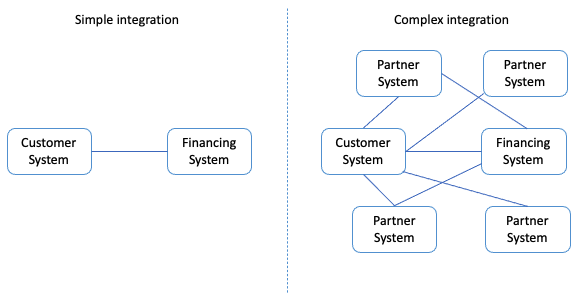
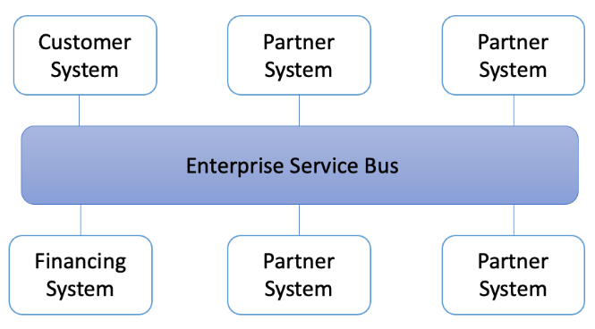
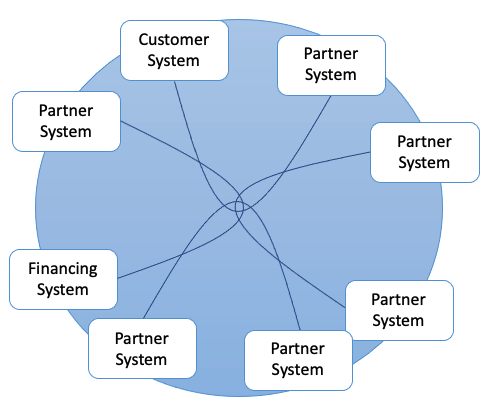
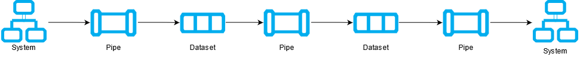
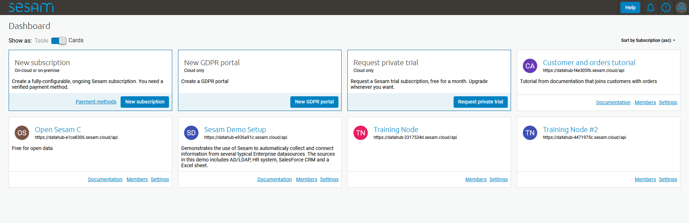
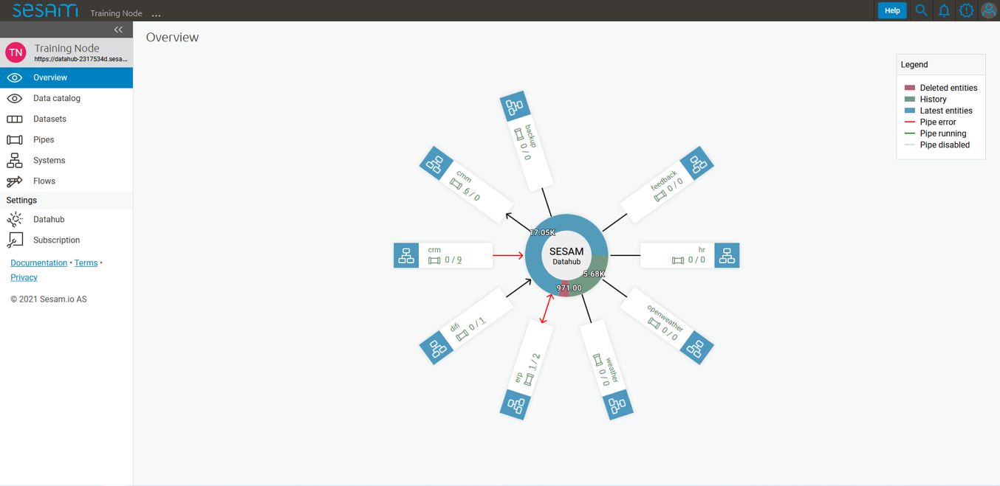
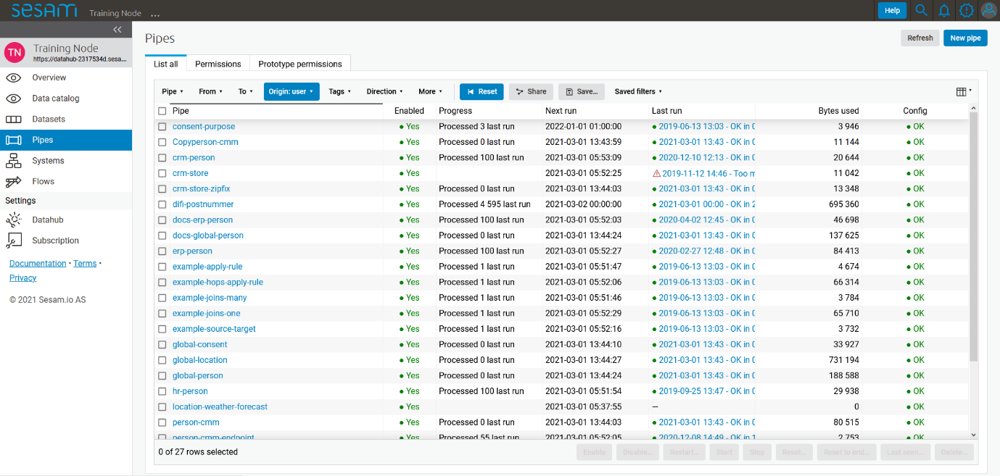
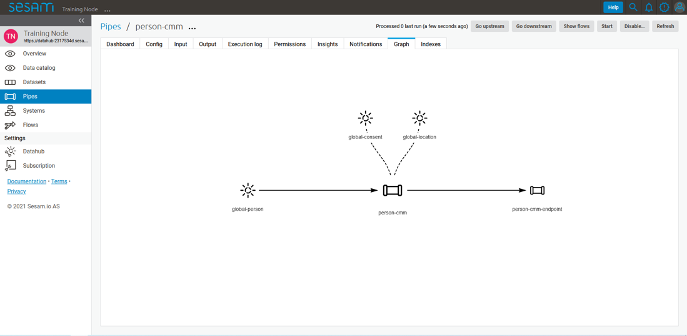
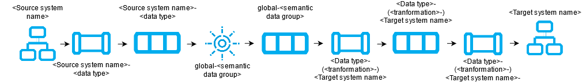
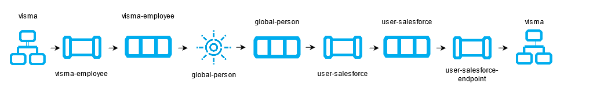

.. _architecture-and-concepts_beginner-1-1:

Architecture and Concepts: Beginner
-----------------------------------

.. _different-types-of-architectures-1-1:

Different types of Architectures
~~~~~~~~~~~~~~~~~~~~~~~~~~~~~~~~

When modelling data, integration architectures (IA) lay the foundation
upon which data is shaped and structured as it moves through one system
to another. Within IA, Point-to-point (P2P) and Enterprise Service Bus
(ESB) have been used extensively. Recent trends, however, move away from
these established integration principles and places data and its
mobility at its center.

Albeit, before elaborating on how integration principles has undergone
recent radical changes, you should first dive into P2P and ESB.

.. _point-to-point-1-1:

Point-to-Point
^^^^^^^^^^^^^^

This kind of IA is a simple integration principle. As an example of P2P
imagine sending a message generated in one system to a single receiver
in another system. This simplified example shows both the pros and cons
to using P2P. It is simple and therefore easy to manage, albeit what if
another system is introduced and so multiple new messages need to be
sent? Well, in this case P2P is not your best option, and the issue of
scalability presents itself. To illustrate how complexity can make P2P a
non-viable option look at the below Figure 1 – Point-to-Point:

   Figure 1 – Point-to-Point

As illustrated on the right-hand side of the above figure “Complex
integration”, you have to maintain multiple connections separately
which, in this case, will make P2P time consuming and expensive to
manage. Therefore, amongst other things, new architectural principles
have been developed. One of the more prominent ones being ESB.

Enterprise Service Bus
^^^^^^^^^^^^^^^^^^^^^^

The ESB is a more robust IA and plays a critical role in connecting
diverse systems and services in a Service Oriented Architecture (SOA).
The ESB takes on the responsibility of ensuring that data sent from one
system conforms to the requirements in another system. This core
functionality is an important feature as to why the ESB is such an
established architectural principle. In addition, the ESB aids in
simplifying integration efforts when connecting differing applications
that need to communicate with each other. See Figure 2 – Enterprise
Service Bus.

   Figure 2 – Enterprise Service Bus

Taking into account the positives from using an ESB for your IA - some
challenges still remain unresolved. Recent years transition towards more
cloud-based solutions, hybrid solutions and the remaining tendency to
focus on the systems in the ESB rather than the data itself has
propelled what is called “Data Driven Architecture”.

Data Driven Architecture @Jonas
~~~~~~~~~~~~~~~~~~~~~~~~~~~~~~~

As opposed to both the P2P and the ESB integration principles the Data
Driven Architecture (DDA) does not focus on systems – rather the data
and how modelling a data-centric ecosystem takes precedence in order to
realize an agile meanwhile robust IA, see Figure 3 – Data Driven
Architecture.

   Figure 3 – Data Driven Architecture

As opposed to P2P and ESB, DDA is, respectively, scalable and agile - in
that it does not need the “Bus” to orchestrate data flows, rather DDA
relies on natural flows of connected data to trigger data flows. You may
think that this also presents a risk - that is correct.

In order to utilize DDA you need to create logical, robust albeit
flexible data flows. If done correctly nothing beats the scalability,
cost-effectiveness and possibilities a DDA provides. A word of caution
however, if such guidelines are not agreed upon and followed up on, you
risk creating a waterfall of technical depth as time goes by and these
natural flows of data grows unhinged.

.. _datahub-1-1:

Datahub @Jonas
~~~~~~~~~~~~~~

Continuing the path of building data-centric solutions, the term
“Datahub” comes into play. A datahub is recognized by its frictionless
data flow and as such builds upon the architectural principles presented
in DDA. A datahub can be described as a solution that consists of
multiple different technologies, i.e., a data warehouse, microservices,
databases etc.

A Datahub shares data by connecting generators of data with consumers of
data. In practice this allows data to be delivered in endpoints that can
interact with the datahub in terms of injecting data into the datahub or
exposing data to an external system. As such, a datahub mediates and
manages how data flows between systems and makes states of data visible
to consumers outside the datahub.

In a sense, you could say that a datahub is a digital representation of
an enterprise and also what SESAM often becomes when it is used
properly. As with any other technologies there are pros and cons to any
technology.

Some of these are listed below, so you might be able to recognize them –
“down the road”.

Pros:

- Has enterprise scope, i.e., cloud, hybrid.

- Creates visibility into all data.

- Centralizes data control.

- Moves data in, close to, real time.

- Connects data.

Cons:

- Data does not persist.

- Demands advanced capabilities.

- Does not operate in silos.

.. _sesam_world_map-1-1:

Sesam world map
~~~~~~~~~~~~~~~

.. _the_parts_of_sesam-1-1:

The parts of sesam @Erik
~~~~~~~~~~~~~~~~~~~~~~~~

.. _terminology-1-1:

Terminology
^^^^^^^^^^^
Systems, pipes, datasets

In order to understand how Sesam works, it is important to understand
the parts Sesam is made up of. There are three central re-occurring
concepts in Sesam which you will encounter in your everyday life working
with the integration platform: systems, pipes and datasets. These are
the fundamental parts which make up a Sesam integration pipeline. Figure
1.1.5A gives you an insight into how a standard Sesam integration
pipeline would look.

   A general pipeline flow in Sesam depicting the three central parts of a
   Sesam integration, systems, pipes and datasets. The arrows symbolizes
   the direction of data flow.

-  **Systems**: A system’s main feature is to import and export data
   into and out of the Sesam portal. They are therefore found in the
   beginning and end of the pipeline flows and are often referred to as
   “source systems” or “target systems” respectively. A system could
   connect to a REST API, directly to a database of simply send data to
   a waiting http server. Sesam has several of these system types built
   into the product to simplify the workings inside the portal. In
   situations where the built-in system types are not enough for your
   requirements Sesam also supports connecting systems to a microservice
   which in turn can manipulate and delegate data according to your own
   specifications, making Sesam a very robust and comprehensive tool.

-  **Pipes**: Pipes handles the transformation of the data and specifies
   where the data is supposed to be sent. Manipulation of the data is
   done through Sesam’s own Data Transformation Language (DTL) which
   allows you to add, remove, transform and combine data according to
   you own needs. A pipe generally acquires data from a system or from a
   dataset depending on where the pipe is located inside the integration
   pipeline.

-  **Datasets**: Datasets are Sesam’s storage units and can be compared
   to i.e., a table in an SQL database. This is where pipes store the
   data after configuring them and in a pipeline flow, they are
   generally found between pipes. Sesam stores data in order to be able
   to perform tracking and indexing, but you will learn more about these
   functionalities later in this book (maybe a link?).

-  **Entities**: A dataset consists of a list of entities. Entities in
   Sesam can be compared to individual rows in an SQL table and can
   represent anything from a person, a mechanical part to a contract. An
   entity is defined by its primary key, which is represented in Sesam
   as the value belonging to the key ‘_id’.

.. _the_sesam_portal-1-1:

The Sesam portal
~~~~~~~~~~~~~~~~

Show basics of portal

(Here also refer to a full chapter for portal or from the projects
chapter?)

Integrations, connections and configurations can all be accessed inside
the Sesam portal; the user interface of the Sesam product, The Sesam
portal can be accessed at portal.sesam.io, and in this section you will
learn the most commonly used parts of the portal such that you can
orient yourself, as well as manage existing integrations. For a full
explanation if the workings and functionality of the Sesam portal,
please look [here (with a link)].

When logging in to the portal you will be met with a page like figure "The Sesam Portal"

   The Sesam Portal

The cards on the Dashboard are often referred to as “subscriptions” or
“nodes” and they represent separate instances of Sesam installations.
Each node comes in different sizes (memory available) depending on the
requirements of the customer/project/user. In this example you will be
shown the portal inside the node called “Training Node”, but all nodes
will have the same setup, only different set of systems, pipes and
datasets.

When entering the “Training Node” you will be met with the page seen in
figure 1.1.6B.

   Training Node Landing Page

In this section we will only focus on the specific parts of the portal
needed to start working with Sesam, namely the “Pipes” page and the
“Systems” page.

Pipes
^^^^^

When entering the “Pipes” page you will be met by figure 1.1.6C. This
figure shows you all the available pipes in your subscription as well as
some of their corresponding meta-data. There are also several search and
filter options available, which are specially handy when trying to
located one, or a set of pipes, in a subscription with many pipes.

   Sesam Node Pipe overview

If you now enter the pipe called “person-cmm” we can look into more of
details regarding how you may use the portal to navigate, troubleshoot
and configure you pipes.

Upon entering a pipe, you will by default be sent to the pipe’s “Graph”
view, as seen in figure 1.1.6D.

   Pipe Graph view

The graph view shows you which pipes are upstream and downstream to the
specific pipe you have selected, and it also shows connections to
related pipes (you will learn more about connected pipes later [link
maybe?]). For now, we will focus on four of the pipe’s subpages: Config,
Input, Output and the Execution log.

-  **Config**: The config subpage is where the actual coding takes
   place. This is where you define what this specific pipe is supposed
   to do. A pipe config is written in DTL which you will learn more
   about in section [link]. One

-  **Input**: Whenever a pipe uses one or several datasets as a source,
   the source entities will be displayed here. These are the entities
   the pipe will perform some sort of transformation on.

-  **Output**: The output tab shows the entities after the DTL
   transformation. The way you see the output depends on whether the
   data is stored in a dataset or sent to a target system. There are
   some occasions where there is no output so be seen but for now you
   can assume that there will always be an output to be see for each
   pipe.

-  **Execution log**: The execution log supplies us with information on
   the state of the pipe. If a pipe runs as it should the execution log
   will display information on how many entities it has processed, how
   much time the processing took and much more. If a pipe is not be able
   to process all the data, the execution log will display a failed pipe
   run as well as error messages which may assist you to locate the
   error. The execution log is a vital tool for troubleshooting as it
   not only tells you if a pipe works as it should, but also contains
   detailed information on why a pipe run fails and when they failed.

Systems
^^^^^^^

The systems tab looks very much like the pipe tab in figure 1.1.6C. For
systems we will focus the three most commonly used tabs: Config, Secrets
and Status.

-  **Config**: Like with pipes, the config tab is where you specify what
   the system is supposed to do. There are many different types of
   systems and many of have very different configuration. There are
   however some common traits that apply to most system. These traits
   include authorization parameters, location parameters such as
   IP-addresses, URLs and database names and system types. In the case
   where your system relies on a Microservice you might also have a set
   of environmental variables used by the Microservice.

-  **Secrets**: In the Secrets tab you may store sensitive information
   you do not wish everyone on the node to have access to. These secrets
   are often passwords or token used to authorization and
   authentication. Secrets stored in the system tabs are local secrets
   and may only be used by the specific system in which they are
   defined.

-  **Status**: In the Status tab you can monitor the health of your
   system. When connected to built-in systems this tab shows you whether
   you are connected correctly. When connected to Microservices this tab
   displays connection status and logging provided by the Microservice.

.. _working-language-json-1-1:

Working language JSON
~~~~~~~~~~~~~~~~~~~~~

Something general about JSON

JSON configuration of pipes and systems

DTL also validated as JSON?

.. _naming-conventions-1-1:

Naming Conventions
~~~~~~~~~~~~~~~~~~

When constructing an integration flow in Sesam the use of a standardized
naming convention becomes essential as the project grows to more than a few pipes.
A standardized naming convention helps you to easily structure your Sesam architecture such that:

-  Localizing specific flows becomes easier.

-  Troubleshooting becomes more efficient.

-  Switching between integration projects, or joining a new project,
   becomes more intuitive.

-  Support will be more efficient.

In Sesam we focus on naming pipes, datasets and systems in way that
explains the function of that specific structure. The following points
are the naming rules Sesam suggests you follow when constructing your
integration flows.

**Systems**

A system name should describe the source/target system from the
customers perspective, not from Sesam’s perspective. If a customer has
employee data inside a HR system named “HR”, but the data from “HR” is
supplied by an API provider called “API provider”, the Sesam system
should be named “hr”. The same rule applies if the HR data was populated
in a database which Sesam connects to. Naming the system after the
database might seem intuitive at first glance but naming from the
customers perspective makes communication and troubleshooting much
easier in the long run.

**Pipes**

*Input pipes:*

Input pipes should be named according to endpoint/table they connect to
in the source system and prefixed with the source system name such that
there is a clear and intuitive way of tracking their content.
We use the hr system mentioned above in this example.
There are two tables we would like to read from the hr systems: employee and
department. Our two input pipes connecting to the two tables containing
HR data will therefore be named “hr-employee” and “hr-department”. The
system name prefixed highlights that the HR system is upstream from the
pipes.

*Global pipes:*

Global pipes should be named according to the semantic relation
connecting the datasets used as the global pipes source and prefixed
with “global”. These semantic relations may vary between projects and
customers, but some are generally always occurring such as
global-person, global-company, global-customer or global-project.

*Preparation pipes:*

Preparation pipe naming can be more diverse but should explain the type
of data it transforms as well as the target system. If the input pipe
importing a table “person” from a system “HR” is named “hr-person", the
corresponding preparation pipe preparing data to be pushed to the table
“person” should be named “person-hr". We use the system name as a
postfix in this case to highlight the fact that this data has the HR
system down-stream. In many cases you might require several preparations
pipes between the global pipe and the endpoint pipe. In these cases, in
addition to the type of data transformed as the downstream target
system, the pipe name should reflect the functionality of that specific
preparation pipe. As an example, if a preparation pipe splits entities
into child entities, the children functionality should be part of the
pipe name i.e., “person-child-hr".

*Output pipes:*

An output pipe should have the same name as the name of the pipe
generating the output pipe’s source dataset, only postfixed with
“endpoint” i.e., “person-child-hr-endpoint”.

The following flow shows a typical Sesam flow with each pipe’s preferred
name with an example:

|

   Full pipe flow with generic names.

|

   Full pipe flow with example names.

.. _systems-1-1:

Systems
~~~~~~~

Short about systems (where in the sesam-world-map)

Something more general about pipes maybe in context of pipes and
datasets

Very low level but enough to set up an inputpipe after maybe?

and refer to systems chapter

Namegivingconventions ref. 1.1.8

Where to make new ref 1.1.6

Systems are one of Sesam’s core sub-structures. Systems can connect to
external providers such as an SQL database, a REST API or a Microservice
to either import or export data to and from Sesam and are therefore the
start and finish points of every integration flow. System may cover
other functionalities as well, but we will cover those special cases in
later parts [ref to later parts].

.. _pipes-1-1:

Pipes
~~~~~

Something more general about pipes maybe in context of systems and
datasets

Inbound(Input?)/Preparation/Outbound(Output?)

Very low level but enough to connect to system?

and refer to pipes chapter

Pump

Input & output(sink)

Namegivingconventions ref. 1.1.8

Where to make new ref 1.1.6

.. _datasets-1-1:

Datasets
~~~~~~~~

Something more general about pipes maybe in context of systems and pipes

Very low level but enough to see entities?

and refer to entities subchapter ref. 1.1.12

Namegivingconventions ref. 1.1.8

Where to make new ref 1.1.6

.. _datasets-vs-tables-1-1:

Datasets vs. tables
~~~~~~~~~~~~~~~~~~~

Examples end ref to 1.1.13

.. _entities-json-keyvalpairs-1-1:

Entities / JSON (Key-value pairs)
~~~~~~~~~~~~~~~~~~~~~~~~~~~~~~~~~

.. _globals-as-a-concept-1-1:

Globals as a concept
~~~~~~~~~~~~~~~~~~~~~~~~~~~~~~~~~

Why globals

Golden records

Gjør data tilgjengelig

Ref. 1.2.19, 3.2.14

.. _special-sesam-attributes-1-1:

Special sesam attributes
~~~~~~~~~~~~~~~~~~~~~~~~

Namespace

Rdf:type

\_id

.. _tasks-for-architecture-and-concepts-beginner-1-1:

Tasks for Architecture and Concepts: Beginner
~~~~~~~~~~~~~~~~~~~~~~~~~~~~~~~~~~~~~~~~~~~~~

1. *In what component is data stored in Sesam?*

2. *Which component moves data in Sesam?*

3. *What moves through Sesam?*

| *4. Name the input pipe for this system & table:*
| *System name : IFS
  Table name: workorder
  Pipe name: \_____\_*

5. *in an entity representing a row, how would the column “personalid”
with row value “123” look after it is read by a pipe named crm-person
and stored inside an entity of the output dataset?*

6. *What is the difference between and entity stored as a row in a table
vs in a Sesam Dataset?*

7. *What is the minimum required to define an entity?*
