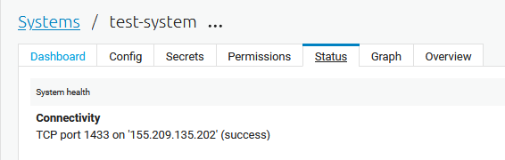

.. _architecture-and-concepts_beginner-1-1:

Beginner
--------

.. _different-types-of-architectures-1-1:

Different types of Architectures
~~~~~~~~~~~~~~~~~~~~~~~~~~~~~~~~

When modelling data, integration architectures lay the foundation
for shaping and structuring data as it moves from one system
to another. Within integration architectures, Point-to-point (P2P) and
Enterprise Service Bus (ESB) architectures have been used extensively.

Recently Data Driven Architecture (DDA) has enabled data to be used in new ways
by focusing on data and its meaning.

To show the evolution of integration architectures and why DDA is the natural
step forward we will first introduce you to P2P and ESB.

.. _point-to-point-1-1:

Point-to-Point (P2P)
^^^^^^^^^^^^^^^^^^^^

.. sidebar:: Summary

  - Synchronous direct data transfer
  - Easy to set up
  - Poor scaleability

This kind of integration architecture is the simplest integration principle.
As an example of P2P imagine sending a message generated in one System A to a
single receiver in another System B. System A talks to System B.
It is simple and therefore easy to manage, albeit what if another System C is
introduced and needs to talk with both System A and System B?

Introducing System C will increase the complexity of the architecture threefold,
as we go from one integration between System A and System B A->B, to three
integrations A->B, A->C, B->C.

In this case P2P is not your best option, and the issue of scalability presents
itself.

To illustrate how complexity can make P2P a
non-viable option see figure :ref:`figure-p2p-1-1`:

.. _figure-p2p-1-1:
.. figure:: ./media/Point_to_Point.png
   :align: center

   Point-to-Point

As illustrated on the right-hand side of the above figure “Complex
integration”, you have to maintain multiple connections separately
which can make P2P time consuming and expensive to maintain, manage and scale.
Therefore new architectural principles have been developed - one of the more
prominent ones being the ESB.

.. _enterprise_service_bus:

Enterprise Service Bus (ESB)
^^^^^^^^^^^^^^^^^^^^^^^^^^^^

.. sidebar:: Summary

  - Asyncronuous message queue
  - Centralized management
  - System decoupling
  - Scaleable
  - No centralized data storage

The ESB is a robust integration architecture which can play a critical role in
Service Oriented Architectures (SOA) by connecting diverse systems and services.
The ESB takes on the responsibility of ensuring that data sent from one
system conforms to the requirements of the receiving system. This core
functionality is an important feature as to why the ESB is such a
well-established architectural principle.
In addition, the ESB aids in simplifying integration efforts when connecting
differing applications that need to communicate with each other.
See figure :ref:`figure-esb-1-1`.

.. _figure-esb-1-1:
.. figure:: ./media/Enterprise_Service_Bus.png
   :align: center

   Enterprise Service Bus

Taking into account the positives from using an ESB for your integration
architecture - some challenges still remain unresolved.
Recent years transition towards more cloud-based solutions, hybrid solutions and
the remaining tendency to focus on the systems in the ESB rather than the data
itself has propelled what is called DDA.

Data Driven Architecture (DDA)
^^^^^^^^^^^^^^^^^^^^^^^^^^^^^^

.. sidebar:: Summary

  - Asynchronous data transfer
  - Data centric
  - Very scaleable
  - Agile

As opposed to both the P2P and the ESB integration architectures the Data
Driven Architecture (DDA) does not focus on systems but rather the data
these systems store and how it can be used in a data-centric ecosystem.
This gives us an agile, robust integration architecture.
See figure :ref:`figure-dda-1-1`.

.. _figure-dda-1-1:
.. figure:: ./media/Data_Driven_Architecture.png
   :align: center

   Data Driven Architecture

As opposed to P2P and ESB, DDA is, respectively, scalable and agile - in
that it does not need the “Bus” to orchestrate data flows, rather DDA
relies on retrieving all the data in a system and connecting it internally
to enhance and propagate it for usage in outbound flows.

As in all great things, there is risk involved.
In order to utilize DDA effectively you need logical and robust principles
to create flexible data flows and models.
This can be achieved by always thinking ahead and leaving room for growth,
which you will learn how to do throughout this course.
If done correctly nothing beats the scalability, cost-effectiveness and
possibilities a DDA provides.

.. seealso::

  :ref:`concepts` > :ref:`why-sesam`

.. _datahub-1-1:

Datahub
~~~~~~~

.. sidebar:: Summary

  - Data centric
  - Very scaleable
  - Centralized data storage

Continuing along the path of building data-centric solutions, the term
“Datahub” comes into play. A datahub is recognized by its frictionless
data flow and builds upon the architectural principles presented
in DDA. A datahub can be described as a solution that consists of
multiple different technologies, i.e., a data warehouse, microservices,
databases etc.

A Datahub shares data by connecting providers of data with consumers of data.
It mediates and manages how data flows between systems and makes states of data
visible to consumers outside the datahub.

In a sense, you could say that a datahub is a digital representation of
an enterprise and also what SESAM often becomes when it is used
properly. As with any other technologies there are pros and cons.
Some of these are listed below, so you might be able to recognize them
“down the road”.

Pros:

- Enterprise scope, i.e., runs on cloud, hybrid.

- Creates visibility into all data.

- Centralised data control & management.

- Moves data asynchronously.

- Connects data from different systems.

- Possibility of defining the best truth of an object across systems.

- Forces the break-down of walled silos.

Cons:

- Only cares about the latest version of data.

- Demands advanced capabilities.

- Does not operate well with silos.

.. seealso::

  :ref:`core-principles`

.. _the_parts_of_sesam-1-1:

The parts of sesam
~~~~~~~~~~~~~~~~~~

.. sidebar:: Summary

  Sesam's core components:

  - **Systems** to interaface with external systems
  - **Pipes** to move and transform data
  - **Datasets** to store entities
  - **Entities** to represent objects as data in datasets

In order to understand how Sesam works, it is important to understand
the parts Sesam is made of. There are three central re-occurring
concepts in Sesam which you will encounter in your everyday use of the
integration platform: systems, pipes and datasets.

.. figure:: ./media/Architecture_Beginner_Systems_pipes_datasets_A.png
   :align: center
   :alt: A general pipeline flow in Sesam depicting the three central parts of a Sesam integration, systems, pipes and datasets. The arrows symbolize the direction of data flow.
   :width: 100%

   A general pipeline flow in Sesam depicting the three central parts of a Sesam
   integration, systems, pipes and datasets.
   The arrows symbolize the direction of data flow.

These are the fundamental parts which make up a Sesam integration pipeline:

Systems:
   A system’s main feature is to act as the interface to import and export data
   into and out of Sesam nodes. The actual import and export is carried out by
   the pipes connected to the systems. The systems are  therefore found in the
   beginning and end of the pipeline flows and are often referred to as
   “source systems” or “target systems” respectively. A system could
   connect to a REST API, directly to a database or simply send data to
   a waiting http server. Sesam has several of these system type interfaces
   built into the product.
   In situations where the built-in system types are not enough for your
   requirements Sesam also supports user created systems as microservices.
   Microservices can interface with external systems according to your own
   specifications, making Sesam a very flexible and robust tool.

Pipes:
   A pipe's main function is to move and transform data.
   Pipes can read from or send to external systems and internal datasets,
   depending on where the pipe is located in the dataflow.
   The source of pipes must be defined, but the sink is by default a dataset
   with the same name as the pipe.
   Transformation of the data is done through Sesam’s own Data Transformation
   Language (DTL) which allows you to enhance, filter or combine data.

Datasets:
   Datasets are Sesam’s storage units and can be compared
   to i.e., a table in an SQL database. Datasets are where the pipes store the
   data they produce, unless a sink specifies otherwise.
   Sesam stores data in order to perform tracking and indexing in addition
   to acting as a smart cache for the source systems' data.
   A dataset is only updated when data changes.
   You will learn more about these functionalities later in this book.

Entities:
   A dataset consists of a list of entities.
   An entity is a JSON dictionary ``{}`` with the identifying key ``_id``.
   Example: ``{"_id": "identity"}``.
   Entities in Sesam can be compared to individual rows in an SQL table and can
   represent any object such as a person, a mechanical part or a contract.

.. seealso::

  :ref:`learn-sesam` > :ref:`architecture_and_concepts` > :ref:`architecture-and-concepts_beginner-1-1` > :ref:`systems-1-1`

  :ref:`learn-sesam` > :ref:`architecture_and_concepts` > :ref:`architecture-and-concepts_beginner-1-1` > :ref:`pipes-1-1`

  :ref:`learn-sesam` > :ref:`architecture_and_concepts` > :ref:`architecture-and-concepts_beginner-1-1` > :ref:`datasets-1-1`

  :ref:`learn-sesam` > :ref:`architecture_and_concepts` > :ref:`architecture-and-concepts_beginner-1-1` > :ref:`entities-json-keyvalpairs-1-1`

.. _the_sesam_portal-1-1:

The Sesam portal
~~~~~~~~~~~~~~~~

.. sidebar:: Summary

  The sesam Portal allows you to:
  - See all your Sesam subscriptions (nodes) and order new ones.
  - See an overview of a node and subsequent pipes and systems on it.
  - Change node configuration settings

Integrations, connections and configurations can be accessed inside
the Sesam portal; the user interface of the Sesam product.
The Sesam portal can be accessed at
`portal.sesam.io <https://www.portal.sesam.io>`_.
The following section will show you the most commonly used components of the
portal so that you can orient yourself, as well as manage existing integrations.

For a full explanation if the workings and functionality of the Sesam portal,
please visit the :ref:`sesam-management-studio` section.

When logging in to the portal you will be met with a page like the figure below:

.. _figure-sesam-portal-1-1:

.. figure:: ./media/Architecture_Beginner_The_Sesam_Portal_A.png
   :align: center
   :alt: The Sesam Portal
   :width: 100%

   The Sesam Portal

The cards on the Dashboard are often referred to as “subscriptions” or
“nodes” and they represent separate instances of Sesam installations.
Sesam nodes come in different sizes depending on the requirements of the
customer/project/user.
In this example you will be shown the portal inside the node called
“Training Node”.

When entering the “Training Node” you will be met with the page seen in
the figure below.

.. _figure-training-node-landing-page-1-1:

.. figure:: ./media/Architecture_Beginner_The_Sesam_Portal_B.png
   :align: center
   :alt: Training Node Landing Page
   :width: 100%

   Training Node Landing Page

In this section we will focus on the specific parts of the portal
needed to start working with Sesam, namely the “Pipes” page and the
“Systems” page.

.. seealso::

  :ref:`tools` > :ref:`sesam-management-studio`

Pipes
^^^^^

Upon entering the “Pipes” page via the menu on the left hand side you will
be met by a list of pipes as seen below.
Unless filters are applied the list diplays all the available pipes in your
subscription as well as some of their corresponding meta-data.
The search and filter options available are specially handy when trying to
locate one, or a subset of pipes, in a subscription with many pipes.

.. _pipe_overview_figure:

.. figure:: ./media/Architecture_Beginner_The_Sesam_Portal_C.png
   :align: center
   :alt: Sesam Node Pipe overview
   :width: 100%

   Pipe overview

We will now enter the pipe called “person-cmm” where we can look more into the
details regarding how you may use the portal to navigate, troubleshoot
and configure your pipes.

Upon entering a pipe you will by default be sent to the pipe’s “Graph”
view, as seen below.

.. _figure-pipe-graph-view-1-1:
.. figure:: ./media/Architecture_Beginner_The_Sesam_Portal_D.png
   :align: center
   :alt: Pipe Graph view
   :width: 100%

   Pipe graph view

The graph view shows you which pipes are one level upstream and one level
downstream to the specific pipe you have selected as well.
It also displays connections to  :ref:`hops<left-join-hops-1-2>`-related pipes
which you will learn more about later.

For now, we will focus on four of the pipe’s tabs:
Config, Input, Output and the Execution log.

Config:
   The config tab is where the pipe configuration can be viewed and changed.
   This is where you define what data the pipe reads, how it transform the
   data, where it places the data and much more.
   Pipe configurations are written in DTL which you will learn more about in
   :ref:`DTL: Beginner <dtl-beginner-3-1>`.

Input:
   Whenever a pipe uses one or several datasets as a source,
   the source entities will be displayed here.
   These are the entities the pipe will perform some sort of transformation on.

Output:
   The output tab shows the entities produced by the pipe.
   If the pipe places its output in a dataset then you will see the dataset, if
   it is sent to a system you will see examples of how the data looks when sent.
   The pipe you are looking at needs to have run at least once for there to be
   any output.

Execution log:
   All pipes have a pump which logs when the pump starts, fails or completes and
   writes this information to the excecution log.
   There are also logs which correspond to single and batch read/write errors.
   If a pipe runs as it should the execution log will display information on how
   many entities it has processed, how much time the processing took and more.
   The execution log is a vital tool for troubleshooting as tracebacks for
   failures are shown there.

.. seealso::

  :ref:`tools` > :ref:`sesam-management-studio` > :ref:`management-studio-pipes`

Systems
^^^^^^^

The systems page looks very much like the pipe tab in the Pipe overview above.

.. _figure-systems-dashboard-view-1-1:

.. figure:: ./media/systems-overview.png
   :align: center
   :alt: Sesam Node System overview
   :height: 200px
   :width: 800px

   Systems overview

When entering a system you will se a set of tabs, just as we saw in a specific
pipe.

.. _figure-systems-graph-view-1-1:

.. figure:: ./media/system-graph.png
   :align: center
   :alt: System graph
   :height: 400px
   :width: 800px

   System graph view

For systems we will focus the three most commonly used tabs: Config, Secrets
and Status.

Config:
   Like with pipes, the config tab is where you specify what
   the system is supposed to do. There are many different types of
   systems which have a variety of configuration options. There are
   however some common traits that apply to most system. These traits
   include authorization parameters, location parameters such as
   IP-addresses, URLs and database names and system types.
   If your system is a microservice you may set environment variables
   whose values can be accessed inside the microservice.

Secrets:
   In the Secrets tab you may store sensitive variables specific to the system.
   These secrets are often passwords or token used for authorization and
   authentication. They cannot be read by users, only overwritten.
   Secrets stored in the system tabs are local secrets and may only be used by
   the specific system in which they are defined.

Status:
   In the Status tab you can monitor the health of your system.
   When connected to built-in systems this tab shows you whether you are
   connected correctly.
   When a system is of the Microservice type the status tab displays connection
   status and logging provided by the Microservice.

.. seealso::

  :ref:`tools` > :ref:`sesam-management-studio` > :ref:`management-studio-systems`

.. _naming-conventions-1-1:

Naming conventions
~~~~~~~~~~~~~~~~~~

.. sidebar:: Summary

  - Lower case
  - Hyphen (-) as separator
  - Singular form (`user`, not `users`)
  - Systems: Name of system (not type) (`hr`, not `mssql`)
  - Inbound pipes: *<source system>*\ `-`\ *<data type>* (`hr-user`)
  - Global pipes: `global-`\ *<category>* (`global-person`)
  - Preparation pipes: *<data-type>*\ `-`\ *<target-system>* (`user-hr`)
  - Endpoint pipes: *<data-type>*\ `-`\ *<target-system>*\ `-endpoint` (`user-hr-endpoint`)

When constructing an integration in Sesam the use of a standardized naming
convention becomes essential as the project grows.
A standardized naming convention helps you to easily structure your Sesam
architecture such that:

-  Localizing specific flows becomes easier.

-  Troubleshooting becomes more efficient.

- Determining pipe type (inbound, outbound, preparation or global) becomes easier.

- Filtering relevant pipes become easier.

-  Switching between integration projects, or joining a new project,
   becomes more intuitive.

-  Support will be more efficient.

In Sesam we focus on naming pipes, datasets and systems in way that explains the
function of specific components.
The following points are the naming rules Sesam suggests you follow when
constructing your integrations.

**Systems**

A system name should describe the source/target system from the customers
perspective, not from Sesam’s perspective.
If a customer has employee data inside a HR system named "HR", but the data from
"HR" is supplied by an API provider called "API provider", the Sesam system
should be named ``hr``.

The same rule applies if the HR data was populated in a database which
Sesam connects to.
Naming the system after the database might seem intuitive at first glance but
naming from the customers perspective makes communication and troubleshooting
much easier in the long run.

**Pipes**

*Inbound pipes:*

Inbound pipes should be named according to the endpoint/table they connect to in
the source system and prefixed with the source system name such that there is a
clear and intuitive way of tracking their content.
Let us use the same example as for naming a system.
The HR system in the previous example populate its data in two tables: employee
and department.

Our two inbound pipes connecting to the two tables containing HR data will
therefore be named ``hr-employee`` and ``hr-department``.
The pipe prefix ``hr-`` highlights that the "HR" system is upstream from the
pipes.

*Global pipes:*

Global pipes should be named according to the semantic relation
connecting the datasets used as the global pipes source and prefixed
with ``global-``.
These semantic relations may vary between projects and customers, but some are
generally always occurring such as ``global-person``, ``global-company``,
``global-customer`` or ``global-project``.

*Preparation pipes:*

Preparation pipe naming can be more diverse but should be prefixed by the type
of data it transforms as well as the designated target system.
If the inbound pipe which imports the table "person" from a system “HR” is named
``hr-person``, the corresponding preparation pipe preparing data to be pushed to
the table “person” should be named ``person-hr``.

We use the system name as a postfix in this case to highlight the fact that this
pipe has the ``hr`` system down-stream.

In many cases you might require several preparation pipes between the global
pipe and the endpoint pipe.
In these cases, in addition to the type of data transformed and the downstream
target system, the pipe name should reflect the functionality of that specific
preparation pipe.
As an example, if a preparation pipe splits entities into child entities, the
children functionality should be part of the pipe name i.e. ``person-child-hr``.

*Outbound pipes:*

An outbound pipe should have the same name as the name of the pipe
generating the outbound pipe’s source dataset, only postfixed with
``-endpoint`` i.e., ``person-child-hr-endpoint``.

The following flow shows a typical Sesam flow with each pipe’s preferred
name with an example:

|

.. figure:: ./media/Architecture_Beginner_Pipes_A.png
   :align: center
   :width: 835px
   :height: 105px
   :alt: Full pipe flow with generic names.

   Full pipe flow with generic names.

|

   Full pipe flow with example names.

.. seealso::

  :ref:`developer-guide` > :ref:`data-modelling` > :ref:`best-practice-naming-conventions`

.. _systems-1-1:

Systems
~~~~~~~

.. sidebar:: Summary

  Systems are interfaces to external systems.

Systems are one of Sesam's core components.
Systems can connect to external providers such as SQL databases, REST APIs,
Microservices and more, to either import data into Sesam or export data out from
Sesam.
Systems are therefore the start and end points of every dataflow.

Systems may cover other functionalities as well, but we will cover those special
cases later.

In this section we will show you an example of the most commom system in a Sesam
installation, the mssql system.
We will also show how this system can connect to pipes to either import or
export data, depending on your need.

The MSSQL system
^^^^^^^^^^^^^^^^

.. figure:: ./media/mssql-system-config.png
   :align: right
   :alt: MSSQL system config.

   MSSQL system config

Since they are a relatively common way to store data, Sesam has a ready built-in
connector for MSSQL databases.
The MSSQL system inside Sesam connects to an MSSQL database by sending the host,
database and port information, as well as authentication parameters, through a
built in connector inside Sesam.

Note that in the system config we also have to specify the system type
``system:mssql``.

   MSSQL system status.

Once the connection is open the node can extract data from the tables in the
database through inbound pipes connected to the system.
You can see if the connection to the MSSQL database is open by going to the
"Status" tab on the system page.

Should the system health state "failure" in your connectivity, this could be
because you have some parameter values in your config wrong, or there might be a
firewall blocking your access.

.. seealso::

  :ref:`developer-guide` > :ref:`configuration` > :ref:`system_section`

  :ref:`learn-sesam` > :ref:`systems` > :ref:`systems-beginner-2-1`

.. _pipes-1-1:

Pipes
~~~~~

Pipes are a critical component of Sesam because they move and transform data.
Read more about them by following the references given in the **See Also**
section below.

.. seealso::

  :ref:`developer-guide` > :ref:`configuration` > :ref:`pipe_section`

  :ref:`learn-sesam` > :ref:`dtl` > :ref:`dtl-beginner-3-1` > :ref:`pipes-where-dtl-executes-3-1`

  :ref:`learn-sesam` > :ref:`architecture_and_concepts` > :ref:`architecture-and-concepts_beginner-1-1` > :ref:`the_parts_of_sesam-1-1`

  :ref:`learn-sesam` > :ref:`architecture_and_concepts` > :ref:`architecture-and-concepts_beginner-1-1` > :ref:`naming-conventions-1-1`

.. _datasets-1-1:

Datasets
~~~~~~~~

.. sidebar:: Summary

  - Sesam datasets are immutable logs of entities
  - Sesam datasets are schemaless
  - Entities in Sesam datasets *must* have ``_id``

Datasets are where data is stored inside Sesam, regardless of whether the
data comes from external systems or from internal pipes.

Data in a dataset is represented as a JSON list where each list item is a
data record, called *entity*, consisting of key-value pairs.

A dataset with two entities concerning people could look like this:

.. code-block:: json

   [
     {
       "_id": "1",
       "id": 1,
       "name": "Jane Doe"
     },
     {
       "_id": "2",
       "id": 2,
       "name": "John Doe"
     }
   ]

Note that the value from the identifier ``id`` has been converted to string and
stored as the primary key ``_id``.

Dataset is the default sink type for internal pipes in Sesam, so if no sink
config is specified for a pipe it's output will be a dataset.

Datasets are the source for both internal & endpoint pipes.

.. seealso::

  :ref:`learn-sesam` > :ref:`architecture_and_concepts` > :ref:`architecture-and-concepts_beginner-1-1` > :ref:`entities-json-keyvalpairs-1-1`

  :ref:`learn-sesam` > :ref:`architecture_and_concepts` > :ref:`architecture-and-concepts_beginner-1-1` > :ref:`naming-conventions-1-1`

  :ref:`learn-sesam` > :ref:`architecture_and_concepts` > :ref:`architecture-and-concepts_beginner-1-1` > :ref:`pipes-1-1`

.. _datasets-vs-tables-1-1:

Datasets vs. tables
~~~~~~~~~~~~~~~~~~~

Sesam datasets are similar to database tables in that both store data records.

Continuing with the example from the previous section:

.. code-block:: json

   [
     {
       "_id": "1",
       "id": 1,
       "name": "Jane Doe"
     },
     {
       "_id": "2",
       "id": 2,
       "name": "John Doe"
     }
   ]

This would typically be represented as the following database table:

== ====
id name
== ====
1  Jane Doe
2  John Doe
== ====

Notice that property names in Sesam usually correspond to columns
in a database table and property values correspond to cell values.

Despite the similarities, there are some key differences between
Sesam datasets and database tables which are important to point out:

* Database tables are for the most part storage of mutable records.
  When a record is updated, the table cells where updated data is
  supplied are changed in-place. Historical changes of a particular
  record is therefore not available, unless you design for it.

  Sesam datasets are lists of immutable entities, and can be thought of
  as logs of entities.
  When an entity is updated, Sesam creates a copy of the current entity version,
  applies the new data to the copy and saves it as a new entity version.
  The copy will keep its original identifier,
  but will have a reference to its previous version.
  Sesam datasets will therefore grow when data changes, as all changes
  are tracked.

* Tables are usually defined in a database schema.
  A database schema imposes integrity constraints on a database such
  as primary keys, referential integrity on foreign keys and
  column declarations.

  Sesam datasets are schemaless, which means that Sesam is neither bound by
  or enforces any integrity constraints on or between datasets.
  This also means that you as the integration specialist must
  define any relevant constraints such as foreign keys, etc. based on
  domain knowledge.
  However the great advantage of being schemaless is that Sesam is very flexible
  with handling vastly different data structures from different sources so you
  usually do not have to spend any time on restructuring inbound data.

* Tables often have a defined primary key but not always.

  Entities in a Sesam dataset *must* have a PK property and it *must* be named ``_id``.

.. seealso::

  :ref:`concepts` > :ref:`concepts-datasets`

  :ref:`learn-sesam` > :ref:`architecture_and_concepts` > :ref:`architecture-and-concepts_beginner-1-1` > :ref:`id-1-1`

  :ref:`learn-sesam` > :ref:`architecture_and_concepts` > :ref:`architecture-and-concepts_beginner-1-1` > :ref:`entities-json-keyvalpairs-1-1`

  :ref:`learn-sesam` > :ref:`architecture_and_concepts` > :ref:`architecture-and-concepts_beginner-1-1` > :ref:`naming-conventions-1-1`

  :ref:`learn-sesam` > :ref:`architecture_and_concepts` > :ref:`architecture-and-concepts_beginner-1-1` > :ref:`pipes-1-1`

.. _entities-json-keyvalpairs-1-1:

Entities / JSON (Key-value pairs)
~~~~~~~~~~~~~~~~~~~~~~~~~~~~~~~~~

As stated earlier in this section, a dataset consists of a list of entities.
An entity is a JSON type dictionary containing a set of key-value pairs
identified by its unique identifier.
A key-value pair is two related data elements.
A key is a constant and defines what that data element is concerned with,
i.e., postCode, email, phoneNumber, etc.
Meanwhile, the value provides contextual information for a specific key.
This could look like the following:

.. code-block:: json

   {
     "<key>": "<value>"
   }

   {
     "postCode": "6400"
   }

.. seealso::
  :ref:`developer-guide` > :ref:`entity_data_model`

.. _globals-as-a-concept-1-1:

Globals as a concept
~~~~~~~~~~~~~~~~~~~~

   Figure of a Global Symbol.

What are Globals?
^^^^^^^^^^^^^^^^^

Globals are pipes which merge datasets that store similar entities which
fall under the same concept. As an example, ``global-person`` can merge data
from the datasets ``hr-employee`` and ``hr-customer``.
This is because the concept of a "person" is the common denominator of both
employees and customers.

Why use globals?
^^^^^^^^^^^^^^^^

Globals give us the opportunity to simplify and enhance our integrations by
merging data which represent the same concept in the real world but normally is
stored separately in the binary world.
By using globals we also simplify the process of grabbing the data we need
because if you know which concept or entity type an external system requires,
you can quickly identify the global where this entity type is stored.
If you only want to process a specific subset of the global
then you can easily use the ``rdf:type`` attribute to narrow down which entities
you want.
More on :ref:`special-sesam-attributes_rdf-type` in the next topic
:ref:`special-sesam-attributes-1-1`.

How do globals work?
^^^^^^^^^^^^^^^^^^^^

A global is the collection of objects categorized as the same concept.
In other words, globals are buckets for entities which fall under the same
concept.
To draw on this metaphor further, you can choose to either mix your bucket by
setting equalities between the objects within it, or keep them separate inside
the bucket.
Of course more value is gained by mixing the objects within, but without doing
so you still have a nicely labeled bucket which will simplify decisions of what
data to use.

Globals without equalities
^^^^^^^^^^^^^^^^^^^^^^^^^^

This is an example of an un-mixed bucket also known as a Global without
equalities.
We have the inbound pipes/datasets ``cab-address`` and ``hr-address``.
Both these datasets store information about addresses, but the first is for our
customers and the second for our employees.
Unless a person might fall into both categories, there is no value to be gained
by joining these entities together using equalities.
We will therefore place these datasets into the ``global-address`` pipe without
creating equalities between the datasets.
The ``global-address`` pipe can now be used as a destination when you want to
look up an employees or a customers address.
Read more about hops here: :ref:`left-join-hops-1-2`.

Globals with equalities
^^^^^^^^^^^^^^^^^^^^^^^

This is an example of a mixed bucket also known as Globals with equalities.
We have the inbound pipes/datasets ``shipping-customerinfo`` and
``sales-customer`` which read from a shipping system and a sales system
respectively.
The datasets produced by these pipes both store information about the same
customers, but this data is currently stored separately.
In other words, these systems and pipes talk about the same customers but with
different perspectives.
The shipping system cares about how the customer wishes to receive their
goods while the sales system cares about what goods the customer usually shops
for and analytics about their habits.
The entities (customers) in these datasets could for example be linked together
by their email address or phone number.
By merging these datasets together in the ``global-customer`` pipe, we can also
join the customers from these different sources by setting an equality on for
example Email.
We now have an aggregated view of the customers which join together, giving us
both perspectives in the same entity!
This makes us able to pick data both from the shipping and the sales system when
we wish to process data about any given customer.

As a sidenote to this last example, we would now be able to define
"golden records".
A golden record consists of the properties which together represent the most
truthful version of an object.
For example, both the ``shipping-customerinfo`` and ``sales-customer``
entities could have the attribute ``address``, but the version of the address
received from the shipping system is always most up to date.
In other words; the address received from the shipping system is more
*truthful*.
This means that in our global pipe we can add the attribute ``address`` with the
address provided by our shipping system.
This ``address`` attribute is automatically prefixed with the name of the pipe
it was generated in, like ``global-customer:address``, unless other behaviour is
specified - this is called :ref:`special-sesam-attributes_namespaces` and is
explained in the next topic :ref:`special-sesam-attributes-1-1`.
The ``global-customer:address`` attribute can thereafter be used in any outbound
flows which use data from global-customer without needing to worry about the
original origin of the attribute.

.. seealso::

  :ref:`learn-sesam` > :ref:`architecture_and_concepts` > :ref:`architecture-and-concepts_beginner-1-1` > :ref:`special-sesam-attributes-1-1`

  :ref:`learn-sesam` > :ref:`architecture_and_concepts` > :ref:`architecture-and-concepts-intermediate-1-2` > :ref:`full-outer-join-merge-1-2`

  :ref:`learn-sesam` > :ref:`architecture_and_concepts` > :ref:`architecture-and-concepts-intermediate-1-2` > :ref:`left-join-hops-1-2`

  :ref:`learn-sesam` > :ref:`architecture_and_concepts` > :ref:`architecture-and-concepts-intermediate-1-2` > :ref:`global-1-2`

  :ref:`learn-sesam` > :ref:`architecture_and_concepts` > :ref:`architecture-and-concepts-advanced` > :ref:`hops-1-3`

  :ref:`learn-sesam` > :ref:`architecture_and_concepts` > :ref:`architecture-and-concepts-advanced` > :ref:`subset-1-3`

  :ref:`learn-sesam` > :ref:`dtl` > :ref:`dtl-intermediate-3-2`: > :ref:`merge-as-a-source-3-2`

  :ref:`learn-sesam` > :ref:`dtl` > :ref:`dtl-intermediate-3-2`: > :ref:`hops-3-2`

  :ref:`learn-sesam` > :ref:`dtl` > :ref:`dtl-advanced`: > :ref:`source-subset-3-3`

  :ref:`developer-guide` > :ref:`data-modelling` > :ref:`best-practice-golden-record`

.. _special-sesam-attributes-1-1:

Special sesam attributes
~~~~~~~~~~~~~~~~~~~~~~~~

.. _special-sesam-attributes_namespaces:

Namespaces
^^^^^^^^^^

Namespaces in Sesam are used on the value of identifiers and properties.
It serves to ensure uniqueness across sources and to maintain the origin of the
properties.
The namespace used in properties is by default the pipe name which produces
the property.

For example, given an enrichment pipe ``crm-person`` which reads this entity
from it's source dataset:

.. code-block:: json

   [
     {
       "_id": "1",
       "id": 1,
       "name": "Jane Doe",
       "age": "42"
     },
   ]

When the pipe ``crm-person`` processes this entity with ``_id`` as the
identifier and ``id``, ``name`` & ``age`` as properties, the properties will be
prefixed with ``crm-person:`` while the value of the identifier ``_id`` will be
prefixed with ``crm-person:`` as follows:

.. code-block:: json

   [
     {
       "_id": "crm-person:1",
       "crm-person:id": 1,
       "crm-person:name": "Jane Doe",
       "crm-person:age": 42
     },
   ]

Downstream pipes will not change the namespace of the properties unless they
explicitly add them as new properties, meaning that functions such as ``copy``
will retain namespace, while ``add`` will not.

Namespaced identifiers (NIs) are identifiers (i.e. property values) given a
namespace.

"source:reference": "~:foo:bar" is an example of a NI, where "source" is the
property namespace, "reference" is the property name, "foo" is the namespace of
the referenced data and "bar" is the identifier usually matching the identifier
``_id`` in the referenced data. The prefix ``~:`` is the Sesam syntax for
defining a datatype as a NI.

As such, NIs in Sesam are similar to foreign keys in databases in that NIs are a
visual indication of how data is connected, and enables easier and more precise
joins.

However, Sesam does not enforce any relationship between NIs and the referenced
properties.

You use the functions ["make-ni"] or ["ni"] to create NIs when modelling data in
Sesam.

.. seealso::

  :ref:`developer-guide` > :ref:`DTLReferenceGuide` > :ref:`namespace_aware_functions`

  :ref:`learn-sesam` > :ref:`dtl` > :ref:`dtl-beginner-3-1`: > :ref:`entity-id-and-namespaces-3-1`

  :ref:`learn-sesam` > :ref:`dtl` > :ref:`dtl-intermediate-3-2`: > :ref:`namespace-3-2`

  :ref:`learn-sesam` > :ref:`dtl` > :ref:`dtl-intermediate-3-2`: > :ref:`make-ni-3-2`

.. _special-sesam-attributes_rdf-type:

Rdf:type
^^^^^^^^

RDF stands for Resource Description Framework and is a standard for describing
web resources and data interchange. Sesam has several features to facilitate
working with RDF data both as :ref:`input<rdf-input>` when doing transforms and
finally when exposing or producing data for
:ref:`external consumption<rdf-output>`.

RDF in Sesam is used to relate data and add semantic context.
When used with a namespace, it keeps track of the origin of the data, as well as
the business type. It is composed upon input and will be used to relate and
filter like you would use a foreign key.

Using the above NI "~:foo:bar", an RDF type defined property in Sesam could look
like the following: ``{"rdf:type": "~:foo:bar"}.``

When an entity from the system ``foo`` of the type ``bar`` merges with an entity
from the system ``hello`` of the type ``person``, the ``rdf:type`` will look
as follows in the merged entity:

``{"rdf:type": "~:foo:bar"}.``

.. seealso::

  :ref:`developer-guide` > :ref:`working-with-RDF`

  :ref:`learn-sesam` > :ref:`dtl` > :ref:`dtl-intermediate-3-3`: > :ref:`rdf:type-3-2`
  
  :ref:`learn-sesam` > :ref:`dtl` > :ref:`dtl-intermediate-3-2`: > :ref:`rdf:type-3-2`

.. _id-1-1:

\_id
^^^^
You can read more about ``_id`` in the DTL Beginner chapter and elsewhere.
Links in the **See Also** section below.

.. seealso::

  :ref:`learn-sesam` > :ref:`dtl` > :ref:`dtl-beginner-3-1`: > :ref:`entities-pipes-and-id-3-1`

  :ref:`learn-sesam` > :ref:`dtl` > :ref:`dtl-beginner-3-1`: > :ref:`entity-id-and-namespaces-3-1`

  :ref:`developer-guide` > :ref:`entity_data_model`

.. _tasks-for-architecture-and-concepts-beginner-1-1:

Tasks for Architecture and Concepts: Beginner
~~~~~~~~~~~~~~~~~~~~~~~~~~~~~~~~~~~~~~~~~~~~~

#. *In what component is data stored in Sesam?*

#. *Which component moves data in Sesam?*

#. *What moves through Sesam?*

#. *Name the input pipe for this system & table:*

     System name: ``IFS``

     Table name: ``WorkOrder``

     Pipe name: ______

#. *In an entity representing a row, how would the column “personalid”
   with row value “123” look after it is read by a pipe named crm-person
   and stored inside an entity of the output dataset?*

#. *What is the difference between and entity stored as a row in a table
   vs in a Sesam Dataset?*

#. *What is the minimum required to define an entity?*
