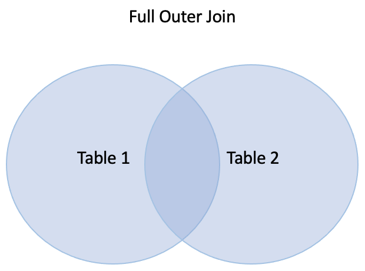
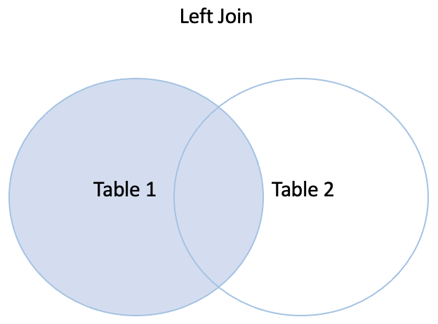

.. _architecture-and-concepts-novice-1-2:

Novice
------

.. _joining-data-1-2:

Joining Data
~~~~~~~~~~~~

.. sidebar:: Summary

  Joining data...

  - creates a comprehensive representation of a data object
  - allows you to work more efficiently and logically when modelling your data

When working with data, you will often find yourself in situations where you need to join data. By joining data you get a comprehensive representation of a data object that has relations to other isolated data objects. In general, you join data because it gives you a more complete picture of a data object and its relation to other data objects. This allows you to work more efficiently and logically when you model your data towards a target state.

In Sesam you will also experience the need for joining data, and this is a functionality Sesam excels at. To outline the different possibilities when joining data, given the two data objects "foo" and "bar", the below example will be used. It draws upon the Sesam syntax and as such is something you will be using down the road. Here goes:

.. code-block:: json

	{
	  "_id": "foo",
	  "value": 1,
	  "values": [1, 2, 4, 5]
	}
	{
	  "_id": "bar",
	  "value": 1,
	  "values": [1, 3, 4, 6]
	}

There are four different kinds of joins. In the below outline, "eq" is an abreviation for equals and "foo.value" is to denote that you search in the "foo" data object in the key "value":

- One-to-one join: ["eq", "foo.value", "bar.value"]
- One-to-many: ["eq", "foo.value", "bar.values"]
- Many-to-one: ["eq", "foo.values", "bar.value"]
- Many-to-many: ["eq", "foo.values", "bar.values"]

The rule for joins is very simple: if any of the values overlap, then the join succeeds.

All of the four joins given above succeed for the two data objects given, because they all have overlapping values, i.e. the values 1 and 4.

.. seealso::

  :ref:`concepts` > :ref:`concepts-merging`

  :ref:`developer-guide` > :ref:`DTLReferenceGuide` > :ref:`expression_language`

.. _make-namespaced-identifiers-for-foreign-keys-make-ni-1-2:

Make namespaced identifiers for foreign keys - make-ni
~~~~~~~~~~~~~~~~~~~~~~~~~~~~~~~~~~~~~~~~~~~~~~~~~~~~~~

.. sidebar:: Summary

  Namespaced identifiers...

  - are used to reference an identifier in a related dataset
  - can be created in DTL by using the functions ``["make-ni"]`` or ``["ni"]``

Continuing along the lines of joining data, namespaced identifiers (NIs) come into play. NIs in Sesam are used to reference an identifier or a NI in a related dataset. In order to create them, you can use either of the two functions: ``["make-ni"]`` or ``["ni"]``.

In the below example, ``["make-ni"]`` will be used. A NI in Sesam works like a foreign key in a relational database. As such, it shows the relation between data objects and enables the joining of these. The pipe config presented in the below example, shows exactly this:  

.. code-block:: json

	{
	  "_id": "mssql-accounts",
	  "type": "pipe",
	  "source": {
	    "type": "sql",
	    "system": "sesam-training",
	    "table": "accounts"
	  },
	  "transform": {
	    "type": "dtl",
	    "rules": {
	      "default": [
	        ["copy", "*"],
	        ["add", "rdf:type",
	          ["ni", "mssql-accounts", "accounts"]
	        ],
	        ["make-ni", "mssql-contacts", "phone"]
	      ]
	    }
	  }
	}

and will result in the following dataset when run. For the purpose of spacing, only one entity is shown:

.. code-block:: json

	{
	  "mssql-accounts:country": "DK",
	  "mssql-accounts:id": 40,
	  "mssql-accounts:phone": "1-894-115-3398",
	  "mssql-accounts:phone-ni": "~:mssql-contacts:1-894-115-3398",
	  "mssql-accounts:position": "CEO",
	  "rdf:type": "~:mssql-accounts:accounts"
	}

As can be seen in the above dataset, the property with the key "mssql-accounts:phone-ni" is the result of the function ``["make-ni"]`` as defined in the above pipe config. The value can be used to join data between the pipes "mssql-accounts" and "mssql-contacts" so that data can be merged to create complete representations of a related set of data objects. In Sesam, a merge is typically done on different datasets in the global stage of data modelling.

.. seealso::

  :ref:`concepts` > :ref:`concepts-namespaces`

  :ref:`developer-guide` > :ref:`DTLReferenceGuide` > :ref:`expression_language` > :ref:`namespaced-identifiers`

.. _sesams-approach-to-semantics-RDF-1-2:

Sesams approach to semantics - RDF
~~~~~~~~~~~~~~~~~~~~~~~~~~~~~~~~~~

.. sidebar:: Summary

  "RDF"...

  - stands for Resource Description Framework and is a standard for describing web resources and data interchange
  - consists of statements about a particular subject, which is given as a triple: ``subject predicate object``
  - is applied in DTL by adding namespaces and namespaced identifiers 

RDF stands for Resource Description Framework and is a standard for describing web resources and data interchange. Sesam has several features to facilitate working with RDF data both as `input <https://docs.sesam.io/rdf-support.html?highlight=rdf#rdf-input>`_, when doing transforms and finally when exposing or producing data for `external consumption <https://docs.sesam.io/rdf-support.html?highlight=rdf#rdf-output>`_.

The RDF data model consists in essence of statements about a particular subject. This is given as a triple:

::

	subject predicate object

To put the above into perspective, let us imagine the following: You are importing data from HubSpot into your Sesam node. HubSpot is a CRM platform. As such, HubSpot will contain organisational data. What we are interested in illustrating is how Sesam applies its RDF standard to HubSpot data entering Sesam and also what the following example shows:

HubSpot example data: 

.. code-block:: json

	{
		"results":
		[
			{
			"id": 1,
			"name": "MIT",
			"progress_state": 1,
			"owner": "Nohar Vard"
			},
			{
				"id": 2,
				"name": "Harvard",
				"progress_state": 2,
				"owner": "Nom It"
			}
		]
	}

Pipe configuration:

.. code-block:: json

	{
	  "_id": "hubspot-organisation",
	  "type": "pipe",
	  "source": {
    "type": "rest",
    "system": "hubspot",
    "id_expression": "{{ id }}",
    "operation": "get",
    "payload_property": "results",
    "properties": {
      "url": "companies?properties=*"
    },
	  "transform": {
	    "type": "dtl",
	    "rules": {
	      "default": [
	        ["copy", "*"],
	        ["add", "rdf:type",
	          ["ni", "hubspot-organisation", "organisation"]
	        ]]
	      ]
	    }
	  }
	}

From the above pipe configuration you will get the following output when the pipe completes a run:

.. code-block:: json

	{
		"_id": "hubspot-organisation:1",
		"hubspot-organisation:id": 1,
		"hubspot-organisation:name": "MIT",
		"hubspot-organisation:progress_state": 1,
		"hubspot-organisation:owner": "Nohar Vard",
		"rdf:type": "~:hubspot-organisation:organisation"
	},
	{
		"_id": "hubspot-organisation:2",
		"hubspot-organisation:id": 2,
		"hubspot-organisation:name": "Harvard",
		"hubspot-organisation:progress_state": 2,
		"hubspot-organisation:owner": "Nom It",
		"rdf:type": "~:hubspot-organisation:organisation"
	}

Comparing the current state of the data with how it looked prior to having been exposed to the RDF standard in Sesam, you should recognize the semantic changes to the shape of the Hubspot example data. What you in practice see here, is Sesam's RDF standard applied to its data. Each property now consists of a subject, a predicate and an object. To exemplify: ``"hubspot-organisation`` is the subject, ``id"`` is a predicate and ``1`` is the object.   

.. seealso::

	:ref:`developer-guide` > :ref:`working-with-RDF`

  :ref:`concepts` > :ref:`concepts-namespaces`

  :ref:`developer-guide` > :ref:`DTLReferenceGuide` > :ref:`expression_language` > :ref:`namespaced-identifiers`

.. _full-outer-join-merge-1-2:

Full outer Join - Merge
~~~~~~~~~~~~~~~~~~~~~~~

.. sidebar:: Summary

  Merge...

  - retains all entries from merged datasets

Full outer join is something you will experience in the Sesam terminology as a "merge". A merge, like the full outer join, retains all entries from i.e. two merged data objects. Graphically, a full outer join will look like the following:

   Figure – Full Outer Join

A note on the handling of null values. In Sesam null values are not existing. Meaning, as opposed to a full outer join which will populate empty entries in the join between tables with null values, the merge in Sesam will by default never have to do this. To exemplify, look at the below example: 

.. code-block:: json
	
	{
	  "_id": "first_entity:foo",
	  "first_entity:value": 1,
	  "first_entity:string":"Hello merge",
	  "first_entity:values": [1, 2, 4, 5]
	}
	{			
	  "_id": "second_entity:bar",
	  "second_entity:value": 1,
	  "second_entity:string":"This is retained",
	  "second_entity:values": [1, 3, 4, 6]
	}

and the merged result, if we choose to retain the first ``"_id"`` of the above two data objects and join the data on the value property:

.. code-block:: json

	{
	  "_id": "first_entity:foo",
	  "first_entity:value": 1,
	  "first_entity:string":"Hello merge",
	  "first_entity:values": [1, 2, 4, 5],
	  "second_entity:value": 1,
	  "second_entity:string":"This is retained",
	  "second_entity:values": [1, 3, 4, 6],
	  "$ids": [
	    "~:first_entity:foo",
	    "~:second_entity:bar"
	  ]
	}

What should immediately get your attention would be the ``"$ids"`` property in the merged result. Sesam utilizes this property to keep track of which ``"_id"s`` have been merged and as such aids in data governance, as you do your data modelling.  

.. seealso::

  :ref:`concepts` > :ref:`concepts-merging`

  :ref:`developer-guide` > :ref:`configuration` > :ref:`source_section` > :ref:`merge_source`

.. _left-join-hops-1-2:

Left Join - Hops
~~~~~~~~~~~~~~~~

.. sidebar:: Summary

  Hops...

  - appends data
  - returns data even if there are no matches for a particular entry

In addition to a full outer join it is also relevant to talk about the left join. This is because you in the Sesam terminology will use something we call "hops". The hops is similar to a left join, in that it appends data and returns data even if there are no matches for a particular entry in the join. As such, in cases where you append data, null values in Sesam are retained. A graphical representation of the left join can be viewed in the below figure:

   Figure – Left Join

To illustrate the graphical representation of a left join, the following practical example has been drafted:

.. code-block:: json
	
	{
	  "_id": "first_entity:foo",
	  "first_entity:value": 1,
	  "first_entity:string":"Hello merge",
	  "first_entity:values": [1, 2, 4, 5]
	}
	{			
	  "_id": "second_entity:bar",
	  "second_entity:value": 1,
	  "second_entity:string":"This is retained",
	  "second_entity:values": [1, 3, 4, 6]
	}
	{			
	  "_id": "third_entity:the_runt",
	  "third_entity:value": 1,
	  "third_entity:string":"Third's the charm"
	}

When applying the hops, our point of reference will be the first data object from the above and we will name the new property ``"left_join_result"``. We will choose to join the data on the ``"value"`` property present in all of the above three data objects in order to return the ``"values"`` property. Albeit, the ``"values"`` property is only present on the first two data objects. The expected result can be seen below:

.. code-block:: json

  {
    "_id": "first_entity:foo",
    "first_entity:value": 1,
    "first_entity:string":"Hello merge",
    "first_entity:values": [1, 2, 4, 5],
    "first_entity:left_join_result": [{"second_entity:values": [1, 3, 4, 6], null}]
  }

As stated earlier, it is important to note that in this case, null values will be returned if the hops is not possible between individual data objects, which can be seen in the new property ``"left_join_result"``, where the last entry is null.  

.. seealso::

	:ref:`best-practices` > :ref:`data-enrichment`

.. _global-1-2:

Global
~~~~~~

.. sidebar:: Summary

  Globals...

  - provide all data related to a specific concept
  - allows you to define golden records by using the ``["coalesce"]`` function

Global datasets lie at the heart of a well managed Sesam architecture. They are created by global pipes and often consist of aggregated data from several different sources enabling a higher level of semantic structure to a Sesam node. A global dataset is your "one place to go" to find all the data related to a specific concept.

Creating global datasets allows you to:

- 	Semantically group and structure data
		A semantic grouping of the data makes the data itself easier to understand and more intuitive to work with, both in terms of existing architectures and new projects. For existing architectures, separating your data into relatable and recognizable structures allows for more efficient support and error handling. To have all raw source data related to a concept (ie. customer data) directly upstream from a pipe substantially decreases the time you need to localize and to correct a potential issue. 
		Semantic grouping also makes your Sesam architecture more scalable and results in fewer active connections over time.   

-	Setup master data management - Golden records
		One effect of global datasets is the ability to perform active master data management through setting golden records. Golden records are where Sesam architectures may localize and prioritize their master data in order to create a flexible system-wide model. Through golden records you may prioritize which system knows a specific type of data best, which system knows it second best and so on. By ordering systems based on their quality of data for a specific data type Sesam may ensure the highest quality of data possible. Another benefit of golden records are their reusability. Once their logic has been created a golden record may be used by any project downstream from its global dataset, thus saving both time and energy.

		Golden records are created with the ``["coalesce"]`` function, as shown in the example below.

	A global pipe, ``global-person``, has three source datasets, crm-person, hr-person and economy-person. The crm-person dataset has high quality work experience data and medium quality hours logged data. The hr-person dataset has high quality personal information and the economy-person dataset has high quality hours logged data. In our global pipe ``global-person`` we wish to set 3 golden records: email, weekly-hours-billed and hours-pr-project. By using the "coalesce" function we may specify which source dataset has the master data for which specific variable.

	For example we might assume that hr-person should be master for "email", crm-person should be master for "hours-pr-project" and economy-person should be master for weeky-hours-billed. This may be setup by the following logic:

.. code-block:: json
  :linenos:

  ["add", "email",
    ["coalesce",
      ["list", "_S.hr-person:email", "_S.crm-person:Email", "_S.economy-person:e-mail"]
    ]
  ]

In this case, all three source datasets have an email property. If the email property from hr-person is not null it will be used for our global property. If it is null then the Email property from crm-person will be evaluated, and so on. 

.. code-block:: json
  :linenos:	

  ["add", "hours-pr-project",
    ["coalesce",
      ["list", "_S.crm-person:hours-pr-project", "_S.economy-person:hours-pr-project"]
  ]

  ["add", "weekly-hours-billed",
    ["coalesce",
      ["list", "_S.economy-person:weekly-hours-billed", "_S.crm-person:weekly-hours-billed"]
    ]
  ] 

The dataset hr-person does not contain any data regarding "hours-pr-project" or "weekly-hours-billed" and can therefore be left out of the prioritations. 
The dataset hr-person does not contain any data regarding "hours-pr-project" or "weekly-hours-billed" and can therefore be left out of the prioritizations.

.. seealso::

	:ref:`best-practices` > :ref:`collecting-data` > :ref:`collecting_data-Global pipes / datasets`

	:ref:`developer-guide` > :ref:`data-modelling` > :ref:`best-practice-workflow` > :ref:`best-practice-global-pipes`

.. _guidelines-inbound-and-outbound-pipes-1-2:

Guidelines - inbound and outbound pipes
~~~~~~~~~~~~~~~~~~~~~~~~~~~~~~~~~~~~~~~

.. sidebar:: Summary

  Inbound pipes...

  - handles data when it enters Sesam
  - should retain "raw" data integrity
  - should ensure reusability with regards to modelling purposes

  Outbound pipes...

  - should be used for late schema binding to target systems

As established above, an important aspect when modelling data in Sesam is the use of globals. Albeit before reaching the global stage and after completion of the global stage, when modelling your data the following guidelines apply:

Inbound pipes
#############

As data enters Sesam it is handled in inbound pipes. An inbound pipe should be as generic as possible with regards to the amount of shaping done on the data that flows through to its dataset. The reason being, in order for you to make the best possible modelling decisions downstream, you should look at the "raw" data first to get a complete understanding of the condition of the data. In addition, we want to assume as little as possible about how the data will be used by current and future recipients. Therefore,
if we start shaping and customizing data too soon in the flow, it's much harder, if not impossible, to reuse the data for different purposes later. A rule of thumb is therefore to minimize the amount of DTL used in an inbound pipe and try to just copy everything, or close to everything. Special cases can occur when you need to do some shaping of the data before reaching the global stage. In such cases, you should aim at making the minimal required DTL changes in order for the data to retain as much of its original integrity as possible.

Outbound pipes
##############

Following the flow of data as it leaves the global stage of modelling, the amount of DTL will increase in the preparation pipes. As you might recall, preparation pipes deliver data to the outbound pipes. It is therefore important to consider the state of the data as it enters an outbound pipe. The reason for this being, as with any inbound pipe, that you should aim at minimizing the amount of DTL needed to shape your data further. This will create robust consumable data that can be delivered seamlessly to your target systems as data flows through your outbound pipes. As with inbound pipes, special cases can occur, where you need to do some additional shaping before the data can be presented in a consumable shape for a given target system. Again, aim at making a minimal set of DTL changes. 

Summary
#######

The amount of DTL in a given pipe with respect to modelling stage in Sesam should increase until the point of modelling stage, where the intent of shaping data is primarily due to target system requirements, as visualized in the below *Figure - DTL Amount*. 

.. figure:: ./media/dtl-amount.png
   :align: center

   Figure – DTL Amount

.. seealso::

  :ref:`developer-guide` > :ref:`data-modelling` > :ref:`best-practice-workflow` > :ref:`best-practice-inbound-pipes`

  :ref:`developer-guide` > :ref:`data-modelling` > :ref:`best-practice-workflow` > :ref:`  best-practice-output-pipes`

.. _filter-entities-on-the-way-out-1-2:

Filter entities on the way out
~~~~~~~~~~~~~~~~~~~~~~~~~~~~~~

.. sidebar:: Summary

  Filtering entities on the way out...

  - ensures that you can work on subsets of datasets
  - are typically used when you are working on large datasets
  - makes sure *_deleted* entities are not received by your target system

Filtering entities after the global stage of modelling is a common use case. Filtering gives the ability to work with subsets of a dataset. It is therefore often used when working on large datasets where you are only interested in a small section of the data. In addition, filtering is often used in outbound pipes as well. This is due to the fact that *_deleted* entities are processed continously as data flows through Sesam and do rarely leave Sesam when first introduced. The *_deleted* property is used in Sesam to flag whether an entity is deleted or not. As such an entity which is deleted will have the property: ``{"_deleted": true},`` whilst an entity that is not deleted will have the property: ``{"_deleted": false}.`` Additionally, *_deleted* entities are not usually something you would like to send to a target system. This is obviously not always the case, but in general that is how things tend to work.

Imagine you are working on a large dataset produced by a global pipe. You quickly recognize that the amount of data and all its properties is not that relevant to you. Therefore, one of the first things you do is to apply a filter on a specific key and value. This leaves you with a subset of the complete data. As you look closely at the state of the data, after having applied your first filter, you are not immediately satisfied. This makes you apply another filter to alter the state of the data further. Therefore, you decide to add a specific property given a specific condition; i.e., if the entity is of type: "Employee" - add properties "Salary", "Position" and "Goals". Finally, if it is not of type "Employee" apply a filter to exclude that entity. As illustrated, it is not unusual to use multiple filters in a DTL config, especially when the amount of DTL increases, and a need for stepwise filtering presents itself.

.. seealso::

  :ref:`developer-guide` > :ref:`DTLReferenceGuide` > :ref:`dtl-transforms`

.. _customize-data-structure-for-endpoints-1-2:

Customize data structure for outbound flows
~~~~~~~~~~~~~~~~~~~~~~~~~~~~~~~~~~~~~~~~~~~

.. sidebar:: Summary

  Customizing data structures for outbound flows...

  - is concerned with late schema binding

An *outbound* dataflow consists of all pipes downstream from a global pipe. In these outbound dataflows it is typically necessary to transform your data so that it aligns with the schema that your target system requires for consumption. Typical functions used when transforming data in the outbound stage could be: ``["add"], ["remove"], ["rename"], ["copy"].``

As an example, the data presented below is produced by the pipe ``global-person``:

.. code-block:: json

	{
	  "global-person:country": "DK",
	  "global-person:id": 40,
	  "global-person:phone": "1-894-115-3398",
	  "global-person:position": "Engineer",
	  "crm-account:positions": ["Engineer", "Salesmanager", "Accountant", "CTO"],
	  "crm-account:hobbies": "Builds LEGO"
	}   

The shape of the data does not immediately satisfy your needs, as you are only interested in working with the properties whose key starts with the namespace ``global-person:``. To solve this you choose to use the copy function where you can define what namespaces you are interested in. In DTL this would be written as

.. code-block:: json

	["copy", "global-person:*"]

and would produce the following data:

.. code-block:: json

	{
	  "global-person:country": "DK",
	  "global-person:id": 40,
	  "global-person:phone": "1-894-115-3398",
	  "global-person:position": "Engineer"
	} 

After comparing the current shape of your data to the target system schema, you realize only the properties "id", "phone" and "position" are needed. In addition, you recognize that the first letter of the keys must be in capital. To solve this in DTL, you would do the following: 

.. code-block:: json
	
	["remove", "country"] 

and 

.. code-block:: json
	
	["rename", "id", "Id"]
	["rename", "phone", "Phone"]
	["rename", "position", "Position"] 

based on the declared DTL functions, this would produce the following:

.. code-block:: json

	{
	  "global-person:Id": 40,
	  "global-person:Phone": "1-894-115-3398",
	  "global-person:Position": "Engineer"
	} 

.. seealso::

  :ref:`best-practices` > :ref:`sharing-data`

.. _change-tracking-data-delta-1-2:

Change tracking & data delta
~~~~~~~~~~~~~~~~~~~~~~~~~~~~

.. sidebar:: Summary

  Change tracking & data delta...

  - allows Sesam to process and update data only when it changes
  - ensures minimal latency
  - increases agility when synchronizing systems

Change tracking and data delta allows Sesam to process and update data only when it changes. This ensures minimal latency and increased agility both when importing data from source systems and when processing data through internal pipes towards target systems.

Firstly, when reading data from a source system, if supported by the source, it may be possible to just ask for the data that have changed since the last time. This mechanism uses entries from the source, such as a last updated time stamp, to ensure that only data that have been created, deleted or modified are processed. 

Secondly, the first time data flows through a pipe in Sesam that pipe's dataset will be created. Datasets consist of entities and on each entity a ``_hash`` property will be created. This ``_hash`` property enables change tracking and data delta when data enters or flows through Sesam. When an entity's ``_hash`` value changes, any downstream pipes register this change and recognizes it as a new sequence number that needs to be processed again.

.. seealso::

  :ref:`concepts` > :ref:`concepts-datasets`

  :ref:`concepts` > :ref:`concepts-features` > :ref:`concepts-change-tracking`

  :ref:`developer-guide` > :ref:`entity_data_model`

  :ref:`developer-guide` > :ref:`entity_data_model` > :ref:`reserved-fields`

.. _tasks-for-architecture-and-concepts-novice-1-2:

Tasks for Architecture and Concepts: Novice
~~~~~~~~~~~~~~~~~~~~~~~~~~~~~~~~~~~~~~~~~~~

#. *Why should inbound pipes retain raw data shape?*

#. *Why is it important to remember to filter on _deleted entities in an outbound pipe?*

#. *What is late schema binding?*

#. *What are the three different categorizations of pipes in Sesam with regards to a dataflow?*
