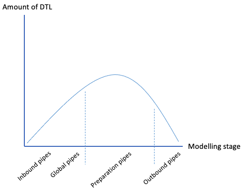

.. _architecture-and-concepts-novice-1-2:

Architecture and Concepts: Novice
---------------------------------

.. _joining-data-1-2:

Joining Data
~~~~~~~~~~~~

The value of joining data

Short overview of what data joining is

1-1, 1-n, n-m

.. _make-namespaced-identifiers-for-foreign-keys-make-ni-1-2:

Make namespaced identifiers for foreign keys - make-ni
~~~~~~~~~~~~~~~~~~~~~~~~~~~~~~~~~~~~~~~~~~~~~~~~~~~~~~

.. _full-outer-join-merge-1-2:

Full outer Join - Merge
~~~~~~~~~~~~~~~~~~~~~~~~~~~~~~~~

All data from input ends up in output

.. _left-join-hops-1-2:

Left Join - Hops
~~~~~~~~~~~~~~~~

Data is appended to the output

.. _global-1-2:

Global
~~~~~~

Golden – the best truth about common attributes of a concept collected
from multiple sources

Coalesce, prioritization of source data (master data)

.. _guidelines-inbound-and-outbound-pipes-1-2:

Guidelines - inbound and outbound pipes
~~~~~~~~~~~~~~~~~~~~~~~~~~~~~~~~~~~~~~~~

As established above, an important aspect when modelling data in Sesam is the use of globals. Albeit before reaching the global stage and after completion of the global stage, when modelling your data the following guidelines apply:

Inbound pipes
#####################

As data enters Sesam it is handled in inbound pipes. An inbound pipe should be as generic as possible with regards to the amount of shaping done on the data that flows through to its dataset. The reason being, in order for you to make the best possible modelling decisions downstream, you should look at the "raw" data first to get a complete understanding of the condition of the data. In addition, we want to assume as little as possible about how the data will be used by current and future recipients. Therefore,
If we start shaping and customizing data too soon in the flow, it's much harder, if not impossible, to reuse the data for different purposes later. A rule of thumb is therefore to minimize the amount of DTL used in an inbound pipe and try to just copy everything, or close to everything. Special cases can occur when you need to do some shaping of the data before reaching the global stage. In such cases, you should aim at making the minimal required DTL changes in order for the data to retain as much of its original integrity as possible.

Outbound pipes
######################

Following the flow of data as it leaves the global stage of modelling, the amount of DTL will increase in the preparation pipes. As you might recall, preparation pipes deliver data to the outbound pipes. It is therefore important to consider the state of the data as it enters an outbound pipe. The reason for this being, as with any inbound pipe, that you should aim at minimizing the amount of DTL needed to shape your data further. This will create robust consumable data that can be delivered seamlessly to your target systems as data flows through your outbound pipes. As with inbound pipes, special cases can occur, where you need to do some additional shaping before the data can be presented in a consumable shape for a given target system. Again, aim at making a minimal set of DTL changes. 

Summary
#######

The amount of DTL in a given pipe with respect to modelling stage in Sesam should increase until the point of modelling stage, where the intent of shaping data is primarily due to target system requirements, as visualized in the below *Figure - DTL Amount*. 

   Figure – DTL Amount

.. _filter-entities-on-the-way-out-1-2:

Filter entities on the way out
~~~~~~~~~~~~~~~~~~~~~~~~~~~~~~

| Filter gives the ability to stop entities from being sent by providing
  a logical gate.
| On the other hand, it can make sure you only send the entities you
  wish to receive in an endpoint.

| Makes sure the endpoint only receives the entities they want.
| Can stop entities from triggering events they shouldn’t trigger.

| + + many examples
| filtering on source data
| on target data (from hops f.ex) – typical example, hop to
  global-classification and map status, if cancelled then filter

.. _tag-your-entities-categorization-of-sub-concepts-1-2:

Tag your entities - Categorization of sub-concepts
~~~~~~~~~~~~~~~~~~~~~~~~~~~~~~~~~~~~~~~~~~~~~~~~~~

Extra:type - usually added into the globals to separate what entities about the same thing do & mean.

.. _customize-data-structure-for-endpoints-1-2:

Customize data structure for endpoints
~~~~~~~~~~~~~~~~~~~~~~~~~~~~~~~~~~~~~~

| Sesam has transformative functions to add, remove,Copy the attributes
  you want the end system to receive.
| All changes to attributes you add to the target will cause an entity
  update.

Referring to namespace 1.1.15 to know property origin, rename, add, copy

.. _change-tracking-data-delta-1-2:

Change tracking & data delta
~~~~~~~~~~~~~~~~~~~~~~~~~~~~

`All entities stored inside sesam have a
\_hash <https://docs.sesam.io/entitymodel.html?highlight=_hash>`__
value. This is a quantification of an entity and is calculated every
time an entity is processed by a pipe. If the \_hash value changes or is
new, the entity will be stored as a new version in dataset. We call this
change in \_hash value a data-delta.

Any data-delta for an entity in a dataset causes downstream pipes to see
this as a new sequence number they haven’t yet read. This in turn makes
the pipe process the entity. If the processed entity does not exist or
gets a new \_hash in the output of the pipe, it will cause an update to
the output dataset.

.. _tasks-for-architecture-and-concepts-novice-1-2:

Tasks for Architecture and Concepts: Novice
~~~~~~~~~~~~~~~~~~~~~~~~~~~~~~~~~~~~~~~~~~~
