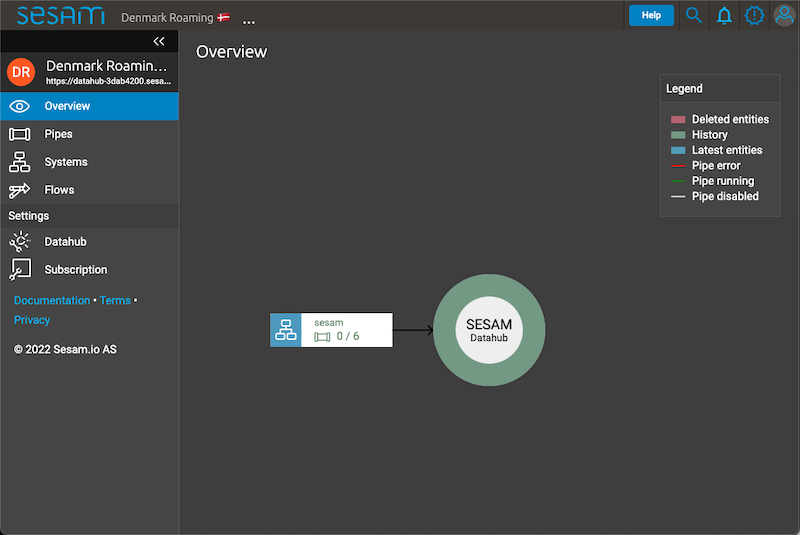
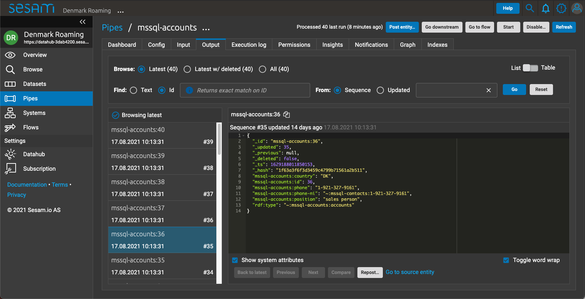
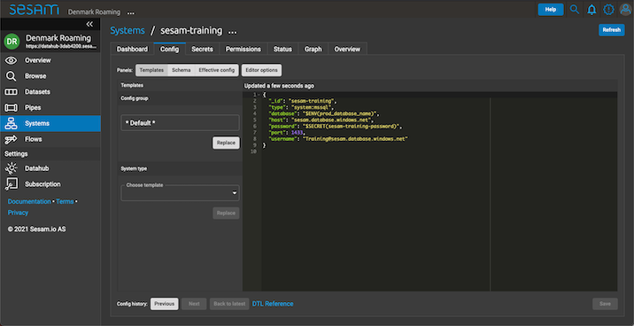
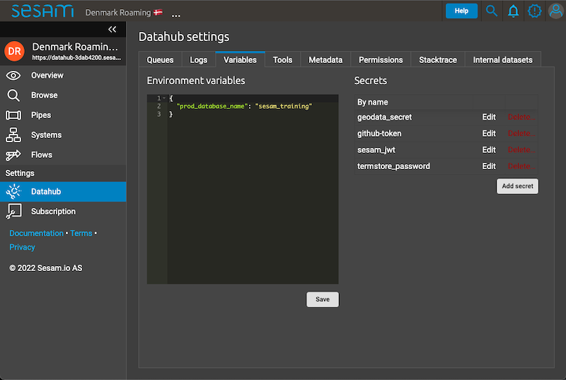

.. _projects-and-infrastructure-beginner-4-1:

Projects & Infrastructure Beginner
----------------------------------

.. _sesam-node-gui-4-1:

Sesam Node GUI
~~~~~~~~~~~~~~

The graphical user interface (GUI) in a Sesam node provides you with a multitude of options. In this section we are going to go through some of these options and explain how they are used when working on a project.

On the below picture the Sesam GUI can be seen.  

.. _figure-sesamGUI-4-1:

   Sesam Node GUI

It is crucial that you learn and feel confident about navigating the vertical menu on the left hand side of the above picture. The tabs "Pipes" and "Systems" will become your bread and butter tabs when working on projects. The tab "Pipes" will display all pipes from inbound to outbound and the "Systems" tab will show both source and target systems. As such, these tabs will hold all the information you need to get an overview as to how data moves through Sesam. In addition, the "Datahub" and "Subscription" tab also plays an important part in projects, especially so when setting up your Sesam node for use or throughout a project as users change, configuration configs need to be updated or groups of users need to be defined.

Tabs
^^^^

The "Pipes" tab will display to you an overview of all the pipes in Sesam. This overview can be sorted and/or filtered depending on your preference or particular use case. When looking at the overview of all the pipes, you can click on a particular pipe `_id` and then you'll jump to the output of that pipe. The output of a pipe is the result of how that pipe transforms the data flowing through that pipe.

.. _figure-pipejump4-1:

   Pipe View

In addition to the output view of a pipe, you will have multiple other views when looking at a particular pipe. These different views can be found horizontally aligned with the "Output" Tab, as can be seen in the above picture as well. The most frequently used are the "Config", "Input", "Output", "Execution Log" and "Graph" Tabs. The "Config" tab entails the rules that transform data flowing through the pipe, the "Input" tab shows the data as is when it enters the pipe, the "Execution log" tab shows diagnostics messages based on pipe runs. To extend on this, when a pipe runs successfully you will find the message *pump completed* at the top of the execution log and when a pipe fails its run you will find "pump failed" at the top of the execution log. Additionally, you will be able to expand these entries in the execution log to gain additional information with regards to individual runs. Finally, the "Graph" tab shows a graphical representation of how data is modelled to and from the pipe you are currently looking at. This makes it extremely easy to get an overview of the modelling landscape as well as how data is connected. By clicking on a specific pipe via the graphical representation you can navigate to other pipes as well, which is really handy for navigating a dataflow. 

Moving onto the "Systems" tab. This tab will hold your start- and endpoints with regards to dataflows in Sesam. This is because Sesam works with systems. Emphasizing the importance of systems here as they both provide Sesam with data and consumes data from Sesam as it is shaped, transformed and/or enriched via dataflows. Typically systems either are databases or microservices. Important here to remember, that inside Sesam anything that produces or consumes data is a system, albeit outside of Sesam these producers or consumers of data can be a wide variety of things. As with pipes, the "Systems" tab will display to you an overview of all the systems currently in Sesam. In addition, you can also click on a particular system `_id` and you'll jump to the config of that system. What you'll see here is what you will typically define as connection parameters. Connection parameters are typically variables like username, password, server, port, database name and/or access token. Obviously these will vary depending on the specific microservice or database in question, albeit it is sure to state that you will always need to apply some of these to connect successfully to a database or microservice inside of Sesam. On the below picture you can see an example system config.

.. _figure-systemconfig4-1:

   System View

As can be seen from the config, all these connection variables are defined in a JSON dictionary. Albeit two of these variables look a little different. This is the `database` and `password` variables. These variables are what we in Sesam call environment variables. The database variable is prefixed with the `$ENV()` and the `password` is prefixed with the `$SECRET()`. To extend on the mechanics of environment variables, you will provide a value that goes inside of the parenthesis, i.e. `$ENV(<my_awesome_example_value>)`. These values are stored in the "Datahub" tab and can be used globally in a Sesam node, i.e. one `$ENV(<global_value_for_multiple_systems>)` can be used in multiple systems. In comparison to `$ENV()` values, the `$SECRET()` values are stored confidentially in Sesam, whilst the `$ENV()` values can be viewed by anyone. As such, `$SECRET()` values can be used globally, albeit viewing their value, is not possible. To clarify, `$SECRET()` values are confidential, whilst `$ENV()` values are not and they are both stored in the "Datahub" tab, which we will talk about now.  

The "Datahub" tab is your view of what is globally in effect on your Sesam node. When navigating to this tab you will be presented with the "Variables" view. This view will show you all the variables defined in your Sesam node and an example of this can be seen in the below picture.

.. _figure-datahubview4-1:

   Datahub View

On the left hand side of the above picture you see what, in a system config, is defined as an `$ENV()` value, i.e. `prod_database_name` holds a value of `sesam_training` and that value can be effectively used in a system. On the right hand side of the above picture, you can see your `$SECRET()` values. Again, these are stored in a confidential way, so you cannot actually retrieve their individual values. You can however, point to them in a system config as explained previously, by using the prefix `$SECRET()`. As an example use case, you could retrieve the value of `sesam_jwt` by doing the following in a system config `$SECRET(sesam_jwt)`. This secret will now hold the value of `sesam_jwt`. Finishing of the "Datahub" tab the "Metadata" view is also quite crucial when working on projects in a Sesam node. In the "Metadata" view you can see all the global settings that will affect how your individual Sesam node will work by default with respect to reading and handling metadata. This means in practice that what is defined in the "Metadata" tab shapes metadata flowing through Sesam passively. As such, you could state that this is the polar opposite of how we use pipes in a project to actively shape, transform and enrich data.

Finally, the "Subscription" tab. This tab is your, you could say, "manage my Sesam node" view. It lets you add users to your node, it lets you look at the amount of data currently in your node and lets you define user groups. You can do way more in the "Subscription" tab but in terms of working on a project, this is usually not where you will spend the majority of your time, so in terms of maximizing your learning gain, we will stick to this for now.  

.. seealso::

  Learn Sesam > Architecture & Concepts: :ref:`systems-1-1`
  
  Learn Sesam > Architecture & Concepts: :ref:`pipes-1-1`

  Getting started: :ref:`getting-started-microservices`

  Developer Guide > Service Configuration > Systems: :ref:`microservice_system`

.. _sesam-cli-4-1:

sesam-CLI
~~~~~~~~~

NB!! IKKE BRUK SYNCCONFIG TIL Å LASTE OPP/NED TIL AKTIVE NODER (PROD)

pre-requisite lære seg hvordan man installerer det.

lag en sesam-init <- feature request

setup

expected folder

test.conf.json

whitelist/blacklist

test.json

entiteter

env-var-folder

set up vars for different environments

test-env

.syncconfig

jwt, node

kommandoer

sesam upload/download

test

update

-print-scheduler-log

-vv

-use-internal-scheduler

wipe

restart

verify

run

-version

Hvordan funker expected output

.. seealso::

  TODO

.. _testing-and-testdata-4-1:

Testing & Testdata
~~~~~~~~~~~~~~~~~~

testing

Manuell testing med sesam-cli før opplasting til versjonskontroll

Manuell testing med config-group på live node

Automatisk testing med ci-node

Testdata

Bør lage data som reflekterer virkelige koblinger mellom data i systemer

Bør være nok for å beskrive de caser man kan møte i virkeligheten

Bør ikke være all data i prod

Bør være anonymisert

Bør reflektere \*innkommende\* data

Bør utvidet behov legges til data, ikke endre eksisterende

Bør gis navn utfra det case du vil teste, f.eks gi entiteten navn utfra
casen

Dokumenter testdata

\\\oppdater prosjekt i docs utfra hva vi skriver\\\

Hvordan funker expected output

.. seealso::

  TODO

.. _documentation-4-1:

Documentation
~~~~~~~~~~~~~

.. sidebar:: Summary

  The documentation ...

  - can be divided into Sesam documentation and DTL documentation
  - concerning Sesam consists of general as well as technically specific themes
  - concerning DTL consists of explanations and pratictical examples when using DTL functions

In terms of documentation, we will diffentiate between the Sesam documentation and DTL documentation. The Sesam documentation will be concerned with the understanding of Sesam as a concept and as a datahub whilst DTL documentation will be concerned with how you should document what you do in your pipes, as you model your data. 

The Sesam Documentation
^^^^^^^^^^^^^^^^^^^^^^^

The Sesam documentation can be found here: `Sesam documentation <https://docs.sesam.io/>`_. The documentation consists of anything from general themes to more technically specific themes. With regards to working on a project, the following links might be of particular interest to you:

- `Getting Started <https://docs.sesam.io/getting-started.html>`_
- `Best Practices <https://docs.sesam.io/best-practices.html>`_
- `Developer Guide <https://docs.sesam.io/developer-guide.html>`_

In addition, there is also the search function available on the Sesam documentation. This function is quite handy in case you want to search for something specific as you can search through the whole documentation, i.e: Filtering, Oracle DB etc.

The DTL Documentation
^^^^^^^^^^^^^^^^^^^^^

DTL is in many ways similar to any programming language you might know of. It is not heavily object oriented, albeit it does support the usage of multiple functions in order to transform your data as it moves through Sesam. As such you should conform to concepts such as "Clean Code" i.e: Naming convention should be logical and semantically concise. In addition, DTL supports implementation of a ``comment`` function. This function can be used to document what a given DTL section or function does, i.e: ``["comment", "The following function named 'checkingForNull' runs through your array and filters all entries that equals null."]``. As outlined, a ``comment`` function that makes it easy and convenient to document DTL logic when needed. Finally, DTL also supports adding a ``description`` function, which will display what a pipe does, when hovering over a given pipe in the Pipes view, i.e: ``["description", "This pipe transforms data to add customer loyalty and segments customers based on loyalty score"]``.    

.. hint::

  - when searching for specific DTL functions in the DTL documentation, search by hitting ``Ctrl/Cmd + f`` and type in the specific DTL function you want to look at in the search dropdown.

  - the `Service Configuration <https://docs.sesam.io/configuration.html>`_ is a good resource to look at when wanting to set up a new pipe and/or system.

.. seealso::

  Sesam Node GUI: :ref:`sesam-node-gui-4-1`

  The Sesam Documentation: :ref:`sesam-master-data-hub`

  Developer Guide > Service Configuration: :ref:`configuration`

.. _jwt-authentication-4-1:

JWT/Authentisering
~~~~~~~~~~~~~~~~~~

Hvordan fungerer JWT’er?

NB: Skal snake mer om API I sesam-in-the-wild

.. seealso::

  TODO

.. _groups-and-permissions-4-1:

Groups & Permissions
~~~~~~~~~~~~~~~~~~~~

Hvordan virker det

Får man satt opp tilgangsstyring i Sesam?

.. seealso::

  TODO

.. _tasks-for-projects-infrastructure-beginner-4-1:

Tasks for Projects & Infrastructure: Beginner
~~~~~~~~~~~~~~~~~~~~~~~~~~~~~~~~~~~~~~~~~~~~~
