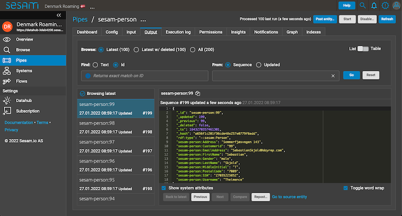
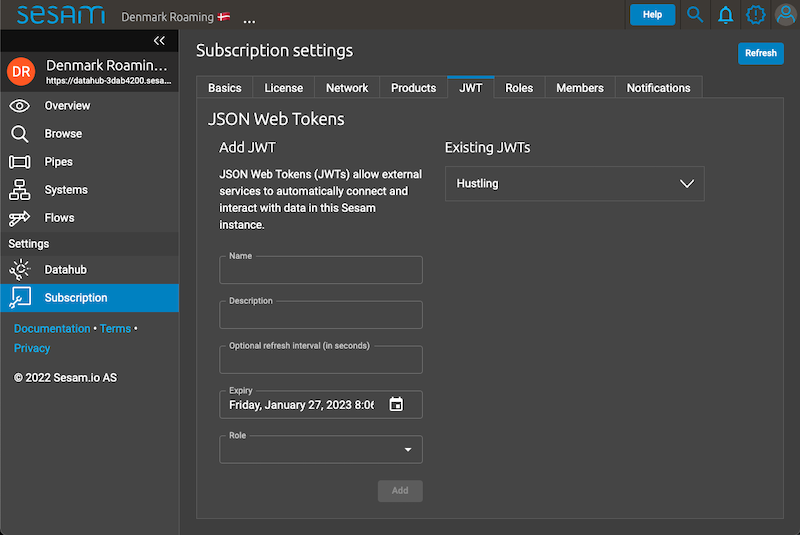

.. _projects-and-infrastructure-beginner-4-1:

Projects & Infrastructure Beginner
----------------------------------

.. _sesam-node-gui-4-1:

Sesam Node GUI
~~~~~~~~~~~~~~

The graphical user interface (GUI) in a Sesam node provides you with a multitude of options. In this section we are going to go through some of these options and explain how they are used when working on a project.

On the below picture the Sesam GUI can be seen.  

.. _figure-sesamGUI-4-1:
.. figure:: ./media/Sesam_GUI.png
   :align: center

   Sesam Node GUI

It is crucial that you learn and feel confident about navigating the vertical menu on the left hand side of the above picture. The tabs "Pipes" and "Systems" will become your bread and butter tabs when working on projects. The tab "Pipes" will display all pipes from inbound to outbound and the "Systems" tab will show both source and target systems. As such, these tabs will hold all the information you need to get an overview as to how data moves through Sesam. In addition, the "Datahub" and "Subscription" tab also plays an important part in projects, especially so when setting up your Sesam node for use or throughout a project as users change, configuration configs need to be updated or groups of users need to be defined.

Tabs
^^^^

The "Pipes" tab will display to you an overview of all the pipes in Sesam. This overview can be sorted and/or filtered depending on your preference or particular use case. When looking at the overview of all the pipes, you can click on a particular pipe `_id` and then you'll jump to the output of that pipe. The output of a pipe is the result of how that pipe transforms the data flowing through that pipe.

.. _figure-pipejump4-1:

   Pipe View

In addition to the output view of a pipe, you will have multiple other views when looking at a particular pipe. These different views can be found horizontally aligned with the "Output" Tab, as can be seen in the above picture as well. The most frequently used are the "Config", "Input", "Output", "Execution Log" and "Graph" Tabs. The "Config" tab entails the rules that transform data flowing through the pipe, the "Input" tab shows the data as is when it enters the pipe, the "Execution log" tab shows diagnostics messages based on pipe runs. To extend on this, when a pipe runs successfully you will find the message *pump completed* at the top of the execution log and when a pipe fails its run you will find "pump failed" at the top of the execution log. Additionally, you will be able to expand these entries in the execution log to gain additional information with regards to individual runs. Finally, the "Graph" tab shows a graphical representation of how data is modelled to and from the pipe you are currently looking at. This makes it extremely easy to get an overview of the modelling landscape as well as how data is connected. By clicking on a specific pipe via the graphical representation you can navigate to other pipes as well, which is really handy for navigating a dataflow. 

Moving onto the "Systems" tab. This tab will hold your start- and endpoints with regards to dataflows in Sesam. This is because Sesam works with systems. Emphasizing the importance of systems here as they both provide Sesam with data and consumes data from Sesam as it is shaped, transformed and/or enriched via dataflows. Typically systems either are databases or microservices. Important here to remember, that inside Sesam anything that produces or consumes data is a system, albeit outside of Sesam these producers or consumers of data can be a wide variety of things. As with pipes, the "Systems" tab will display to you an overview of all the systems currently in Sesam. In addition, you can also click on a particular system `_id` and you'll jump to the config of that system. What you'll see here is what you will typically define as connection parameters. Connection parameters are typically variables like username, password, server, port, database name and/or access token. Obviously these will vary depending on the specific microservice or database in question, albeit it is sure to state that you will always need to apply some of these to connect successfully to a database or microservice inside of Sesam. On the below picture you can see an example system config.

.. _figure-systemconfig4-1:
.. figure:: ./media/systemconfig.png
   :align: center

   System View

As can be seen from the config, all these connection variables are defined in a JSON dictionary. Albeit two of these variables look a little different. This is the `database` and `password` variables. These variables are what we in Sesam call environment variables. The database variable is prefixed with the `$ENV()` and the `password` is prefixed with the `$SECRET()`. To extend on the mechanics of environment variables, you will provide a value that goes inside of the parenthesis, i.e. `$ENV(<my_awesome_example_value>)`. These values are stored in the "Datahub" tab and can be used globally in a Sesam node, i.e. one `$ENV(<global_value_for_multiple_systems>)` can be used in multiple systems. In comparison to `$ENV()` values, the `$SECRET()` values are stored confidentially in Sesam, whilst the `$ENV()` values can be viewed by anyone. As such, `$SECRET()` values can be used globally, albeit viewing their value, is not possible. To clarify, `$SECRET()` values are confidential, whilst `$ENV()` values are not and they are both stored in the "Datahub" tab, which we will talk about now.  

The "Datahub" tab is your view of what is globally in effect on your Sesam node. When navigating to this tab you will be presented with the "Variables" view. This view will show you all the variables defined in your Sesam node and an example of this can be seen in the below picture.

.. _figure-datahubview4-1:
.. figure:: ./media/datahubview.png
   :align: center

   Datahub View

On the left hand side of the above picture you see what, in a system config, is defined as an `$ENV()` value, i.e. `prod_database_name` holds a value of `sesam_training` and that value can be effectively used in a system. On the right hand side of the above picture, you can see your `$SECRET()` values. Again, these are stored in a confidential way, so you cannot actually retrieve their individual values. You can however, point to them in a system config as explained previously, by using the prefix `$SECRET()`. As an example use case, you could retrieve the value of `sesam_jwt` by doing the following in a system config `$SECRET(sesam_jwt)`. This secret will now hold the value of `sesam_jwt`. Finishing of the "Datahub" tab the "Metadata" view is also quite crucial when working on projects in a Sesam node. In the "Metadata" view you can see all the global settings that will affect how your individual Sesam node will work by default with respect to reading and handling metadata. This means in practice that what is defined in the "Metadata" tab shapes metadata flowing through Sesam passively. As such, you could state that this is the polar opposite of how we use pipes in a project to actively shape, transform and enrich data.

Finally, the "Subscription" tab. This tab is your, you could say, "manage my Sesam node" view. It lets you add users to your node, it lets you look at the amount of data currently in your node and lets you define user groups. You can do way more in the "Subscription" tab but in terms of working on a project, this is usually not where you will spend the majority of your time, so in terms of maximizing your learning gain, we will stick to this for now.  

.. seealso::

  Learn Sesam > Architecture & Concepts: :ref:`systems-1-1`
  
  Learn Sesam > Architecture & Concepts: :ref:`pipes-1-1`

  Getting started: :ref:`getting-started-microservices`

  Developer Guide > Service Configuration > Systems: :ref:`microservice_system`

.. _sesam-cli-4-1:

sesam-CLI
~~~~~~~~~

.. sidebar:: Summary

  The Sesam CLI is...

  - a command line interface
  - a tool that supports CI/CD workflows

  and the most common command workflow is... 

  - ``sesam wipe`` - wipes your Sesam node
  - ``sesam upload`` - uploads a local node config to your Sesam node 
  - ``sesam download`` - downloads a node config to your local machine repo 
  - ``sesam test`` - runs all dataflows and compares expected with actual outcome
  - ``sesam update`` - updates your tests to account for recent changes
  - ``sesam verify`` - verify that your tests now run successfully

The Sesam command line interface (CLI) is used in order to support continous integration/continous deployment (CI/CD) workflows. This is especially handy when multiple people are working on the same project and changes the node configuration when they want to. The Sesam node configuration is typically stored in GitHub to make it accessible and allow for version control.
 
In order to use the Sesam CLI you will need to install it. The repository for installing it can be found `here <https://github.com/sesam-community/sesam-py>`_. Upon successfully installing the Sesam CLI you should verify your installation by running the following command from your command prompt or terminal ``sesam -version``. If your terminal outputs a semantic version of Sesam you are good to go.

Starting using the Sesam CLI on a project you should verify your local copy of the node config located on GitHub is up to date with recent changes. This is a rule of thumb when collaborating on a given CI/CD workflow across multiple local contributors. As such, *Always* pull recent changes, before starting to work on anything locally. If this is your very first time working on a project you presumably do not have any Sesam configs on your local machine or in your personal Sesam development node. By cloning the node config located on GitHub, configuring the ``.syncconfig`` file and running ``sesam test``, your node will sync itself with the state of your cloned GitHub repository. 

After having made sure your local node config is up to date with the remote node config, you will typically do the following: 

  1) Make a branch from the master branch in GitHub.
  2) Wipe your Sesam development node by running: ``sesam wipe``. 
  3) Run ``sesam upload`` to upload your local node config to your Sesam development node, accessible in your preferred browser. 

  **Note**: Remember to run ``sesam download`` to save your current Sesam development node config, if you want to retain those changes before running ``sesam wipe`` as ``sesam wipe`` will not save your current Sesam development node config for you.

In addition to all of the above, you should create an ``expected/`` folder. The preferred way of doing this is to run ``sesam update`` which will create the ``expected/`` folder with template test configs for you automatically. Alternatively, you can create an empty ``expected/`` folder yourself. The ``expected/`` folder should be placed in the root of your already existing ``node/`` folder. The ``expected/`` folder will hold all of your ``*.test.json`` config files. The ``*`` symbol denotes that every string value goes here. When finished with making config changes in your Sesam development node, then run ``sesam download`` followed by ``sesam test`` to check how your recently completed changes might affect the expected ouput placed in the ``expected/`` folder. The ``sesam test`` command compares the outcome produced by running all dataflows created in your Sesam development node against what is currently expected in the ``expected/`` folder. As an example, imagine you have made changes to the pipe config ``salesforce-person``, then what you want to make sure is that these changes are not disrupting any expected output present in the ``expected/`` folder. Your command prompt or terminal will let you know whether or not your tests passed. In case your tests failed, you can run ``sesam update`` followed by ``sesam verify`` to respectively update the ``expected/`` folder and verify the current state of what is expected equals what is produced via the dataflow run-throughs. Upon verification, you can add and/or commit your local changes and make a pull request to the master branch connected to your global repository state present on GitHub.

Finally, alteration to environment variables, i.e. adding new ones or removing new ones is a manual process and you'll need to navigate to the ``variables/`` folder placed in the root of your node repository. In the ``variables/`` folder you'll find a file that holds all your environment variables. Again *remember* to alter the contents of this file you need to manually add or remove specific environment variables.            

.. seealso::

  `Sesam Command Line Interface repository <https://github.com/sesam-community/sesam-py>`_

  Tools > Sesam Client :ref:`concepts-sesam-client`

  Best Practices > Working on a Sesam Project :ref:`setting-up-a-new-sesam-project`

.. _testing-and-testdata-4-1:

Testing & Testdata
~~~~~~~~~~~~~~~~~~

testing

Manuell testing med sesam-cli før opplasting til versjonskontroll

Manuell testing med config-group på live node

Automatisk testing med ci-node

Testdata

Bør lage data som reflekterer virkelige koblinger mellom data i systemer

Bør være nok for å beskrive de caser man kan møte i virkeligheten

Bør ikke være all data i prod

Bør være anonymisert

Bør reflektere \*innkommende\* data

Bør utvidet behov legges til data, ikke endre eksisterende

Bør gis navn utfra det case du vil teste, f.eks gi entiteten navn utfra
casen

Dokumenter testdata

\\\oppdater prosjekt i docs utfra hva vi skriver\\\

Hvordan funker expected output

.. seealso::

  TODO

.. _documentation-4-1:

Documentation
~~~~~~~~~~~~~

Hvordan bruke docs.sesam.io

developer guide!!

ctrl + f "hva du tror funksjon heter"

Hvordan dokumentere

Schema definition

hva mener vi er dokumentasjon

Generell dokumentasjon

DTL dokumentasjon(comments)

clean code

.. seealso::

  TODO

.. _jwt-authentication-4-1:

JWT/Authentisering
~~~~~~~~~~~~~~~~~~

A JSON Web Token (JWT) is an open standard that is a compact and self-contained means of securely transmitting information between parties as a JSON object, i.e: A user and a Sesam node. JWTs, from a Sesam point of view, are used to allow a user to authenticate towards the Sesam Service API. This will in essence allow a user to communicate with a Sesam node without having to authenticate towards a Sesam node in your preferred browser. Everything from scripts and/or CLIs can now be used to communicate with your Sesam node.

To create a JWT you need to navigate to the following page:

.. _figure-SesamJWT-4-1:

   Sesam JWT

.. seealso::

  Sesam in the Wild: :ref:`sesam-in-the-wild-beginner-6-1`

  Developer Guide > Service API :ref:`api-top`

  Tools > Databrowser :ref:`databrowser_ini_authorization_via_jwt_token`

.. _groups-and-permissions-4-1:

Groups & Permissions
~~~~~~~~~~~~~~~~~~~~

Hvordan virker det

Får man satt opp tilgangsstyring i Sesam?

.. seealso::

  TODO

.. _tasks-for-projects-infrastructure-beginner-4-1:

Tasks for Projects & Infrastructure: Beginner
~~~~~~~~~~~~~~~~~~~~~~~~~~~~~~~~~~~~~~~~~~~~~
