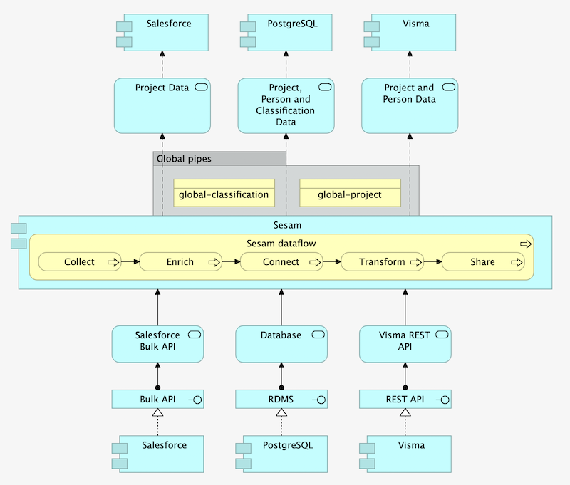

.. _projects-infrastructure-novice-4-2:

Novice
------

.. _node-config-4-2:

Node config
~~~~~~~~~~~

.. sidebar:: Summary

  The Node config...

  - is a Sesam node´s skeletal structure
  - consists of configuration files   

The node config in a Sesam node is like its skeletal structure. An example of said skeletal structure is presented below:

::

  my-project-directory/
    ├ node/
    | ├ expected/
    | ├ pipes/
    | ├ systems/
    | ├ variables/
    | | ├ development.json
    | | ├ test.json
    | | └ production.json
    | └ node-metadata.conf.json    
    ├ README.md
    ├ LICENSE
    ├ .gitignore
    ├ test-env.json
    └ ++

The folder ``my-project-directory/`` will be your root folder. You will typically give this folder a name specific to the project you are working on, i.e: ``sesam/``. In general, it is recommended to have a total of `four Sesam nodes <https://docs.sesam.io/setup-environment.html#subscriptions>`_, which in project terms will be development, CI-test, test and production as this ensures CI/CD workflows can be carried out. Distinct to each environment you will have an environment.json file in your ``variables/`` folder. This will be elaborated on when talking about the ``node/`` folder. Finally, in the root folder, you will have files such as ``README.md``, ``LICENSE`` and ``.gitignore``. As the ``LICENSE`` and ``.gitignore`` files are quite generic, further description of these will be omitted here. The ``README.md`` file however will be specific to each project you are working on, and should ensure thorough documentation of the practices in place.  

Moving on from your root folder, the next folder will be your ``node/`` folder. This folder is the one that holds the skeletal information pertaining to all the metadata in your Sesam node. In the ``node/`` folder you will find four subfolders: ``expected/``, ``pipes/``, ``systems/`` and ``variables/`` in addition to the json file ``node-metadata.conf.json``. The subfolders only contain json files. This is an important aspect to remember, as everything in a Sesam node is json.    

The ``expected/`` folder is where all expected outputs from `outbound pipes <https://docs.sesam.io/data-modelling.html#outbound-pipes>`_ are stored. These are used by the Sesam-CLI and CI/CD workflows to verify correct outputs. This approach is described in detail here :ref:`sesam-cli-4-1`. The ``pipes/`` folder contains all your pipe files whilst the ``systems/`` folder contains all your system files. Finally, the ``variables/`` folder will contain all your defined variables files pertaining to each environment. For this example our environment is development, and as such we will be looking at the ``development.json`` file placed in the ``variables/`` folder:

.. code-block:: json

  {
    "erp_base_url": "https://my_erp_system.com/api/v1/",
    "erp_username": "test007@gmail.com",
    "salesforce_base_url": "https://salesforce.com/api/v2/",
    "salesforce_username": "test007",
    "node-env": "test"
  } 

As can be seen from the above we have defined variables for an erp and salesforce system. This should tell you that these two systems are in use in your development environment. In addition, the property ``"node-env": "test"`` tells you that in your development environment the node is using embedded data to run all its dataflows. Embedded data is synonymous with test data and is described in detail here :ref:`best-practice-inbound-pipes`. Additionally, the CI-test recommended Sesam node will have its variables defined by the file ``test-env.json`` placed in your root project folder. 

Finally, the ``node-metadata.conf.json`` is a json file that contain metadata about how a Sesam node is globally parameterized. A typical example is presented below:

.. code-block:: json

  {
    "_id": "node",
    "type": "metadata",
    "namespaced_identifiers": true
  }

The last entry in the above example ``"namespaced_identifiers": true`` is particularly important, as this entry ensures that `namespaces <https://docs.sesam.io/concepts.html#namespaces>`_ are added as data enters and moves through Sesam.

.. seealso::

  :ref:`learn-sesam` > :ref:`projects-and-infrastructure` > :ref:`projects-and-infrastructure-beginner-4-1` > :ref:`sesam-cli-4-1`

  :ref:`concepts` > :ref:`concepts-features` > :ref:`concepts-namespaces`

.. _deployment-4-2:

Deployment
~~~~~~~~~~

Når trenger man å resette pipes?/Når trenger man ikke det

Update last seen

reset to end

reset

Disable/enable pipes (spesifik endpoint)

Indexering

.. seealso::

  TODO

.. _monitorering-4-2:

Monitorering
~~~~~~~~~~~~~

microservices

pipes

ekstern monitorering

Execution logs/system dataset

.. seealso::

  TODO

.. _know-your-systems-4-2:

Know your systems
~~~~~~~~~~~~~~~~~

.. sidebar:: Summary

  Know your systems...

  - especially when integrating them with one another
  - as this will minimize the effort needed to create a robust architectural solution

The last aspect we will consider in this section is the fact that you should know your systems when working on a Sesam project. This may sound somewhat simple, albeit often times the complexity of systems, especially when integrating them with one another, is something that should not be easily overlooked.

What is interesting about systems is that they usually vary in format, will have specific query possibilities, authentification methods and should be implemented in Sesam with respect to a desired solution architecture.

A solution architecture is an architectural description of a desired solution. Such a description will vary in complexity, in terms of what it conveys to a receiver, albeit it is extremely important that it is transparent and adequately detailed in its proposed architecural solution to satisfy stakeholders. As an example, imagine drafting an architectural solution for the following line of business systems:

- Salesforce - project records
- PostgreSQL - historic data for reporting
- Visma - client specific data

Which is represented in an architectural solution below, using the `Archimate modelling language <https://pubs.opengroup.org/architecture/archimate3-doc/toc.html>`_:

.. _figure-p2p-1-1:

   Solution Architecture

As can be seen from the above solution Sesam pulls data from said three systems, undertakes the process called "Sesam dataflow" and then shares data so that it can be pushed to said three systems. In the architectural solution you can see how the different systems are described in detail with regards to their interface and service. As an example the interface of Salesforce is "Bulk API" and its service is "Salesforce Bulk API". In the solution it is recommended to create two global pipes namely "global-project" and "global-classification". This is important to consider, in that it hints Salesforce and Visma data can be merged into "global-project" as they probably contain contextual information about the same thing, a project. With regards to the systems implemented in this solution, it is important to acknowledge that the Salesforce system has a bulk API whilst the Visma is a REST API. As Sesam works with streams of data, Sesam prefers to pull data from a system as streams of changes, albeit bulk pulls also work just fine. You should however consider data volumes as reading large amount of data in bulks can be a time-consuming endeavour and might limit your suggested solution.

.. seealso::

  :ref:`developer-guide` > :ref:`json_pull_protocol`

  :ref:`developer-guide` > :ref:`json_push_protocol`

  :ref:`learn-sesam` > :ref:`systems` > :ref:`systems-novice-2-2` > :ref:`authentication-methods-2-2`

  :ref:`learn-sesam` > :ref:`microservices` > :ref:`microservices-novice-5-2` > :ref:`authentication-with-microservices-5-2`

.. _tasks-for-projects-infrastructure-novice-4-2:

Tasks for Projects & Infrastructure: Novice
~~~~~~~~~~~~~~~~~~~~~~~~~~~~~~~~~~~~~~~~~~~
