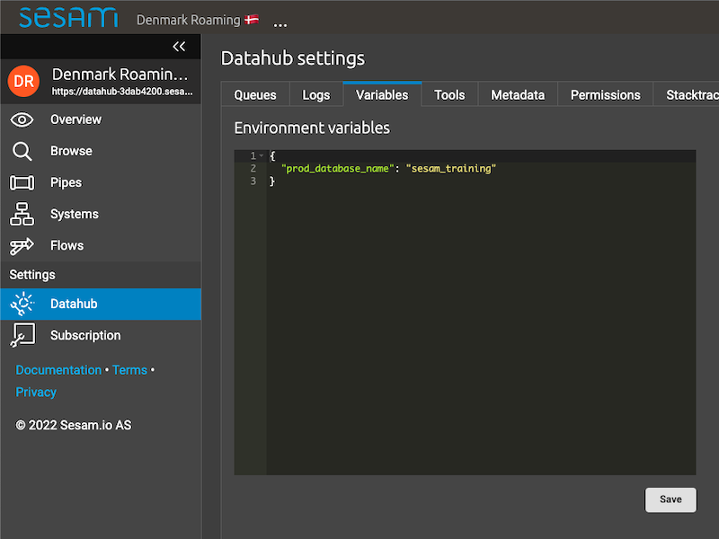
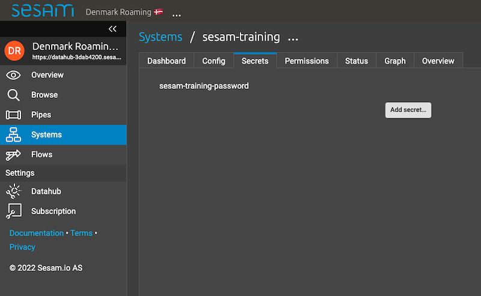

.. _microservices-novice-5-2:

Novice
------

.. _interacting-with-a-microservice-in-sesam-5-2:

Interacting with a Microservice in Sesam
~~~~~~~~~~~~~~~~~~~~~~~~~~~~~~~~~~~~~~~~

.. sidebar:: Summary

  Interacting with microservices...

  - to ingest or expose data is done with, respectively, a pull and push protocol
  - you should use the ``since`` request parameter, in the pull protocol, to enable delta requests
  - the request parameter ``is_first`` in the push protocol, on full data syncs, should be used to parse JSON from an array
  - you should make sure to implement thorough error handling in order to allow for adequate logging
  - logging should allow a non-technical user to understand why and potentially what made a microservice fail
  - is done by "coupling" a given system with a given pipe
  - in terms of triggering a microservice, the trigger is when streams of data flows through the implementation point 

Interacting with a microservice in a Sesam node is by no means a simple thing when it comes to the technicality of utilizing a microservice in the best possible way. In order for you to get the tools necessary to do exactly this, the following sub-sections will explain certain topics related to integrating a microservice optimally in Sesam. 

Protocols
#########

In terms of functionality, a microservice will need to either ingest and/or expose data. Therefore, we will now talk about the pull and push protocols, which respectively allows for ingestion and exposure of data.

The pull and push protocols are HTTP-based protocols. The pull protocol uses GET requests to read streams of JSON data. Requests can be split across multiple requests, albeit you should be cautious about splitting up your request, as you risk to only get a sample of the entire stream of data you are reading. 

The pull protocol supports the following request parameters:

- ``since`` - specifies an offset from which reading of data will start.
- ``limit`` - specifies a maximum number of entities from which the server will cap the response.
- ``subset`` - specifies whether a subset of entities is requested. 

The push protocol uses POST requests to write incremental or full data syncs across to an HTTP endpoint. It allows for splitting up data into smaller batches in order to decrease load on every request.

The push protocol supports the following request parameters:

- ``sequence_id`` - a string token which is generated every time the data sync is started.
- ``is_full`` - a boolean which evaluates to ``true`` on full data syncs and ``false`` if incremental. Default value is ``false``.
- ``request_id`` - a string token which is generated on every request.
- ``previous_request_id`` - a string token which refers to the previous ``request_id``. Present on all, but the first request.
- ``is_first`` - a boolean, only set on full data syncs, which is included on the first request and has a default value of ``true``. 
- ``is_last`` - a boolean, only set on full data syncs, which is included on the last request and has a default value of ``true``.

Additional information about the protocols can be found here: `Pull <https://docs.sesam.io/json-pull.html#json-pull-protocol>`_ or `Push <https://docs.sesam.io/json-push.html#json-push-protocol>`_.

Interaction & triggers
######################

Interacting with a microservice in a Sesam node means in practice creating a system of the type ``system:microservice``. This tells Sesam that the system is in reality a microservice hosted in Docker. An example of such a system can be seen below:

.. code-block:: json

  {
    "_id": "my-system-microservice",
    "type": "system:microservice",
    "docker": {
      "environment": {
        "user": "$ENV(my-username)",
        "password": "$SECRET(my-password)",
        "base_url": "$ENV(my-base_url)"
      }
    },
    "image": "myDockerID/myImageID:<semanticVersion>",
    "port": 5000
  }

After having set up such a system you can move on to making a pipe that interacts with this system:

.. code-block:: json

  {
    "_id": "my-pipe",
    "type": "pipe",
    "source": {
      "type": "json",
      "system": "my-system-microservice",
      "url": "/department"
    },
    "transform": {
      "type": "dtl",
      "rules": {
        "default": [
          ["copy", "*"],
          ["add", "_id", "_S.departmentID"],
          ["add", "rdf:type", ["ni", "department:Denmark"]]
        ]
      }
    }
  }

As can be seen from the above pipe config you will recognize the name of your recently created system, namely "my-system-microservice". Basically, by specifying this name you tell Sesam that you wish to communicate with that exact microservice. Additionally, the property ``{"url": "/department"}`` is of particular interest to us. This property tells us which endpoint we are interested in ingesting data from. As outlined, you can provide whatever value you want for the key "url". This means that Sesam supports the implementation and use of dynamic endpoints such as Python's <path>. This makes interacting with microservices well supported and as such you do not need to think about compromising on your code in order for it to work in Sesam. 

Finally, the topic of triggering comes into play. Triggering your system in Sesam is governed by how data flows in a given dataflow. An inbound pipe, as shown in the above example, will by default run every 15 minutes, unless otherwise stated or if you choose to start the pipe manually. On the topic of run times, you can state specific run times by the use of cron expressions. A microservice that is used in the middle or at the end of a dataflow will be triggered when data flows through a specific pipe at this particular stage in the dataflow. As such, Sesam triggers microservices in accordance to the streams of data that makes a dataflow. A given change in the stream of data will trigger an interaction with a microservice, but only a load sufficient to handle the trigger will be carried out.

.. seealso::

  :ref:`developer-guide` > :ref:`configuration` > :ref:`source_section` > :ref:`continuation_support`

  :ref:`developer-guide` > :ref:`configuration` > :ref:`system_section` > :ref:`microservice_system`

  :ref:`developer-guide` > :ref:`json_pull_protocol`

  :ref:`developer-guide` > :ref:`json_push_protocol`

  :ref:`learn-sesam` > :ref:`systems` > :ref:`systems-novice-2-2`

.. _microservice-development-prerequisites-5-2:

Microservice Development Prerequisites
~~~~~~~~~~~~~~~~~~~~~~~~~~~~~~~~~~~~~~

.. sidebar:: Summary

  Microservice development prerequisites are...

  - an integrated development environment (IDE) or text editor
  - a Docker account
  - a GitHub account

In order to develop a microservice that will be used in a Sesam node as outlined in :ref:`interacting with a microservice in Sesam <interacting-with-a-microservice-in-sesam-5-2>` you need to know what development environment you will need locally in order to make this happen.

Initially, Docker is a prerequisite. Adding, that an integrated development environment (IDE) or text editor will most likely also be needed. An IDE or text editor will allow you to write and develop your code. Docker allows for hosting your code as an image. A Docker image is referenced from a Sesam system. From that Docker image, Sesam creates a Docker container that is hosted and run in the Sesam node. In addition, a GitHub account is also advised as this will support for open sourcing your developed code and ease the way in which you can collaborate on developing your code.

The Sesam Community can be found `here <https://github.com/sesam-community>`_.

.. seealso::

  :ref:`developer-guide` > :ref:`configuration` > :ref:`system_section` > :ref:`microservice_system`

  :ref:`sesam-community`

.. _changing-a-microservice-5-2:

Changing a Microservice
~~~~~~~~~~~~~~~~~~~~~~~

   Workflow

   Fork [Vi må lage et repo]

   Change

   Test

   Teste lokalt

   Bygge docker konteiner

   Pushe docker konteiner

   Explanation of Bare Bones DockerFile

   How DockerFiles run [Sequentally, cache]

.. seealso::

  TODO

.. _authentication-with-microservices-5-2:

Authentication and authorization with microservices
~~~~~~~~~~~~~~~~~~~~~~~~~~~~~~~~~~~~~~~~~~~~~~~~~~~

.. sidebar:: Summary

  Microservice...

  - authentication is the process of verifying that a party is who they claim to be
  - authorization is the process of verifying the access rights of a party
  - authentication and authorization verfies that a party can now access available resources
  - resources are defined in its API. APIs use frameworks to ease and standardize authorization

    - `The OAuth Authorization Framework <https://auth0.com/docs/authorization/protocols/protocol-oauth2>`_ 

  - OAuth authorization typically use an access token to grant access to protected resources owned by a client
  - setup in a Sesam node uses environment variables defined globally
  - secrets are defined locally for a specific system

Authentication is the process of verifying that a party is who they claim to be, whilst authorization is the process of verifying the access rights of a party. With regards to microservices the process of authentication can vary quite a bit. Among the most common forms of authentication, a verification via username and password is a typical one. 

After having completed both authentication and authorization, the user will have a set of resources available. Such resources can vary depending on what was authenticated against, albeit an API typically has endpoints whereas for example a database will have tables.

API authorization
##################

APIs use authorization to ensure that a party requests data in a secure way. This will typically involve authenticating that the party which made the request is permitted to access and/or manipulate the relevant resource. Authorizing towards an API has historically been done in different ways, albeit recent authorization frameworks ease and standardize this. One of the most popular are the `OAuth Authorization Framework <https://auth0.com/docs/authorization/protocols/protocol-oauth2>`_. This framework is a protocol that allows a party to grant a third-party web site or application access to its protected resources, without necessarily revealing their long-term credentials or even their identity. 

Imagine that you want to gain access to a client API using the OAuth Authorization Framework. Initially, you request access to a resource controlled by your client, albeit instead of using the client's credentials to access protected resources, you obtain an access token via the OAuth Authorization Framework. Having been granted an access token, you can now use this access token to access protected resources, within the scope granted by this access token, owned by your client.   

.. hint::

  - An access token is a string that specifies a scope, lifetime and other access related attributes. 
  - Access tokens are issued by third-party clients, via an authorization server, approved by a resource owner and distributed to authorized users.

Environment variables and secrets 
#################################

Upon successfully authorizing towards an API, you can now start to request resources implemented in your microservice code, assuming you have set up your environment variables and secrets. Doing so in a Sesam node is straight forward. Environment variables and secrets can both be defined locally for a given microservice system, albeit it is recommended to define environment variables globally in your Sesam node whereas secrets should be defined locally for your specific microservice system. 

Global environment variables are defined in your "Datahub" view under the "Variables" tab, as shown below:

.. _figure-EnvironmentVariables-5-2:

   Environment Variables

Secrets, capable of being defined both globally and locally, also need to be set and as is recommended, you can see a picture below that illustrates this locally for a microservice system called "sesam-training".

.. _figure-Secrets-5-2:

   Secrets

As seen, the secret "sesam-training-password" has been defined locally and as such your microservice system can now be used to either pull and/or push data via Sesam.

.. seealso::

  :ref:`developer-guide` > :ref:`configuration` > :ref:`system_section` > :ref:`microservice_system`

  :ref:`learn-sesam` > :ref:`systems` > :ref:`systems-novice-2-2` > :ref:`systems-as-a-pipe-source-2-2`

  :ref:`learn-sesam` > :ref:`systems` > :ref:`systems-novice-2-2` > :ref:`authentication-methods-2-2`

  :ref:`sesam-community`

  `OAuth Authorization Framework <https://auth0.com/docs/authorization/protocols/protocol-oauth2>`_

  `Sesam Community at GitHub <https://github.com/sesam-community>`_

.. _microservices-sesam-input-output-5-2:

Micorservices in sesam and input/output
~~~~~~~~~~~~~~~~~~~~~~~~~~~~~~~~~~~~~~~

Common for sesams input & output

Sesam push/pull protocol

Sesam-json (formattering)

Lister av entiteter

query-parameter

url-parameter

is-first

is-last

.. seealso::

  TODO

.. _using-a-microservice-as-input-in-sesam-5-2:

Using a Microservice as Input in Sesam
~~~~~~~~~~~~~~~~~~~~~~~~~~~~~~~~~~~~~~

Inside sesam

Best practise:

Delta/last seen

request-params

is-first

is-last

.. seealso::

  TODO

.. _looking-inside-an-input-microservice-5-2:

Looking inside an Input Microservice
~~~~~~~~~~~~~~~~~~~~~~~~~~~~~~~~~~~~

.. sidebar:: Summary

  To look inside an input microservice...

  - you should only implement the minimum required code logic for Sesam to be able to consume data
  - you should remember that Sesam consumes and produces streams of entities
  - you should implement robust error handling and logging

In order to easily understand how an input microservice works in terms of code functionality, it is important that the microservice does not transform or reshape its source data too much. Keep in mind, Sesam ideally pulls in raw data and then starts to transform the data so that it aligns with the way in which Sesam enriches its data. In addition, by keeping data in its raw state as it enters Sesam, it makes it easier to understand how its source looks and it also retains schema information. Extending on this aspect of looking inside an input microservice, you will now learn about returning entities, streaming, and error handling and logging.

Returning entities
##################

Returning entities, with reference to the topic of looking inside an input microservice, comes down to the fact that you should only implement the minimum required code logic for Sesam to be able to consume data produced by a source system. As stated initially in this section, by retaining to the raw shape of your source data, our Sesam's data modelling approach can more easily be used to both enrich and maintain data integrity as entities are produced and transformed as these move through a Sesam node.   

Streaming
#########

Sesam consumes and produces streams of entities. An entity is very much like a JSON object and consists of a number of key-value pairs along with some special reserved property names. See the `entity data model <https://docs.sesam.io/entitymodel.html>`_ document for more details about entities.

The following is a quick example of the shape of entities that are consumed and exposed by Sesam.

.. code-block:: json

  [
      {
          "_id": "1",
          "name": "Bill",
          "dob": "01-01-1980"
      },
      {
          "_id": "2",
          "name": "Jane",
          "dob": "04-10-1992"
      }
  ]

Streams of entities flow through pipes. A pipe has an associated pump that is scheduled to regularly pull data entities from the source, push them through any transforms and send the results to the sink. The most common source is the `dataset source <https://docs.sesam.io/configuration.html#dataset-source>`_ which reads entities from a dataset. The most common sink is the `dataset sink <https://docs.sesam.io/configuration.html#dataset-sink>`_ which writes entities to a dataset. There are also `sources <https://docs.sesam.io/configuration.html#source-section>`_ and `sinks <https://docs.sesam.io/configuration.html#sink-section>`_ that can read and write data to and from external systems outside of Sesam.

Error handling & logging
########################

Error handling and logging are closely related topics and you should not do the one, without considering the other.

Error handling should be done in such a way that you make sure typical causes of error will be registered in your microservice. Typical causes of error often relates to status codes. A successful request returns a response code of 200, whilst an altogether unsuccessful one returns a response code of 404. If you consider the above two response codes as extremes, in terms of success, there are multiple additional response codes on this scale. These allow for incremental error handling.

Using the information returned from such a response is important and also here logging comes into play. Logging is used in a microservice so that a given user, especially a user not engaged technically in either response codes or code in itself, can explain and understand what made the microservice fail and/or why the microservice failed. Typically, severity in logging goes from logging of information to logging of warnings and finally to logging of errors. Naturally, you should make sure your microservice handles warnings and expecially errors in a robust and transparent way so that a given user will know what to do when such a logging entry occurs.    

.. seealso::

  :ref:`concepts` > :ref:`concepts-streaming`

  :ref:`developer-guide` > :ref:`configuration` > :ref:`source_section` > :ref:`dataset_source`

  :ref:`developer-guide` > :ref:`configuration` > :ref:`sink_section` > :ref:`dataset_sink`

.. _tasks-for-microservices-novice-5-2:

Tasks for Microservices: Novice
~~~~~~~~~~~~~~~~~~~~~~~~~~~~~~~

Run a microservice in Sesam [could be sink, http, source]
