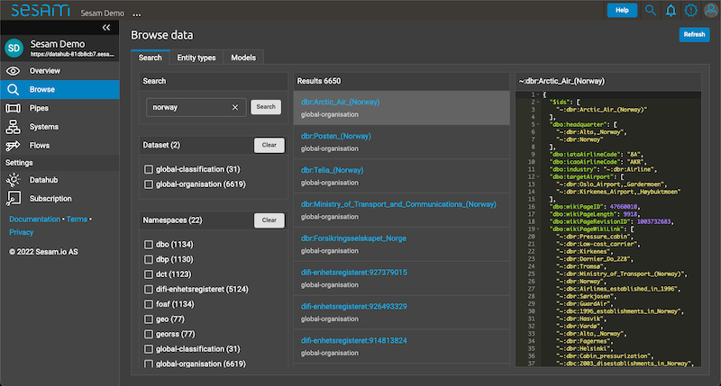

.. _sesam-in-the-wild-6-2:

Sesam in the Wild
-----------------

.. _topics-6-2:

Topics
~~~~~~

.. _creating-mapping-data-for-enrichment-6-2:

Creating mapping data for enrichment
~~~~~~~~~~~~~~~~~~~~~~~~~~~~~~~~~~~~

.. sidebar:: Summary

  Creating mapping data for enrichment...

  - can be advantageous when you need to increase your understanding of a data object

Usually an entity with its given properties will convey a concept. Imagine pulling data from a Customer relationship management (CRM) system. The inbound pipe that pulls data from this CRM system is called ``salesforce-person``. If you were to look at the entities in the dataset of this pipe, you will usually be able to understand what the data is all about. For brevity, only one entity is shown below:

.. code-block:: json
	
	{
	  "_id": "salesforce-person:Tordenskjold Skipskaptajnson - Sesam Expert",
	  "salesforce-person:Age": 32,
	  "salesforce-person:CurrentProfession": "Sesam Expert",
	  "salesforce-person:EmployeeStatus": 0,
	  "salesforce-person:EmployeeTime": "5 years",
	  "salesforce-person:FormerProfession": "Semiprofessional footballer",
	  "salesforce-person:Fullname": "Tordenskjold Skipskaptajnson",
	  "salesforce-person:Gender": "Male",
	  "salesforce-person:Nickname": "Joe"

	}  

This entity could be semantically defined as an object which is concerned with personal data. This definition is a very general one, as personal data can be many things. Meanwhile, for this specific entity, you could say that it is about the person Tordenskjold Skipskaptajnson whose age is 32 and who has been a Sesam Expert for 5 years. Previously, it seems he pursued a career as a footballer, albeit he did not succeed in doing that given his current employment. This is a more detailed semantic definition of the above object.

The above description of the entity is a semantic categorization, as we define its meaning based on our understanding of the words that make up the entity. Albeit, from a semantic point of view, in terms of what can immediately be told from looking at the current state of the data, it seems that one of the properties can only be somewhat vaguely understood. Namely the property ``salesforce-person:EmployeeStatus``. ``EmployeeStatus`` with the value ``0`` can mean many things. In such scenarios you might need to define sub-concepts that will allow you to increase the immediate semantic meaning. 

Imagine you are in charge of sending out salaries for the next month, albeit you are not sure whether or not Tordenskjold Skipskaptajnson is actually an active employee, and so should receive his registered salary. To solve this, you recognize that you need to enrich your data to increase the semantic meaning of the property ``salesforce-person:EmployeeStatus``. This could for example be done by having a mapping dataset containing a semantic description for a range of integers, i.e:

.. code-block:: json
	
	[{
	  "_id": "0",
	  "EmployeeStatus": 0,
	  "Description": "On Leave"
	},
	{
	  "_id": "1",
	  "EmployeeStatus": 1,
	  "Description": "Active"
	},
	{
	  "_id": "2",
	  "EmployeeStatus": 2,
	  "Description": "InActive"
	},
	{
	  "_id": "3",
	  "EmployeeStatus": 3,
	  "Description": "Future Employee"
	}]  

Then, if we use a ``hops`` function, we can merge the two datasets on ``EmployeeStatus``. In DTL, this could look like the following:

.. code-block:: json
	
	["merge",
	   ["hops", {
	     "datasets": ["map-salesforce-person-status md"],
	     "where": [
		["eq", "_S.salesforce-person:EmployeeStatus", "md.EmployeeStatus"] 
	     ],
	     "return": ["dict", "EmployeeStatusDescription", "md.map-salesforce-person-status:Description"]
	   }]
	]

And would produce the following changes to the dataset produced by the pipe ``salesforce-person``:

.. code-block:: json

	{
	  "_id": "salesforce-person:Tordenskjold Skipskaptajnson - Sesam Expert",
	  "salesforce-person:Age": 32,
	  "salesforce-person:CurrentProfession": "Sesam Expert",
	  "salesforce-person:EmployeeStatus": 0,
	  "map-salesforce-person-status:EmployeeStatusDescription": "On Leave",
	  "salesforce-person:EmployeeTime": "5 years",
	  "salesforce-person:FormerProfession": "Semiprofessional footballer",
	  "salesforce-person:Fullname": "Tordenskjold Skipskaptajnson",
	  "salesforce-person:Gender": "Male",
	  "salesforce-person:Nickname": "Joe"
	}  

As can be seen from the above result, we are now able to tell that Tordenskjold Skipskaptajnson is currently "On Leave", which means that he should not be paid his monthly salary. In addition, this might also mean that he, against the odds, is again pursuing a career in football.

The above example shows how a scenario might arise where you need to create sub-concepts of your data to get the required knowledge needed to handle your data appropriately.  

.. seealso::

	:ref:`concepts` > :ref:`concepts-features` > :ref:`concepts-namespaces`

  :ref:`developer-guide` > :ref:`DTLReferenceGuide` > :ref:`path_expressions_and_hops`

  :ref:`developer-guide` > :ref:`configuration` > :ref:`pipe_section` > :ref:`namespaces`

.. _semantic-graph-data-store-6-2:

The Semantic graph data store
~~~~~~~~~~~~~~~~~~~~~~~~~~~~~

.. sidebar:: Summary

  The Semantic graph data store...

  - is Sesam's semantic reference model
  - is provisioned by global datasets
  - can be used to undertake explorative analysis on data residing in your Sesam node

Sesam's semantic graph data store is used as a semantic reference model within a Sesam node. It is provisioned by global datasets and how namespaces are being merged in global pipe configurations. As such, the Semantic graph data store will not be operative until the point when global pipes have been defined and have completed their first run.

The Semantic graph data store can be accessed via the "Browse" tab in the Sesam Management Studio. Additionally, all defined namespaced identifiers (NIs) in Sesam are Uniform Resource Locators (URLs). As such, NIs can be used to navigate the semantic graph data store. This is both true when clicking a NI after having accessed the "Browse" tab but also when i.e. navigating pipe datasets and clicking a NI to be redirected to the "Browse" view to start your explorative analysis. Said "Browse" view is presented in the below picture:

.. _figure-graphStore-6-2:

   The Semantic Graph Data Store

As can be seen from the above picture, the "Browse" view lets you text filter presented entities. In this case the entities are filtered on *norway* and as such will render you a semantic reference model with respect to that. This exemplifies how you can easily navigate and "zoom in" on specific aspects that is of interest to you. Additionally, you can also see how you can filter on "Namespaces" and how "Results" are shown with respect to your filter selection. In this example a total of 6658 entities are shown and the specific entity ``~:dbr:Arctic_Air_(Norway)`` is presented. 

.. seealso::

	:ref:`concepts` > :ref:`concepts-features` > :ref:`concepts-namespaces`

.. _tasks-for-sesam-in-the-wild-6-2:

Tasks for Sesam in the Wild
~~~~~~~~~~~~~~~~~~~~~~~~~~~
