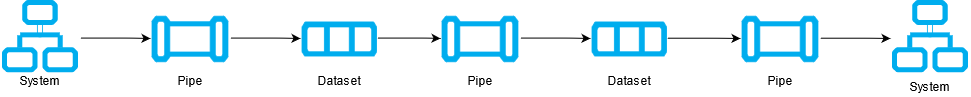
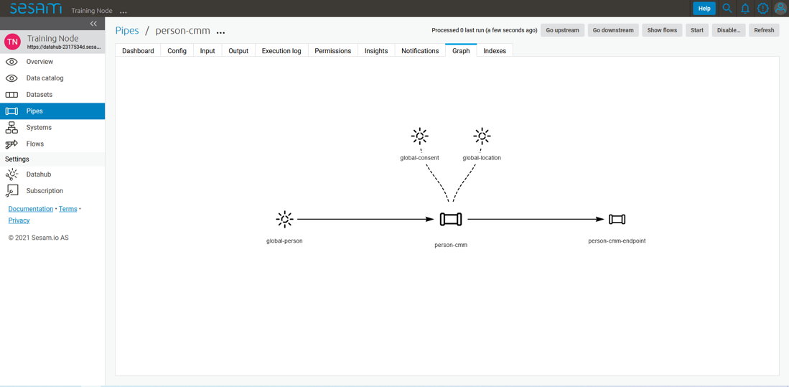
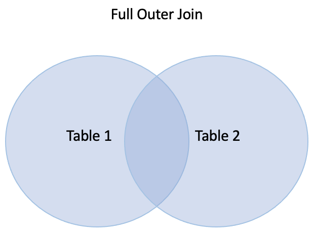

.. _tc_sesam_intro:

=====================
Introduction to Sesam
=====================

Beginner Topics
---------------

Different types of Architectures
~~~~~~~~~~~~~~~~~~~~~~~~~~~~~~~~

.. _tc_data-driven-architecture-1-1:

Data Driven Architecture (DDA)
^^^^^^^^^^^^^^^^^^^^^^^^^^^^^^

As opposed to both the P2P and the ESB integration principles the Data
Driven Architecture (DDA) does not focus on systems but rather the data
these systems store and how it can be used in a data-centric ecosystem.
This gives us an agile, robust IA. See Figure 3 – Data Driven Architecture.

.. figure:: ../../../training/010_architecture_and_concepts/media/Data_Driven_Architecture.png
   :align: center
   :alt: Figure 3 – Data_Driven_Architecture

   Figure 3 – Data Driven Architecture

As opposed to P2P and ESB, DDA is, respectively, scalable and agile - in
that it does not need the “Bus” to orchestrate data flows, rather DDA
relies on retrieving all the data in a system and connecting it internally
to enhance and propagate it for usage in outbound flows.

As in all great things, there is risk involved.
In order to utilize DDA effectively you need logical and robust principles
to create flexible data flows and models.
This can be achieved by always thinking ahead and leaving room for growth,
which you will learn how to do throughout this course.
If done correctly nothing beats the scalability, cost-effectiveness and
possibilities a DDA provides.

.. _tc_datahub-1-1:

Datahub
~~~~~~~

Continuing along the path of building data-centric solutions, the term
“Datahub” comes into play. A datahub is recognized by its frictionless
data flow and builds upon the architectural principles presented
in DDA. A datahub can be described as a solution that consists of
multiple different technologies, i.e., a data warehouse, microservices,
databases etc.

A Datahub shares data by connecting providers of data with consumers of
data. As such, a datahub mediates and manages how data flows between systems and makes states of data visible to consumers outside the datahub.

In a sense, you could say that a datahub is a digital representation of
an enterprise and also what SESAM often becomes when it is used
properly. As with any other technologies there are pros and cons.
Some of these are listed below, so you might be able to recognize them
“down the road”.

Pros:

- Enterprise scope, i.e., runs on cloud, hybrid.

- Creates visibility into all data.

- Centralised data control & management.

- Moves data asynchronously.

- Connects data from different systems.

- Possibility of defining the best truth of an object across systems.

- Forces the break-down of walled silos.

Cons:

- Only cares about the latest version of data.

- Demands advanced capabilities.

- Does not operate well with silos.

.. _tc_the_parts_of_sesam-1-1:

The parts of sesam @Erik
~~~~~~~~~~~~~~~~~~~~~~~~

In order to understand how Sesam works, it is important to understand
the parts Sesam is made up of. There are three central re-occurring
concepts in Sesam which you will encounter in your everyday life working
with the integration platform: systems, pipes and datasets.

|

   *A general pipeline flow in Sesam depicting the three central parts of a
   Sesam integration, systems, pipes and datasets. The arrows symbolize
   the direction of data flow.*

|

These are the fundamental parts which make up a Sesam integration pipeline:

Systems:
   A system’s main feature is to act as the interface to import and export data
   into and out of Sesam nodes. The actual import and export is carried out by the pipes connected to the systems. The systems are  therefore found in the
   beginning and end of the pipeline flows and are often referred to as
   “source systems” or “target systems” respectively. A system could
   connect to a REST API, directly to a database or simply send data to
   a waiting http server. Sesam has several of these system types built
   into the product to simplify the workings inside the portal. In
   situations where the built-in system types are not enough for your
   requirements Sesam also supports connecting systems to a microservice
   which in turn can manipulate and delegate data according to your own
   specifications, making Sesam a very robust and comprehensive tool.

Pipes:
   A pipe's main functions are to actualize the import and export of data, to handle transformation of the data when needed as well as to specify
   where the data is supposed to be sent. Manipulation of the data is
   done through Sesam’s own Data Transformation Language (DTL) which
   allows you to add, remove, transform or combine data according to
   you own needs. A pipe generally acquires data from a system or from a
   dataset depending on where the pipe is located inside the integration
   pipeline.

Datasets:
   Datasets are Sesam’s storage units and can be compared
   to i.e., a table in an SQL database. Datasets are where the pipes store the
   data they produce, unless a sink specifies otherwise. Sesam stores data in order to be able
   to perform tracking and indexing, but you will learn more about these
   functionalities later in this book (maybe a link?).

Entities:
   A dataset consists of a list of entities. Entities in
   Sesam can be compared to individual rows in an SQL table and can
   represent anything from a person, a mechanical part to a contract. An
   entity is defined by its primary key, which is represented in Sesam
   as the value belonging to the key ``_id``.

.. _tc_the_sesam_portal-1-1:

The Sesam portal
~~~~~~~~~~~~~~~~

Show basics of portal

(Here also refer to a full chapter for portal or from the projects
chapter?)

Integrations, connections and configurations can all be accessed inside
the Sesam portal; the user interface of the Sesam product, The Sesam
portal can be accessed at portal.sesam.io, and in this section you will
learn the most commonly used parts of the portal such that you can
orient yourself, as well as manage existing integrations. For a full
explanation if the workings and functionality of the Sesam portal,
please look [here (with a link)].

When logging in to the portal you will be met with a page like figure "The Sesam Portal"

.. figure:: ../../../training/010_architecture_and_concepts/media/Architecture_Beginner_The_Sesam_Portal_A.png
   :align: center
   :alt: The Sesam Portal

   The Sesam Portal

The cards on the Dashboard are often referred to as “subscriptions” or
“nodes” and they represent separate instances of Sesam installations.
Each node comes in different sizes (memory available) depending on the
requirements of the customer/project/user. In this example you will be
shown the portal inside the node called “Training Node”, but all nodes
will have the same setup, only different set of systems, pipes and
datasets.

When entering the “Training Node” you will be met with the page seen in
figure 1.1.6B.

.. figure:: ../../../training/010_architecture_and_concepts/media/Architecture_Beginner_The_Sesam_Portal_B.png
   :align: center
   :alt: Training Node Landing Page

   Training Node Landing Page

In this section we will only focus on the specific parts of the portal
needed to start working with Sesam, namely the “Pipes” page and the
“Systems” page.

Pipes
^^^^^

When entering the “Pipes” page you will be met by figure 1.1.6C. This
figure shows you all the available pipes in your subscription as well as
some of their corresponding meta-data. There are also several search and
filter options available, which are specially handy when trying to
located one, or a set of pipes, in a subscription with many pipes.

.. figure:: ../../../training/010_architecture_and_concepts/media/Architecture_Beginner_The_Sesam_Portal_C.png
   :align: center
   :alt: Sesam Node Pipe overview

   Sesam Node Pipe overview

If you now enter the pipe called “person-cmm” we can look into more of
details regarding how you may use the portal to navigate, troubleshoot
and configure you pipes.

Upon entering a pipe, you will by default be sent to the pipe’s “Graph”
view, as seen in figure 1.1.6D.

   Pipe Graph view

The graph view shows you which pipes are upstream and downstream to the
specific pipe you have selected, and it also shows connections to
related pipes (you will learn more about connected pipes later [link
maybe?]). For now, we will focus on four of the pipe’s subpages: Config,
Input, Output and the Execution log.

-  **Config**: The config subpage is where the actual coding takes
   place. This is where you define what this specific pipe is supposed
   to do. A pipe config is written in DTL which you will learn more
   about in section [link]. One

-  **Input**: Whenever a pipe uses one or several datasets as a source,
   the source entities will be displayed here. These are the entities
   the pipe will perform some sort of transformation on.

-  **Output**: The output tab shows the entities after the DTL
   transformation. The way you see the output depends on whether the
   data is stored in a dataset or sent to a target system. There are
   some occasions where there is no output so be seen but for now you
   can assume that there will always be an output to be see for each
   pipe.

-  **Execution log**: The execution log supplies us with information on
   the state of the pipe. If a pipe runs as it should the execution log
   will display information on how many entities it has processed, how
   much time the processing took and much more. If a pipe is not be able
   to process all the data, the execution log will display a failed pipe
   run as well as error messages which may assist you to locate the
   error. The execution log is a vital tool for troubleshooting as it
   not only tells you if a pipe works as it should, but also contains
   detailed information on why a pipe run fails and when they failed.

Systems
^^^^^^^

The systems tab looks very much like the pipe tab in figure 1.1.6C. For
systems we will focus the three most commonly used tabs: Config, Secrets
and Status.

-  **Config**: Like with pipes, the config tab is where you specify what
   the system is supposed to do. There are many different types of
   systems and many of have very different configuration. There are
   however some common traits that apply to most system. These traits
   include authorization parameters, location parameters such as
   IP-addresses, URLs and database names and system types. In the case
   where your system relies on a Microservice you might also have a set
   of environmental variables used by the Microservice.

-  **Secrets**: In the Secrets tab you may store sensitive information
   you do not wish everyone on the node to have access to. These secrets
   are often passwords or token used to authorization and
   authentication. Secrets stored in the system tabs are local secrets
   and may only be used by the specific system in which they are
   defined.

-  **Status**: In the Status tab you can monitor the health of your
   system. When connected to built-in systems this tab shows you whether
   you are connected correctly. When connected to Microservices this tab
   displays connection status and logging provided by the Microservice.

.. _tc_naming-conventions-1-1:

Naming conventions
~~~~~~~~~~~~~~~~~~

When constructing an integration flow in Sesam the use of a standardized
naming convention becomes essential as the project grows to more than a few pipes.
A standardized naming convention helps you to easily structure your Sesam architecture such that:

-  Localizing specific flows becomes easier.

-  Troubleshooting becomes more efficient.

- Determining pipe type (inbound, outbound, preparation or global) becomes easier.

- Filtering relevant pipes become easier.

-  Switching between integration projects, or joining a new project,
   becomes more intuitive.

-  Support will be more efficient.

In Sesam we focus on naming pipes, datasets and systems in way that
explains the function of that specific structure. The following points
are the naming rules Sesam suggests you follow when constructing your
integration flows.

**Systems**

A system name should describe the source/target system from the
customers perspective, not from Sesam’s perspective. If a customer has
employee data inside a HR system named “HR”, but the data from “HR” is
supplied by an API provider called “API provider”, the Sesam system
should be named “hr”. The same rule applies if the HR data was populated
in a database which Sesam connects to. Naming the system after the
database might seem intuitive at first glance but naming from the
customers perspective makes communication and troubleshooting much
easier in the long run.

**Pipes**

*Inbound pipes:*

Inbound pipes should be named according to endpoint/table they connect to
in the source system and prefixed with the source system name such that
there is a clear and intuitive way of tracking their content.
We use the hr system mentioned above in this example.
There are two tables we would like to read from the hr systems: employee and
department. Our two inbound pipes connecting to the two tables containing
HR data will therefore be named “hr-employee” and “hr-department”. The
system name prefixed highlights that the HR system is upstream from the
pipes.

*Global pipes:*

Global pipes should be named according to the semantic relation
connecting the datasets used as the global pipes source and prefixed
with “global”. These semantic relations may vary between projects and
customers, but some are generally always occurring such as
global-person, global-company, global-customer or global-project.

*Preparation pipes:*

Preparation pipe naming can be more diverse but should explain the type
of data it transforms as well as the target system. If the inbound pipe
importing a table “person” from a system “HR” is named “hr-person", the
corresponding preparation pipe preparing data to be pushed to the table
“person” should be named “person-hr". We use the system name as a
postfix in this case to highlight the fact that this data has the HR
system down-stream. In many cases you might require several preparations
pipes between the global pipe and the endpoint pipe. In these cases, in
addition to the type of data transformed as the downstream target
system, the pipe name should reflect the functionality of that specific
preparation pipe. As an example, if a preparation pipe splits entities
into child entities, the children functionality should be part of the
pipe name i.e., “person-child-hr".

*Outbound pipes:*

An outbound pipe should have the same name as the name of the pipe
generating the outbound pipe’s source dataset, only postfixed with
“endpoint” i.e., “person-child-hr-endpoint”.

The following flow shows a typical Sesam flow with each pipe’s preferred
name with an example:

|

.. figure:: ../../../training/010_architecture_and_concepts/media/Architecture_Beginner_Pipes_A.png
   :align: center
   :width: 835px
   :height: 105px
   :alt: Full pipe flow with generic names.

   Full pipe flow with generic names.

|

.. figure:: ../../../training/010_architecture_and_concepts/media/Architecture_Beginner_Pipes_B.png
   :width: 800px
   :height: 100px
   :align: center
   :alt: Example of Full pipe flow with globals.

   Full pipe flow with example names.

.. _tc_systems-1-1:

Systems
~~~~~~~

Short about systems (where in the sesam-world-map)

Something more general about pipes maybe in context of pipes and
datasets

Very low level but enough to set up an inputpipe after maybe?

and refer to systems chapter

Namegivingconventions ref. 1.1.8

Where to make new ref 1.1.6

Systems are one of Sesam’s core sub-structures. Systems can connect to
external providers such as an SQL database, a REST API or a Microservice
to either import or export data to and from Sesam and are therefore the
start and finish points of every integration flow. System may cover
other functionalities as well, but we will cover those special cases in
later parts [ref to later parts].

.. _tc_pipes-1-1:

Pipes
~~~~~

Something more general about pipes maybe in context of systems and
datasets

Inbound(Input?)/Preparation/Outbound(Output?)

Very low level but enough to connect to system?

and refer to pipes chapter

Pump

Input & output(sink)

Namegivingconventions ref. 1.1.8

Where to make new ref 1.1.6

.. _tc_datasets-1-1:

Datasets
~~~~~~~~

Datasets are where data is stored inside Sesam, regardless of whether the
data comes from external systems or from internal pipes.

Data in a dataset is represented as a JSON list where each list item is a
data record, called *entity*, consisting of key-value pairs.

A dataset with two entities concerning people could look like this:

.. code-block:: json

   [
     {
       "id": "1",
       "name": "Jane Doe"
     },
     {
       "id": "2",
       "name": "John Doe"
     }
   ]

Dataset is the default sink type for internal pipes in Sesam, so if no sink
config is specified for a pipe it's output will be a dataset.

Datasets are also often the source for internal pipes.

**Related topics:**

:ref:`dataset-id-3-1`,
:ref:`entities-json-keyvalpairs-1-1`,
:ref:`naming-conventions-1-1`,
:ref:`pipes-1-1`

.. _tc_entities-json-keyvalpairs-1-1:

Entities / JSON (Key-value pairs)
~~~~~~~~~~~~~~~~~~~~~~~~~~~~~~~~~

As stated earlier in this section, a dataset consists of a list of entities. An entity is a JSON type dictionary containing a set of key-value pairs identified by its unique identifier. A key-value pair is two related data elements. A key is a constant and defines what that data element is concerned with, i.e., postCode, email, phoneNumber, etc. Meanwhile, the value provides contextual information for a specific key. This could look like the following:

.. code-block:: json

   {
     "<key>": "<value>"
   }

   {
     "postCode": "6400"
   }

.. _tc_special-sesam-attributes-1-1:

Special sesam attributes
~~~~~~~~~~~~~~~~~~~~~~~~

Namespaces
^^^^^^^^^^
Namespaces in Sesam are primarily used on properties, and its main functions are to ensure uniqueness across sources and to maintain the origin of the properties. "global-person:fullname" is an example of a namespaced property, where "global-person" is the namespace and "fullname" is the property name.

Namespaced identifiers (NIs) are identifiers (i.e. property values) given a namespace.
"source:reference": "~:foo:bar" is an example of a NI, where "source" is the property namespace, "reference" is the property name, "foo" is the namespace of the referenced data and "bar" is the identifier usually matching an identifier in the referenced data. The "~" is the Sesam syntax for defining a datatype as a NI.

As such, NIs in Sesam are similar to foreign keys in databases in that NIs are a visual indication of how data is connected, and enables easier and more precise joins. However, Sesam does not enforce any relationship between NIs and the referenced properties. You use the functions ["make-ni"] or ["ni"] to create NIs when modelling data in Sesam.

Rdf:type
^^^^^^^^
The RDF type is metadata used to relate data and give some semantic context. When used with a namespace, it keeps track of the origin of the data, as well as the business type. It is composed upon input and will be used to relate and filter like you would use a foreign key.

Using the above NI "~:foo:bar", an RDF type defined property in Sesam could look like the following: ``{"rdf:type": "~:foo:bar"}.``

.. _tc_id-1-1:

\_id
^^^^
The identity (_id) of systems, pipes and datasets must be unique and consistent as data moves via systems, through pipes and into datasets.

The _id of a system is usually defined by the name of your source system i.e., salesforce. In case you need two systems in Sesam that both originate from salesforce, you'll need to make two unique names for each of these i.e., salesforce and salesforce-rest.

For pipes, the _id is typically defined by establishing which properties in the pipe´s dataset are unique across its entities. This could typically be primary key(s) when data is imported from a database or potentially a unique property or even concatenated properties when data is imported from an API.

When data reaches a pipe's dataset, the _id will be identical to what you defined the _id to be, in that pipe's config.

.. _tc_pipes-where-dtl-executes-3-1:

Pipes, where DTL executes
~~~~~~~~~~~~~~~~~~~~~~~~~

(Repeting 1.1.5?)

Sesam consumes and produces streams of data in the form of lists of
entities.

Streams of entities flow through **pipes**. A pipe has an associated
**pump** that pull data entities from the **source**, push them through
any **transforms**, and send the results to the **sink**. All of this is
configured in the pipes configuration. As with water pipes, there is a
flow inside the single pipe (segment), and pipes connect to other pipes
and systems.

DTL (Data transformation Language) as the name implies is a
transformation. It is part of the internal flow of the pipe and an
entity enters and is transformed before the resulting entity is passed
to the next step in the flow. Usually the sink.

A pipe do not strictly have to have a DTL-transform, but most pipes have
one. DTL is not used outside pipes in Sesam.

**Source** and **Target** are two central concepts in DTL. Source is
data entering the flow and target is data exiting the flow. In some DTL
functions this is implicit, like copy and rename. For other DTL
functions you use built-in Variables "_S." (**S**\ ource) and "_T."
(**T**\ arget).

The simplest DTL transforms only copy or rename a subset of the fields
from the source (single) entity that flows from pipe-source into
DTL-transform. The source-concept is context based in pipes and DTL. You
will see examples of this.

Example: (need to line up with other examples and have a nice layout)

(*Link to short video*?)

(pipe with only embeded data?? Make the dataset)

(pipe with this datasett as source??)

This is the config for a pipe that gets data entities from the dataset
salesforce-lead and make new enteties from each entity and put them in

.. code-block:: json

   {

      "_id": "dtl-test",

      "type": "pipe",

      "source": {

         "type": "dataset",

         "dataset": "salesforce-lead"

      },

      "transform": {

         "type": "dtl",

         "rules": {

            "default": [

               ["copy", ["list", "_id", "Username"]],

               ["rename","EmailAddress",":Contact-point"]

            ]

         }

      }

   }

DTL is often more complex. E.g. it can pull and use data from other data
sets in your Sesam node or deal with nested structures in the source
entity.

DTL has many functions that you can use to transform data. You find an
overview in the DTL Reference Guide. You will use this much.

**What happens when a pipe runs?**

**What is the relationship of pipes and DTL?**

.. _tc_entities-pipes-and-id-3-1:

Entities, pipes and _id @Geir Atle
~~~~~~~~~~~~~~~~~~~~~~~~~~~~~~~~~~

The reserved property _id
^^^^^^^^^^^^^^^^^^^^^^^^^

Everything in Sesam must have a unique identity, whether it is a system
configuration, a pipe configuration, a dataset, an entity within a
dataset, etc.

The reserved property named ``_id`` is used as unique identity for
components in Sesam.

This unique identity allows for precise references between
configurations and precise connections between data entities.

See <ref to ``_id`` restrictions> for more information on how to create
valid identifiers.

System _id
^^^^^^^^^^

The identity (``_id``) of a system must be unique within a Sesam node
instance.

Once a system configuration is saved, its identity cannot be changed. If
you need to change a system’s identity, you can Duplicate the system
configuration, save the duplicated configuration with the desired
identity, and then delete the original configuration.

Remember to also update any other configurations that were referencing
the original system to reference the new identity.

In the Sesam Management Studio, when you view the list of all systems in
the Systems menu, the System column will by default show you the
identity of all the defined systems in that Sesam node.

If the name property is also defined for a system configuration, then
the System column will show that value instead of the identity.

Regardless, if you need to reference a system configuration from another
configuration in Sesam, you reference the system’s identity.

**Related topics:**
:ref:`naming-conventions-1-1`,
:ref:`systems`

Pipe _id
^^^^^^^^

The identity (``_id``) of a pipe must be unique within a Sesam node
instance.

Once a pipe configuration is saved, its identity cannot be changed. If
you need to change a pipe’s identity, you can Duplicate the pipe
configuration, save the duplicated configuration with the desired
identity, and then delete the original configuration.

In the Sesam Management Studio, when you view the list of all pipes in
the Pipes menu, the Pipe column will by default show you the identity of
all the defined pipes in that Sesam node.

If the name property is also defined for a pipe configuration, then the
Pipe column will show that value instead of the identity.

Regardless, if you need to reference a pipe configuration from another
configuration in Sesam, you reference the pipe’s identity.

**Related topics:**
:ref:`dtl-in-practice-3-1`,
:ref:`naming-conventions-1-1`

.. _tc_dataset-id-3-1:

Dataset _id
^^^^^^^^^^^

The identity (``_id``) of a dataset must be unique within a Sesam node
instance.

By default, a dataset will have the same identity as the pipe it is
generated from.

You can override the default dataset identity by defining the dataset
property in the pipe’s sink configuration. (reference to sink config).

Once a dataset is generated, its identity cannot be changed. If you need
to change a dataset’s identity, you can edit the dataset property in the
pipe’s sink configuration, delete the sink dataset, and restart the
pipe. This will generate a new dataset with the new identity.

Remember to also update any other configurations that were referencing
the original dataset to reference the new identity.

In the Sesam Management Studio, when you view the list of all datasets
in the Datasets menu, the Dataset column will show you the identity of
all the datasets in that Sesam node.

If you need to reference a dataset from another configuration in Sesam,
you reference the dataset’s identity.

Entity _id
^^^^^^^^^^

The identity (``_id``) of an entity must be unique within the dataset in
which it resides. The identity of an entity is similar to a primary key
in a database table.

What makes an entity unique is usually dictated by the source system the
entity is imported from. This can typically be the primary key(s) of a
database table.

This means that you usually define the identity for entities in inbound
pipes.

If the source system has multiple properties that combined makes the
entity unique, you must combine all these properties into the ``_id``
property to ensure that uniqueness is preserved in Sesam.

In some cases, you can handle this in the source configuration part of
the inbound pipe. SQL sources, for example, allows you to specify
multiple columns from the source database as primary keys. Sesam will
then combine these columns automatically into the ``_id`` during import.

In other cases, you may have to explicitly add the ``_id`` property with
DTL in a transform step in the inbound pipe. This may be relevant when
the source configuration does not support specifying multiple properties
as primary keys.

Entity _id and namespaces
^^^^^^^^^^^^^^^^^^^^^^^^^

By default, the pipe identity of the pipe where the entity originates is
used as namespace for both the entity’s identifier and the entity’s
properties.

Note that there is a slight, but significant, difference in the
placement of the namespace for the entity’s ``_id`` property compared to
its other properties.

For the ``_id`` property, the namespace prefixes the property **value**:

.. code-block:: json

  "_id": "<namespace>:<value>"

For other properties, the namespace prefixes the property **name**:

.. code-block:: json

  "<namespace>:<property-name>": "<value>"

The reason the namespace is put into the value of the ``_id`` is to ensure
that all entities are unique across all source systems.

Example:

An entity imported from a system called `crm` with a `user` table
consisting of a primary key `userId` with value `123`, and a column
`email` with value `john.doe@foo.no` would look something like this:

.. code-block:: json

   {
     "_id": "crm-user:123",
     "crm-user:userId": "123",
     "crm-user:email": "john.doe@foo.com"
   }

Now imagine you have another source where one of the entities are also
identified by `123`.

Unless the namespace is part of the property value of ``_id``, both
entities would have the same ``_id``, namely `123`. So by prefixing this
value with a namespace we ensure that these entities do not come into
conflict with each other.

**Related topics:**
:ref:`namespaced-identifiers`,
:ref:`namespaces`

The autogenerated property $ids
^^^^^^^^^^^^^^^^^^^^^^^^^^^^^^^

Should probably write something sensible about the connection between
``_id`` and $ids somewhere. Maybe related to merge pipes? – ‘Yea, or maybe
add it to the \_ Properties chapter’ -G

.. _tc_dtl-in-practice-3-1:

DTL in practice
~~~~~~~~~~~~~~~

In this section you will learn how to:

- create a pipe from scratch
- view the output of a pipe
- write a greeting to the world with DTL

Create a new pipe
^^^^^^^^^^^^^^^^^

Let us start by creating a new pipe from scratch called ``practice``.
In the Sesam Management Studio, navigate to the **Pipes** view and follow these steps:

- Click the **New pipe** button
- Type in `practice` as the pipe's ``_id``
- In the **Templates** panel:

  - Choose Source System: ``system:sesam-node``
  - Choose Source Provider: ``embedded prototype``
  - Click the **Replace** button to put the chosen Source configuration into the pipe configuration area.
  - Click the **Add DTL transform** button to get a nice starting point to write DTL.

- Lastly, add some test data:

  .. code-block:: json

    "entities": [{
      "_id": "1",
      "data": "One"
    }, {
      "_id": "2",
      "data": "Two"
    }]

You should now have the following pipe config:

.. _tc_practice-pipe-config-initial:
.. code-block:: json
  :caption: Practice pipe config - initial
  :linenos:

  {
    "_id": "practice",
    "type": "pipe",
    "source": {
      "type": "embedded",
      "entities": [{
        "_id": "1",
        "data": "One"
      }, {
        "_id": "2",
        "data": "Two"
      }]
    },
    "transform": {
      "type": "dtl",
      "rules": {
        "default": [
          ["copy", "_id"]
        ]
      }
    }
  }

Save and run the pipe by clicking the **Save** button and then the **Start** button.

In the next section you learn how to view the result of a pipe run.

Pipe output
^^^^^^^^^^^

To view the result of a pipe run, switch to the pipe's **Output** tab.
Here you will see two entities:

::

  practice:1
  practice:2

But they are both empty:

.. code-block:: json
  :linenos:

  {
  }

This is because we only copy the ``_id`` so far.

In the next section you will learn to write your first piece of DTL to make the output a bit more interesting.

Greet the world!
^^^^^^^^^^^^^^^^

Switch back to the **Config** tab.

First, change the ``copy`` so that all source properties are included.
Then add a property called ``greeting`` with the value `Hello, World!`:

.. code-block:: json

  ["copy", "*"],
  ["add", "greeting", "Hello, World!"]

Save and start the pipe again.

Switch to the **Output** tab to view the new results.

Now you will see that the output has changed:

.. code-block:: json
  :caption: ``practice:1``
  :linenos:

  {
    "practice:data": "One",
    "practice:greeting": "Hello, World!"
  }

.. code-block:: json
  :caption: ``practice:2``
  :linenos:

  {
    "practice:data": "Two",
    "practice:greeting": "Hello, World!"
  }

You have now learned how to create a new pipe from scratch using templates, write and edit DTL functions,
run a pipe and view it's output.

.. _tc_practice-pipe-config-final:
.. code-block:: json
  :caption: Practice pipe config - final
  :linenos:

  {
    "_id": "practice",
    "type": "pipe",
    "source": {
      "type": "embedded",
      "entities": [{
        "_id": "1",
        "data": "One"
      }, {
        "_id": "2",
        "data": "Two"
      }]
    },
    "transform": {
      "type": "dtl",
      "rules": {
        "default": [
          ["copy", "*"],
          ["add", "greeting", "Hello, World!"]
        ]
      }
    }
  }

.. _tc_pipe-interaction-with-systems.-2-1:

Pipe interaction with systems.
~~~~~~~~~~~~~~~~~~~~~~~~~~~~~~

Input, output (mention transform?)

.. _tc_systems-as-a-pipe-source-2-2:

Systems as a pipe source
~~~~~~~~~~~~~~~~~~~~~~~~

System configuration (mostly) defines the possibilities pipes have to
pull data.

We need to write about what a system is in the context of a pipe source,
with not only configs but explanations. Keep it simple don’t go into too
many system types (json & SQL?). Write more text than configurations,
draw stuff. (1-N)

.. _tc_how-to-create-a-system-with-templates-2-1:

How to create a system with Templates
~~~~~~~~~~~~~~~~~~~~~~~~~~~~~~~~~~~~~

Introduction to some case.
--------------------------

Represent a case which the reader/participants need to work through.
The case can include multiple dataflows and in total needs to entail the following:

* Multiple input pipes for the same type entity/concept. These must be merged into a global.
* One or more input pipes for different entities/concepts which connect to the main entity/concept. This/these pipe(s) must go into a global which will be hopped to.
* An endpoint system which is interested in the data we retrieve, connect and enhance.
* Possibility to design a dataflow (AC)
* Possibility to code a dataflow  (Dev)
* Possibility to design a integration (AC)
* Planning for eventual consistency (AC)
* Possibility of defining golden-properties. (AC & Dev)
* Microservice usage (AC)
* Microservice creation (Dev)
* Incremental queries/api usage (AC & Dev)
* Creating CLI tests. (Dev)
* Creating mapping files. (AC & Dev)
* Emit children (AC & Dev)
*

Creating a system
-----------------

Some task to make a system.

Creating an input pipe
----------------------

Some task to make an input pipe reading from system created previously.

.. _tc_globals-as-a-concept-1-1:

Globals as a concept
~~~~~~~~~~~~~~~~~~~~~~~~~~~~~~~~~

Why globals

Golden records

Gjør data tilgjengelig

Ref. 1.2.19, 3.2.14

.. _tc_joining-data-1-2:

Joining Data
~~~~~~~~~~~~

When working with data, you will often find yourself in situations where you need to join data. By joining data you get a comprehensive representation of a data object that has relations to other isolated data objects. In general, you join data because it gives you a more complete picture of a data object and its relation to other data objects. This allows you to work more efficiently and logically when you model your data towards a target state.

In Sesam you will also experience the need for joining data, and this is a functionality Sesam excels at. To outline the different possibilities when joining data, given the two data objects "foo" and "bar", the below example will be used. It draws upon the Sesam syntax and as such is something you will be using down the road. Here goes:

.. code-block:: json

	{
	  "_id": "foo",
	  "value": 1,
	  "values": [1, 2, 4, 5]
	}
	{
	  "_id": "bar",
	  "value": 1,
	  "values": [1, 3, 4, 6]
	}

There are four different kinds of joins. In the below outline, "eq" is an abreviation for equals and "foo.value" is to denote that you search in the "foo" data object in the key "value":

- One-to-one join: ["eq", "foo.value", "bar.value"]
- One-to-many: ["eq", "foo.value", "bar.values"]
- Many-to-one: ["eq", "foo.values", "bar.value"]
- Many-to-many: ["eq", "foo.values", "bar.values"]

The rule for joins is very simple: if any of the values overlap, then the join succeeds.

All of the four joins given above succeed for the two data objects given, because they all have overlapping values, i.e. the values 1 and 4.

.. _tc_full-outer-join-merge-1-2:

Full outer Join - Merge
~~~~~~~~~~~~~~~~~~~~~~~~~~~~~~~~

Full outer join is something you will experience in the Sesam terminology as a "merge". A merge, like the full outer join, retains all entries from i.e. two merged data objects. Graphically, a full outer join will look like the following:

   Figure – Full Outer Join

A note on the handling of null values. In Sesam null values are not existing. Meaning, as opposed to a full outer join which will populate empty entries in the join between tables with null values, the merge in Sesam will by default never have to do this. To exemplify, look at the below example:

.. code-block:: json

	{
	  "_id": "first_entity:foo",
	  "first_entity:value": 1,
	  "first_entity:string":"Hello merge",
	  "first_entity:values": [1, 2, 4, 5]
	}
	{
	  "_id": "second_entity:bar",
	  "second_entity:value": 1,
	  "second_entity:string":"This is retained",
	  "second_entity:values": [1, 3, 4, 6]
	}

and the merged result, if we choose to retain the first "_id" of the above two data objects and join the data on the value property:

.. code-block:: json

	{
	  "_id": "first_entity:foo",
	  "first_entity:value": 1,
	  "first_entity:string":"Hello merge",
	  "first_entity:values": [1, 2, 4, 5],
	  "second_entity:value": 1,
	  "second_entity:string":"This is retained",
	  "second_entity:values": [1, 3, 4, 6],
	  "$ids": [
	    "~:first_entity:foo",
	    "~:second_entity:bar"
	  ]
	}

What should immediately get your attention would be the "$ids" property in the merged result. Sesam utilizes this property to keep track of which "_id"s have been merged and as such aids in data governance, as you do your data modelling.

THIS IS WHERE THE PATHS DIVERGE
-------------------------------

From here on out we will give different tasks and go into different depth
for the topics we bring up based on who is taking the course.

Most topics will be covered for both participant groups, but the perspective
shown and tasks given will be different.

For the context of this document I will annotate where AC(architect) and devs
differ for each topic.

DEV
---

.. _tc_merge-as-a-source-3-2:

Merge as a Source
~~~~~~~~~~~~~~~~~

Show config, explain all properties, refer to architecture chapter also.

-  Strategy

-  Identidy - \_id etter merge

-  datasets

.. _tc_merge-as-a-source-3-2-summary:

Summary
^^^^^^^

DEV & AC
--------

.. _tc_global-1-2:

Global
~~~~~~

Golden – the best truth about common attributes of a concept collected
from multiple sources

Coalesce, prioritization of source data (master data)

Creating a global pipe
----------------------

Task to make a global pipe.
Devs will get the design (pipes to include and eq) and create the config.
Architects pick attributes to join on and get the config.

Important that only 1 answer for the eq produces the output we want - ikke no slingringsrom.

DEV & AC
--------

.. _tc_guidelines-inbound-and-outbound-pipes-1-2:

Guidelines - inbound and outbound pipes
~~~~~~~~~~~~~~~~~~~~~~~~~~~~~~~~~~~~~~~~

As established above, an important aspect when modelling data in Sesam is the use of globals. Albeit before reaching the global stage and after completion of the global stage, when modelling your data the following guidelines apply:

Inbound pipes
^^^^^^^^^^^^^

As data enters Sesam it is handled in inbound pipes. An inbound pipe should be as generic as possible with regards to the amount of shaping done on the data that flows through to its dataset. The reason being, in order for you to make the best possible modelling decisions downstream, you should look at the "raw" data first to get a complete understanding of the condition of the data. In addition, we want to assume as little as possible about how the data will be used by current and future recipients. Therefore,
if we start shaping and customizing data too soon in the flow, it's much harder, if not impossible, to reuse the data for different purposes later. A rule of thumb is therefore to minimize the amount of DTL used in an inbound pipe and try to just copy everything, or close to everything. Special cases can occur when you need to do some shaping of the data before reaching the global stage. In such cases, you should aim at making the minimal required DTL changes in order for the data to retain as much of its original integrity as possible.

Outbound pipes
^^^^^^^^^^^^^^

Following the flow of data as it leaves the global stage of modelling, the amount of DTL will increase in the preparation pipes. As you might recall, preparation pipes deliver data to the outbound pipes. It is therefore important to consider the state of the data as it enters an outbound pipe. The reason for this being, as with any inbound pipe, that you should aim at minimizing the amount of DTL needed to shape your data further. This will create robust consumable data that can be delivered seamlessly to your target systems as data flows through your outbound pipes. As with inbound pipes, special cases can occur, where you need to do some additional shaping before the data can be presented in a consumable shape for a given target system. Again, aim at making a minimal set of DTL changes.

Summary
^^^^^^^

The amount of DTL in a given pipe with respect to modelling stage in Sesam should increase until the point of modelling stage, where the intent of shaping data is primarily due to target system requirements, as visualized in the below *Figure - DTL Amount*.

.. figure:: ../../../training/010_architecture_and_concepts/media/dtl-amount.png
   :align: center

   Figure – DTL Amount

.. _tc_change-tracking-data-delta-1-2:

Change tracking & data delta
~~~~~~~~~~~~~~~~~~~~~~~~~~~~

`All entities stored inside sesam have a
\_hash <https://docs.sesam.io/entitymodel.html?highlight=_hash>`__
value. This is a quantification of an entity and is calculated every
time an entity is processed by a pipe. If the \_hash value changes or is
new, the entity will be stored as a new version in dataset. We call this
change in \_hash value a data-delta.

Any data-delta for an entity in a dataset causes downstream pipes to see
this as a new sequence number they haven’t yet read. This in turn makes
the pipe process the entity. If the processed entity does not exist or
gets a new \_hash in the output of the pipe, it will cause an update to
the output dataset.

Creating a preparation pipe
---------------------------

DEV & AC
--------

Dev får info om funksjonaliteten, men fokuserer mer på configen
AC fokuserer mer på funksjonaliteten, men blir vist konfig & output.

.. _tc_left-join-hops-1-2:

Left Join - Hops
~~~~~~~~~~~~~~~~

In addition to a full outer join it is also relevant to talk about the left join. This is because you in the Sesam terminology will use something we call "hops". The hops is similar to a left join, in that it appends data and returns data even if there are no matches for a particular entry in the join. As such, in cases where you append data, null values in Sesam are retained. A graphical representation of the left join can be viewed in the below figure:

.. figure:: ../../../training/010_architecture_and_concepts/media/Left_Join.png
   :align: center
   :alt: Figure – Left Join

   Figure – Left Join

To illustrate the graphical representation of a left join, the following practical example has been drafted:

.. code-block:: json

	{
	  "_id": "first_entity:foo",
	  "first_entity:value": 1,
	  "first_entity:string":"Hello merge",
	  "first_entity:values": [1, 2, 4, 5]
	}
	{
	  "_id": "second_entity:bar",
	  "second_entity:value": 1,
	  "second_entity:string":"This is retained",
	  "second_entity:values": [1, 3, 4, 6]
	}
	{
	  "_id": "third_entity:the_runt",
	  "third_entity:value": 1,
	  "third_entity:string":"Third's the charm"
	}

When applying the hops, our point of reference will be the first data object from the above and we will name the new property "left_join_result". We will choose to join the data on the "value" property present in all of the above three data objects in order to return the "values" property. Albeit, the "values" property is only present on the first two data objects. The expected result can be seen below:

.. code-block:: json

	{
	  "_id": "first_entity:foo",
	  "first_entity:value": 1,
	  "first_entity:string":"Hello merge",
	  "first_entity:values": [1, 2, 4, 5],
	  "first_entity:left_join_result": [{"second_entity:values": [1, 3, 4, 6], null}]
	}

As stated earlier, it is important to note that in this case, null values will be returned if the hops is not possible between individual data objects, which can be seen in the new property "left_join_result", where the last entry is null.

.. _tc_hops-3-2:

Hops
~~~~

Basics, uten apply

Hopping with a preparation pipe
-------------------------------

A new preparation pipe which hops, reads from same global.
Uses some of the same values as the opther prep pipe but not 100% match.

Architects create the mapping and get almost the whole pipe config.
For example let them add all the "_S.someattribute" but have everything else ready

Devs create the pipe config and get the mapping.

The value of golden properties can now be understood as we have re-done mapping
twice.

Prioritization of data sources
------------------------------

FUN IDEA FOR A COURSE ONLY THING.
Course teachers act as DBA's / People responsible for two different systems.
We don't know anything about eachothers systems but know everything about our own.
The course participants must ask questions to us one at a time regarding what data
we care about, what data gets updated by our system and where the data we hold come from.

Then the participants must make real decisions when it comes to prioritizing
the origin of golden attributes based on the information we have provided.

No wrong answers as long as justification is good - possibility of showing how
easy it can be to interpret things differently.

Maybe let the DBA's talk to eachother after the participants have answered (?)

.. _tc_coalesce-3-2:

Coalesce
~~~~~~~~

ref 1.2.19

Defining golden properties
--------------------------

Devs use the information above to code the coalesce's.
Architects use the information above to define the mapping and prioritization.

Using a microservice in prep pipe
---------------------------------

Dev, koder microservice eller bare bruker den?
AC går i dybden på hvorfor en microservice er en god løsning og ikke innebygd
sesam funksjon.

HVOR FETT HADDE DET VÆRT OM VI KJØRTE AC & DEV KURS SAMTIDIG
------------------------------------------------------------

AC gjør all design også kommer dev etterpå og implementerer det.
2 instruktører og 2 rom, som møtes for å gjøre oppgaver.
Perfekt mulighet for naturlig overførsel av informasjon fra arkitektur siden
til dev siden.
?????????? :D
