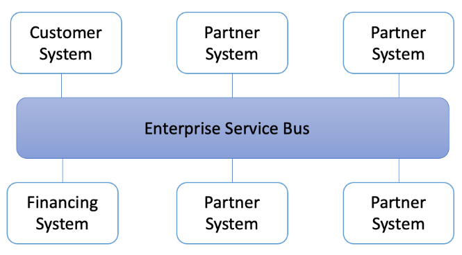
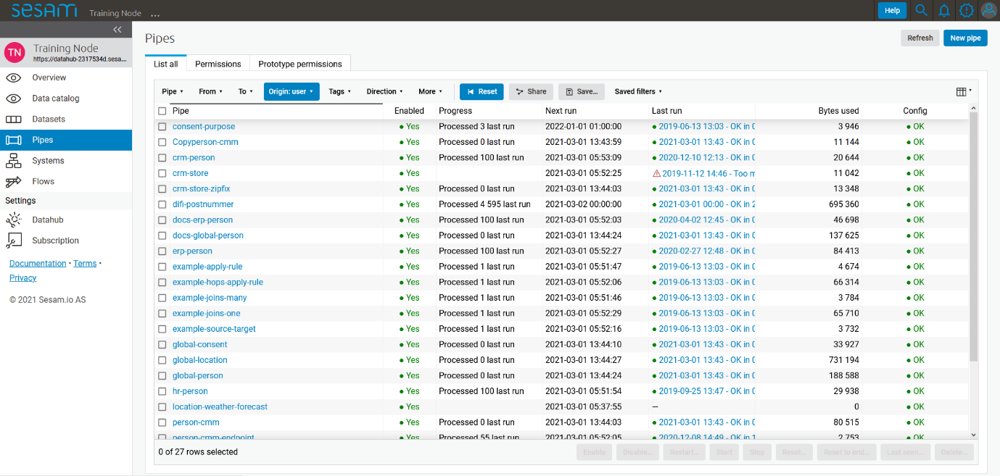
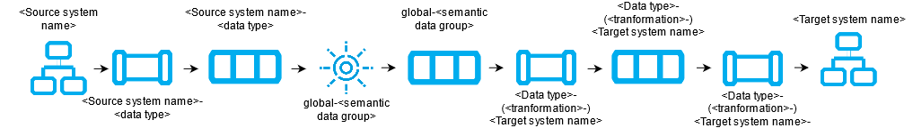

Prologue
========

   Introduction to the book

   Who is this book for?

   Who are we?

   What is Sesam?

   What problems do we seek to solve?

   What should you expect to learn?

   Innholdsfortegnelse og forklaring/justification for det.

Table of Contents
=================

`Prologue 1 <#prologue>`__

`Table of Contents 2 <#_Toc64461657>`__

`1. Architecture and Concepts 6 <#architecture-and-concepts>`__

`Introduction 6 <#introduction>`__

`Architecture 6 <#architecture>`__

`1.1 Architecture and Concepts: Beginner
6 <#architecture-and-concepts-beginner>`__

`1.1.1 Different types of Architectures
6 <#different-types-of-architectures-jonas>`__

`1.1.2 Datadriven architecture 7 <#data-driven-architecture-jonas>`__

`1.1.3 Datahub 7 <#datahub-jonas>`__

`1.1.4 Sesam “sesam-world-map”? 7 <#sesam-sesam-world-map>`__

`1.1.5 The parts of sesam 7 <#the-parts-of-sesam-erik>`__

`1.1.6 The Sesam portal 7 <#the-sesam-portal>`__

`1.1.7 Working language JSON 7 <#working-language-json>`__

`1.1.8 Namegiving conventions 7 <#naming-convention>`__

`1.1.9 Systems 7 <#systems-1>`__

`1.1.10 Pipes 7 <#pipes-1>`__

`1.1.11 Datasets 8 <#datasets>`__

`1.1.12 Datasets vs. tables 8 <#datasets-vs.-tables>`__

`1.1.13 Entities / JSON (Key-value pairs)
8 <#entities-json-key-value-pairs>`__

`1.1.14 Globals as a concept 8 <#globals-as-a-concept>`__

`1.1.15 Special sesam attributes 8 <#special-sesam-attributes>`__

`1.1 Tasks for Architecture and Concepts: Beginner
8 <#tasks-for-architecture-and-concepts-beginner>`__

`1.2 Architecture and Concepts: Novice
8 <#architecture-and-concepts-novice>`__

`1.2.16 Joining Data 8 <#joining-data>`__

`1.2.17 Make namespaced identifieries for foreign keys [Make-ni]
9 <#make-namespaced-for-foreign-keys-make-ni>`__

`1.2.18 Full Outer Join (Merge) 9 <#full-outer-join-merge>`__

`1.2.19 Left Join (Hops) 9 <#left-join-hops>`__

`1.2.20 Global 9 <#global>`__

`1.2.21 Generic input pipes, custom output pipes
9 <#generic-input-pipes-custom-output-pipes>`__

`1.2.22 Filter entities on the way out
9 <#filter-entities-on-the-way-out>`__

`1.2.23 Tag your entities - Categorization of sub-concepts
9 <#tag-your-entities---categorization-of-sub-concepts>`__

`1.2.24 Customize data structure for endpoints
9 <#customize-data-structure-for-endpoints>`__

`1.2.25 Change tracking & data delta 10 <#change-tracking-data-delta>`__

`1.2 Tasks for Architecture and Concepts: Novice
10 <#tasks-for-architecture-and-concepts-novice>`__

`1.3 Architecture and Concepts: Intermediate
10 <#architecture-and-concepts-intermediate>`__

`1.3.26 Hops 10 <#hops>`__

`1.3.27 1.3.26 Incremental Database queries
10 <#incremental-system-queries>`__

`1.3.28 Subset 10 <#subset>`__

`1.3.29 Dynamic, Static & Timeseries Data
10 <#dynamic-static-timeseries-data>`__

`1.3.30 When to use a microservice 10 <#when-to-use-a-microservice>`__

`1.3 Tasks for Architecture and Concepts: Intermediate
10 <#tasks-for-architecture-and-concepts-intermediate>`__

`1.4 Architecture and Concepts: Advanced
10 <#architecture-and-concepts-advanced>`__

`1.4.31 Choosing a source dataset for your pipe
10 <#choosing-a-source-dataset-for-your-pipe>`__

`1.4.32 Eventual Consistency 11 <#eventual-consistency>`__

`1.4.33 Create Child & Emit children 11 <#create-child-emit-children>`__

`1.4 Tasks for Architecture and Concepts: Advanced
11 <#tasks-for-architecture-and-concepts-advanced>`__

`Epilogue 11 <#epilogue>`__

`2 Systems 11 <#systems-2>`__

`Introduction 11 <#introduction-1>`__

`2.1 Systems: Beginner 11 <#systems-beginner>`__

`2.1.1 What is a system in Sesam? 11 <#what-is-a-system-in-sesam>`__

`2.1.2 Introduction to SQL & Json systems
11 <#introduction-to-sql-json-systems>`__

`2.1.3 Pipe interaction with systems.
11 <#pipe-interaction-with-systems.>`__

`2.1.4 How to create a system with Templates
11 <#how-to-create-a-system-with-templates>`__

`2.1.5 Environment variables & Secrets
11 <#environment-variables-secrets>`__

`2.1.6 JSON Push & Pull protocol 12 <#json-push-pull-protocol>`__

`2.1 Tasks for Systems: Beginner 12 <#tasks-for-systems-beginner>`__

`2.2 Systems: Novice 12 <#systems-novice>`__

`2.2.7 What is a system in Sesam? 12 <#what-is-a-system-in-sesam-1>`__

`2.2.8 Systems as a pipe source 12 <#systems-as-a-pipe-source>`__

`2.2.9 Systems as a pipe sink 12 <#systems-as-a-pipe-sink>`__

`2.2.10 [System?] Authentication methods
12 <#system-authentication-methods>`__

`2.2.11 System Types 12 <#system-types>`__

`2.2 Tasks for Systems: Novice 12 <#tasks-for-systems-novice>`__

`2.3 Systems: Intermediate 12 <#systems-intermediate>`__

`2.3.12 Microservice System 12 <#microservice-system>`__

`2.3.13 HTTP Transforms 13 <#http-transforms>`__

`2.3.14 Chaining of Systems 13 <#chaining-of-systems>`__

`2.3 Tasks for Systems: Intermediate
13 <#tasks-for-systems-intermediate>`__

`Epilogue 13 <#epilogue-1>`__

`3 DTL – The language of Pipes 14 <#dtl-the-language-of-pipes>`__

`Introduction 14 <#introduction-2>`__

`What is DTL? 14 <#what-is-dtl>`__

`Why DTL? 14 <#why-dtl>`__

`Where is DTL used? – Can fit into 3.1.1 probably.
14 <#where-is-dtl-used-can-fit-into-3.1.1-probably.>`__

`3.1 DTL: Beginner 14 <#dtl-beginner>`__

`3.1.1 Pipes, where DTL executes
14 <#pipes-where-dtl-executes-morten>`__

`3.1.2 Entities, pipes and \_id
14 <#entities-pipes-and-_id-geir-atle>`__

`3.1.3 Entity Data model – Data Types
14 <#entity-data-model-data-types-gabriell>`__

`3.1.4 Syntax 14 <#syntax>`__

`3.1.5 Bootstrap 15 <#dtl-in-practice>`__

`3.1.6 Pipe shortcuts 15 <#pipe-shortcuts>`__

`3.1 Tasks for DTL: Beginner 15 <#tasks-for-dtl-beginner>`__

`3.2 DTL: Novice 15 <#dtl-novice>`__

`3.2.7 “Copy” 15 <#copy>`__

`3.2.8 “Add” 16 <#add>`__

`3.2.9 “Concat” – Concatination 16 <#concat-concatination>`__

`3.2.10 rdf:type 16 <#rdftype>`__

`3.2.11 Namespace 16 <#namespace>`__

`3.2.12 “Make-ni” 16 <#make-ni>`__

`3.2.13 “Eq” – Equality 16 <#eq-equality>`__

`3.2.14 Merge as a Source 16 <#merge-as-a-source>`__

`3.2.15 Filter as a transform 16 <#filter-as-a-transform>`__

`3.2.16 Coalesce 16 <#coalesce>`__

`3.2.17 Nested dictionaries 16 <#nested-dictionaries>`__

`3.2.18 Apply – Custom Functions 16 <#apply-custom-functions>`__

`3.2.19 Merge as a function 17 <#merge-as-a-function>`__

`3.2.20 Hops 17 <#hops-1>`__

`3.2.21 \_ Properties 17 <#properties>`__

`3.2.22 Type examples 17 <#type-examples>`__

`3.2 Tasks for DTL: Novice 17 <#tasks-for-dtl-novice>`__

`3.3 DTL: Intermediate 18 <#dtl-intermediate>`__

`3.3.23 More on Pipes 18 <#more-on-pipes>`__

`3.3.24 Pipe Sink 18 <#pipe-sink>`__

`3.3.25 if 18 <#if>`__

`3.3.26 Case &? case-eq 18 <#case-case-eq>`__

`3.3.27 Multiple transforms 18 <#multiple-transforms>`__

`3.3.27 Dependency tracking in Hops 18 <#dependency-tracking-in-hops>`__

`3.3.28 "Apply-hops" 18 <#apply-hops>`__

`3.3.29 Source Subset 18 <#source-subset>`__

`3.3 Tasks for DTL: Intermediate 18 <#tasks-for-dtl-intermediate>`__

`3.4 DTL: Advanced 18 <#dtl-advanced>`__

`3.4.30 Filter as an expression 18 <#filter-as-an-expression>`__

`3.4.31 \_. Syntax and Functions 18 <#syntax-and-functions>`__

`3.4.32 Map 19 <#map>`__

`3.4.33 \_P & \_R – Parent & Root 19 <#p-_r-parent-root>`__

`3.4.34 “Create-child” 19 <#create-child>`__

`3.4.35 Recursion in Hops & Apply 19 <#recursion-in-hops-apply>`__

`3.4.36 Key-values 19 <#key-values>`__

`3.4.37 Escape Namespaced Identifiers [NI]
19 <#escape-namespaced-identifiers-ni>`__

`3.4 Tasks for DTL: Advanced 19 <#tasks-for-dtl-advanced>`__

`Epilogue 19 <#epilogue-2>`__

`Projects & Infrastructure 20 <#projects-infrastructure>`__

`Introduction 20 <#introduction-3>`__

`4.1 Projects & Infrastructure Beginner
20 <#projects-infrastructure-beginner>`__

`4.1.1 Portal GUI 20 <#portal-gui>`__

`4.1.2 sesam-CLI 20 <#sesam-cli>`__

`4.1.3 4.1.3 Testing & Testdata 21 <#testing-testdata>`__

`4.1.4 Dokumentasjon 22 <#dokumentasjon>`__

`4.1.5 JWT/Authentisering 22 <#jwtauthentisering>`__

`4.1.6 Groups & Permissions 22 <#groups-permissions>`__

`4.1 Tasks for Projects & Infrastructure: Beginner
22 <#tasks-for-projects-infrastructure-beginner>`__

`4.2 Projects & Infrastructure: Novice
22 <#projects-infrastructure-novice>`__

`4.2.7 Node config? 22 <#node-config>`__

`4.2.8 Deployment 23 <#deployment>`__

`4.2.9 Monitorering 23 <#monitorering>`__

`4.2.10 Arbeidsmetodikk 23 <#arbeidsmetodikk>`__

`4.2 Tasks for Projects & Infrastructure: Novice
24 <#tasks-for-projects-infrastructure-novice>`__

`4.3 Projects & Infrastructure: Intermediate
24 <#projects-infrastructure-intermediate>`__

`5.2.8 dev/CI/test/prod-noder 24 <#devcitestprod-noder>`__

`5.2.9 CI/CD/TDD? 24 <#cicdtdd>`__

`4.3.10 Workflow in Projects 24 <#workflow-in-projects>`__

`4.3 Tasks for Projects & Infrastructure: Intermediate
25 <#tasks-for-projects-infrastructure-intermediate>`__

`Epilogue 25 <#epilogue-3>`__

`5 Microservices 25 <#microservices>`__

`Introduction 25 <#introduction-4>`__

`5.1 Microservices: Beginner 25 <#microservices-beginner>`__

`5.1.1 What is a microservice? 25 <#what-is-a-microservice>`__

`5.1.2 Why use Microservices in Sesam?
26 <#why-use-microservices-in-sesam>`__

`5.1.3 How are Microservices used in Sesam?
26 <#how-are-microservices-used-in-sesam>`__

`5.1.4 Microservice hosting 26 <#microservice-hosting>`__

`5.1.5 Running a microservice in Sesam
26 <#running-a-microservice-in-sesam>`__

`5.1.6 Types of Microservices 26 <#types-of-microservices>`__

`5.1.7 Naming Convention 26 <#naming-convention-1>`__

`5.1 Tasks for Microservices: Beginner – Tasks
26 <#tasks-for-microservices-beginner-tasks>`__

`5.2 Microservices: Novice 26 <#microservices-novice>`__

`5.2.8 Interacting with a Microservice in Sesam
26 <#interacting-with-a-microservice-in-sesam>`__

`5.2.9 Microservice Development Prerequisites
27 <#microservice-development-prerequisites>`__

`5.2.10 Changing a Microservice 27 <#changing-a-microservice>`__

`5.2.11 Authentication with microservices
27 <#authentication-with-microservices>`__

`5.2.12 Sesam I/O 27 <#sesam-io>`__

`5.2.13 Using a Microservice as Input in Sesam
27 <#using-a-microservice-as-input-in-sesam>`__

`5.2.14 Looking inside an Input Microservice
27 <#looking-inside-an-input-microservice>`__

`5.2 Tasks for Microservices: Novice
28 <#tasks-for-microservices-novice>`__

`5.3 Microservices: Intermediate 28 <#microservices-intermediate>`__

`5.3.15 Using a Microservice as Output in Sesam
28 <#using-a-microservice-as-output-in-sesam>`__

`5.3.16 Looking inside an Output Microservice
28 <#looking-inside-an-output-microservice>`__

`5.3.17 Guidelines for Microservice Development
28 <#guidelines-for-microservice-development>`__

`5.3.18 Microservices and GitHub [VCS]
29 <#microservices-and-github-vcs>`__

`5.3.19 Optimizing a Microservice 29 <#optimizing-a-microservice>`__

`5.3.20 Microservice System types 29 <#microservice-system-types>`__

`5.3 Tasks for Microservices: Intermediate
29 <#tasks-for-microservices-intermediate>`__

`5.4 Microservices: Advanced 29 <#microservices-advanced>`__

`5.4.21 Testing 29 <#testing>`__

`5.4.22 Proxy Endpoint [Jonas] 30 <#proxy-endpoint-jonas>`__

`5.4.23 Chaining 30 <#chaining>`__

`5.4. Tasks for Microservices: Intermediate
30 <#tasks-for-microservices-intermediate-1>`__

`Epilogue 30 <#epilogue-4>`__

`6. Sesam in the Wild [WIP] 30 <#sesam-in-the-wild-wip>`__

`Introduction 30 <#introduction-5>`__

`Sesam in the Wild: Beginner 30 <#sesam-in-the-wild-beginner>`__

`6.1.1 Beginner topic 30 <#beginner-topic>`__

`6.1 Tasks for Sesam in the Wild: Beginner
30 <#tasks-for-sesam-in-the-wild-beginner>`__

`Sesam in the Wild: Novice 31 <#sesam-in-the-wild-novice>`__

`6.2.X: Novice topic 31 <#x-novice-topic>`__

`6.2 Tasks for Sesam in the Wild: Novice
31 <#tasks-for-sesam-in-the-wild-novice>`__

`Sesam in the Wild: Intermediate 31 <#sesam-in-the-wild-intermediate>`__

`6.3.X: Intermediate topic 31 <#x-intermediate-topic>`__

`6.3 Tasks for Sesam in the Wild: Intermediate
31 <#tasks-for-sesam-in-the-wild-intermediate>`__

`Sesam in the Wild: Advanced 31 <#sesam-in-the-wild-advanced>`__

`6.4.X: Advanced topic 31 <#x-advanced-topic>`__

`6.4 Tasks for Sesam in the Wild: Advanced
31 <#tasks-for-sesam-in-the-wild-advanced>`__

`Epilouge 31 <#epilouge>`__

`Appendix 31 <#appendix>`__

Architecture and Concepts
=========================

Introduction
------------

Sesam opens the door to running a data-driven business, but what is a
data driven business and how does the journey towards it look?

In this chapter we will introduce you to Sesam as a way of not only
developing but thinking. You will learn about overarching themes for
designing integrations, the components you build with and the pitfalls
to look out for along the way.

After reading you can expect to recognize and design a data driven
Integration of your own.

Architecture
------------

What do we mean about architecture

1. .. rubric:: Architecture and Concepts: Beginner
      :name: architecture-and-concepts-beginner

   1. .. rubric:: Different types of Architectures @Jonas
         :name: different-types-of-architectures-jonas

When modelling data, integration architectures (IA) lay the foundation
upon which data is shaped and structured as it moves through one system
to another. Within IA, Point-to-point (P2P) and Enterprise Service Bus
(ESB) have been used extensively. Recent trends, however, move away from
these established integration principles and places data and its
mobility at its center.

Albeit, before elaborating on how integration principles has undergone
recent radical changes, you should first dive into P2P and ESB.

1.1.1.1 Point-to-Point

This kind of IA is a simple integration principle. As an example of P2P
imagine sending a message generated in one system to a single receiver
in another system. This simplified example shows both the pros and cons
to using P2P. It is simple and therefore easy to manage, albeit what if
another system is introduced and so multiple new messages need to be
sent? Well, in this case P2P is not your best option, and the issue of
scalability presents itself. To illustrate how complexity can make P2P a
non-viable option look at the below Figure 1 – Point-to-Point:

|image0|

Figure 1 – Point-to-Point

As illustrated on the right-hand side of the above figure “Complex
integration”, you have to maintain multiple connections separately
which, in this case, will make P2P time consuming and expensive to
manage. Therefore, amongst other things, new architectural principles
have been developed. One of the more prominent ones being ESB.

1.1.1.2 Enterprise Service Bus

The ESB is a more robust IA and plays a critical role in connecting
diverse systems and services in a Service Oriented Architecture (SOA).
The ESB takes on the responsibility of ensuring that data sent from one
system conforms to the requirements in another system. This core
functionality is an important feature as to why the ESB is such an
established architectural principle. In addition, the ESB aids in
simplifying integration efforts when connecting differing applications
that need to communicate with each other. See Figure 2 – Enterprise
Service Bus.

| |image1|
| Figure 2 – Enterprise Service Bus

Taking into account the positives from using an ESB for your IA - some
challenges still remain unresolved. Recent years transition towards more
cloud-based solutions, hybrid solutions and the remaining tendency to
focus on the systems in the ESB rather than the data itself has
propelled what is called “Data Driven Architecture”.

Data Driven Architecture @Jonas
~~~~~~~~~~~~~~~~~~~~~~~~~~~~~~~

As opposed to both the P2P and the ESB integration principles the Data
Driven Architecture (DDA) does not focus on systems – rather the data
and how modelling a data-centric ecosystem takes precedence in order to
realize an agile meanwhile robust IA, see Figure 3 – Data Driven
Architecture.

|image2|

Figure 3 – Data Driven Architecture

As opposed to P2P and ESB, DDA is, respectively, scalable and agile - in
that it does not need the “Bus” to orchestrate data flows, rather DDA
relies on natural flows of connected data to trigger data flows. You may
think that this also presents a risk - that is correct.

In order to utilize DDA you need to create logical, robust albeit
flexible data flows. If done correctly nothing beats the scalability,
cost-effectiveness and possibilities a DDA provides. A word of caution
however, if such guidelines are not agreed upon and followed up on, you
risk creating a waterfall of technical depth as time goes by and these
natural flows of data grows unhinged.

Datahub @Jonas
~~~~~~~~~~~~~~

Continuing the path of building data-centric solutions, the term
“Datahub” comes into play. A datahub is recognized by its frictionless
data flow and as such builds upon the architectural principles presented
in DDA. A datahub can be described as a solution that consists of
multiple different technologies, i.e., a data warehouse, microservices,
databases etc.

A Datahub shares data by connecting generators of data with consumers of
data. In practice this allows data to be delivered in endpoints that can
interact with the datahub in terms of injecting data into the datahub or
exposing data to an external system. As such, a datahub mediates and
manages how data flows between systems and makes states of data visible
to consumers outside the datahub.

In a sense, you could say that a datahub is a digital representation of
an enterprise and also what SESAM often becomes when it is used
properly. As with any other technologies there are pros and cons to any
technology.

Some of these are listed below, so you might be able to recognize them –
“down the road”.

Pros:

- Has enterprise scope, i.e., cloud, hybrid.

- Creates visibility into all data.

- Centralizes data control.

- Moves data in, close to, real time.

- Connects data.

Cons:

- Data does not persist.

- Demands advanced capabilities.

- Does not operate in silos.

4. .. rubric:: [STRIKEOUT:Sesam “sesam-world-map”?]
      :name: sesam-sesam-world-map

5. .. rubric:: The parts of sesam @Erik
      :name: the-parts-of-sesam-erik

Terminology

Systems, pipes, datasets

In order to understand how Sesam works, it is important to understand
the parts Sesam is made up of. There are three central re-occurring
concepts in Sesam which you will encounter in your everyday life working
with the integration platform: systems, pipes and datasets. These are
the fundamental parts which make up a Sesam integration pipeline. Figure
1.1.5A gives you an insight into how a standard Sesam integration
pipeline would look.

|A general pipeline flow in Sesam depicting the three central parts of a
Sesam integration, systems, pipes and datasets. The arrows symbolizes
the direction of data flow.|

-  **Systems**: A system’s main feature is to import and export data
   into and out of the Sesam portal. They are therefore found in the
   beginning and end of the pipeline flows and are often referred to as
   “source systems” or “target systems” respectively. A system could
   connect to a REST API, directly to a database of simply send data to
   a waiting http server. Sesam has several of these system types built
   into the product to simplify the workings inside the portal. In
   situations where the built-in system types are not enough for your
   requirements Sesam also supports connecting systems to a microservice
   which in turn can manipulate and delegate data according to your own
   specifications, making Sesam a very robust and comprehensive tool.

-  **Pipes**: Pipes handles the transformation of the data and specifies
   where the data is supposed to be sent. Manipulation of the data is
   done through Sesam’s own Data Transformation Language (DTL) which
   allows you to add, remove, transform and combine data according to
   you own needs. A pipe generally acquires data from a system or from a
   dataset depending on where the pipe is located inside the integration
   pipeline.

-  **Datasets**: Datasets are Sesam’s storage units and can be compared
   to i.e., a table in an SQL database. This is where pipes store the
   data after configuring them and in a pipeline flow, they are
   generally found between pipes. Sesam stores data in order to be able
   to perform tracking and indexing, but you will learn more about these
   functionalities later in this book (maybe a link?).

-  **Entities**: A dataset consists of a list of entities. Entities in
   Sesam can be compared to individual rows in an SQL table and can
   represent anything from a person, a mechanical part to a contract. An
   entity is defined by its primary key, which is represented in Sesam
   as the value belonging to the key ‘_id’.

   6. .. rubric:: The Sesam portal
         :name: the-sesam-portal

Show basics of portal

(Here also refer to a full chapter for portal or from the projects
chapter?)

Integrations, connections and configurations can all be accessed inside
the Sesam portal; the user interface of the Sesam product, The Sesam
portal can be accessed at portal.sesam.io, and in this section you will
learn the most commonly used parts of the portal such that you can
orient yourself, as well as manage existing integrations. For a full
explanation if the workings and functionality of the Sesam portal,
please look [here (with a link)].

When logging in to the portal you will be met with a page like figure
1.1.6A.\ |image4|

The cards on the Dashboard are often referred to as “subscriptions” or
“nodes” and they represent separate instances of Sesam installations.
Each node comes in different sizes (memory available) depending on the
requirements of the customer/project/user. In this example you will be
shown the portal inside the node called “Training Node”, but all nodes
will have the same setup, only different set of systems, pipes and
datasets.

When entering the “Training Node” you will be met with the page seen in
figure 1.1.6B.

|image5|

In this section we will only focus on the specific parts of the portal
needed to start working with Sesam, namely the “Pipes” page and the
“Systems” page.

Pipes
^^^^^

When entering the “Pipes” page you will be met by figure 1.1.6C. This
figure shows you all the available pipes in your subscription as well as
some of their corresponding meta-data. There are also several search and
filter options available, which are specially handy when trying to
located one, or a set of pipes, in a subscription with many pipes.

|image6|

If you now enter the pipe called “person-cmm” we can look into more of
details regarding how you may use the portal to navigate, troubleshoot
and configure you pipes.

Upon entering a pipe, you will by default be sent to the pipe’s “Graph”
view, as seen in figure 1.1.6D.

|image7|

The graph view shows you which pipes are upstream and downstream to the
specific pipe you have selected, and it also shows connections to
related pipes (you will learn more about connected pipes later [link
maybe?]). For now, we will focus on four of the pipe’s subpages: Config,
Input, Output and the Execution log.

-  **Config**: The config subpage is where the actual coding takes
   place. This is where you define what this specific pipe is supposed
   to do. A pipe config is written in DTL which you will learn more
   about in section [link]. One

-  **Input**: Whenever a pipe uses one or several datasets as a source,
   the source entities will be displayed here. These are the entities
   the pipe will perform some sort of transformation on.

-  **Output**: The output tab shows the entities after the DTL
   transformation. The way you see the output depends on whether the
   data is stored in a dataset or sent to a target system. There are
   some occasions where there is no output so be seen but for now you
   can assume that there will always be an output to be see for each
   pipe.

-  **Execution log**: The execution log supplies us with information on
   the state of the pipe. If a pipe runs as it should the execution log
   will display information on how many entities it has processed, how
   much time the processing took and much more. If a pipe is not be able
   to process all the data, the execution log will display a failed pipe
   run as well as error messages which may assist you to locate the
   error. The execution log is a vital tool for troubleshooting as it
   not only tells you if a pipe works as it should, but also contains
   detailed information on why a pipe run fails and when they failed.

Systems
^^^^^^^

The systems tab looks very much like the pipe tab in figure 1.1.6C. For
systems we will focus the three most commonly used tabs: Config, Secrets
and Status.

-  **Config**: Like with pipes, the config tab is where you specify what
   the system is supposed to do. There are many different types of
   systems and many of have very different configuration. There are
   however some common traits that apply to most system. These traits
   include authorization parameters, location parameters such as
   IP-addresses, URLs and database names and system types. In the case
   where your system relies on a Microservice you might also have a set
   of environmental variables used by the Microservice.

-  **Secrets**: In the Secrets tab you may store sensitive information
   you do not wish everyone on the node to have access to. These secrets
   are often passwords or token used to authorization and
   authentication. Secrets stored in the system tabs are local secrets
   and may only be used by the specific system in which they are
   defined.

-  **Status**: In the Status tab you can monitor the health of your
   system. When connected to built-in systems this tab shows you whether
   you are connected correctly. When connected to Microservices this tab
   displays connection status and logging provided by the Microservice.

   7. .. rubric:: Working language JSON
         :name: working-language-json

Something general about JSON

JSON configuration of pipes and systems

DTL also validated as JSON?

Naming convention
~~~~~~~~~~~~~~~~~

How (maybe a table) to give good names to the different parts in Sesam.

Why this is *really* important

When constructing an integration flow in Sesam the use of a standardized
naming convention becomes essential. This becomes especially important
when the integration project grows to more than a few pipes. A
standardized naming convention helps you to easily structure your Sesam
architecture such that:

-  Localizing specific flows becomes easier.

-  Troubleshooting becomes more efficient.

-  Switching between integration projects, or joining a new project,
   becomes more intuitive.

-  Support will be more efficient.

In Sesam we focus on naming pipes, datasets and systems in way that
explains the function of that specific structure. The following points
are the naming rules Sesam suggests you follow when constructing your
integration flows.

**Systems**

A system name should describe the source/target system from the
customers perspective, not from Sesam’s perspective. If a customer has
employee data inside a HR system named “HR”, but the data from “HR” is
supplied by an API provider called “API provider”, the Sesam system
should be named “hr”. The same rule applies if the HR data was populated
in a database which Sesam connects to. Naming the system after the
database might seem intuitive at first glance but naming from the
customers perspective makes communication and troubleshooting much
easier in the long run.

**Pipes**

*Input pipes:*

Input pipes should be named according to endpoint/table they connect to
in the source system and prefixed with the source system name such that
there is a clear and intuitive way of tracking their content. Let us use
the same example as for naming system. I this case the HR system in the
previous example populate its data in two tables: employee and
department. Our two input pipes connecting to the two tables containing
HR data will therefore be named “hr-employee” and “hr-department”. The
system name prefixed highlights that the HR system is upstream from the
pipes.

*Global pipes:*

Global pipes should be named according to the semantic relation
connecting the datasets used as the global pipes source and prefixed
with “global”. These semantic relations may vary between projects and
customers, but some are generally always occurring such as
global-person, global-company, global-customer or global-project.

*Preparation pipes:*

Preparation pipe naming can be more diverse but should explain the type
of data it transforms as well as the target system. If the input pipe
importing a table “person” from a system “HR” is named “hr-person", the
corresponding preparation pipe preparing data to be pushed to the table
“person” should be named “person-hr". We use the system name as a
postfix in this case to highlight the fact that this data has the HR
system down-stream. In many cases you might require several preparations
pipes between the global pipe and the endpoint pipe. In these cases, in
addition to the type of data transformed as the downstream target
system, the pipe name should reflect the functionality of that specific
preparation pipe. As an example, if a preparation pipe splits entities
into child entities, the children functionality should be part of the
pipe name i.e., “person-child-hr".

*Output pipes:*

An output pipe should have the same name as the name of the pipe
generating the output pipe’s source dataset, only postfixed with
“output” i.e., “person-child-hr-endpoint”.

The following flow shows a typical Sesam flow with each pipe’s preferred
name with an example:

|image8|

|image9|

.. _systems-1:

Systems
~~~~~~~

Short about systems (where in the sesam-world-map)

Something more general about pipes maybe in context of pipes and
datasets

Very low level but enough to set up an inputpipe after maybe?

and refer to systems chapter

Namegivingconventions ref. 1.1.8

Where to make new ref 1.1.6

Systems are one of Sesam’s core sub-structures. Systems can connect to
external providers such as an SQL database, a REST API or a Microservice
to either import or export data to and from Sesam and are therefore the
start and finish points of every integration flow. System may cover
other functionalities as well, but we will cover those special cases in
later parts [ref to later parts].

.. _pipes-1:

Pipes
~~~~~

Something more general about pipes maybe in context of systems and
datasets

Inbound(Input?)/Preparation/Outbound(Output?)

Very low level but enough to connect to system?

and refer to pipes chapter

Pump

Input & output(sink)

Namegivingconventions ref. 1.1.8

Where to make new ref 1.1.6

Datasets
~~~~~~~~

Something more general about pipes maybe in context of systems and pipes

Very low level but enough to see entities?

and refer to entities subchapter ref. 1.1.12

Namegivingconventions ref. 1.1.8

Where to make new ref 1.1.6

Datasets vs. tables
~~~~~~~~~~~~~~~~~~~

Examples end ref to 1.1.13

13. .. rubric:: Entities / JSON (Key-value pairs)
       :name: entities-json-key-value-pairs

14. .. rubric:: Globals as a concept
       :name: globals-as-a-concept

Why globals

Golden records

Gjør data tilgjengelig

Ref. 1.2.19, 3.2.14

Special sesam attributes
~~~~~~~~~~~~~~~~~~~~~~~~

Namespace

Rdf:type

\_id

1.1 Tasks for Architecture and Concepts: Beginner
~~~~~~~~~~~~~~~~~~~~~~~~~~~~~~~~~~~~~~~~~~~~~~~~~

1. *In what component is data stored in Sesam?*

2. *Which component moves data in Sesam?*

3. *What moves through Sesam?*

| *4. Name the input pipe for this system & table:*
| *System name : IFS
  Table name: workorder
  Pipe name: \_____\_*

5. *in an entity representing a row, how would the column “personalid”
with row value “123” look after it is read by a pipe named crm-person
and stored inside an entity of the output dataset?*

6. *What is the difference between and entity stored as a row in a table
vs in a Sesam Dataset?*

7. *What is the minimum required to define an entity?*

2. .. rubric:: Architecture and Concepts: Novice
      :name: architecture-and-concepts-novice

   16. .. rubric:: Joining Data
          :name: joining-data

The value of joining data

Short overview of what data joining is

1-1, 1-n, n-m

17. .. rubric:: Make namespaced for foreign keys [make-ni]
       :name: make-namespaced-for-foreign-keys-make-ni

18. .. rubric:: Full Outer Join (Merge)
       :name: full-outer-join-merge

All data from input ends up in output

Left Join (Hops)
~~~~~~~~~~~~~~~~

Data is appended to the output

Global
~~~~~~

Golden – the best truth about common attributes of a concept collected
from multiple sources

Coalesce, prioritization of source data (master data)

Generic input pipes, custom output pipes
~~~~~~~~~~~~~~~~~~~~~~~~~~~~~~~~~~~~~~~~

Write about where globals fit into the bigger picture of data flows, how
do pipes going in look and how do pipes going out look?

Filter entities on the way out
~~~~~~~~~~~~~~~~~~~~~~~~~~~~~~

| Filter gives the ability to stop entities from being sent by providing
  a logical gate.
| On the other hand, it can make sure you only send the entities you
  wish to receive in an endpoint.

| Makes sure the endpoint only receives the entities they want.
| Can stop entities from triggering events they shouldn’t trigger.

| + + many examples
| filtering on source data
| on target data (from hops f.ex) – typical example, hop to
  global-classification and map status, if cancelled then filter

Tag your entities - Categorization of sub-concepts
~~~~~~~~~~~~~~~~~~~~~~~~~~~~~~~~~~~~~~~~~~~~~~~~~~

Extra:type

Customize data structure for endpoints
~~~~~~~~~~~~~~~~~~~~~~~~~~~~~~~~~~~~~~

| Sesam has transformative functions to add, remove,Copy the attributes
  you want the end system to receive.
| All changes to attributes you add to the target will cause an entity
  update.

Referring to namespace 1.1.15 to know property origin, rename, add, copy

Change tracking & data delta
~~~~~~~~~~~~~~~~~~~~~~~~~~~~

`All entities stored inside sesam have a
\_hash <https://docs.sesam.io/entitymodel.html?highlight=_hash>`__
value. This is a quantification of an entity and is calculated every
time an entity is processed by a pipe. If the \_hash value changes or is
new, the entity will be stored as a new version in dataset. We call this
change in \_hash value a data-delta.

Any data-delta for an entity in a dataset causes downstream pipes to see
this as a new sequence number they haven’t yet read. This in turn makes
the pipe process the entity. If the processed entity does not exist or
gets a new \_hash in the output of the pipe, it will cause an update to
the output dataset.

2. .. rubric:: Tasks for Architecture and Concepts: Novice
      :name: tasks-for-architecture-and-concepts-novice

3. .. rubric:: Architecture and Concepts: Intermediate
      :name: architecture-and-concepts-intermediate

   26. .. rubric:: Hops
          :name: hops

Dependency tracking

Stacking av hops (dvs flere datasett)

Indeksering

Incremental System queries
~~~~~~~~~~~~~~~~~~~~~~~~~~

Dataset vs database-tabell (oppdatere data)

Subset
~~~~~~

Grabbing the rdf:type or type of data you need from a global

Dynamic, Static & Timeseries Data
~~~~~~~~~~~~~~~~~~~~~~~~~~~~~~~~~

| Dynamic data = frequent updates to the same object
| Static data = rare/never update to the same object
| Timeseries = Frequent new entities about the same object. (f.ex \_id =
  meterpoint & timestamp and attribute attached is reading the last
  hour)

When to use a microservice
~~~~~~~~~~~~~~~~~~~~~~~~~~

For everything Sesam is bad at or can’t do.

1.3 Tasks for Architecture and Concepts: Intermediate
~~~~~~~~~~~~~~~~~~~~~~~~~~~~~~~~~~~~~~~~~~~~~~~~~~~~~

1.4 Architecture and Concepts: Advanced
---------------------------------------

Choosing a source dataset for your pipe
~~~~~~~~~~~~~~~~~~~~~~~~~~~~~~~~~~~~~~~

Do not create children based on a hop, rather read from the dataset you
hop to.

Eventual Consistency
~~~~~~~~~~~~~~~~~~~~

Dependency tracking causes reprocessing of source entity in the pipe
with the hops.

Idempotency

Create Child & Emit children
~~~~~~~~~~~~~~~~~~~~~~~~~~~~

Change-tracking

1.4 Tasks for Architecture and Concepts: Advanced
~~~~~~~~~~~~~~~~~~~~~~~~~~~~~~~~~~~~~~~~~~~~~~~~~

Epilogue
--------

Congratulations on making your way through this treacherous territory
and finding your way out. Let’s have a quick chat about the path you’ve
walked before moving on to greener pastures.

.. _systems-2:

Systems
=======

.. _introduction-1:

Introduction
------------

In this chapter you will learn about Systems; the component which
connects Sesam to the external world. They are an integral component of
Sesam and have a wide array of uses, so we will start off by introducing
the general knowledge you should have at-hand while setting one up.

Onwards you will learn how Systems interface with Pipes and how to use
customized solutions when Sesams built-in systems cannot.

2. .. rubric:: Systems: Beginner
      :name: systems-beginner

   16. .. rubric:: What is a system in Sesam?
          :name: what-is-a-system-in-sesam

Everything external to the node

17. .. rubric:: Introduction to SQL & Json systems
       :name: introduction-to-sql-json-systems

18. .. rubric:: Pipe interaction with systems.
       :name: pipe-interaction-with-systems.

Input, output (mention transform?)

19. .. rubric:: How to create a system with Templates
       :name: how-to-create-a-system-with-templates

20. .. rubric:: Environment variables & Secrets
       :name: environment-variables-secrets

How are secrets stored in the backend? – Discuss with product

How do systems read secrets? Encrypted and decrypted in transmission or
passed as plain text?

$SECRET

$ENV

JSON Push & Pull protocol
~~~~~~~~~~~~~~~~~~~~~~~~~

Lots of info in docs.

Tasks for Systems: Beginner
~~~~~~~~~~~~~~~~~~~~~~~~~~~

2. .. rubric:: Systems: Novice
      :name: systems-novice

   7. .. rubric:: What is a system in Sesam?
         :name: what-is-a-system-in-sesam-1

| General introduction to what systems are and what problems they solve.
| Everything external to the node

Systems as a pipe source
~~~~~~~~~~~~~~~~~~~~~~~~

System configuration (mostly) defines the possibilities pipes have to
pull data.

We need to write about what a system is in the context of a pipe source,
with not only configs but explanations. Keep it simple don’t go into too
many system types (json & SQL?). Write more text than configurations,
draw stuff. (1-N)

Systems as a pipe sink
~~~~~~~~~~~~~~~~~~~~~~

Same as above only with system as a sink. What is a system in the
context of a sink? What does the pipe see? What does the system see?
(1-N)

[System?] Authentication methods 
~~~~~~~~~~~~~~~~~~~~~~~~~~~~~~~~~

| Default authentication methods built in for systems handling URLS
  $SECRET()
| Basic, Oauth2, JWT, microservices

| Authentication methods for specific systems: ?? worth mentioning
| SQL, oracle

System Types
~~~~~~~~~~~~

| Mention all built in system types, is there a common denominator?
| refer to appendix/documentation for more information

“Type”: “system_XXXX”

2. .. rubric:: Tasks for Systems: Novice
      :name: tasks-for-systems-novice

3. .. rubric:: Systems: Intermediate
      :name: systems-intermediate

   12. .. rubric:: Microservice System
          :name: microservice-system

How does Sesam look at microservices?

What is a microservice?

How do I use one?

Don’t go too deep, we have a whole module for these.

Probably want to wait with this subchapter until we’ve written the
microservices module.

HTTP Transforms
~~~~~~~~~~~~~~~

When you need to transform or append information which Sesam isn’t good
at handling, you’d use an http_transform.

When you don’t want all the data from a system, but need to append it to
the data you’re processing, you’d typically do a http_transform.

Example: You want to get the current weather for a location, but you
don’t want to read all the weather around the world constantly into
sesam. What you’re interested in is the weather for a location specified
by an entity at runtime. You can get this by querying an API per entity
being processed.vor

Example: You need to convert UTM to LatLong coordinates. Sesam doesn’t
have a function to do this built in, so you make a microservice to do
the conversion and call this with an http_transform.

General Example: appending time-dependent datapoints to your output
without reading absolutely all of the time-dependented data.

Chaining of Systems
~~~~~~~~~~~~~~~~~~~

Microservices are easily re-used if they do generic stuff.

The point of chaining microservices or API’s is to use multiple generic,
simple services to solve a bigger complex problem.

Pros: Usually re-use of microservices makes development time shorter

Cons: Debugging can be complex and unforeseen issues hard to find &
pinpoint. Can’t see it in the graph, need to search the whole node
configuration to find the systems.

2.3 Tasks for Systems: Intermediate
~~~~~~~~~~~~~~~~~~~~~~~~~~~~~~~~~~~

.. _epilogue-1:

Epilogue
--------

Summarize the topics the reader has gone through on a very high level.

In relation to the introduction, tell them what they’ve learned and what
they should be capable of using this knowledge to do.

DTL – The language of Pipes
===========================

.. _introduction-2:

Introduction
------------

What is DTL?
~~~~~~~~~~~~

Data transformation language - Programming language, mix of JSON &
func_programming etc

Why DTL?
~~~~~~~~

What problems does it solve? Why did we need to make a new programming
language?

Where is DTL used? – Can fit into 3.1.1 probably.
~~~~~~~~~~~~~~~~~~~~~~~~~~~~~~~~~~~~~~~~~~~~~~~~~

Where do you write it? Why only in pipes?

1. .. rubric:: **DTL: Beginner**
      :name: dtl-beginner

   1. .. rubric:: **Pipes, where DTL executes** **@Morten**
         :name: pipes-where-dtl-executes-morten

(Repeting 1.1.5?)

Sesam consumes and produces streams of data in the form of lists of
entities.

Streams of entities flow through **pipes**. A pipe has an associated
**pump** that pull data entities from the **source**, push them through
any **transforms**, and send the results to the **sink**. All of this is
configured in the pipes configuration. As with water pipes, there is a
flow inside the single pipe (segment), and pipes connect to other pipes
and systems.

DTL (Data transformation Language) as the name implies is a
transformation. It is part of the internal flow of the pipe and an
entity enters and is transformed before the resulting entity is passed
to the next step in the flow. Usually the sink.

A pipe do not strictly have to have a DTL-transform, but most pipes have
one. DTL is not used outside pipes in Sesam.

**Source** and **Target** are two central concepts in DTL. Source is
data entering the flow and target is data exiting the flow. In some DTL
functions this is implicit, like copy and rename. For other DTL
functions you use built-in Variables "_S." (**S**\ ource) and "_T."
(**T**\ arget).

The simplest DTL transforms only copy or rename a subset of the fields
from the source (single) entity that flows from pipe-source into
DTL-transform. The source-concept is context based in pipes and DTL. You
will see examples of this.

Example: (need to line up with other examples and have a nice layout)

(*Link to short video*?)

(pipe with only embeded data?? Make the dataset)

(pipe with this datasett as source??)

This is the config for a pipe that gets data entities from the dataset
salesforce-lead and make new enteties from each entity and put them in

{

"_id": "dtl-test",

"type": "pipe",

"source": {

"type": "dataset",

"dataset": "salesforce-lead"

},

"transform": {

"type": "dtl",

"rules": {

"default": [

["copy",

["list", "_id", "Username"]

],

["rename","EmailAddress",":Contact-point"]

]

}

}

}

DTL is often more complex. E.g. it can pull and use data from other data
sets in your Sesam node or deal with nested structures in the source
entity.

DTL has many functions that you can use to transform data. You find an
overview in the DTL Reference Guide. You will use this much.

**What happens when a pipe runs?**

**What is the relationship of pipes and DTL?**

Entities, pipes and \_id @Geir Atle
~~~~~~~~~~~~~~~~~~~~~~~~~~~~~~~~~~~

What is an \_id? Why do we need it? Is it used for the same thing
always? What is it good for? [STRIKEOUT:Absolutely nothing] quite a bit!

The reserved property \_id
^^^^^^^^^^^^^^^^^^^^^^^^^^

Everything in Sesam must have a unique identity, whether it is a system
configuration, a pipe configuration, a dataset, an entity within a
dataset, etc.

The reserved property named \_id is used as unique identity for
components in Sesam.

This unique identity allows for precise references between
configurations and precise connections between data entities.

See <ref to \_id restrictions> for more information on how to create
valid identifiers.

System \_id
^^^^^^^^^^^

The identity (_id) of a system must be unique within a Sesam node
instance.

Once a system configuration is saved, its identity cannot be changed. If
you need to change a system’s identity, you can Duplicate the system
configuration, save the duplicated configuration with the desired
identity, and then delete the original configuration.

Remember to also update any other configurations that were referencing
the original system to reference the new identity.

In the Sesam Management Studio, when you view the list of all systems in
the Systems menu, the System column will by default show you the
identity of all the defined systems in that Sesam node.

If the name property is also defined for a system configuration, then
the System column will show that value instead of the identity.

Regardless, if you need to reference a system configuration from another
configuration in Sesam, you reference the system’s identity.

See <ref to naming conventions> for more information on system naming
conventions.

See <ref to system config> for more information on how to define systems
in Sesam.

Pipe \_id
^^^^^^^^^

The identity (_id) of a pipe must be unique within a Sesam node
instance.

Once a pipe configuration is saved, its identity cannot be changed. If
you need to change a pipe’s identity, you can Duplicate the pipe
configuration, save the duplicated configuration with the desired
identity, and then delete the original configuration.

In the Sesam Management Studio, when you view the list of all pipes in
the Pipes menu, the Pipe column will by default show you the identity of
all the defined pipes in that Sesam node.

If the name property is also defined for a pipe configuration, then the
Pipe column will show that value instead of the identity.

Regardless, if you need to reference a pipe configuration from another
configuration in Sesam, you reference the pipe’s identity.

See <ref to naming conventions> for more information on pipe naming
conventions.

See <ref to system config> for more information on how to define pipes
in Sesam.

Dataset \_id
^^^^^^^^^^^^

The identity (_id) of a dataset must be unique within a Sesam node
instance.

By default, a dataset will have the same identity as the pipe it is
generated from.

You can override the default dataset identity by defining the dataset
property in the pipe’s sink configuration. (reference to sink config).

Once a dataset is generated, its identity cannot be changed. If you need
to change a dataset’s identity, you can edit the dataset property in the
pipe’s sink configuration, delete the sink dataset, and restart the
pipe. This will generate a new dataset with the new identity.

Remember to also update any other configurations that were referencing
the original dataset to reference the new identity.

In the Sesam Management Studio, when you view the list of all datasets
in the Datasets menu, the Dataset column will show you the identity of
all the datasets in that Sesam node.

If you need to reference a dataset from another configuration in Sesam,
you reference the dataset’s identity.

Entity \_id
^^^^^^^^^^^

The identity (_id) of an entity must be unique within the dataset in
which it resides. The identity of an entity is similar to a primary key
in a database table.

What makes an entity unique is usually dictated by the source system the
entity is imported from. This can typically be the primary key(s) of a
database table.

This means that you usually define the identity for entities in inbound
pipes.

If the source system has multiple properties that combined makes the
entity unique, you must combine all these properties into the \_id
property to ensure that uniqueness is preserved in Sesam.

In some cases, you can handle this in the source configuration part of
the inbound pipe. SQL sources, for example, allows you to specify
multiple columns from the source database as primary keys. Sesam will
then combine these columns automatically into the \_id during import.

In other cases, you may have to explicitly add the \_id property with
DTL in a transform step in the inbound pipe. This may be relevant when
the source configuration does not support specifying multiple properties
as primary keys.

Entity \_id and namespaces
^^^^^^^^^^^^^^^^^^^^^^^^^^

By default, the pipe identity of the pipe where the entity originates is
used as namespace for both the entity’s identifier and the entity’s
properties.

Note that there is a slight, but significant, difference in the
placement of the namespace for the entity’s \_id property compared to
its other properties.

For the \_id property, the namespace prefixes the property **value**:

“_id”: ”\ **<namespace>**:<value>”

For other properties, the namespace prefixes the property **name**:

“\ **<namespace>**:property1”: ”<value>”

The reason the namespace is put into the value of the \_id is to ensure
that all entities are unique across all source systems.

Example:

An entity imported from a system called “crm” with a “user” table
consisting of a primary key “userId” with value “123”, and a column
“email” with value “john.doe@foo.no” would look something like this:

{

“_id”: “\ **crm-user**:123”,

“\ **crm-user**:userId”: “123”,

“\ **crm-user**:email”: “john.doe@foo.com”

}

Now imagine you have another source where one of the entities are also
identified by “123”.

Unless the namespace is part of the property value of \_id, both
entities would have the same \_id, namely “123”. So by prefixing this
value with a namespace we ensure that these entities do not come into
conflict with each other.

See <namespace ref> for more info on namespaces.

See <make-ni ref> for more info on namespaced identifiers and connecting
data in Sesam.

The autogenerated property $ids
^^^^^^^^^^^^^^^^^^^^^^^^^^^^^^^

Should probably write something sensible about the connection between
\_id and $ids somewhere. Maybe related to merge pipes? – ‘Yea, or maybe
add it to the \_ Properties chapter’ -G

Entity Data model – Data Types @Gabriell
~~~~~~~~~~~~~~~~~~~~~~~~~~~~~~~~~~~~~~~~

Entities, Dictionaries and \_id
^^^^^^^^^^^^^^^^^^^^^^^^^^^^^^^

Sesams Entity Data model is based on JSON – JavaScript Object notation –
and supports both the most common datatypes literally and the uncommon
ones as strings. It is a dictionary built up by key-value pairs. The key
is a string but the value can either be a literal value, a list or
another dictionary.

There is however one crucial difference between JSON dictionaries and
the Sesam Entity Data model; our entity model requires a primary key
‘_id’ as you have learned about in the previous topic. The value of the
key “_id” must always be a string. In the dataset view it can be found
in the list on the left hand side, on the top bar when viewing any
entity or shown inside the entity dictionary by checking the box “Show
System Attributes”.

An entity is therefore defined as a dictionary with the key “_id” as
shown in *Example 3.1.3A: Entity*

| \``\`
| *Example 3.1.3A: Entity*
| {“_id”: “primary-key-as-String”}.

\``\`

| *Example 3.1.3B: Dictionary* is not an entity, because it is missing
  \_id.
| \``\`
| *Example 3.1.3B: Dictionary*
| {}
| \``\`

Data types
^^^^^^^^^^

Sesam has many built in data types. I will list and explain them simply
here and refer you to the documentation
https://docs.sesam.io/entitymodel.html for further information.

Dictionary: \`{“key”: value}\`

Entity \`{“_id”: “primary-key-as-String”}`.

List: \`[“supports”, “different”, “types”,0, 0.01, true, null, {}, [],
]\`

String: \`“”\`

Integer: \`0\`

Decimal, \`0.01\`

Float: \`“~f123.456”\`

Boolean: \`true/false\`

Null: \`null\`

Syntax
~~~~~~

-  

   -  

      -  
      -  

   -  

      -  

-  

   -  

Within IT, syntax can be defined as: “the structure of statements in a
computer language”.

Expanding upon your current knowledge of JSON, and how it is used in
Sesam, a typical JSON syntax consists of the following:

[“<function>”, “<key>”, “<value>”]

i.e:

[“rename”, “EmailAddress”, “:Contact-point”], as shown in 3.1.1

Additionally, you will frequently be shaping JSON as data flows through
Sesam. Typically, when shaping JSON, you will be working with the Source
or Target that exists in a given pipe’s flow of data, as mentioned in
3.1.1.

In this sub-chapter, we will go through the functions [“copy”] and
[“rename”], as also introduced earlier in this section, in addition to
the [“add”] function.

[“copy”] lets you copy properties existing in your Source data, and the
most typical way of using [“copy”] is to copy everything in the Source.
To denote that you want to copy everything, you can use asterisk (*).
Asterisk works like a wildcard, and therefore copies everything in the
Source. This can look like the following:

{

"_id": "dtl-test",

"type": "pipe",

"source": {

"type": "dataset",

"dataset": "salesforce-lead"

},

"transform": {

"type": "dtl",

"rules": {

"default": [

["copy", "*"]

]

}

}

}

[“rename”] lets you define a new key for a given key in your Source. As
such, let’s say we have:

{

“EmailAddress”: “thisIs@google.com”,

“PostCode”: 0461,

“Country”: “Norway”

}

In our Source, albeit you don’t want the key to be “EmailAddress” rather
just “Email”, you could do the following in your pipe config:

{

"_id": "dtl-test",

"type": "pipe",

"source": {

"type": "dataset",

"dataset": "salesforce-lead"

},

"transform": {

"type": "dtl",

"rules": {

"default": [

["copy", "*"],

["rename", "EmailAddress", "Email"]

]

}

}

}

Which will produce the following dataset, when the pipe has completed a
run:

{

“Email”: “thisIs@google.com”,

“PostCode”: 0461,

“Country”: “Norway”

}

Continuing on to the [“add”] function. [“add”] lets you define a new key
and/or value. As such, it does not necessarily rely upon the Source or
Target. The following pipe config lists such definitions by using
[“add”].

{

"_id": "dtl-test",

"type": "pipe",

"source": {

"type": "dataset",

"dataset": "salesforce-lead"

},

"transform": {

"type": "dtl",

"rules": {

"default": [

["copy", "*"],

["add", "fakeKey", "fakeValue"],

["add", "fakeKey2", "_T. fakeKey "],

["add", "newEmail", "_S.Email"]

]

}

}

}

Which will produce the following dataset, when the pipe has completed a
run:

{

“fakeKey”: “fakeValue”,

“fakeKey2”: “fakeValue”,

“newEmail”: “thisIs@google.com”,

“PostCode”: 0461,

“Country”: “Norway”

}

Having covered the above functions, you should now be able to do some
basic shaping of your data as it flows into and out of a pipe. Albeit
you will quickly experience the need to do more advanced shaping of your
data. In order for you to do just that, you will now learn about the
functions: [“string”], [“concat”], [“plus”] and [“minus”].

These functions work like expressions, i.e., you can add or subtract
from an integer value by using [“plus”] and/or [“minus”]. The following
Source data, pipe config and result after a run shows simple use cases
of all of these functions.

Source data:

{

“favouriteSeries”: “Breaking Bad”,

“secondFavouriteSeries”: “Game of Thrones”,

“favouriteNumber”: 7,

“newEmail”: “thisIs@google.com”,

“PostCode”: 0461,

“Country”: “Norway”

}

Pipe config:

{

"_id": "dtl-test",

"type": "pipe",

"source": {

"type": "dataset",

"dataset": "salesforce-lead"

},

"transform": {

"type": "dtl",

"rules": {

"default": [

["copy", "*"],

["add", "postalCode", ["string", "_S.PostCode"]],

["add", "numberPlussed", ["plus", 1, "_S. favouriteNumber"]],

["add", "numberMinussed", ["minus", 1, "_S. favouriteNumber"]],

["add", "series", ["concat", "_S. favouriteSeries ", " and ", "_S.
secondFavouriteSeries",]]

]

}

}

}

Result after run:

{

“favouriteSeries”: “Breaking Bad”,

“secondFavouriteSeries”: “Game of Thrones”,

“series”: “Breaking Bad and Game of Thrones”,

“favouriteNumber”: 7,

“newEmail”: “thisIs@google.com”,

“numberPlussed”: 8,

“numberMinussed”: 6,

“postalCode”: “0461”,

“PostCode”: 0461,

“Country”: “Norway”

}

DTL in Practice
~~~~~~~~~~~~~~~

Gå gjennom prosessen fra man trykker "New pipe" til "Save" til "Start"
til "Restart"

-  Sette \_id

-  Bruke templater

   -  Source system "sesam:node" (refers to itself)

      -  Provider: premade dataset

   -  "add DTL transform"

-  ["add", "hello", "world"]

-  Save

-  Starte

-  ["add", "key", "value"]

-  Save

-  Start - ikke noe nytt i output

-  Referer "Proessser ny data" over, vis det også.

   6. .. rubric:: Pipe shortcuts
         :name: pipe-shortcuts

Preview, Ctrl + Enter

Formatering alt + .

Save ctrl + s

Find/replace

Ctrl+space = Search/autocomplete

1. .. rubric:: Tasks for DTL: Beginner
      :name: tasks-for-dtl-beginner

2. .. rubric:: DTL: Novice
      :name: dtl-novice

   7. .. rubric:: “Copy”
         :name: copy

Explain copy, based on ref 3.1.4 above

Wildcard \* [namespace:*]

"Copy" whitelist, blacklist

“Add”
~~~~~

Explain the add, based on ref 3.1.4 above

“Concat” – Concatination
~~~~~~~~~~~~~~~~~~~~~~~~

Concatenation of strings, examples etc

rdf:type
~~~~~~~~

Resource Description Framework (?) explain what it means in Sesam
context

Namespace
~~~~~~~~~

Explain namespace in \_id (value) and keys.

EXAMPLESSS

“Make-ni”
~~~~~~~~~

Declaraiton of foreign key in Sesam, explain /reference Namespace

“Eq” – Equality
~~~~~~~~~~~~~~~

Equality for joins [n-n]

Merge as a Source
~~~~~~~~~~~~~~~~~

Examples, steal from PP training, show in tables vs json, everything
coming in goes out.

-  Strategy

-  Identidy - \_id etter merge

-  datasets

   15. .. rubric:: Filter as a transform
          :name: filter-as-a-transform

Explain in the context of reading from global pipes

Coalesce
~~~~~~~~

ref 1.2.19

Nested dictionaries
~~~~~~~~~~~~~~~~~~~

As you can see in *Example 3.2.17A: Dotted Notation*, we can get
attributes inside dictionaries by using “.”

Dotted notation

list of dicts can give you list of values from a single key.

A: [{“foo”:1},{“foo”:2}] -> \_S.A.foo = [1,2]

1. [“add”, “some-nested-attribute”,
   “_S.somedict.some-nested-attribute”] 

*Example 3.2.17A: Dotted Notation*,

Apply – Custom Functions
~~~~~~~~~~~~~~~~~~~~~~~~

Basic, bare bruk på data fra \_S, forklar det uten å bruke hops

Merge as a function
~~~~~~~~~~~~~~~~~~~

Source type Merge VS Transformation Merge

Merging dictionaries up to the root level of entities.

.. _hops-1:

Hops
~~~~

Basics, uten apply

\_ Properties
~~~~~~~~~~~~~

(_deleted, filtered, \_id, \_previous, \_updated, *\_hash? REF 1.2.24*)

Type examples
~~~~~~~~~~~~~

Type eksempler:

• Datettime

• Dict {}

• List

○ First

○ Unique/Distinct

○ Last

○ Count

○ nth

• String

• Integer

• Decimal

• Float

• Boolean

○ And

○ Or

○ Not

○ In

○ Eq

○ If-null

○ Is-empty

2. .. rubric:: Tasks for DTL: Novice
      :name: tasks-for-dtl-novice

3. .. rubric:: DTL: Intermediate
      :name: dtl-intermediate

   23. .. rubric:: More on Pipes
          :name: more-on-pipes

• Pump

○ Dead-letter…

• Metadata

• Reset-to-end

• Stop

• Enable/disable

Pipe Sink
~~~~~~~~~

Eksplisitt (vs implicit dataset) Sink - til system/fil

25. .. rubric:: if
       :name: if

26. .. rubric:: Case &? case-eq
       :name: case-case-eq

27. .. rubric:: Multiple transforms
       :name: multiple-transforms

3.3.27 Dependency tracking in Hops
~~~~~~~~~~~~~~~~~~~~~~~~~~~~~~~~~~

When does dependency tracking work? How does it work? When doesn’t it
work (multiple transforms) Ref 1.3.25

"Apply-hops"
~~~~~~~~~~~~

Apply a function to the entities retrieved by your hop

Source Subset
~~~~~~~~~~~~~

You don’t really need to filter :P

Tasks for DTL: Intermediate
~~~~~~~~~~~~~~~~~~~~~~~~~~~

4. .. rubric:: DTL: Advanced
      :name: dtl-advanced

   30. .. rubric:: Filter as an expression
          :name: filter-as-an-expression

VS as a transform (filter objects in list)

\_. Syntax and Functions
~~~~~~~~~~~~~~~~~~~~~~~~

\_. : path, map, filter, what does it reference? How does it work?

Map
~~~

Map, map-values, map-dict

\_P & \_R – Parent & Root
~~~~~~~~~~~~~~~~~~~~~~~~~

How do I use \_P. notation? Where does it point?

“Create-child”
~~~~~~~~~~~~~~

1-N

dep. Tracking, $children, emit_child transform type (2 pipes necessary
for all updates to propagate)

35. .. rubric:: Recursion in Hops & Apply
       :name: recursion-in-hops-apply

36. .. rubric:: Key-values
       :name: key-values

37. .. rubric:: Escape Namespaced Identifiers [ni]
       :name: escape-namespaced-identifiers-ni

Add ::hello

3.4 Tasks for DTL: Advanced
~~~~~~~~~~~~~~~~~~~~~~~~~~~

.. _epilogue-2:

Epilogue
--------

Summarize the topics the reader has gone through on a very high level.

In relation to the introduction, tell them what they’ve learned and what
they should be capable of using this knowledge to do.

4. Projects & Infrastructure
============================

.. _introduction-3:

Introduction
------------

@todo Gabriell

4.1 Projects & Infrastructure Beginner
--------------------------------------

Portal GUI
~~~~~~~~~~

Bli kjent med gui

Datasets

previous version etc.

Task på å sette opp ting som gjøres når man er i prosjekt

Laste opp/ned node i tools

Legge til brukere

Legge til env-vars/secrets (system secrets vs secrets)

Lage JWT

se på Execution logs/system dataset

system:config-dataset

Lage grupp/tilganger

sesam-CLI
~~~~~~~~~

NB!! IKKE BRUK SYNCCONFIG TIL Å LASTE OPP/NED TIL AKTIVE NODER (PROD)

pre-requisite lære seg hvordan man installerer det.

lag en sesam-init <- feature request

setup

expected folder

test.conf.json

whitelist/blacklist

test.json

entiteter

env-var-folder

set up vars for different environments

test-env

.syncconfig

jwt, node

kommandoer

sesam upload/download

test

update

-print-scheduler-log

-vv

-use-internal-scheduler

wipe

restart

verify

run

-version

Hvordan funker expected output

Testing & Testdata
~~~~~~~~~~~~~~~~~~

testing

Manuell testing med sesam-cli før opplasting til versjonskontroll

Manuell testing med config-group på live node

Automatisk testing med ci-node

Testdata

Bør lage data som reflekterer virkelige koblinger mellom data i systemer

Bør være nok for å beskrive de caser man kan møte i virkeligheten

Bør ikke være all data i prod

Bør være anonymisert

Bør reflektere \*innkommende\* data

Bør utvidet behov legges til data, ikke endre eksisterende

Bør gis navn utfra det case du vil teste, f.eks gi entiteten navn utfra
casen

Dokumenter testdata

\\\oppdater prosjekt i docs utfra hva vi skriver\\\

Hvordan funker expected output

Dokumentasjon
~~~~~~~~~~~~~

Hvordan bruke docs.sesam.io

developer guide!!

ctrl + f "hva du tror funksjon heter"

Hvordan dokumentere

Schema definition

hva mener vi er dokumentasjon

Generell dokumentasjon

DTL dokumentasjon(comments)

clean code

JWT/Authentisering
~~~~~~~~~~~~~~~~~~

Hvordan fungerer JWT’er?

NB: Skal snake mer om API I sesam-in-the-wild

Groups & Permissions
~~~~~~~~~~~~~~~~~~~~

Hvordan virker det

Får man satt opp tilgangsstyring i Sesam?

1. .. rubric:: Tasks for Projects & Infrastructure: Beginner
      :name: tasks-for-projects-infrastructure-beginner

2. .. rubric:: Projects & Infrastructure: Novice
      :name: projects-infrastructure-novice

   7. .. rubric:: Node config?
         :name: node-config

Mappestruktur

System

Pipes

Node-metadata.conf.json

+expected

Global metadata

Namespaces

Tag for å inkludere c++ ext.

Dependency tracking hops limit

signalling

Referer mye til dokumentasjon

Deployment
~~~~~~~~~~

Når trenger man å resette pipes?/Når trenger man ikke det

Update last seen

reset to end

reset

Disable/enable pipes (spesifik endpoint)

Indexering

Monitorering 
~~~~~~~~~~~~~

microservices

pipes

ekstern monitorering

Execution logs/system dataset

Arbeidsmetodikk
~~~~~~~~~~~~~~~

1. Dokumentere source-data og sink-data før en flyt

formater

datamengde

frekvens

2. Analysere innkommende data for globala dataset

3. Lage testdata

4. Drøfte behov & Løsninger

5. Velge løsning

6. Lag løsning

Mer?

1. .. rubric:: Tasks for Projects & Infrastructure: Novice
      :name: tasks-for-projects-infrastructure-novice

2. .. rubric:: Projects & Infrastructure: Intermediate
      :name: projects-infrastructure-intermediate

   8. .. rubric:: dev/CI/test/prod-noder
         :name: devcitestprod-noder

dev = personlig node der utvikling foregår

test = node som kjører samme config som prod med testdata for å finne
bugs

CI = do tests for pull requests /deployments before deploying.

prod = live node som kjører live integrasjoner

Tagging av brancher for deployment

CI/CD/TDD?
~~~~~~~~~~

ci-node

kjører med test-data

embedded data

NB!! nye cli fra 1.18.1(separat testdata-fodler)

NB!! ikke koblet til live systemer, ikke legg inn secrets som ikke skal
være der

node-env

conditional source

embedded data

NB!! nye cli fra 1.18.1(separat testdata-folder)

conditional transform

Hvordan bruker vi versjonskontroll(git, vcs, svn)

initiere repo (se docs)

protected branches

merge regler

byggserver

Autodeploy/vs ikke

Workflow in Projects
~~~~~~~~~~~~~~~~~~~~

Get task

[Document task]

Pull repo

Create branch

Do changes

Test changes

[Create more test cases]

Update expected data

Push changes

Document solution

Deploy to test

Test changes in test – go back to create branch if necessary.

Deploy to prod

Tasks for Projects & Infrastructure: Intermediate
~~~~~~~~~~~~~~~~~~~~~~~~~~~~~~~~~~~~~~~~~~~~~~~~~

.. _epilogue-3:

Epilogue
--------

Summarize the topics the reader has gone through on a very high level.

In relation to the introduction, tell them what they’ve learned and what
they should be capable of using this knowledge to do.

Microservices
=============

.. _introduction-4:

Introduction
------------

4. .. rubric:: Microservices: Beginner
      :name: microservices-beginner

   1. .. rubric:: What is a microservice?
         :name: what-is-a-microservice

Nevn bruksområder

språk

Docker

Why use Microservices in Sesam?
~~~~~~~~~~~~~~~~~~~~~~~~~~~~~~~

System som gjør ting andre systemer ikke kan

How are Microservices used in Sesam?
~~~~~~~~~~~~~~~~~~~~~~~~~~~~~~~~~~~~

Ekte Use caser

Microservice hosting
~~~~~~~~~~~~~~~~~~~~

Sesamcommunity Git & Docker

Intro til Hosting

Running a microservice in Sesam
~~~~~~~~~~~~~~~~~~~~~~~~~~~~~~~

Intro til Running I sesam

Forklare GUI

Pull & Restart

   Status

   Refresh

Forklare Config

Pipe source/sink/http

Types of Microservices
~~~~~~~~~~~~~~~~~~~~~~

   Interne

   http-transform

   Source, sink (begge i 1?)

   Eksterne

   Monitorering av Sesam

.. _naming-convention-1:

Naming Convention
~~~~~~~~~~~~~~~~~

\_id standard system naming convention (source/sink system name)

Repo/microservice naming convention recommendation:
sesam-<system>[-<special-functionality>]

Tasks for Microservices: Beginner – Tasks
~~~~~~~~~~~~~~~~~~~~~~~~~~~~~~~~~~~~~~~~~

Run a microservice in Sesam [could be sink, http, source]

2. .. rubric:: Microservices: Novice
      :name: microservices-novice

   8. .. rubric:: Interacting with a Microservice in Sesam
         :name: interacting-with-a-microservice-in-sesam

Sesam push/pull protocol

Error handling/logging

Pipes

Statuslogg [Hvordan bruke & Lese]

Log-level

Trigger/Call

Endepunkt i ms (/<paramater>)

Hvordan sender man info til ms fra sesam

url-i pipe

url-parameter

Microservice Development Prerequisites
~~~~~~~~~~~~~~~~~~~~~~~~~~~~~~~~~~~~~~

   Docker

   User

   Program

   GitHub

   User

   CLI/Desktop

Changing a Microservice
~~~~~~~~~~~~~~~~~~~~~~~

   Workflow

   Fork [Vi må lage et repo]

   Change

   Test

   Teste lokalt

   Bygge docker konteiner

   Pushe docker konteiner

   Explanation of Bare Bones DockerFile

   How DockerFiles run [Sequentally, cache]

Authentication with microservices
~~~~~~~~~~~~~~~~~~~~~~~~~~~~~~~~~

Docker hosting site login

Passing Env-vars/Secrets i Sesam

Oauth2 standard – Salesforce microservice

Sesam I/O
~~~~~~~~~

Common for sesams input & output

Sesam push/pull protocol

Sesam-json (formattering)

Lister av entiteter

query-parameter

url-parameter

is-first

is-last

Using a Microservice as Input in Sesam
~~~~~~~~~~~~~~~~~~~~~~~~~~~~~~~~~~~~~~

Inside sesam

Best practise:

Delta/last seen

request-params

is-first

is-last

Looking inside an Input Microservice
~~~~~~~~~~~~~~~~~~~~~~~~~~~~~~~~~~~~

Inside the microservice

Transparens (minst mulig transformasjon i microservice)

Måter å returnere entiteter på (Transform i MS vs transform i pipe)

Streaming

Logging

Gi gode feilmeldinger på http, catch spesifikke exceptions

Tasks for Microservices: Novice
~~~~~~~~~~~~~~~~~~~~~~~~~~~~~~~

Run a microservice in Sesam [could be sink, http, source]

2. .. rubric:: Microservices: Intermediate
      :name: microservices-intermediate

   15. .. rubric:: Using a Microservice as Output in Sesam
          :name: using-a-microservice-as-output-in-sesam

Ukjent: Business logikk

Eventual Consistency 1.4.30

NB!! \_properties blir med ut!! NB!!

Filter

\_filtered - blir ikke sendt videre

\_deleted - blir sendt videre

Endpoints fjerner namespaces

Batching/streaming

NB! siste batch sendt fra sesam er alltid en tom liste

Looking inside an Output Microservice
~~~~~~~~~~~~~~~~~~~~~~~~~~~~~~~~~~~~~

Create vs update

Formattering

Transparens (minst mulig transformasjon i microservice)

transit-encoding fra sesam

Logging

Gi gode feilmeldinger på http, catch spesifikke exceptions

Batching/streaming

NB! siste batch sendt fra sesam er alltid en tom liste

Guidelines for Microservice Development
~~~~~~~~~~~~~~~~~~~~~~~~~~~~~~~~~~~~~~~

Check if it already exists

Documentation: Readme

Define Scope

Gjenbrukbarhet

Sesamutils

Templates

Env var for dynamiske MS’er

Videreutvikling

Release/tagging

Ref. Optimalisering 5.3.17

Requirements.txt

Microservices and GitHub [VCS]
~~~~~~~~~~~~~~~~~~~~~~~~~~~~~~

Lisenser

For community bruk

For privat bruk

Community github/slack/stackoverflow

Krav til microservices i sesam-community

Videreutvikling

Release/tagging

Byggserver – Travis, Azure ContainerRegistry

For community bruk

For privat bruk

Reference the “5.2.8 Changing a Microservice” for workflow

Ref appendix with complete microservice workflow (create a sequence
diagram Gabriell/Daniel?)

Optimizing a Microservice
~~~~~~~~~~~~~~~~~~~~~~~~~

Minnebruk

Streaming / Yield

Delta/last seen

Transparens (minst mulig transformasjon i microservice)

Microservice System types
~~~~~~~~~~~~~~~~~~~~~~~~~

Lots of examples!

How should microservices which read or write to/from these types work?
What have we learned?

Source & Sink

Apier

   Paging

   Update VS Create

Filer

sFtp

SOAP

Tasks for Microservices: Intermediate
~~~~~~~~~~~~~~~~~~~~~~~~~~~~~~~~~~~~~

Run a microservice in Sesam [could be sink, http, source]

Create a microservice

3. .. rubric:: Microservices: Advanced
      :name: microservices-advanced

   21. .. rubric:: Testing
          :name: testing

Env vars

Lokal testing

Returnerer riktig format (json som sesam kan lese)

Unit testing

[Experimental] Undersøke:

| [Experimental] Morten? (docker-compose att: Gabriell)
|  

[Experimental] !!NB!! Definer testing i ms // Lag en test-ms-template //
Implementer MVP testing på sesam-community [great expectations
python-lib Daniel har info]!!

Proxy Endpoint [Jonas]
~~~~~~~~~~~~~~~~~~~~~~

Kan lage en ms med frontend f.eks og eksponere den fra sesam

Chaining
~~~~~~~~

Ref advanced system 2.4.13.

.. _tasks-for-microservices-intermediate-1:

Tasks for Microservices: Intermediate
~~~~~~~~~~~~~~~~~~~~~~~~~~~~~~~~~~~~~

Run a microservice in Sesam [could be sink, http, source]

Create a microservice

.. _epilogue-4:

Epilogue
--------

Summarize the topics the reader has gone through on a very high level.

In relation to the introduction, tell them what they’ve learned and what
they should be capable of using this knowledge to do.

Sesam in the Wild [WIP]
=======================

.. _introduction-5:

Introduction
------------

Sesam in the Wild: Beginner
---------------------------

6.1.1 Beginner topic
~~~~~~~~~~~~~~~~~~~~

6.1 Tasks for Sesam in the Wild: Beginner
~~~~~~~~~~~~~~~~~~~~~~~~~~~~~~~~~~~~~~~~~

Sesam in the Wild: Novice
-------------------------

6.2.X: Novice topic
~~~~~~~~~~~~~~~~~~~

6.2 Tasks for Sesam in the Wild: Novice
~~~~~~~~~~~~~~~~~~~~~~~~~~~~~~~~~~~~~~~

Sesam in the Wild: Intermediate
-------------------------------

6.3.X: Intermediate topic
~~~~~~~~~~~~~~~~~~~~~~~~~

6.3 Tasks for Sesam in the Wild: Intermediate
~~~~~~~~~~~~~~~~~~~~~~~~~~~~~~~~~~~~~~~~~~~~~

Sesam in the Wild: Advanced
---------------------------

6.4.X: Advanced topic
~~~~~~~~~~~~~~~~~~~~~

6.4 Tasks for Sesam in the Wild: Advanced
~~~~~~~~~~~~~~~~~~~~~~~~~~~~~~~~~~~~~~~~~

Epilouge
--------

Appendix
========

1.X.X

2.X.X

3.X.X

4.X.X

5.X.X

.. |image0| image:: ./media/image1.png
   :width: 5.36597in
   :height: 2.80694in

.. |image2| image:: ./media/image3.png
   :width: 3.15594in
   :height: 2.65625in
.. |A general pipeline flow in Sesam depicting the three central parts of a Sesam integration, systems, pipes and datasets. The arrows symbolizes the direction of data flow.| image:: ./media/image4.png
   :width: 5in
   :height: 0.5in
.. |image4| image:: ./media/image5.png
   :width: 6.18589in
   :height: 2.01042in
.. |image5| image:: ./media/image6.png
   :width: 6.14584in
   :height: 2.99609in

.. |image7| image:: ./media/image8.png
   :width: 5in
   :height: 2.44792in

.. |image9| image:: ./media/image10.png
   :width: 6.0625in
   :height: 0.89675in
