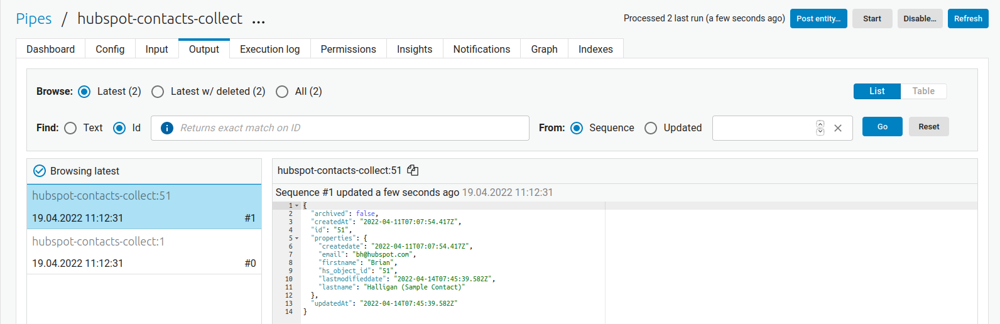

.. _tutorial_custom_data_source_microservice:

Customize Data Source - The Microservice System
===============================================

In this tutorial we will look closer into how to create a :ref:`custom data source with a microservice <custom_data_source_microservice>`. You will be given information on how to access the API used as well as a Microservice template in which you will have to add the needed logic to import data from that API into a Sesam pipe.

.. admonition::  Objectives:
   
    After you complete this tutorial you would have learned the following:

    #. How to implement a Microservice for use in Sesam
    #. How to set up an input pipe to import data from the Microservice

.. admonition:: Prerequisits

  Before starting on this tutorial we suggest you get familiar with input pipes [link] aswell as the :ref:`Custom Data Source - The Microservice System <custom_data_source_microservice>` article in our documentation. 
    
  You should also acquire:
    - An account on `DockerHub <https://hub.docker.com/>`_ (free)
    - A `Hubspot developer account <https://developers.hubspot.com/>`_ (free)
    - An understanding on how to create Docker images
    - Coding experience (we use Python in this example, but any coding language works as long as you can translate to it from Python)

  Tips:
    - Set your sensitive variables as secrets in Sesam and send those secrets to the microservice as environmental variables.
    - `Postman <https://www.postman.com>`_ is a great tool for testing API functionality
        
.. important::
  This is not a tutorial on how to create a Microservice. This is a tutorial on how Microservices interact with Sesam and as such we will not focus on the details of the Microservice itself but rather on the requirements Sesam puts on Microservices in order to make the connection work.

Use-case
--------
A company uses `HubSpot <https://www.hubspot.com>`_ for their CRM solution. As a part of the company's strategy to utilize and increase the value of their data, the company would like to import all the CRM contacts into Sesam. HubSpot provides a set of `APIs <https://developers.hubspot.com/docs/api/overview>`_ which can be used to synchronize data to and from HubSpot. 

The company wishes you to create a Microservice which connects to the HubSpot APIs and extracts all the CRM contacts. These contacts should be passed from the Microservice into Sesam through the Sesam :ref:`JSON Pull protocol <json_pull>`.   

Import data through a Microservice
----------------------------------
If you do not have a HubSpot account already, `create a HubSpot developer account <https://developers.hubspot.com/get-started>`_. Once you have a developer account you need to set up a `test account <https://legacydocs.hubspot.com/docs/faq/how-do-i-create-a-test-account>`_ in order to `aquire an API key <https://knowledge.hubspot.com/integrations/how-do-i-get-my-hubspot-api-key>`_. You will need this key to access HubSpot's APIs.

Once you have an API key you will write a microservice that imports all the contacts from your HubSpot account and allows Sesam to pull these contacts into your Sesam node. You can find information about the needed API `here <https://developers.hubspot.com/docs/api/crm/contacts>`_. 

You will also create a Docker image from the microservice and connect that Docker image to your Sesam node inside a :ref:`Microservice System <microservice_system>` as well as set up an input pipe that collects the contact data from the Microservice system. 

To start off, we provide you with a microservice template written in Python that you may use, or write your own if you wish to do so.

.. code-block:: python
    :linenos:

    import requests
    import json 
    from flask import Flask
    import logging
    import os

    app = Flask(__name__)
    logger = None
    format_string = '%(asctime)s - %(name)s - %(levelname)s - %(message)s'
    logger = logging.getLogger('hubspot')

    # Log to stdout
    stdout_handler = logging.StreamHandler()
    stdout_handler.setFormatter(logging.Formatter(format_string))
    logger.addHandler(stdout_handler)
    logger.setLevel(logging.DEBUG)

    api_key = os.environ.get("hubspot-api-key")
    base_url = os.environ.get("hubspot-base-url")

    @app.route("/get_contacts", methods=["GET"])
    def get_contacts():
        url = base_url + "/objects/contacts?hapikey={}".format(api_key)
        res = requests.get(url=url)

        if res.status_code != 200:
            logger.error("Unexpected response status code: %d with response text %s" % (res.status_code, res.text))
            raise AssertionError ("Unexpected response status code: %d with response text %s"%(res.status_code, res.text))

        logger.info("Importing %i contacts to Sesam" % len(res.json()["results"]))
        return json.dumps(res.json()["results"])

    if __name__ == '__main__':
        app.run(debug=True, host='0.0.0.0', threaded=True, port=os.environ.get('port',5000))

 
.. admonition::  Remember:
   
  Testing how a microservice interacts with Sesam directly in Sesam can be troublesome as you have to create a Docker image and spin up the corresponding container in Sesam for each code change. Make sure you test the microservice thouroughly locally before creating the docker image.

Error handling
^^^^^^^^^^^^^^
An important detail to include in your Microservice is correct error handling. If, for some reason, the Microservice fails to import data from the API, Sesam should be aware of this and potentially cancel the pipe run. 

Remember that Sesam accepts any data that is exposed as a JSON array. We could imagine a scenario where the API returns an error message (maybe the server is down and the API returns a 500 code), but the Microservice still returns something to Sesam. In this case, the Sesam pipe will not register that something has gone wrong but continue as usual. We could end up in a situation where Sesam thinks that all data has been imported when this is not the case. 

In the case of an error we would often prefer the Microservice to stop such that the corresponding Sesam pipe fails. There are many ways of doing this, and in the example above we have included an `AssertionError <https://www.geeksforgeeks.org/python-assertion-error/>`_ that stops the program from running if triggered. This effectively causes the pipe that connects to the route to stop as well.

.. code-block:: python
    :emphasize-lines: 4
  
      ...
      if res.status_code != 200:
        logger.error("Unexpected response status code: %d with response text %s" % (res.status_code, res.text))
        raise AssertionError ("Unexpected response status code: %d with response text %s"%(res.status_code, res.text))
      ...

Return a JSON Array
^^^^^^^^^^^^^^^^^^^
As stated in the Sesam documentation section :ref:`Custom Data Sources <custom_data_source>` "A response must expose entities as a JSON Array."

From a Microservice perspective this means the entities Sesam will pull from the Microservice needs to take a JSON array format. There are many ways of doing this, and in this example tutorial we use the dumps function from `Python's json library <https://docs.python.org/3/library/json.html>`_. In the example above we expect the API to return the contacts as the value of the dictionary key "results" in the API response. We therefore extract the array results (``res.json()["results"]``) and return them as a JSON dictionary.

Connect the Microservice to Sesam
---------------------------------
When the Docker image has been created and hosted online we can connect it to a :ref:`Microservice system <microservice_system>` in Sesam and spin up the container. We do this by declaring where where the image is located and which port the Microservice runs on. In the config to the Microservice system we can also declare environmental variables to be used inside the Microservice. In this example we will send the API key and the base url from Sesam as environtal variables.

.. code-block:: json
  :linenos:

    {
      "_id": "hubspot",
      "type": "system:microservice",
      "docker": {
        "environment": {
          "api-key": "$SECRET(hubspot-api-key)",
          "base-url": "$ENV(hubspot-base-url)"
        },
        "image": "<image-url>:<image-tag>",
        "port": 5000
      },
      "verify_ssl": true
    }

To ensure the container spins up as it should you can go to the system's ``status`` page. For this specific example the logs from the Microservice, if running correctly, it should look like the log example below.

::

  timestamp  * Serving Flask app 'service' (lazy loading)
  timestamp  * Environment: production
  timestamp    WARNING: This is a development server. Do not use it in a production deployment.
  timestamp    Use a production WSGI server instead.
  timestamp  * Debug mode: on
  timestamp  * Running on all addresses.
  timestamp    WARNING: This is a development server. Do not use it in a production deployment.
  timestamp  * Running on http://172.21.0.14:5000/ (Press CTRL+C to quit)
  timestamp  * Restarting with stat
  timestamp  * Debugger is active!
  timestamp  * Debugger PIN: 138-328-919

Connect a pipe to the system
----------------------------
The final step is to connect a pipe to the Microservice system that triggers when the contacts should be imported. 

#. First we need to create a new pipe with a :ref:`json source <json_source>` poiting to the Microservice system. 

.. code-block:: json
  :linenos:
  :emphasize-lines: 5,6

    {
      "_id": "hubspot-contacts-collect",
      "type": "pipe",
      "source": {
        "type": "json",
        "system": "hubspot",
        "completeness": false,
    },

#. Secondly, and through the url source parameter, we need to specify which Microservice route the pipe will connect to. In our case the contacts are imported from the ``get_contacts`` route.

.. code-block:: json
  :linenos:
  :emphasize-lines: 8

    {
      "_id": "hubspot-contacts-collect",
      "type": "pipe",
      "source": {
        "type": "json",
        "system": "hubspot",
        "completeness": false,
        "url": "get_contacts"
      }

#. Since HubSpot does not return any ``_id``  attribute for contacts we need to declare this in the pipe as this attribute is a requirement for all entities in Sesam.

.. code-block:: json
  :linenos:
  :emphasize-lines: 15

    {
      "_id": "hubspot-contacts-collect",
      "type": "pipe",
      "source": {
        "type": "json",
        "system": "hubspot",
        "completeness": false,
        "url": "get_contacts"
      },
      "transform": {
        "type": "dtl",
        "rules": {
          "default": [
            ["copy", "*"],
            ["add", "_id", "_S.id"]
          ]
        }
      },
      "add_namespaces": false
    }

#. Finally we wish to copy all the data imported and save it to the pipe's resulting dataset. This is done by the ``["copy", "*"]`` transformation..

.. code-block:: json
  :linenos:
  :emphasize-lines: 14

    {
      "_id": "hubspot-contacts-collect",
      "type": "pipe",
      "source": {
        "type": "json",
        "system": "hubspot",
        "completeness": false,
        "url": "get_contacts"
      },
      "transform": {
        "type": "dtl",
        "rules": {
          "default": [
            ["copy", "*"],
            ["add", "_id", "_S.id"]
          ]
        }
      },
      "add_namespaces": false
    }

Troubleshooting
^^^^^^^^^^^^^^^
If for some reason the import does not work, the pipe's ``Execution log`` is a good place to start. Here you will find error messages from the Microservice, which might help you troubleshoot.

An other good troubleshooting tactic is to log your progress inside the Microservice. These log can be viewed in the Microservice's ``status`` page and may provide more insights than the pipe's ``Execution log``.

Results
-------
When finished you should see at least two contacts from HubSpot imported to your Sesam node (the two default test contacts included in your HubSpot developer account).

