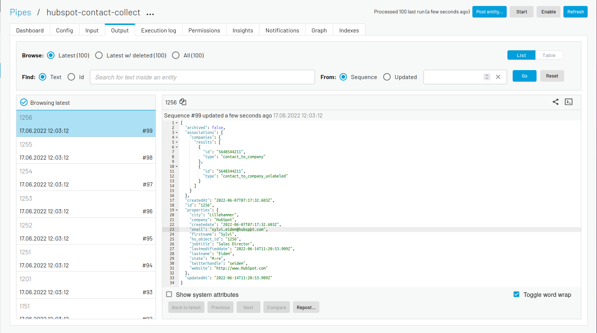

-------------------
Inbound Pipe - REST
-------------------

In this tutorial we will look closer into the creation of an :ref:`inbound pipe <best-practice-workflow>` connected to a :doc:`Sesam system <configuration-systems>`. Sesam best practices recommend to always use :ref:`continuation support <continuation_support>` when collecting data from external systems. In this specific case, continuation support can not be implemented with the Sesam REST system because of the structure of the API we attempt to connect to. However, this not very uncommon. Many API's do not support delta requests, so in this tutorial we will focus on some of the other aspects used when connecting a pipe to a REST source system.

.. admonition:: Objectives

  After you complete this tutorial you will have:

  - Created an inbound pipe connected to a REST source system
  - Gotten aquainted with some of the :ref:`rest source properties <rest_source_properties>` 

.. admonition:: Prerequisites
	
	Before starting on this tutorial we suggest you read the documentation section regarding best practices for the :ref:`collect phase <collect>`

  You should also have created the ``hubspot`` system shown in the tutorial :doc:`Source System - REST <tutorial-source-system-rest>`.

Use-case
--------

In this tutorial we use the ``hubspot`` system created in the :doc:`Source System - REST <tutorial-source-system-rest>` tutorial to import `contacts from HubSpot <https://developers.hubspot.com/docs/api/crm/contacts>`_ into Sesam. These contacts till later be used further in the remaining four phases of any Sesam flow.

Populate HubSpot with contact data
----------------------------------

Before we analyze the data supplied byt the HubSpot API, we need some more contact data in HubSpot. This will make it a lot more interesting for you as you work with related tutorials down the road. Therefore, follow the steps below to import new contacts into HubSpot **before** moving on: 

#. Download the :download:`company data <files/learn-hubspot-company.csv>` and :download:`contact data <files/learn-hubspot-contacts.csv>` and save the csv files locally
#. Log into HubSpot and navigate to your **Companies** section, found under **Contacts** in the top menu.
#. Click **Import** on the right hand side of the page
#. Click **Start an import** and select **File from computer** and click **Next**
#. Select **Multiple files with associations** and click **Next**
#. Select **Companies** and **Contacts** and click **Next** 
#. Upload ``learn-hubspot-company.csv`` under **Company** and ``learn-hubspot-contacts.csv`` under **Contacts** (don't click on the "This file includes a ... column" boxes) and click **Next**
#. Select **Company ID** as common column header and select **Company** as the object it is unique for and click **Next**
#. Select **Don't import data in unmapped column** and click **Next**
#. Select **Don't import data in unmapped column** again and click **Next**
#. Agree to the terms and click **Finish import**

Understanding the HubSpot data
------------------------------

A REST API does not necessarily provide data on the :doc:`structure Sesam prefers <entitymodel>`. It's therefore important to analyze the incoming API payload before creating the inbound pipe. By doing this, should we need to we can adapt the inbound pipe configuration to the incoming payload. Often example payloads can be provided through the API documentation. In HubSpot's case, data is returned as dictionaries inside a ``results`` array as shown in the example below.

.. code-block:: json
  
    {
      "results": [
        { 
          "id": "some-id",
          "createdAt": "2022-05-24T12:42:29.071Z",
          "properties": {
            "company": "Biglytics",
            "createdate": "2019-10-30T03:30:17.883Z",
            "email": "bcooper@biglytics.net",
            "firstname": "Bryan",
            "lastmodifieddate": "2019-12-07T16:50:06.678Z",
            "lastname": "Cooper",
            "phone": "(877) 929-0687",
            "website": "biglytics.net"
          },
          "updatedAt": "2022-06-07T07:17:44.749Z"
        },
        { 
          "id": "some-other-id",
          "createdAt": "2022-05-24T12:42:29.071Z",
          "properties": {
            "company": "Smalllytics",
            "createdate": "2019-10-30T03:30:17.883Z",
            "email": "batman@smallglytics.net",
            "firstname": "Bruce",
            "lastmodifieddate": "2019-12-07T16:50:06.678Z",
            "lastname": "Wayne",
            "phone": "(866) 980-0123",
            "website": "smalllytics.net"
          },
          "updatedAt": "2022-06-07T07:17:44.749Z"
        }
      ]
    }

In order to release all the entities inside the ``results`` array we can use the REST source attribute ``payload_property``:

``"payload_property": "results"``

We can also tell Sesam to use the ``id`` attribute inside each dictionary as the internal Sesam ``_id`` by using the REST source attribute ``id_expression``:

``"id_expression": {{ id }}`` 

Unless otherwise stated, the HubSpot API only provides some data in each dictionary per default unless otherwise stated. However, the API allows you to query which ever contact data you want. In our case, we would like to add our own query parameter to the API where we decide what kind of data we wish to request. In Sesam we can do this by using the REST source attribute ``properties``. The ``properties`` attribute allows us to supply the Sesam system we connect to with pipe specific instructions which in turn allows our source system configurations to be as generic as possible.

Creating our inbound pipe
-------------------------

We will now create our inbound pipe with the attributes stated above.

#. Navigate to **Pipes**
#. Click **New pipe**
#. Paste and save the configuration below
#. Click **Start** to ensure your pipe runs 
#. Click refresh to see number of entities processed (should be 100). You can also see them in the pipe's **Output** tab. 

.. code-block:: json
  
    {
	  "_id": "hubspot-contact-collect",
	  "type": "pipe",
	  "source": {
	    "type": "rest",
	    "system": "hubspot",
	    "id_expression": "{{ id }}",
	    "operation": "get",
	    "payload_property": "results",
	    "properties": {
	      "url": "contacts?properties=city,company,email,firstname,jobtitle,lastname,state,website,twitterhandle&associations=companies&limit=100"
	    }
	  },
	  "namespaced_identifiers": false
	}

When done you should have 100 entities in the output of your inbound pipe. 

Results
-------

As we can see in the **Output** tab, these is no namespace added to any of the properties. This is due to the above property ``namespaced_identifiers: false``. This ensures that Sesam's semantic enrichment is not applied to data at this stage of your synchronization.

After having successfully created your inbound pipe, you are now ready to move onto the next tutorial in this guide, or look at the enrich guide, where you will learn to apply Sesam's :ref:`semantic enrichment <enrich>`.

