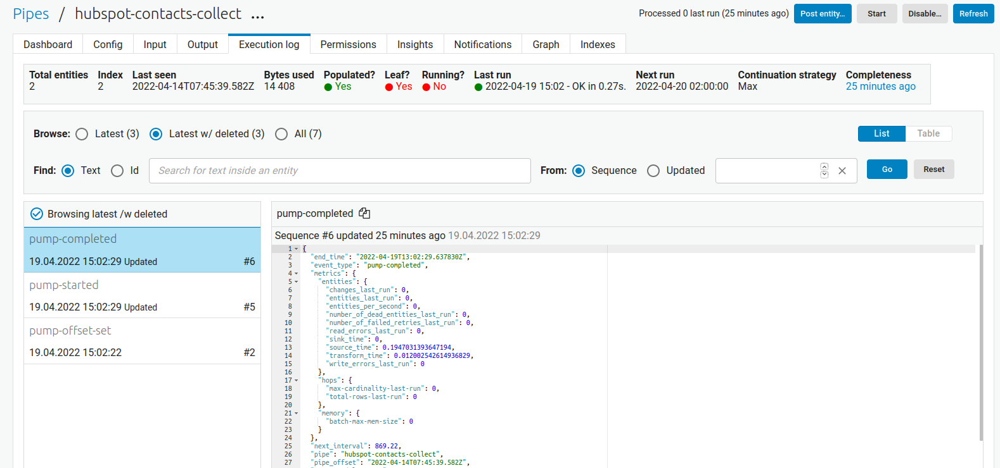

.. _tutorial_microservices_continuation_support:

Microservices - Continuation support
====================================

In this tutorial we will look closer into :ref:`continuation support <continuation_support_microservices>` and how to implement it to a microservice in order to only import changed data into Sesam.

.. admonition::  Objectives:
   
    After you complete this tutorial you would have learned the following:

    #. How to implement continuation support in a Microservice
    #. How to implement continuation support in an input pipe

.. admonition:: Prerequisites

  Before starting on this lesson we expect a general understanding of :ref:`inbound pipes <best-practice-inbound-pipes>` in Sesam and we recommend that you do the tutorial :ref:`Custom Data Source - The Microservice System <tutorial_custom_data_source_microservice>` as this tutorial is heavily based its results. We also recommend you read the section concerning :ref:`Continuation support for Microservices <continuation_support_microservices>` in our documentation. 

  You should also acquire:
    - An account on `DockerHub <https://hub.docker.com/>`_ (free)
    - A `Hubspot developer account <https://developers.hubspot.com/>`_ (free)
    - An understanding on how to create Docker images
    - Coding experience (we use Python in this example, but any coding language works as long as you can translate to it from Python)

.. important::
    - Each API has different functionalities, and not every API supports query parameters to only access updated data. It's important to thoroughly read the API's documentation in order to set the correct query parameter as you since parameter.

Use-case
--------
In addition to importing contacts (see the tutorial :ref:`Custom Data Source - The Microservice System <tutorial_custom_data_source_microservice>`) the company realizes that importing every contacts every time seems redundant. 

The company would like you to add logic to make sure that only contacts that have been updated since the last time Sesam imported data are included in the new batch. This will save both time and money for the company in the long run.  

Continuation support with a Microservice 
----------------------------------------
With the Python code and Sesam configurations supplied in the tutorial :ref:`Custom Data Source - The Microservice System <tutorial_custom_data_source_microservice>` as a basis, we will now add logic to both the Microservice and the collect pipe to make sure that only updated contacts are imported to Sesam. The example below shows one way of applying this logic.

.. code-block:: python
    :linenos:

    import requests
    import json 
    from datetime import datetime
    from flask import Flask, request
    import logging
    import os

    app = Flask(__name__)
    logger = None
    format_string = '%(asctime)s - %(name)s - %(levelname)s - %(message)s'
    logger = logging.getLogger('hubspot')

    # Log to stdout
    stdout_handler = logging.StreamHandler()
    stdout_handler.setFormatter(logging.Formatter(format_string))
    logger.addHandler(stdout_handler)
    logger.setLevel(logging.DEBUG)

    api_key = os.environ.get("api-key")
    base_url = os.environ.get("base-url")
    since_operator = os.environ.get("since-operator")
    since_field = os.environ.get("since-field")

    def find_epoch(time):
        utc_time = datetime.strptime(time, "%Y-%m-%dT%H:%M:%S.%fZ")
        epoch_time_milliseconds = (utc_time - datetime(1970, 1, 1)).total_seconds()*1000
        return int(epoch_time_milliseconds)

    @app.route("/get_contacts", methods=["GET", "POST"])
    def get_contacts():
        since = request.args.get('since')
        if since:
            data = json.dumps({"filterGroups":[{"filters":[{"propertyName": since-field,"operator": since-operator,"value": find_epoch(since)}]}]})
            url = base_url + "/objects/contacts/search?hapikey={}".format(api_key)
            res = requests.post(url=url, data=data, headers={"Content-Type": "application/json"})
        else:
            url = base_url + "/objects/contacts/?hapikey={}".format(api_key)
            res = requests.get(url=url)

        if res.status_code != 200:
            logger.error("Unexpected response status code: %d with response text %s" % (res.status_code, res.text))
            raise AssertionError ("Unexpected response status code: %d with response text %s"%(res.status_code, res.text))

        entities = res.json()["results"]
        for entity in entities:
            entity["_updated"] = entity["properties"][since_field]

        return json.dumps(entities)

    if __name__ == '__main__':
        app.run(debug=True, host='0.0.0.0', threaded=True, port=os.environ.get('port',5000))

Adapting the Microservice
^^^^^^^^^^^^^^^^^^^^^^^^^
In their documentation, HubSpot states that the `search API <https://developers.hubspot.com/docs/api/crm/search>`_ can be used to filter objects based on the property ``lastmodifieddate``. The first step is make the Microservice passes this value to Sesam in a way that Sesam can store this as an internal ``since`` value. This is done by adding the value of the ``lastmodifieddate`` property in a new entity attribute: ``_updated``.

.. code-block:: python
    :linenos:
    :emphasize-lines: 4
  
    ...
    entities = res.json()["results"]
    for entity in entities:
    entity["_updated"] = entity["properties"][since_field]
    ...

The code snippet above ensures that Sesam will register each entity's ``lastmodifieddate`` property and pick the one with highest value and set that value as the pipe's new ``pipe_offset``. This offset can be viewed in the pipe's ``Execution log``.

We also need to make sure that the pipe's ``pipe_offset`` is sent back to the Microservice such that we may use that the next time we call the API for updated entities. 

.. code-block:: python
    :linenos:
    :emphasize-lines: 2,5,8
  
    ...
    since = request.args.get('since')
    if since:
        data = json.dumps({"filterGroups":[{"filters":[{"propertyName": since-field,"operator": since-operator,"value": find_epoch(since)}]}]})
            url = "https://api.hubapi.com/crm/v3/objects/contacts/search?hapikey={}".format(api_key)
            res = requests.post(url=url, data=data, headers={"Content-Type": "application/json"})
    else:
        url = "https://api.hubapi.com/crm/v3/objects/contacts/?hapikey={}".format(api_key)
        res = requests.get(url=url)
      ...

The code snippet above separates the logic into two cases: 
    #. The first covers every situation where we wish to ask the API for updated contacts only.

    #. The second case covers situations where we wish to perform a full sync. A full sync can be triggered by resetting the pipe. 

This effectively removes the pipe's ``pipe_offset`` and removes the ``since`` parameter from the request to the Microservice.

Adapting the System
^^^^^^^^^^^^^^^^^^^
In addition to the environmental parameters used for the Microservice system in the tutorial :ref:`Custom Data Source - The Microservice System <tutorial_custom_data_source_microservice>` we will now also have to add the variables ``since_parameter`` and ``since_operator``. 

**Describe why we need to add these variables?**

.. code-block:: json
    :linenos:
    :emphasize-lines: 8,9

    {
      "_id": "hubspot",
      "type": "system:microservice",
      "docker": {
        "environment": {
          "api-key": "$SECRET(hubspot-api-key)",
          "base-url": "$ENV(hubspot-base-url)"
          "since-field": "lastmodifieddate",
          "since-operator": "GT"        
      },
        "image": "<image-url>:<image-tag>",
        "port": 5000
      },
      "verify_ssl": true
    }

Adapting the Pipe
^^^^^^^^^^^^^^^^^
Finally we need to adapt the pipe to handle the ``_updated`` property which the entities coming in are now populated with. This is done by setting the pipe's source parameter ``supports_since`` to true.

.. code-block:: json
    :linenos:
    :emphasize-lines: 8
  
    {
      "_id": "hubspot-contacts-collect",
      "type": "pipe",
      "source": {
        "type": "json",
        "system": "hubspot",
        "completeness": false,
        "supports_since": true,
        "url": "get_contacts"
      },
      "transform": {
        "type": "dtl",
        "rules": {
          "default": [
            ["copy", "*"],
            ["add", "_id", "_S.id"]
          ]
        }
      },
      "pump": {
        "rescan_cron_expression": "0 0 ? * *"
      },
      "add_namespaces": false
    }
 
It is also a best practice to every now and then do a full rescan of the source, which in this specific case has been set to every day at midnight.

We do this by using a :ref:`cron expression <cron_expressions>`, like highlighted bellow.

.. code-block:: json
    :linenos:
    :emphasize-lines: 21

    {
      "_id": "hubspot-contacts-collect",
      "type": "pipe",
      "source": {
        "type": "json",
        "system": "hubspot",
        "completeness": false,
        "supports_since": true,
        "url": "get_contacts"
      },
      "transform": {
        "type": "dtl",
        "rules": {
          "default": [
            ["copy", "*"],
            ["add", "_id", "_S.id"]
          ]
        }
      },
      "pump": {
        "rescan_cron_expression": "0 0 ? * *"
      },
      "add_namespaces": false
    }

Results
-------

When finished with this assignment you should still have the same number of contacts inside your Sesam subscription as you do inside your HubSpot account. Only now, if you update one of your HubSpot contacts, only that contact will be imported to your Sesam subscription the next time the pipe runs. 

To make sure everything works the way it should you can look at the pipe's ``Execution log``. The ``pipe_offset`` in the Execution Log should now reflect your chosen since value, and ``processed_last_run`` should only reflect the number of contacts that has been changed. 

In the screenshot below no entities have been changed since 2022-04-22T07:45:39:582Z, which is the value of the pipe's ``pipe_offset``.

