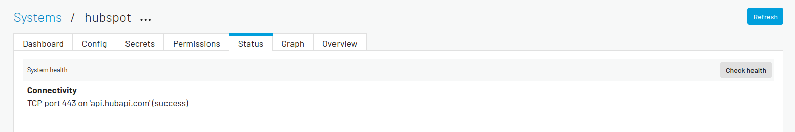

--------------------
Source System - REST
--------------------

In this tutorial we will add a REST source system to your Sesam subscription. The external system we will be working with is `HubSpot <https://www.hubspot.com/>`_ and we will connect a REST system to their APIs.

.. admonition:: Objectives

  After you complete this tutorial you will have:

  - Successfully create a REST source system in your Sesam subscription
  - Gotten aquainted with the different properties available for the REST source system

.. admonition:: Prerequisites
  
  Before starting on this tutorial we suggest you read the documentation section regarding :doc:`REST system <configuration-systems-rest>`.

  You will also need to create a HubSpot account and aquire an API key. You can see a step-by-step guide in the prerequisites of the *Getting started* guide :doc:`Create your first synchronization <guide-create-first-synchronization>`

Creating the full url
---------------------

When creating a REST system in Sesam there are several ways one can define the url to which we wish to send a request. In general you want to system to contain a base url to which you can connect endpoint specific urls depending on which API a specific pipe with to send a request to. In Sesam we can do this by establishing a ``url_pattern`` and let each pipe connect endpoint specific urls to this pattern. 

As you can see in the tutorial :doc:`Inbound Pipe - REST <tutorial-inbound-pipe-rest>` we can define a ``properties`` attribute in our pipe source configuration that may pass endpoint specific information to an operation in a REST system. We can connect this to the ``url_pattern`` by adding the pipe ``properties`` information to the operation url and connecting it to the ``url_pattern`` through the ``%s`` placeholder. 

Creating the system
-------------------

We created a template to get you started in Sesam. Follow these steps to add ``hubspot`` as a system:

#. Navigate to Systems
#. Click on New system
#. Paste and save the configuration below
#. Add your hubspot API key in your Sesam subscription as a Secret by going into Datahub -> Variables.
#. Use the Secret name “hubspot-api-key”.

.. code-block:: json
  :linenos:

  {
    "_id": "hubspot",
    "type": "system:rest",
    "headers": {
      "Content-Type": "application/json"
    },
    "operations": {
      "get": {
        "method": "GET",
        "url": "{{ properties.url }}&"
      }
    },
    "rate_limiting_delay": 60,
    "rate_limiting_retries": 3,
    "url_pattern": "https://api.hubapi.com/crm/v3/objects/%shapikey=$SECRET(hubspot-api-key)",
    "verify_ssl": true
  }

Results
-------

Since we still haven't access any specific API, the only result we can check at this time is whether or not we are allowed to access the domain. This can be checked by looking at the system's status page and check that the connectivity is marked with *success*. Should the connectivity status be marked with *FAILURE* you either have the wrong domain name or you are restricted to access the domain for some reason.

After having successfully created your REST system, you are now ready to move onto the next tutorial in this guide, or look at the :doc:`Inbound Pipe - REST <tutorial-inbound-pipe-rest>` where you will import the datatype ``contact`` from your recently created HubSpot REST system. 

.. hint::

  You should get acquainted with all properties provided in the above configuration. To read about them, you should explore the :ref:`REST system properties <rest_system_properties>` section of the docs.
